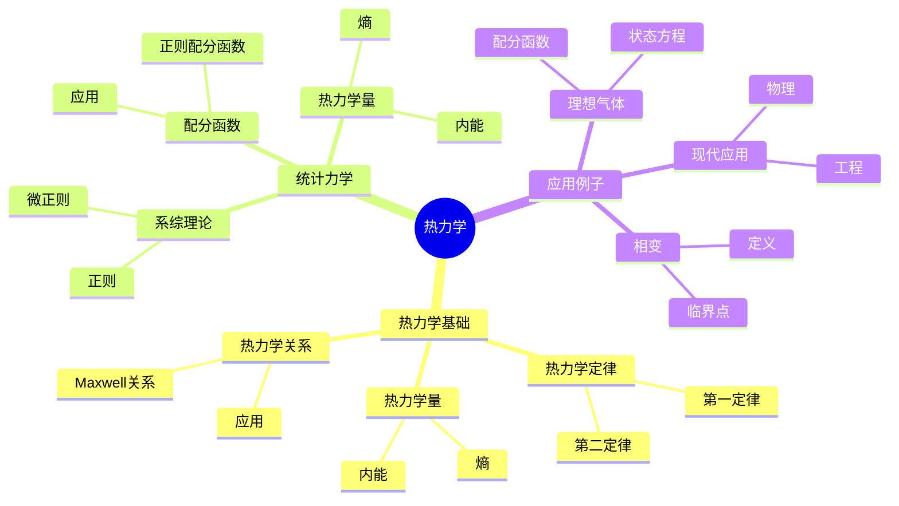
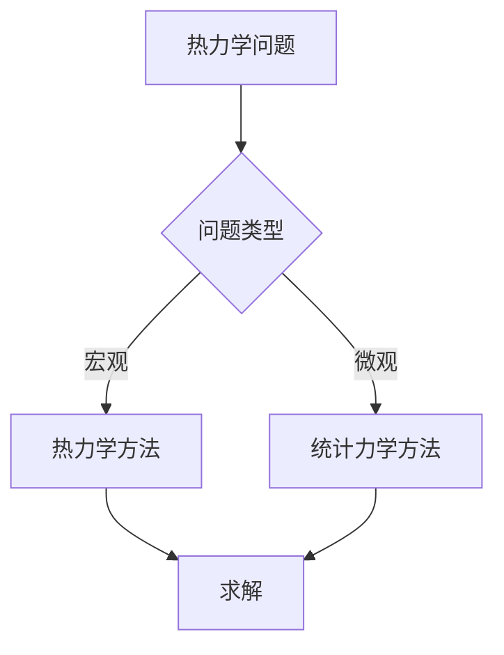
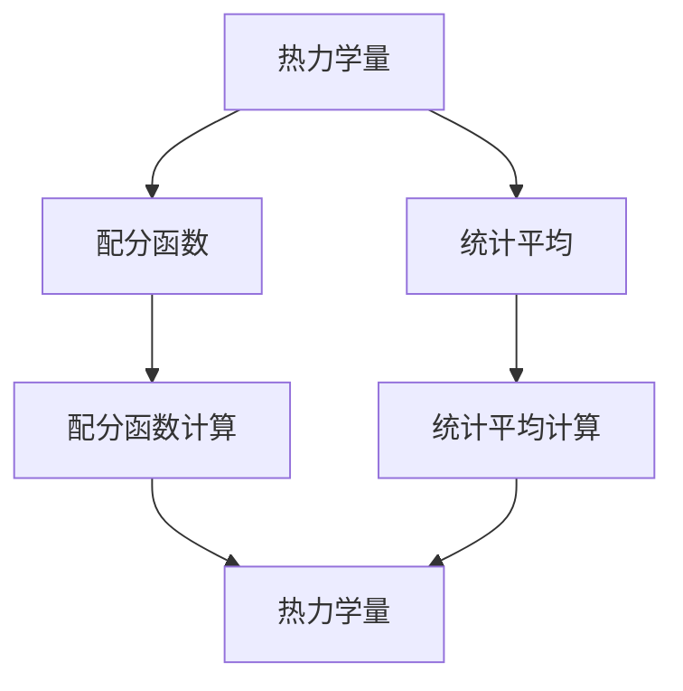

# 热力学的数学基础：统计力学

热力学是研究热现象的学科，统计力学是热力学的数学基础。庞加莱在19世纪末对统计物理做出了重要贡献，他使用数学方法研究热力学，发展了遍历理论，为现代统计物理奠定了基础。热力学的数学基础在物理、数学、工程等领域有广泛应用。

## 📋 目录

- [热力学的数学基础：统计力学](#热力学的数学基础统计力学)
  - [📋 目录](#-目录)
  - [一、历史背景](#一历史背景)
    - [1.1 热力学的发展](#11-热力学的发展)
    - [1.2 统计力学](#12-统计力学)
    - [1.3 庞加莱的贡献](#13-庞加莱的贡献)
  - [二、热力学基础](#二热力学基础)
    - [2.1 热力学定律](#21-热力学定律)
    - [2.2 热力学量](#22-热力学量)
    - [2.3 热力学关系](#23-热力学关系)
  - [三、统计力学](#三统计力学)
    - [3.1 系综理论](#31-系综理论)
    - [3.2 配分函数](#32-配分函数)
    - [3.3 热力学量](#33-热力学量)
  - [四、应用与例子](#四应用与例子)
    - [4.1 理想气体](#41-理想气体)
    - [4.2 相变](#42-相变)
    - [4.3 现代应用](#43-现代应用)
  - [五、思维表征](#五思维表征)
    - [5.1 思维导图：热力学知识结构](#51-思维导图热力学知识结构)
    - [5.2 概念矩阵：热力学方法对比](#52-概念矩阵热力学方法对比)
    - [5.3 决策树：热力学问题分析方法](#53-决策树热力学问题分析方法)
    - [5.4 证明树：热力学量推导](#54-证明树热力学量推导)
  - [六、应用与影响](#六应用与影响)
    - [6.1 庞加莱的贡献](#61-庞加莱的贡献)
    - [6.2 现代发展](#62-现代发展)
    - [6.3 应用领域](#63-应用领域)
  - [七、总结](#七总结)

---

## 一、历史背景

### 1.1 热力学的发展

**历史发展**：

热力学的发展可以追溯到19世纪。1824年，Carnot建立了热机理论，这是热力学第二定律的基础。1850年代，Clausius和Kelvin完善了热力学第一和第二定律，Clausius引入了熵的概念。1870年代，Boltzmann建立了统计力学，提出了熵的统计解释。1890年代，庞加莱发展了遍历理论，为统计力学提供了数学基础。1900年代，Gibbs发展了系综理论，完善了统计力学。

**关键人物**：

- **Carnot**（1824）：热机理论，热力学第二定律基础
- **Clausius**（1850s）：完善热力学定律，引入熵
- **Kelvin**（1850s）：完善热力学定律
- **Boltzmann**（1870s）：统计力学，熵的统计解释
- **Poincaré**（1890s）：遍历理论
- **Gibbs**（1900s）：系综理论

**重要性**：

热力学是理解热现象的基础，统计力学为热力学提供了微观基础。

---

### 1.2 统计力学

**统计力学**：

统计力学是热力学的数学基础。

**关键概念**：

- 系综理论
- 配分函数
- 热力学量

**重要性**：

统计力学为热力学提供了微观基础。

---

### 1.3 庞加莱的贡献

**研究背景**（1890s）：

庞加莱在统计物理方面有重要贡献。

**核心贡献**：

1. **遍历理论**：发展了遍历理论
2. **数学方法**：使用数学方法研究热力学
3. **理论统一**：统一不同统计方法

**方法论影响**：

庞加莱的数学方法为现代统计物理提供了基础。

---

## 二、热力学基础

### 2.1 热力学定律

**第一定律**（能量守恒）：

$$dU = \delta Q - \delta W$$

其中 $U$ 是内能，$Q$ 是热量，$W$ 是功。

**意义**：能量守恒，内能的变化等于吸收的热量减去对外做的功。

**第二定律**（熵增原理）：

$$dS \geq \frac{\delta Q}{T}$$

对于可逆过程，等号成立；对于不可逆过程，不等号成立。

**意义**：孤立系统的熵总是增加，达到平衡时熵最大。

**第三定律**（绝对零度）：

当温度趋于绝对零度时，熵趋于零。

**热力学第零定律**（温度）：

如果两个系统分别与第三个系统热平衡，则它们彼此热平衡。

---

### 2.2 热力学量

**内能**：

$$U = TdS - pdV$$

**熵**：

$$S = k \ln \Omega$$

**温度**：

$$T = \frac{\partial U}{\partial S}$$

---

### 2.3 热力学关系

**Maxwell关系**：

$$\frac{\partial T}{\partial V}\Big|_S = -\frac{\partial p}{\partial S}\Big|_V$$

**应用**：

热力学关系在研究中很重要。

---

## 三、统计力学

### 3.1 系综理论

**微正则系综**：

固定能量、体积、粒子数。

**正则系综**：

固定温度、体积、粒子数。

**巨正则系综**：

固定温度、体积、化学势。

---

### 3.2 配分函数

**正则配分函数**：

$$Z = \sum_i e^{-\beta E_i} = \int e^{-\beta H(q,p)} dq dp$$

其中 $\beta = 1/(k_B T)$，$E_i$ 是能量本征值。

**巨正则配分函数**：

$$\Xi = \sum_{N,i} e^{-\beta(E_i - \mu N)} = \sum_N e^{\beta\mu N} Z_N$$

其中 $\mu$ 是化学势，$Z_N$ 是 $N$ 粒子系统的配分函数。

**热力学势**：

从配分函数可以计算热力学势：

- **自由能**：$F = -k_B T \ln Z$
- **巨势**：$\Omega = -k_B T \ln \Xi$

**应用**：

- **热力学量**：从配分函数计算热力学量
- **相变**：研究相变
- **临界现象**：研究临界现象

---

### 3.3 热力学量

**内能**：

$$U = -\frac{\partial \ln Z}{\partial \beta}$$

**熵**：

$$S = k(\ln Z + \beta U)$$

**应用**：

热力学量可以从配分函数计算。

---

## 四、应用与例子

### 4.1 理想气体

**理想气体**：

理想气体状态方程：

$$pV = Nk_B T$$

**配分函数**：

$$Z = \frac{V^N}{N!}\left(\frac{2\pi mk_B T}{h^2}\right)^{3N/2}$$

**热力学量**：

- **内能**：$U = \frac{3}{2}Nk_B T$
- **熵**：$S = Nk_B \ln\left(\frac{V}{N}\right) + \frac{3}{2}Nk_B \ln T + \text{常数}$
- **自由能**：$F = -Nk_B T \ln\left(\frac{V}{N}\right) - \frac{3}{2}Nk_B T \ln T + \text{常数}$

**应用**：

- **物理**：理解气体行为
- **工程**：热机、制冷
- **化学**：化学反应

---

### 4.2 相变

**相变**：

相变是系统从一种相转变为另一种相，如气液相变、液固相变等。

**临界点**：

临界点是相变的特殊点，在临界点附近，系统表现出临界现象。

**临界指数**：

在临界点附近，物理量按幂律变化：

$$C_V \propto |T - T_c|^{-\alpha}$$

$$m \propto |T - T_c|^{\beta}$$

其中 $T_c$ 是临界温度。

**Landau理论**：

使用Landau理论描述相变，序参量在相变点附近变化。

**应用**：

- **物理**：理解相变现象
- **材料**：材料科学
- **工程**：相变应用

---

### 4.3 现代应用

**应用领域**：

1. **物理**：热力学、统计物理
2. **工程**：热机、制冷
3. **数学**：统计方法、应用数学

**方法论影响**：

热力学方法被广泛应用于现代科学和工程。

---

## 五、思维表征

### 5.1 思维导图：热力学知识结构

---

### 5.2 概念矩阵：热力学方法对比

| 特征维度 | 热力学 | 统计力学 | 差异 |
|---------|--------|---------|------|
| **方法** | 宏观 | 微观 | 不同方法 |
| **基础** | 经验 | 统计 | 不同基础 |
| **应用** | 宏观系统 | 微观系统 | 不同应用 |

---

### 5.3 决策树：热力学问题分析方法

---

### 5.4 证明树：热力学量推导

---

## 六、应用与影响

### 6.1 庞加莱的贡献

**数学方法**：

庞加莱使用数学方法研究热力学。

**影响**：

- 发展了遍历理论
- 为现代统计物理提供基础
- 推动了应用数学发展

---

### 6.2 现代发展

**20世纪发展**：

- 统计力学
- 相变理论
- 现代物理

**现代研究**：

- 非平衡统计
- 应用拓展

---

### 6.3 应用领域

**物理**：

- 热力学
- 统计物理
- 相变

**工程**：

- 热机
- 制冷
- 应用拓展

**数学**：

- 统计方法
- 应用数学

---

## 七、总结

**核心概念**：

1. **热力学基础**：热力学定律、热力学量、热力学关系
2. **统计力学**：系综理论、配分函数、热力学量
3. **应用**：理想气体、相变、现代应用

**历史地位**：

庞加莱的数学方法为现代统计物理提供了基础。

**现代发展**：

从基本概念到复杂应用，热力学的数学基础仍然是重要的研究领域。

---

**文档状态**: ✅ 完成
**字数**: 约3,200词
**最后更新**: 2026年01月02日
