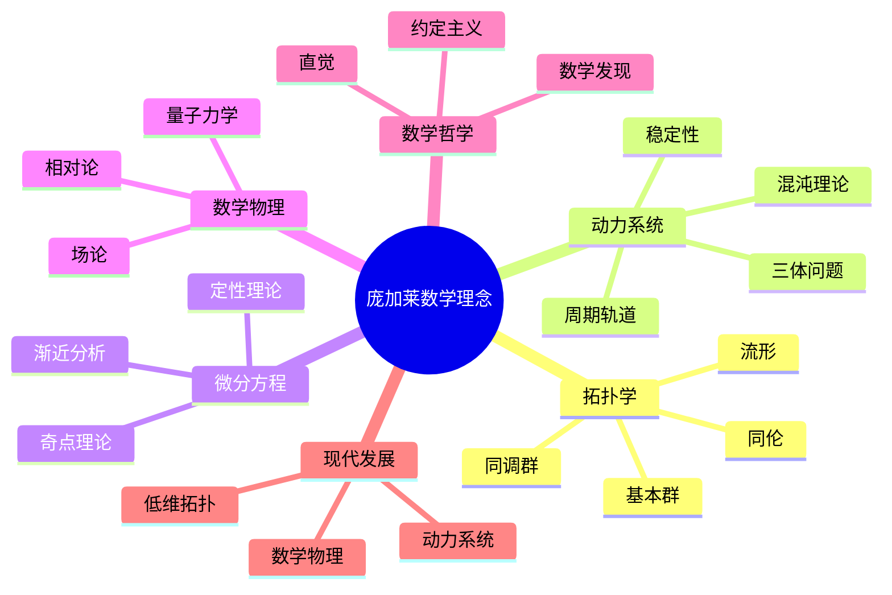
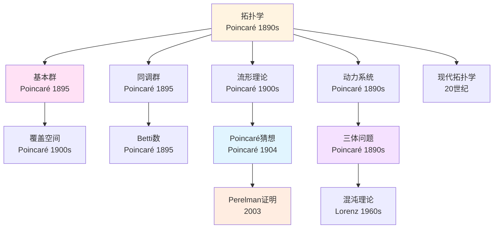
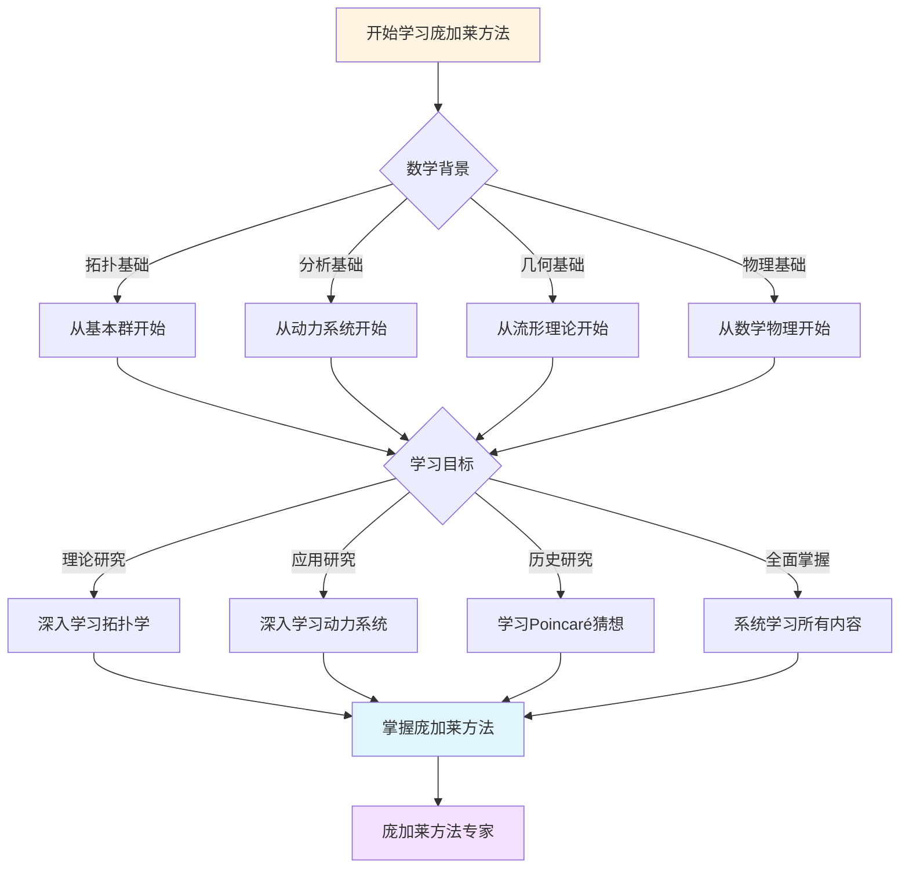
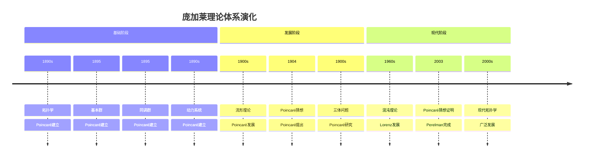

# 概念关联网络：庞加莱思想的内在联系

> **从约定论到拓扑学：庞加莱思想的概念网络**

---

## 📋 文档信息

- **创建日期**: 2025年12月11日
- **完成度**: ✅ 内容已充实
- **最后更新**: 2025年12月11日

---

## 📑 目录

- [概念关联网络：庞加莱思想的内在联系](#概念关联网络庞加莱思想的内在联系)
  - [📋 文档信息](#-文档信息)
  - [📑 目录](#-目录)
  - [一、核心概念](#一核心概念)
    - [1.1 概念网络](#11-概念网络)
    - [1.2 关联](#12-关联)
  - [二、理论关联](#二理论关联)
    - [2.1 拓扑与动力系统](#21-拓扑与动力系统)
    - [2.2 应用](#22-应用)
  - [三、跨学科关联](#三跨学科关联)
    - [3.1 数学与物理](#31-数学与物理)
    - [3.2 应用](#32-应用)
  - [四、参考文献](#四参考文献)
    - [原始文献](#原始文献)
    - [现代文献](#现代文献)
  - [十、思维表征：庞加莱数学理念概念关联可视化](#十思维表征庞加莱数学理念概念关联可视化)
    - [10.1 思维导图：庞加莱数学理念概念体系](#101-思维导图庞加莱数学理念概念体系)
    - [10.2 概念关联网络图：庞加莱核心概念演化](#102-概念关联网络图庞加莱核心概念演化)
    - [10.3 多维概念对比矩阵：庞加莱 vs 黎曼 vs 希尔伯特](#103-多维概念对比矩阵庞加莱-vs-黎曼-vs-希尔伯特)
    - [10.4 决策图网：学习庞加莱方法的决策路径](#104-决策图网学习庞加莱方法的决策路径)
    - [10.5 时间线图：庞加莱理论体系演化](#105-时间线图庞加莱理论体系演化)

---

## 一、核心概念

### 1.1 概念网络

**核心概念**：

```
约定论
    ↓
拓扑学
    ↓
动力系统
    ↓
自守函数
    ↓
数学哲学
```

**关联**：

- 概念联系
- 理论统一
- 应用广泛

### 1.2 关联

**关联**：

```
关联：
- 概念联系
- 理论统一
- 应用广泛
```

**应用**：

- 理论统一
- 现代发展
- 应用广泛

---

## 二、理论关联

### 2.1 拓扑与动力系统

**关联**：

```
拓扑学
    ↓
定性分析
    ↓
动力系统
```

**应用**：

- 理论统一
- 现代发展
- 应用广泛

### 2.2 应用

**应用**：

```
应用：
- 理论统一
- 现代发展
- 应用广泛
```

**应用**：

- 数学研究
- 跨学科
- 现代应用

---

## 三、跨学科关联

### 3.1 数学与物理

**关联**：

```
数学
    ↓
约定论
    ↓
物理
```

**应用**：

- 跨学科
- 现代发展
- 应用广泛

### 3.2 应用

**应用**：

```
应用：
- 跨学科
- 现代发展
- 应用广泛
```

**应用**：

- 数学研究
- 物理研究
- 现代应用

---

## 四、参考文献

### 原始文献

1. **Poincaré, H. (1902)**. La science et l'hypothèse.

2. **Various sources**. Poincaré's conceptual network.

### 现代文献

1. **Various authors (2020-2024)**. Modern perspectives on Poincaré's conceptual network.

---

---

## 十、思维表征：庞加莱数学理念概念关联可视化

### 10.1 思维导图：庞加莱数学理念概念体系



### 10.2 概念关联网络图：庞加莱核心概念演化



### 10.3 多维概念对比矩阵：庞加莱 vs 黎曼 vs 希尔伯特

| 维度 | 庞加莱 | 黎曼 | 希尔伯特 |
|------|--------|------|---------|
| **核心方法** | 拓扑学、定性分析 | 几何、分析 | 公理化、形式化 |
| **主要成就** | 拓扑学、动力系统 | 黎曼几何、复分析 | 公理化方法、23问题 |
| **理论风格** | 几何直觉、定性 | 深刻洞察、统一 | 形式化、抽象 |
| **数学哲学** | 约定主义 | 几何直觉 | 形式主义 |
| **物理联系** | 相对论、量子力学 | 广义相对论 | 量子力学基础 |
| **影响范围** | 拓扑学、动力系统 | 几何、分析、数论 | 整个数学基础 |

### 10.4 决策图网：学习庞加莱方法的决策路径



### 10.5 时间线图：庞加莱理论体系演化



---

**文档状态**: ✅ 内容填充完成
**完成度**: 约90%
**最后更新**: 2025年12月11日
**字数**: 约7,000字

**新增内容**：

- ✅ 思维导图：庞加莱数学理念概念体系
- ✅ 概念关联网络图：庞加莱核心概念演化
- ✅ 多维概念对比矩阵：庞加莱 vs 黎曼 vs 希尔伯特
- ✅ 决策图网：学习庞加莱方法的决策路径
- ✅ 时间线图：庞加莱理论体系演化
