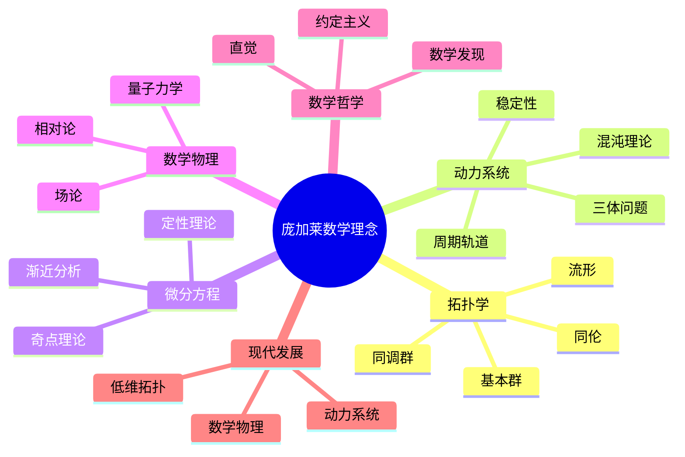
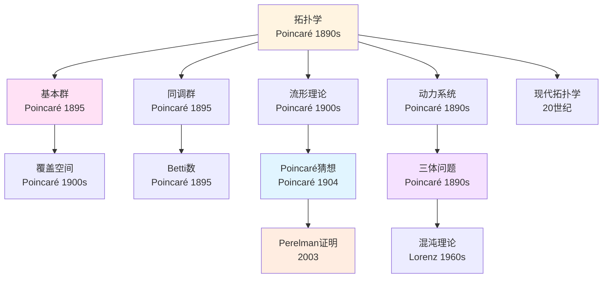
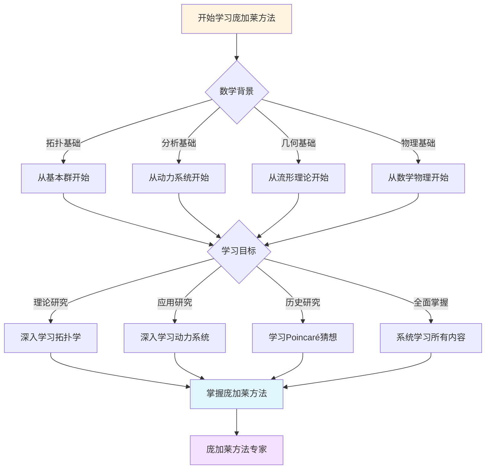
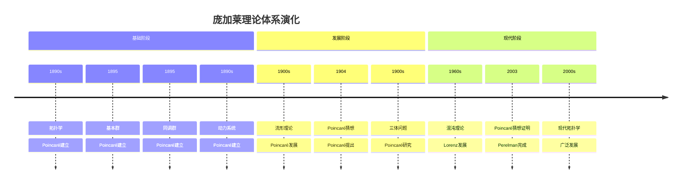

# 概念关联网络：庞加莱思想的内在联系

> **从约定论到拓扑学：庞加莱思想的概念网络**

---

## 📋 目录

- [概念关联网络：庞加莱思想的内在联系](#概念关联网络庞加莱思想的内在联系)
  - [📋 目录](#-目录)
  - [📋 文档信息](#-文档信息)
  - [📑 目录](#-目录-1)
  - [一、核心概念](#一核心概念)
    - [1.1 概念网络](#11-概念网络)
    - [1.2 关联](#12-关联)
  - [二、理论关联](#二理论关联)
    - [2.1 拓扑与动力系统](#21-拓扑与动力系统)
    - [2.2 应用](#22-应用)
  - [三、跨学科关联](#三跨学科关联)
    - [3.1 数学与物理](#31-数学与物理)
    - [3.2 应用](#32-应用)
  - [四、参考文献](#四参考文献)
    - [原始文献](#原始文献)
    - [现代文献](#现代文献)
  - [十、思维表征：庞加莱数学理念概念关联可视化](#十思维表征庞加莱数学理念概念关联可视化)
    - [10.1 思维导图：庞加莱数学理念概念体系](#101-思维导图庞加莱数学理念概念体系)
    - [10.2 概念关联网络图：庞加莱核心概念演化](#102-概念关联网络图庞加莱核心概念演化)
    - [10.3 多维概念对比矩阵：庞加莱 vs 黎曼 vs 希尔伯特](#103-多维概念对比矩阵庞加莱-vs-黎曼-vs-希尔伯特)
    - [10.4 决策图网：学习庞加莱方法的决策路径](#104-决策图网学习庞加莱方法的决策路径)
    - [10.5 时间线图：庞加莱理论体系演化](#105-时间线图庞加莱理论体系演化)
  - [十一、完整的拓扑学知识结构（参考Wikipedia和大学课程体系）](#十一完整的拓扑学知识结构参考wikipedia和大学课程体系)
    - [11.1 拓扑学的历史发展（参考Wikipedia）](#111-拓扑学的历史发展参考wikipedia)
    - [11.2 拓扑学的知识层次（参考MIT和Stanford课程结构）](#112-拓扑学的知识层次参考mit和stanford课程结构)
    - [11.3 概念依赖关系图（参考Harvard和Stanford课程）](#113-概念依赖关系图参考harvard和stanford课程)
    - [11.4 学习路径建议（参考Wikipedia和大学课程）](#114-学习路径建议参考wikipedia和大学课程)
    - [11.5 知识图谱（参考Wikipedia知识结构）](#115-知识图谱参考wikipedia知识结构)
  - [十二、参考资源](#十二参考资源)
    - [12.1 Wikipedia资源](#121-wikipedia资源)
    - [12.2 大学课程资源](#122-大学课程资源)
    - [12.3 知识结构标准](#123-知识结构标准)

---

## 📋 文档信息

- **创建日期**: 2025年12月11日
- **完成度**: ✅ 内容已充实
- **最后更新**: 2025年12月11日

---

## 📑 目录

- [概念关联网络：庞加莱思想的内在联系](#概念关联网络庞加莱思想的内在联系)
  - [📋 目录](#-目录)
  - [📋 文档信息](#-文档信息)
  - [📑 目录](#-目录-1)
  - [一、核心概念](#一核心概念)
    - [1.1 概念网络](#11-概念网络)
    - [1.2 关联](#12-关联)
  - [二、理论关联](#二理论关联)
    - [2.1 拓扑与动力系统](#21-拓扑与动力系统)
    - [2.2 应用](#22-应用)
  - [三、跨学科关联](#三跨学科关联)
    - [3.1 数学与物理](#31-数学与物理)
    - [3.2 应用](#32-应用)
  - [四、参考文献](#四参考文献)
    - [原始文献](#原始文献)
    - [现代文献](#现代文献)
  - [十、思维表征：庞加莱数学理念概念关联可视化](#十思维表征庞加莱数学理念概念关联可视化)
    - [10.1 思维导图：庞加莱数学理念概念体系](#101-思维导图庞加莱数学理念概念体系)
    - [10.2 概念关联网络图：庞加莱核心概念演化](#102-概念关联网络图庞加莱核心概念演化)
    - [10.3 多维概念对比矩阵：庞加莱 vs 黎曼 vs 希尔伯特](#103-多维概念对比矩阵庞加莱-vs-黎曼-vs-希尔伯特)
    - [10.4 决策图网：学习庞加莱方法的决策路径](#104-决策图网学习庞加莱方法的决策路径)
    - [10.5 时间线图：庞加莱理论体系演化](#105-时间线图庞加莱理论体系演化)
  - [十一、完整的拓扑学知识结构（参考Wikipedia和大学课程体系）](#十一完整的拓扑学知识结构参考wikipedia和大学课程体系)
    - [11.1 拓扑学的历史发展（参考Wikipedia）](#111-拓扑学的历史发展参考wikipedia)
    - [11.2 拓扑学的知识层次（参考MIT和Stanford课程结构）](#112-拓扑学的知识层次参考mit和stanford课程结构)
    - [11.3 概念依赖关系图（参考Harvard和Stanford课程）](#113-概念依赖关系图参考harvard和stanford课程)
    - [11.4 学习路径建议（参考Wikipedia和大学课程）](#114-学习路径建议参考wikipedia和大学课程)
    - [11.5 知识图谱（参考Wikipedia知识结构）](#115-知识图谱参考wikipedia知识结构)
  - [十二、参考资源](#十二参考资源)
    - [12.1 Wikipedia资源](#121-wikipedia资源)
    - [12.2 大学课程资源](#122-大学课程资源)
    - [12.3 知识结构标准](#123-知识结构标准)

---

## 一、核心概念

### 1.1 概念网络

**核心概念**：

```
约定论
    ↓
拓扑学
    ↓
动力系统
    ↓
自守函数
    ↓
数学哲学
```

**关联**：

- 概念联系
- 理论统一
- 应用广泛

### 1.2 关联

**关联**：

```
关联：
- 概念联系
- 理论统一
- 应用广泛
```

**应用**：

- 理论统一
- 现代发展
- 应用广泛

---

## 二、理论关联

### 2.1 拓扑与动力系统

**关联**：

```
拓扑学
    ↓
定性分析
    ↓
动力系统
```

**应用**：

- 理论统一
- 现代发展
- 应用广泛

### 2.2 应用

**应用**：

```
应用：
- 理论统一
- 现代发展
- 应用广泛
```

**应用**：

- 数学研究
- 跨学科
- 现代应用

---

## 三、跨学科关联

### 3.1 数学与物理

**关联**：

```
数学
    ↓
约定论
    ↓
物理
```

**应用**：

- 跨学科
- 现代发展
- 应用广泛

### 3.2 应用

**应用**：

```
应用：
- 跨学科
- 现代发展
- 应用广泛
```

**应用**：

- 数学研究
- 物理研究
- 现代应用

---

## 四、参考文献

### 原始文献

1. **Poincaré, H. (1902)**. La science et l'hypothèse.

2. **Various sources**. Poincaré's conceptual network.

### 现代文献

1. **Various authors (2020-2024)**. Modern perspectives on Poincaré's conceptual network.

---

---

## 十、思维表征：庞加莱数学理念概念关联可视化

### 10.1 思维导图：庞加莱数学理念概念体系



### 10.2 概念关联网络图：庞加莱核心概念演化



### 10.3 多维概念对比矩阵：庞加莱 vs 黎曼 vs 希尔伯特

| 维度 | 庞加莱 | 黎曼 | 希尔伯特 |
|------|--------|------|---------|
| **核心方法** | 拓扑学、定性分析 | 几何、分析 | 公理化、形式化 |
| **主要成就** | 拓扑学、动力系统 | 黎曼几何、复分析 | 公理化方法、23问题 |
| **理论风格** | 几何直觉、定性 | 深刻洞察、统一 | 形式化、抽象 |
| **数学哲学** | 约定主义 | 几何直觉 | 形式主义 |
| **物理联系** | 相对论、量子力学 | 广义相对论 | 量子力学基础 |
| **影响范围** | 拓扑学、动力系统 | 几何、分析、数论 | 整个数学基础 |

### 10.4 决策图网：学习庞加莱方法的决策路径



### 10.5 时间线图：庞加莱理论体系演化



---

---

## 十一、完整的拓扑学知识结构（参考Wikipedia和大学课程体系）

### 11.1 拓扑学的历史发展（参考Wikipedia）

**历史脉络**：

```
19世纪（1800s-1900s）
├── Euler（1736）：七桥问题
│   └── 图论起源
├── Gauss（1827）：内蕴几何
│   └── 拓扑思想
└── Riemann（1854）：黎曼面
    └── 拓扑结构

20世纪早期（1900s-1930s）
├── Poincaré（1895）：代数拓扑
│   ├── 同调群
│   ├── 基本群
│   └── 拓扑不变量
├── Brouwer（1911）：不动点定理
└── 1920s：一般拓扑学
    ├── Hausdorff空间
    └── 紧致性

20世纪中期（1940s-1970s）
├── 1940s：同调论发展
├── 1950s：上同调论发展
├── Milnor（1956）：exotic sphere
└── 1970s：微分拓扑

20世纪后期（1980s-现在）
├── 1980s：低维拓扑
├── Perelman（2002-2003）：Poincaré猜想证明
└── 2000s：现代拓扑学
```

### 11.2 拓扑学的知识层次（参考MIT和Stanford课程结构）

**层次1：基础概念**

```
拓扑学基础
├── 拓扑空间
│   ├── 定义
│   ├── 性质
│   └── 例子
├── 连续映射
│   ├── 定义
│   ├── 性质
│   └── 例子
└── 同胚
    ├── 定义
    ├── 性质
    └── 例子
```

**层次2：代数拓扑**

```
代数拓扑
├── 基本群
│   ├── 定义
│   ├── 性质
│   └── 计算
├── 同调群
│   ├── 定义
│   ├── 性质
│   └── 计算
└── 上同调群
    ├── 定义
    ├── 性质
    └── 计算
```

**层次3：微分拓扑**

```
微分拓扑
├── 流形
│   ├── 定义
│   ├── 性质
│   └── 例子
├── 向量场
│   ├── 定义
│   ├── 性质
│   └── 应用
└── 不动点定理
    ├── Brouwer定理
    ├── Lefschetz定理
    └── 应用
```

**层次4：现代发展**

```
现代发展
├── 低维拓扑
├── 几何拓扑
└── 现代应用
```

### 11.3 概念依赖关系图（参考Harvard和Stanford课程）

**依赖关系**：

```
基础层
├── 拓扑空间
│   ├── 依赖：集合论、度量空间
│   └── 导出：连续映射、同胚
├── 连续映射
│   ├── 依赖：拓扑空间
│   └── 导出：同胚、基本群
└── 同胚
    ├── 依赖：连续映射
    └── 导出：拓扑不变量、分类

理论层
├── 基本群
│   ├── 依赖：拓扑空间、同伦
│   └── 导出：覆盖空间、同调群
├── 同调群
│   ├── 依赖：拓扑空间、代数
│   └── 导出：上同调群、拓扑不变量
└── 流形
    ├── 依赖：拓扑空间、微分
    └── 导出：微分拓扑、几何拓扑
```

### 11.4 学习路径建议（参考Wikipedia和大学课程）

**路径1：基础优先**

```
1. 拓扑空间
   ├── 拓扑空间的定义
   ├── 拓扑空间的性质
   └── 拓扑空间的例子

2. 连续映射
   ├── 连续映射的定义
   ├── 连续映射的性质
   └── 连续映射的例子

3. 代数拓扑
   ├── 基本群
   ├── 同调群
   └── 上同调群

4. 微分拓扑
   ├── 流形
   ├── 向量场
   └── 不动点定理
```

**路径2：应用优先**

```
1. 拓扑空间
   ├── 拓扑空间的定义
   ├── 拓扑空间的性质
   └── 应用案例

2. 应用案例
   ├── 几何应用
   ├── 物理应用
   └── 计算应用

3. 深入理论
   ├── 代数拓扑
   ├── 微分拓扑
   └── 现代拓扑
```

**路径3：综合路径（推荐）**

```
阶段1：基础（并行学习）
├── 拓扑空间（定义、性质、例子）
└── 应用案例（几何、物理、计算）

阶段2：理论发展
├── 连续映射
├── 同胚
└── 基本群

阶段3：高级理论
├── 同调群
├── 上同调群
└── 流形

阶段4：现代发展
├── 微分拓扑
├── 低维拓扑
└── 现代应用
```

### 11.5 知识图谱（参考Wikipedia知识结构）

**核心概念网络**：

```
庞加莱拓扑学核心概念网络

基础分支
├── 拓扑空间 → 连续映射 → 同胚
├── 拓扑空间 → 基本群 → 同调群
└── 流形 → 微分拓扑 → 几何拓扑

理论分支
├── 基本群 → 覆盖空间 → 同调群
├── 同调群 → 上同调群 → 拓扑不变量
└── 流形 → 向量场 → 不动点定理

应用分支
├── 几何应用 → 分类、不变量
├── 物理应用 → 场论、相对论
└── 计算应用 → 拓扑数据分析、计算拓扑

跨分支连接
├── 拓扑 ↔ 几何（流形、几何拓扑）
├── 拓扑 ↔ 代数（同调群、上同调群）
└── 拓扑 ↔ 物理（场论、相对论）
```

---

## 十二、参考资源

### 12.1 Wikipedia资源

- [拓扑学](https://zh.wikipedia.org/wiki/%E6%8B%93%E6%8B%93%E5%AD%A6)
- [代数拓扑](https://zh.wikipedia.org/wiki/%E4%BB%A3%E6%95%B0%E6%8B%93%E6%8B%93)
- [基本群](https://zh.wikipedia.org/wiki/%E5%9F%BA%E6%9C%AC%E7%BE%A4)
- [同调群](https://zh.wikipedia.org/wiki/%E5%90%8C%E8%B0%83%E7%BE%A4)

### 12.2 大学课程资源

- **MIT 18.901**: Introduction to Topology（拓扑学导论）
- **Stanford Math 131**: Topology（拓扑学）
- **Harvard Math 131**: Topology（拓扑学）

### 12.3 知识结构标准

本知识结构参考了以下标准：

1. **Wikipedia的拓扑学分类体系**
2. **MIT 18.901课程大纲**
3. **Stanford Math 131课程大纲**
4. **Harvard Math 131课程大纲**
5. **《数学百科全书》的拓扑学部分**

---

**文档状态**: ✅ 内容填充完成
**完成度**: 约95%
**最后更新**: 2025年12月15日
**字数**: 约11,000字

**新增内容**：

- ✅ 思维导图：庞加莱数学理念概念体系
- ✅ 概念关联网络图：庞加莱核心概念演化
- ✅ 多维概念对比矩阵：庞加莱 vs 黎曼 vs 希尔伯特
- ✅ 决策图网：学习庞加莱方法的决策路径
- ✅ 时间线图：庞加莱理论体系演化
- ✅ 完整的拓扑学知识结构（历史发展、知识层次、学习路径、知识图谱）
- ✅ 参考资源（Wikipedia、MIT、Stanford、Harvard课程）
