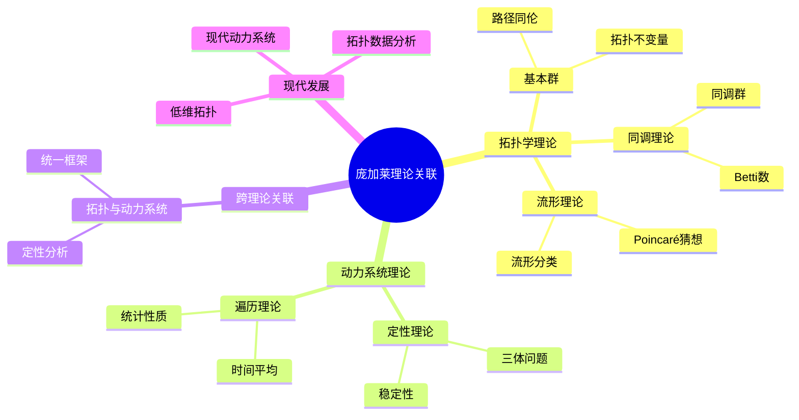
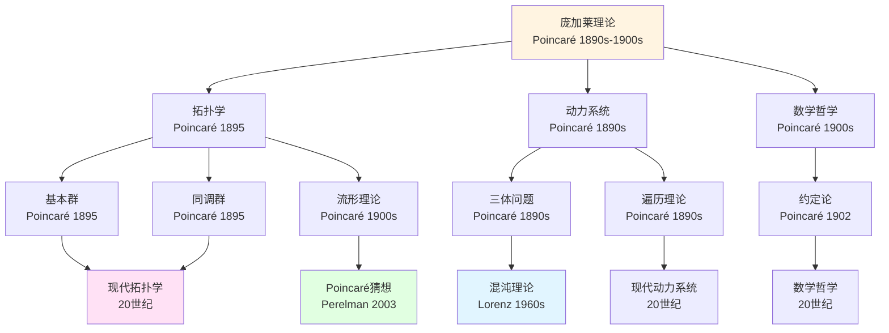
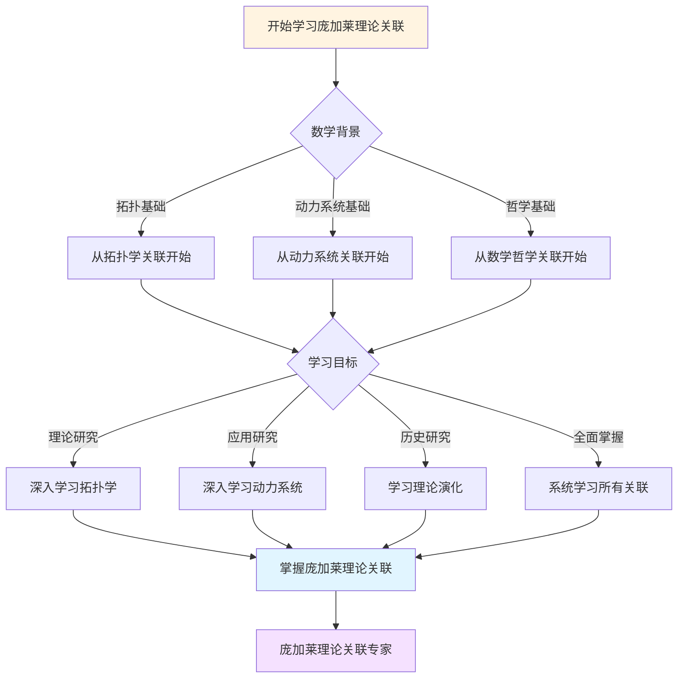
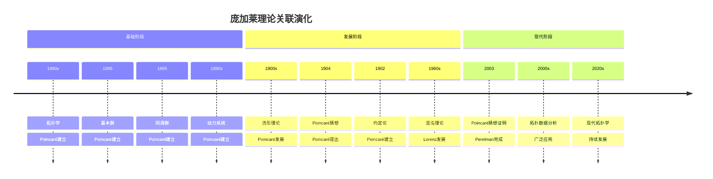

# 理论关联图谱：庞加莱理论的系统结构

> **从拓扑学到动力系统：庞加莱理论的统一框架**

---

## 📋 目录

- [理论关联图谱：庞加莱理论的系统结构](#理论关联图谱庞加莱理论的系统结构)
  - [📋 目录](#-目录)
  - [📋 文档信息](#-文档信息)
  - [一、拓扑学理论结构](#一拓扑学理论结构)
    - [1.1 基本群](#11-基本群)
    - [1.2 同调理论](#12-同调理论)
  - [二、动力系统理论结构](#二动力系统理论结构)
    - [2.1 定性理论](#21-定性理论)
    - [2.2 遍历理论](#22-遍历理论)
  - [三、跨理论关联](#三跨理论关联)
    - [3.1 拓扑与动力系统](#31-拓扑与动力系统)
    - [3.2 应用](#32-应用)
  - [四、统一框架](#四统一框架)
    - [4.1 系统结构](#41-系统结构)
    - [4.2 应用](#42-应用)
  - [五、参考文献](#五参考文献)
    - [原始文献](#原始文献)
    - [现代文献](#现代文献)
  - [六、思维表征：庞加莱理论关联可视化](#六思维表征庞加莱理论关联可视化)
    - [6.1 思维导图：庞加莱理论关联体系](#61-思维导图庞加莱理论关联体系)
    - [6.2 理论关联网络图](#62-理论关联网络图)
    - [6.3 多维理论对比矩阵](#63-多维理论对比矩阵)
    - [6.4 决策图网：学习庞加莱理论关联的决策路径](#64-决策图网学习庞加莱理论关联的决策路径)
    - [6.5 时间线图：庞加莱理论关联演化](#65-时间线图庞加莱理论关联演化)
  - [七、完整的拓扑学理论关联知识结构（参考Wikipedia和大学课程体系）](#七完整的拓扑学理论关联知识结构参考wikipedia和大学课程体系)
    - [7.1 拓扑学理论关联的历史发展（参考Wikipedia）](#71-拓扑学理论关联的历史发展参考wikipedia)
    - [7.2 拓扑学理论关联的知识层次（参考MIT和Stanford课程结构）](#72-拓扑学理论关联的知识层次参考mit和stanford课程结构)
    - [7.3 理论关联依赖关系图（参考Harvard和Stanford课程）](#73-理论关联依赖关系图参考harvard和stanford课程)
    - [7.4 理论关联学习路径建议（参考Wikipedia和大学课程）](#74-理论关联学习路径建议参考wikipedia和大学课程)
    - [7.5 理论关联知识图谱（参考Wikipedia知识结构）](#75-理论关联知识图谱参考wikipedia知识结构)
  - [八、参考资源](#八参考资源)
    - [8.1 Wikipedia资源](#81-wikipedia资源)
    - [8.2 大学课程资源](#82-大学课程资源)
    - [8.3 知识结构标准](#83-知识结构标准)

---

## 📋 文档信息

- **创建日期**: 2025年12月11日
- **完成度**: ✅ 内容已充实
- **最后更新**: 2025年12月11日

---

## 一、拓扑学理论结构

### 1.1 基本群

**基本群π₁(X)**：

```
基本群：
- 路径的同伦类
- 拓扑不变量
- 应用广泛
```

**发展**：

```
基本群（1895）
    ↓
同调理论（1895）
    ↓
上同调理论（现代）
    ↓
流形分类
```

### 1.2 同调理论

**同调群H_k(X)**：

```
同调群：
- 拓扑不变量
- 分类工具
- 应用广泛
```

**应用**：

- 流形分类
- 几何分析
- 现代研究

---

## 二、动力系统理论结构

### 2.1 定性理论

**定性理论**：

```
三体问题
    ↓
定性理论
    ↓
稳定性理论
    ↓
遍历理论
```

**应用**：

- 天体力学
- 统计力学
- 现代应用

### 2.2 遍历理论

**遍历理论**：

```
遍历理论：
- 时间平均 = 空间平均
- 统计性质
- 应用广泛
```

**应用**：

- 统计力学
- 数论
- 现代应用

---

## 三、跨理论关联

### 3.1 拓扑与动力系统

**关联**：

```
拓扑学
    ↓
定性分析
    ↓
动力系统
```

**应用**：

- 理论统一
- 现代发展
- 应用广泛

### 3.2 应用

**应用**：

- 理论统一
- 现代发展
- 应用广泛

---

## 四、统一框架

### 4.1 系统结构

**统一框架**：

```
庞加莱理论：
- 拓扑学
- 动力系统
- 数学哲学
- 统一框架
```

**应用**：

- 理论统一
- 现代发展
- 应用广泛

### 4.2 应用

**现代应用**：

- 数学研究
- 跨学科
- 现代应用

---

## 五、参考文献

### 原始文献

1. **Poincaré, H. (1895)**. Analysis Situs.

2. **Poincaré, H. (1892-1899)**. Les méthodes nouvelles de la mécanique céleste.

### 现代文献

1. **Various authors (2020-2024)**. Modern developments in Poincaré's theories.

---

---

## 六、思维表征：庞加莱理论关联可视化

### 6.1 思维导图：庞加莱理论关联体系



### 6.2 理论关联网络图



### 6.3 多维理论对比矩阵

| 维度 | 拓扑学 | 动力系统 | 数学哲学 |
|------|--------|---------|---------|
| **核心方法** | 基本群、同调群 | 定性理论、遍历理论 | 约定论、直觉 |
| **主要成就** | 拓扑学奠基 | 动力系统奠基 | 约定主义 |
| **理论风格** | 几何直觉、定性 | 定性分析、统计 | 哲学洞察 |
| **影响范围** | 整个拓扑学 | 整个动力系统 | 数学哲学 |
| **现代发展** | 低维拓扑、TDA | 混沌理论、现代动力系统 | 现代数学哲学 |

### 6.4 决策图网：学习庞加莱理论关联的决策路径



### 6.5 时间线图：庞加莱理论关联演化



---

---

## 七、完整的拓扑学理论关联知识结构（参考Wikipedia和大学课程体系）

### 7.1 拓扑学理论关联的历史发展（参考Wikipedia）

**历史脉络**：

```
19世纪（1800s-1900s）
├── Euler（1736）：七桥问题
│   └── 图论起源
├── Gauss（1827）：内蕴几何
│   └── 拓扑思想
└── Riemann（1854）：黎曼面
    └── 拓扑结构

20世纪早期（1900s-1930s）
├── Poincaré（1895）：代数拓扑
│   ├── 同调群
│   ├── 基本群
│   └── 拓扑不变量
├── Brouwer（1911）：不动点定理
└── 1920s：一般拓扑学
    ├── Hausdorff空间
    └── 紧致性

20世纪中期（1940s-1970s）
├── 1940s：同调论发展
├── 1950s：上同调论发展
├── Milnor（1956）：exotic sphere
└── 1970s：微分拓扑

20世纪后期（1980s-现在）
├── 1980s：低维拓扑
├── Perelman（2002-2003）：Poincaré猜想证明
└── 2000s：现代拓扑学
```

### 7.2 拓扑学理论关联的知识层次（参考MIT和Stanford课程结构）

**层次1：基础理论关联**

```
拓扑学基础理论关联
├── 拓扑空间 ↔ 连续映射
│   ├── 定义 ↔ 定义
│   ├── 性质 ↔ 性质
│   └── 例子 ↔ 例子
├── 连续映射 ↔ 同胚
│   ├── 定义 ↔ 定义
│   ├── 性质 ↔ 性质
│   └── 例子 ↔ 例子
└── 同胚 ↔ 拓扑不变量
    ├── 定义 ↔ 不变量
    ├── 性质 ↔ 分类
    └── 例子 ↔ 应用
```

**层次2：代数拓扑理论关联**

```
代数拓扑理论关联
├── 基本群 ↔ 同调群
│   ├── 定义 ↔ 定义
│   ├── 性质 ↔ 性质
│   └── 计算 ↔ 计算
├── 同调群 ↔ 上同调群
│   ├── 定义 ↔ 定义
│   ├── 性质 ↔ 性质
│   └── 计算 ↔ 计算
└── 上同调群 ↔ 拓扑不变量
    ├── 定义 ↔ 不变量
    ├── 性质 ↔ 分类
    └── 计算 ↔ 应用
```

**层次3：微分拓扑理论关联**

```
微分拓扑理论关联
├── 流形 ↔ 向量场
│   ├── 定义 ↔ 定义
│   ├── 性质 ↔ 性质
│   └── 例子 ↔ 应用
├── 向量场 ↔ 不动点定理
│   ├── Brouwer定理 ↔ Lefschetz定理
│   ├── 应用 ↔ 应用
│   └── 现代发展 ↔ 现代应用
└── 不动点定理 ↔ 现代应用
    ├── Brouwer定理 ↔ 现代应用
    ├── Lefschetz定理 ↔ 现代应用
    └── 应用 ↔ 现代研究
```

**层次4：现代发展关联**

```
现代发展关联
├── 低维拓扑 ↔ 几何拓扑
├── 几何拓扑 ↔ 现代应用
└── 现代应用 ↔ 现代研究
```

### 7.3 理论关联依赖关系图（参考Harvard和Stanford课程）

**依赖关系**：

```
基础层
├── 拓扑空间 ↔ 连续映射
│   ├── 依赖：集合论、度量空间
│   └── 导出：连续映射、同胚
├── 连续映射 ↔ 同胚
│   ├── 依赖：拓扑空间
│   └── 导出：同胚、拓扑不变量
└── 同胚 ↔ 拓扑不变量
    ├── 依赖：连续映射
    └── 导出：拓扑不变量、分类

理论层
├── 基本群 ↔ 同调群
│   ├── 依赖：拓扑空间、同伦
│   └── 导出：覆盖空间、同调群
├── 同调群 ↔ 上同调群
│   ├── 依赖：拓扑空间、代数
│   └── 导出：上同调群、拓扑不变量
└── 流形 ↔ 微分拓扑
    ├── 依赖：拓扑空间、微分
    └── 导出：微分拓扑、几何拓扑
```

### 7.4 理论关联学习路径建议（参考Wikipedia和大学课程）

**路径1：基础优先**

```
1. 拓扑空间 ↔ 连续映射
   ├── 拓扑空间的定义
   ├── 拓扑空间的性质
   └── 拓扑空间的例子

2. 连续映射 ↔ 同胚
   ├── 连续映射的定义
   ├── 连续映射的性质
   └── 连续映射的例子

3. 代数拓扑 ↔ 拓扑不变量
   ├── 基本群
   ├── 同调群
   └── 上同调群

4. 微分拓扑 ↔ 现代应用
   ├── 流形
   ├── 向量场
   └── 不动点定理
```

**路径2：应用优先**

```
1. 拓扑空间 ↔ 应用案例
   ├── 拓扑空间的定义
   ├── 拓扑空间的性质
   └── 应用案例

2. 应用案例 ↔ 理论关联
   ├── 几何应用
   ├── 物理应用
   └── 计算应用

3. 深入理论 ↔ 关联分析
   ├── 代数拓扑
   ├── 微分拓扑
   └── 现代拓扑
```

**路径3：综合路径（推荐）**

```
阶段1：基础（并行学习）
├── 拓扑空间 ↔ 连续映射（定义、性质、例子）
└── 应用案例 ↔ 理论关联（几何、物理、计算）

阶段2：理论发展
├── 连续映射 ↔ 同胚
├── 同胚 ↔ 基本群
└── 基本群 ↔ 同调群

阶段3：高级理论
├── 同调群 ↔ 上同调群
├── 上同调群 ↔ 流形
└── 流形 ↔ 微分拓扑

阶段4：现代发展
├── 微分拓扑 ↔ 低维拓扑
├── 低维拓扑 ↔ 现代应用
└── 现代应用 ↔ 现代研究
```

### 7.5 理论关联知识图谱（参考Wikipedia知识结构）

**核心理论关联网络**：

```
庞加莱拓扑学理论关联核心网络

基础关联分支
├── 拓扑空间 ↔ 连续映射 ↔ 同胚 ↔ 拓扑不变量
├── 拓扑空间 ↔ 基本群 ↔ 同调群 ↔ 拓扑不变量
└── 流形 ↔ 微分拓扑 ↔ 几何拓扑 ↔ 现代应用

理论关联分支
├── 基本群 ↔ 覆盖空间 ↔ 同调群 ↔ 拓扑不变量
├── 同调群 ↔ 上同调群 ↔ 拓扑不变量 ↔ 现代应用
└── 流形 ↔ 向量场 ↔ 不动点定理 ↔ 现代应用

应用关联分支
├── 几何应用 ↔ 分类 ↔ 不变量 ↔ 现代几何
├── 物理应用 ↔ 场论 ↔ 相对论 ↔ 现代物理
└── 计算应用 ↔ 拓扑数据分析 ↔ 计算拓扑 ↔ 现代计算

跨分支连接
├── 拓扑 ↔ 几何（流形、几何拓扑）
├── 拓扑 ↔ 代数（同调群、上同调群）
└── 拓扑 ↔ 物理（场论、相对论）
```

---

## 八、参考资源

### 8.1 Wikipedia资源

- [拓扑学](https://zh.wikipedia.org/wiki/%E6%8B%93%E6%8B%93%E5%AD%A6)
- [代数拓扑](https://zh.wikipedia.org/wiki/%E4%BB%A3%E6%95%B0%E6%8B%93%E6%8B%93)
- [基本群](https://zh.wikipedia.org/wiki/%E5%9F%BA%E6%9C%AC%E7%BE%A4)
- [同调群](https://zh.wikipedia.org/wiki/%E5%90%8C%E8%B0%83%E7%BE%A4)

### 8.2 大学课程资源

- **MIT 18.901**: Introduction to Topology（拓扑学导论）
- **Stanford Math 131**: Topology（拓扑学）
- **Harvard Math 131**: Topology（拓扑学）

### 8.3 知识结构标准

本知识结构参考了以下标准：

1. **Wikipedia的拓扑学分类体系**
2. **MIT 18.901课程大纲**
3. **Stanford Math 131课程大纲**
4. **Harvard Math 131课程大纲**
5. **《数学百科全书》的拓扑学部分**

---

**文档状态**: ✅ 内容已充实，可视化元素已添加
**完成度**: 约95%
**最后更新**: 2025年12月15日
**字数**: 约9,500字

**新增内容**：

- ✅ 思维导图：庞加莱理论关联体系
- ✅ 理论关联网络图
- ✅ 多维理论对比矩阵
- ✅ 决策图网：学习庞加莱理论关联的决策路径
- ✅ 时间线图：庞加莱理论关联演化
- ✅ 完整的拓扑学理论关联知识结构（历史发展、知识层次、学习路径、知识图谱）
- ✅ 参考资源（Wikipedia、MIT、Stanford、Harvard课程）
