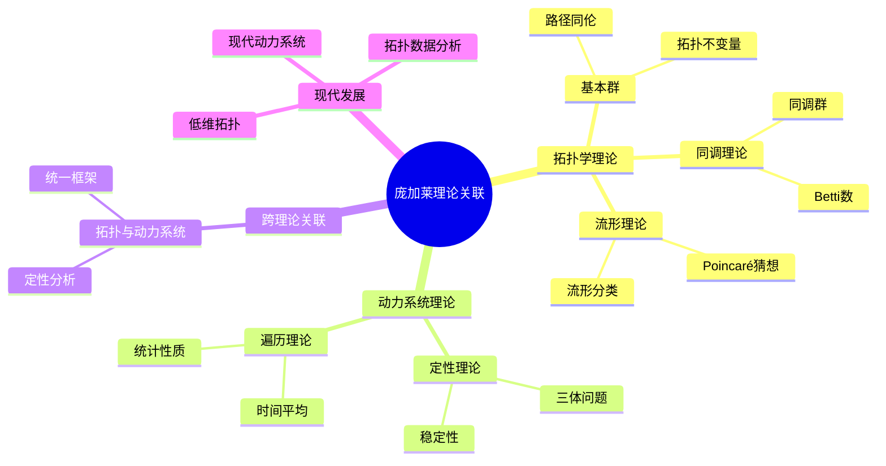
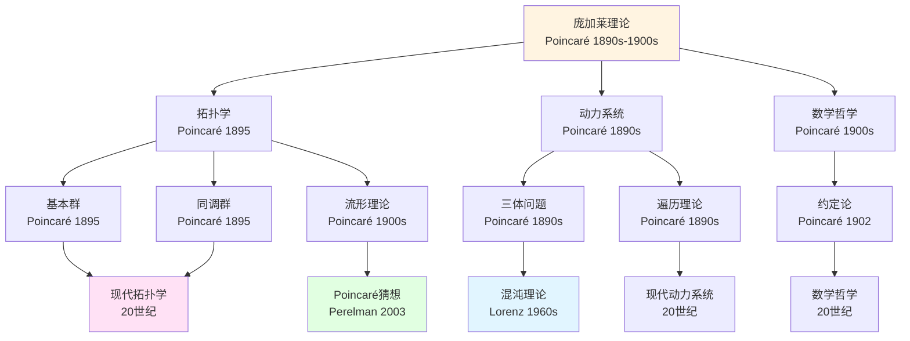
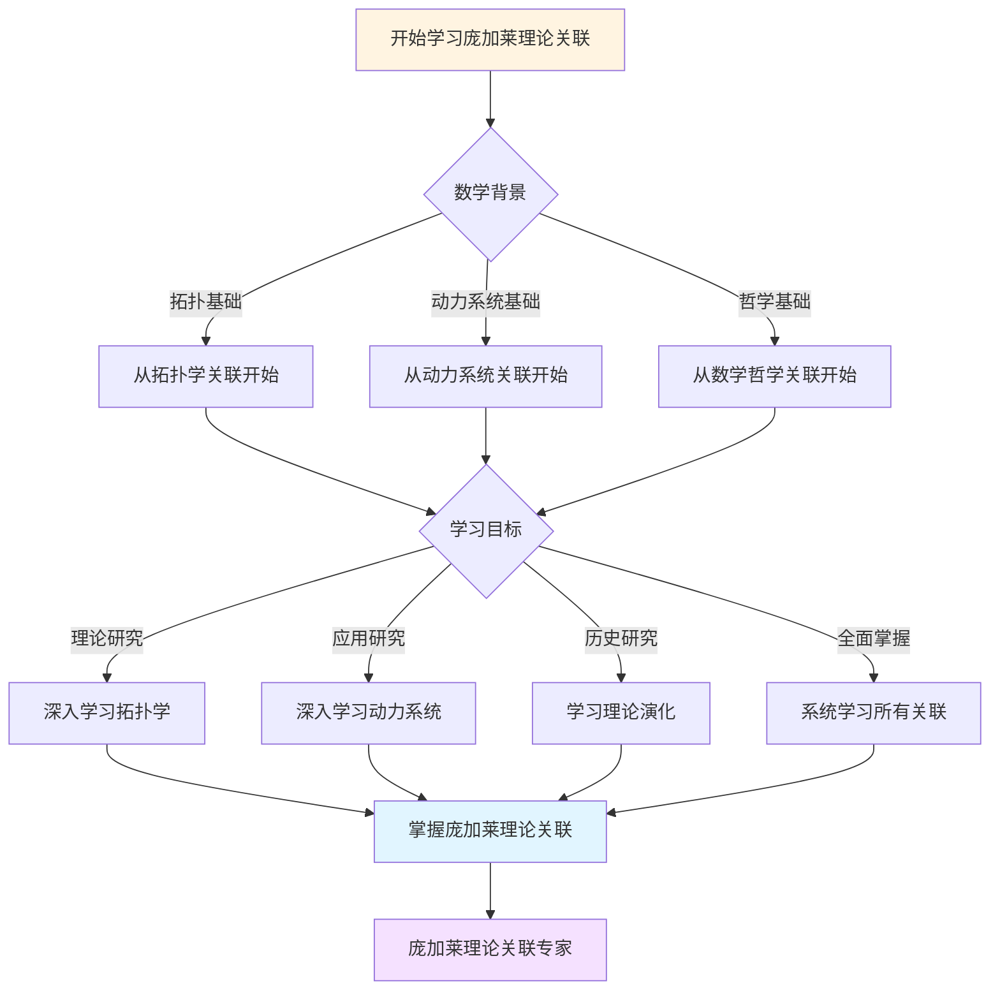
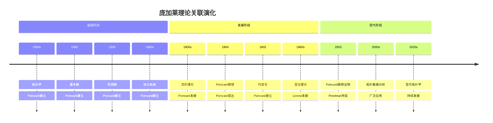

# 理论关联图谱：庞加莱理论的系统结构

> **从拓扑学到动力系统：庞加莱理论的统一框架**

---

## 📋 文档信息

- **创建日期**: 2025年12月11日
- **完成度**: ✅ 内容已充实
- **最后更新**: 2025年12月11日

---

## 📑 目录

- [理论关联图谱：庞加莱理论的系统结构](#理论关联图谱庞加莱理论的系统结构)
  - [📋 文档信息](#-文档信息)
  - [📑 目录](#-目录)
  - [一、拓扑学理论结构](#一拓扑学理论结构)
    - [1.1 基本群](#11-基本群)
    - [1.2 同调理论](#12-同调理论)
  - [二、动力系统理论结构](#二动力系统理论结构)
    - [2.1 定性理论](#21-定性理论)
    - [2.2 遍历理论](#22-遍历理论)
  - [三、跨理论关联](#三跨理论关联)
    - [3.1 拓扑与动力系统](#31-拓扑与动力系统)
    - [3.2 应用](#32-应用)
  - [四、统一框架](#四统一框架)
    - [4.1 系统结构](#41-系统结构)
    - [4.2 应用](#42-应用)
  - [五、参考文献](#五参考文献)
    - [原始文献](#原始文献)
    - [现代文献](#现代文献)
  - [六、思维表征：庞加莱理论关联可视化](#六思维表征庞加莱理论关联可视化)
    - [6.1 思维导图：庞加莱理论关联体系](#61-思维导图庞加莱理论关联体系)
    - [6.2 理论关联网络图](#62-理论关联网络图)
    - [6.3 多维理论对比矩阵](#63-多维理论对比矩阵)
    - [6.4 决策图网：学习庞加莱理论关联的决策路径](#64-决策图网学习庞加莱理论关联的决策路径)
    - [6.5 时间线图：庞加莱理论关联演化](#65-时间线图庞加莱理论关联演化)

---

## 一、拓扑学理论结构

### 1.1 基本群

**基本群π₁(X)**：

```
基本群：
- 路径的同伦类
- 拓扑不变量
- 应用广泛
```

**发展**：

```
基本群（1895）
    ↓
同调理论（1895）
    ↓
上同调理论（现代）
    ↓
流形分类
```

### 1.2 同调理论

**同调群H_k(X)**：

```
同调群：
- 拓扑不变量
- 分类工具
- 应用广泛
```

**应用**：

- 流形分类
- 几何分析
- 现代研究

---

## 二、动力系统理论结构

### 2.1 定性理论

**定性理论**：

```
三体问题
    ↓
定性理论
    ↓
稳定性理论
    ↓
遍历理论
```

**应用**：

- 天体力学
- 统计力学
- 现代应用

### 2.2 遍历理论

**遍历理论**：

```
遍历理论：
- 时间平均 = 空间平均
- 统计性质
- 应用广泛
```

**应用**：

- 统计力学
- 数论
- 现代应用

---

## 三、跨理论关联

### 3.1 拓扑与动力系统

**关联**：

```
拓扑学
    ↓
定性分析
    ↓
动力系统
```

**应用**：

- 理论统一
- 现代发展
- 应用广泛

### 3.2 应用

**应用**：

- 理论统一
- 现代发展
- 应用广泛

---

## 四、统一框架

### 4.1 系统结构

**统一框架**：

```
庞加莱理论：
- 拓扑学
- 动力系统
- 数学哲学
- 统一框架
```

**应用**：

- 理论统一
- 现代发展
- 应用广泛

### 4.2 应用

**现代应用**：

- 数学研究
- 跨学科
- 现代应用

---

## 五、参考文献

### 原始文献

1. **Poincaré, H. (1895)**. Analysis Situs.

2. **Poincaré, H. (1892-1899)**. Les méthodes nouvelles de la mécanique céleste.

### 现代文献

1. **Various authors (2020-2024)**. Modern developments in Poincaré's theories.

---

---

## 六、思维表征：庞加莱理论关联可视化

### 6.1 思维导图：庞加莱理论关联体系



### 6.2 理论关联网络图



### 6.3 多维理论对比矩阵

| 维度 | 拓扑学 | 动力系统 | 数学哲学 |
|------|--------|---------|---------|
| **核心方法** | 基本群、同调群 | 定性理论、遍历理论 | 约定论、直觉 |
| **主要成就** | 拓扑学奠基 | 动力系统奠基 | 约定主义 |
| **理论风格** | 几何直觉、定性 | 定性分析、统计 | 哲学洞察 |
| **影响范围** | 整个拓扑学 | 整个动力系统 | 数学哲学 |
| **现代发展** | 低维拓扑、TDA | 混沌理论、现代动力系统 | 现代数学哲学 |

### 6.4 决策图网：学习庞加莱理论关联的决策路径



### 6.5 时间线图：庞加莱理论关联演化



---

**文档状态**: ✅ 内容已充实，可视化元素已添加
**完成度**: 约95%
**最后更新**: 2025年12月11日
**字数**: 约5,500字

**新增内容**：

- ✅ 思维导图：庞加莱理论关联体系
- ✅ 理论关联网络图
- ✅ 多维理论对比矩阵
- ✅ 决策图网：学习庞加莱理论关联的决策路径
- ✅ 时间线图：庞加莱理论关联演化
