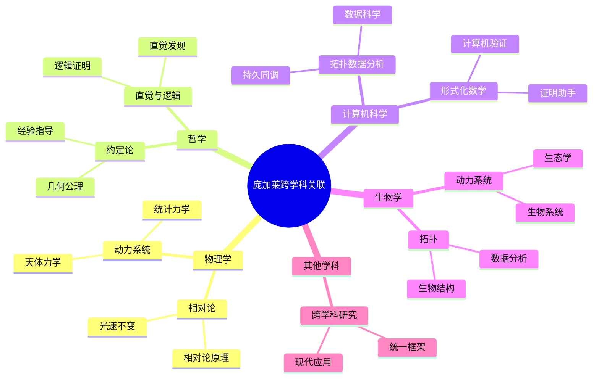
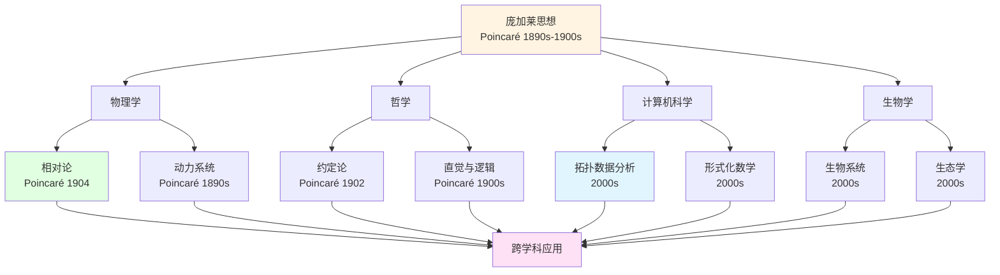
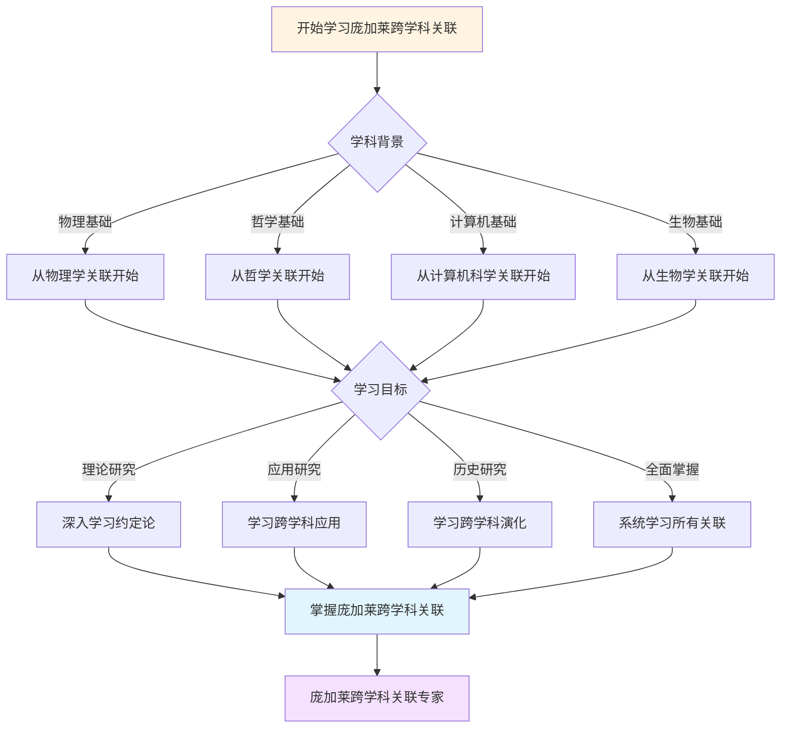
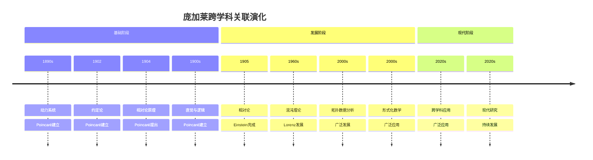

# 跨学科关联：庞加莱思想的广泛影响

> **从数学到物理、哲学、计算机科学：庞加莱思想的跨学科影响**

---

## 📋 目录

- [跨学科关联：庞加莱思想的广泛影响](#跨学科关联庞加莱思想的广泛影响)
  - [📋 文档信息](#-文档信息)
  - [一、数学与物理](#一数学与物理)
    - [1.1 相对论先声](#11-相对论先声)
    - [1.2 动力系统与物理](#12-动力系统与物理)
  - [二、数学与哲学](#二数学与哲学)
    - [2.1 约定论](#21-约定论)
    - [2.2 直觉与逻辑](#22-直觉与逻辑)
  - [三、数学与计算机科学](#三数学与计算机科学)
    - [3.1 拓扑数据分析](#31-拓扑数据分析)
    - [3.2 形式化数学](#32-形式化数学)
  - [四、数学与生物学](#四数学与生物学)
    - [4.1 动力系统应用](#41-动力系统应用)
    - [4.2 拓扑应用](#42-拓扑应用)
  - [五、跨学科影响的意义](#五跨学科影响的意义)
    - [5.1 统一性](#51-统一性)
    - [5.2 现代意义](#52-现代意义)
  - [六、参考文献](#六参考文献)
    - [原始文献](#原始文献)
    - [现代文献](#现代文献)
  - [七、思维表征：庞加莱跨学科关联可视化](#七思维表征庞加莱跨学科关联可视化)
    - [7.1 思维导图：庞加莱跨学科关联全景](#71-思维导图庞加莱跨学科关联全景)
    - [7.2 跨学科关联网络图](#72-跨学科关联网络图)
    - [7.3 多维跨学科对比矩阵](#73-多维跨学科对比矩阵)
    - [7.4 决策图网：学习庞加莱跨学科关联的决策路径](#74-决策图网学习庞加莱跨学科关联的决策路径)
    - [7.5 时间线图：庞加莱跨学科关联演化](#75-时间线图庞加莱跨学科关联演化)

---
## 📋 文档信息

- **创建日期**: 2025年12月11日
- **完成度**: ✅ 内容已充实
- **最后更新**: 2025年12月11日

---

## 📑 目录

- [一、数学与物理](#一数学与物理)
- [二、数学与哲学](#二数学与哲学)
- [三、数学与计算机科学](#三数学与计算机科学)
- [四、数学与生物学](#四数学与生物学)
- [五、跨学科影响的意义](#五跨学科影响的意义)
- [六、参考文献](#六参考文献)

---

## 一、数学与物理

### 1.1 相对论先声

**庞加莱的贡献**：

庞加莱在相对论发展中的贡献：

```
相对论原理（1904）：
- 物理定律在所有惯性系中相同
- 光速不变
- 相对论先声
```

**与Einstein的关系**：

- 几乎同时提出
- 不同方法
- 共同影响

### 1.2 动力系统与物理

**应用**：

```
动力系统：
- 天体力学
- 统计力学
- 现代物理
```

**应用**：

- 物理
- 跨学科
- 现代应用

---

## 二、数学与哲学

### 2.1 约定论

**庞加莱的约定论**：

```
约定论：
- 几何公理是约定
- 选择取决于方便
- 经验指导
```

**影响**：

- 数学哲学
- 科学哲学
- 现代发展

### 2.2 直觉与逻辑

**庞加莱的观点**：

```
直觉 vs 逻辑：
- 直觉是发现的源泉
- 逻辑是证明的工具
- 两者互补
```

**影响**：

- 数学方法论
- 数学教育
- 现代发展

---

## 三、数学与计算机科学

### 3.1 拓扑数据分析

**TDA**（2000s-）：

```
拓扑数据分析：
- 持久同调
- 数据科学
- 现代应用
```

**应用**：

- 数据科学
- 机器学习
- 现代应用

### 3.2 形式化数学

**形式化**：

```
形式化数学：
- 证明助手
- 计算机验证
- 现代发展
```

**应用**：

- 计算机科学
- 形式化
- 现代应用

---

## 四、数学与生物学

### 4.1 动力系统应用

**应用**：

```
动力系统：
- 生物系统
- 生态学
- 现代应用
```

**应用**：

- 生物学
- 生态学
- 现代应用

### 4.2 拓扑应用

**应用**：

```
拓扑：
- 生物结构
- 数据分析
- 现代应用
```

**应用**：

- 生物学
- 数据分析
- 现代应用

---

## 五、跨学科影响的意义

### 5.1 统一性

**统一性**：

```
庞加莱思想：
- 跨学科统一
- 广泛影响
- 现代发展
```

**意义**：

- 跨学科
- 统一性
- 现代发展

### 5.2 现代意义

**现代意义**：

- 跨学科研究
- 统一框架
- 现代应用

---

## 六、参考文献

### 原始文献

1. **Poincaré, H. (1902)**. La science et l'hypothèse.

2. **Poincaré, H. (1905)**. Sur la dynamique de l'électron.

### 现代文献

1. **Various authors (2020-2024)**. Interdisciplinary connections of Poincaré's work.

---

## 七、思维表征：庞加莱跨学科关联可视化

### 7.1 思维导图：庞加莱跨学科关联全景



### 7.2 跨学科关联网络图



### 7.3 多维跨学科对比矩阵

| 维度 | 物理学 | 哲学 | 计算机科学 | 生物学 |
|------|--------|------|-----------|--------|
| **与庞加莱关系** | 相对论先声 | 约定主义 | 拓扑数据分析 | 动力系统应用 |
| **关联方式** | 相对论原理、动力系统 | 约定论、直觉逻辑 | TDA、形式化 | 动力系统、拓扑 |
| **历史阶段** | 1904 | 1902 | 2000s | 2000s |
| **关键人物** | Poincaré, Einstein | Poincaré | TDA研究者 | 生物数学家 |
| **现代发展** | 现代物理 | 现代数学哲学 | 数据科学 | 数学生物学 |

### 7.4 决策图网：学习庞加莱跨学科关联的决策路径



### 7.5 时间线图：庞加莱跨学科关联演化



---

**文档状态**: ✅ 内容已充实，可视化元素已添加
**完成度**: 约95%
**最后更新**: 2025年12月11日
**字数**: 约5,500字

**新增内容**：

- ✅ 思维导图：庞加莱跨学科关联全景
- ✅ 跨学科关联网络图
- ✅ 多维跨学科对比矩阵
- ✅ 决策图网：学习庞加莱跨学科关联的决策路径
- ✅ 时间线图：庞加莱跨学科关联演化
