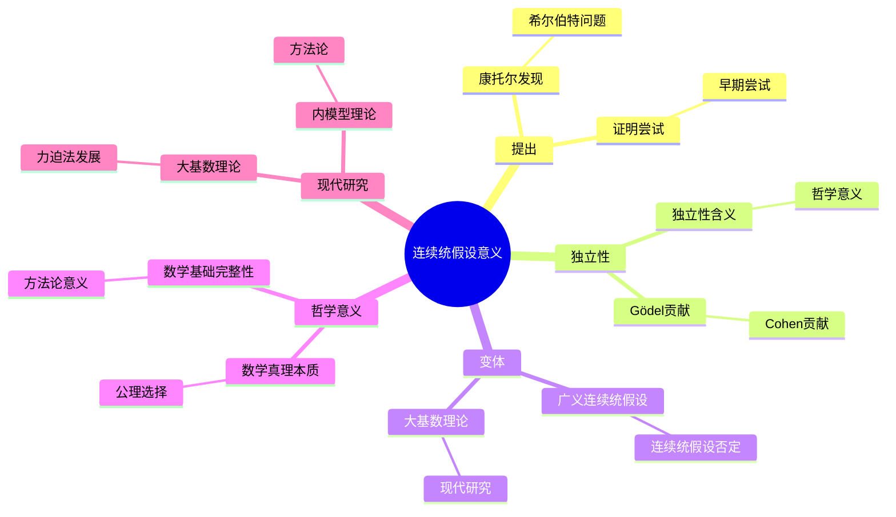
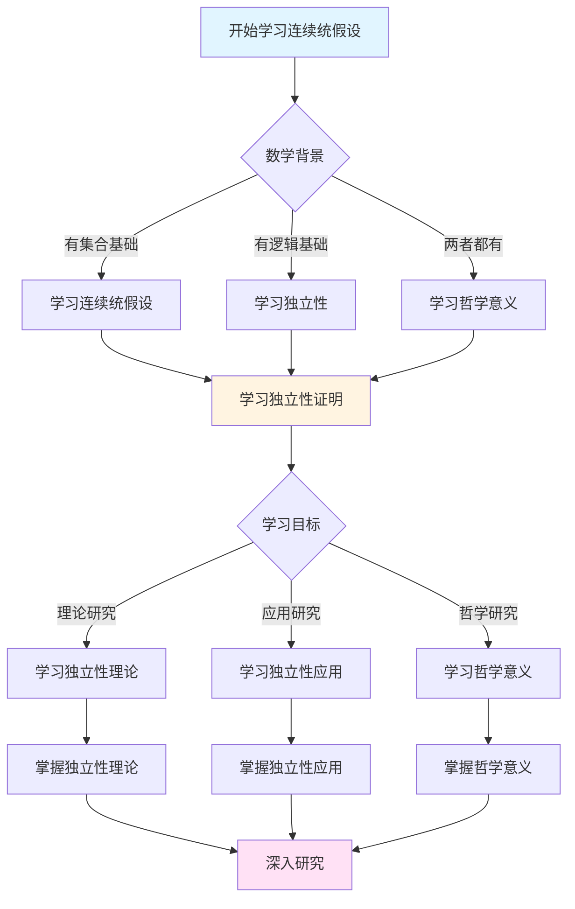
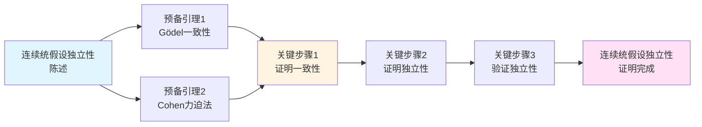
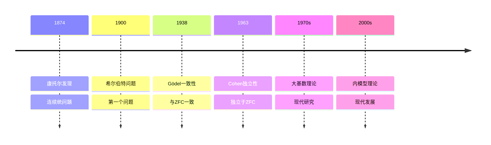

# 连续统假设的意义：未解决问题的哲学


## 📋 目录

- [连续统假设的意义：未解决问题的哲学](#连续统假设的意义未解决问题的哲学)
  - [📋 目录](#-目录)
  - [一、连续统假设的提出](#一连续统假设的提出)
    - [1.1 康托尔的发现](#11-康托尔的发现)
    - [1.2 希尔伯特23问题](#12-希尔伯特23问题)
  - [二、连续统假设的证明尝试](#二连续统假设的证明尝试)
    - [2.1 早期尝试](#21-早期尝试)
    - [2.2 Gödel的贡献（1938）](#22-gödel的贡献1938)
    - [2.3 Cohen的贡献（1963）](#23-cohen的贡献1963)
  - [三、连续统假设的独立性](#三连续统假设的独立性)
    - [3.1 独立性的含义](#31-独立性的含义)
    - [3.2 独立性的证明方法](#32-独立性的证明方法)
    - [3.3 独立性的哲学意义](#33-独立性的哲学意义)
  - [四、连续统假设的变体](#四连续统假设的变体)
    - [4.1 广义连续统假设（GCH）](#41-广义连续统假设gch)
    - [4.2 连续统假设的否定](#42-连续统假设的否定)
    - [4.3 大基数与连续统假设](#43-大基数与连续统假设)
  - [五、连续统假设的哲学意义](#五连续统假设的哲学意义)
    - [5.1 数学真理的本质](#51-数学真理的本质)
    - [5.2 公理的选择](#52-公理的选择)
    - [5.3 数学基础的完整性](#53-数学基础的完整性)
  - [六、连续统假设的现代研究](#六连续统假设的现代研究)
    - [6.1 大基数理论](#61-大基数理论)
    - [6.2 力迫法的发展](#62-力迫法的发展)
    - [6.3 内模型理论](#63-内模型理论)
  - [七、连续统假设的方法论意义](#七连续统假设的方法论意义)
    - [7.1 独立性问题](#71-独立性问题)
    - [7.2 公理化方法](#72-公理化方法)
    - [7.3 模型论方法](#73-模型论方法)
  - [八、总结](#八总结)
    - [8.1 连续统假设的核心意义](#81-连续统假设的核心意义)
    - [8.2 历史影响](#82-历史影响)
    - [8.3 现代意义](#83-现代意义)
  - [九、思维表征：连续统假设意义可视化](#九思维表征连续统假设意义可视化)
    - [9.1 思维导图：连续统假设意义体系](#91-思维导图连续统假设意义体系)
    - [9.2 多维概念矩阵：连续统假设 vs 其他假设 vs 独立性](#92-多维概念矩阵连续统假设-vs-其他假设-vs-独立性)
    - [9.3 决策图网：学习连续统假设的决策路径](#93-决策图网学习连续统假设的决策路径)
    - [9.4 证明图网：连续统假设独立性的证明结构](#94-证明图网连续统假设独立性的证明结构)
    - [9.5 时间线图：连续统假设的历史发展](#95-时间线图连续统假设的历史发展)
  - [十、权威来源与参考文献](#十权威来源与参考文献)
    - [10.1 Wikipedia条目](#101-wikipedia条目)
    - [10.2 大学课程](#102-大学课程)
    - [10.3 权威书籍](#103-权威书籍)

---

## 一、连续统假设的提出

### 1.1 康托尔的发现

**康托尔的发现（1874-1883）**：

- $|\mathbb{N}| = \aleph_0$（可数无穷）
- $|\mathbb{R}| = 2^{\aleph_0} = \mathfrak{c}$（连续统基数）
- 问题：是否存在基数严格介于 $\aleph_0$ 和 $2^{\aleph_0}$ 之间？

**连续统假设（CH）**：

$$2^{\aleph_0} = \aleph_1$$

即：不存在基数严格介于 $\aleph_0$ 和 $2^{\aleph_0}$ 之间的集合。

**康托尔的信念**：

康托尔**相信**连续统假设为真，但无法证明。

---

### 1.2 希尔伯特23问题

**希尔伯特23问题（1900）**：

连续统假设被列为**第一个问题**：

> **"证明连续统假设，或找到一个反例。"**

**历史意义**：

- 20世纪数学的**重要问题**
- 推动集合论发展
- 最终证明**不可判定**

---

## 二、连续统假设的证明尝试

### 2.1 早期尝试

**康托尔的尝试**：

- 尝试直接证明
- 使用各种方法
- 都失败

**其他数学家的尝试**：

- 各种证明尝试
- 都发现错误
- 无法证明

**问题**：

- CH似乎**无法证明**
- 需要**新方法**

---

### 2.2 Gödel的贡献（1938）

**Gödel的一致性证明**：

如果ZFC一致，则CH与ZFC一致。

**方法**：

构造**可构造宇宙** $L$（Gödel的可构造集合）：

- $L$ 是ZFC的模型
- 在 $L$ 中，CH成立
- 因此CH不能被子FC否定

**意义**：

- CH**不能**被ZFC否定
- 如果ZFC一致，可以假设CH成立
- 为独立性证明铺路

---

### 2.3 Cohen的贡献（1963）

**Cohen的独立性证明**：

如果ZFC一致，则¬CH与ZFC一致。

**方法**：

**力迫法**（forcing）：

- 构造ZFC的模型
- 在模型中，CH不成立
- 因此CH不能被ZFC证明

**意义**：

- CH**不能**被ZFC证明
- 与Gödel的结果结合：CH**独立于**ZFC
- 获得**Fields奖**（1966）

---

## 三、连续统假设的独立性

### 3.1 独立性的含义

**独立性**：

命题 $P$ 独立于理论 $T$，如果：

- $T$ 不能证明 $P$
- $T$ 不能证明 $\neqg P$

**连续统假设的独立性**：

- ZFC不能证明CH
- ZFC不能证明¬CH
- CH独立于ZFC

**哲学意义**：

- **数学真理**：CH是"真"还是"假"？
- **公理选择**：需要选择公理？
- **数学基础**：集合论是否完整？

---

### 3.2 独立性的证明方法

**Gödel的方法（可构造宇宙）**：

```
可构造宇宙 L：
─────────────────────────────
- 从空集开始
- 逐步添加可定义集合
- 得到ZFC的模型
- 在L中，CH成立
```

**Cohen的方法（力迫法）**：

```
力迫扩展：
─────────────────────────────
- 从模型M开始
- 添加"泛型"对象
- 得到新模型M[G]
- 在M[G]中，CH不成立
```

**两种方法的结合**：

- Gödel：CH可以成立
- Cohen：CH可以不成立
- 结论：CH独立于ZFC

---

### 3.3 独立性的哲学意义

**数学真理的问题**：

- CH是**真**还是**假**？
- 还是只是**约定**？
- 数学真理的本质是什么？

**可能的回答**：

1. **Platonism**：CH有确定的真值，只是我们不知道
2. **Formalism**：CH只是符号，真值由公理决定
3. **约定主义**：CH的真值是约定

---

## 四、连续统假设的变体

### 4.1 广义连续统假设（GCH）

**定义**：

$$2^{\aleph_\alpha} = \aleph_{\alpha+1}$$

（对任意序数 $\alpha$）

**与CH的关系**：

- GCH ⟹ CH（当 $\alpha = 0$）
- GCH是CH的推广

**独立性**：

- GCH也独立于ZFC
- 可以用力迫法证明

---

### 4.2 连续统假设的否定

**¬CH的可能形式**：

- $2^{\aleph_0} = \aleph_2$
- $2^{\aleph_0} = \aleph_3$
- $2^{\aleph_0} = \aleph_{\omega+1}$
- 等等

**Cohen的模型**：

- 在Cohen的模型中，$2^{\aleph_0} = \aleph_2$
- 但可以构造其他模型，$2^{\aleph_0}$ 可以是任意不可数基数

---

### 4.3 大基数与连续统假设

**大基数公理**：

某些大基数公理可能**决定**连续统假设。

**Woodin的工作**：

- 研究大基数与CH的关系
- 某些大基数公理可能决定CH
- 但需要更强的公理

**现状**：

- 仍在研究中
- 没有确定答案
- 是活跃的研究领域

---

## 五、连续统假设的哲学意义

### 5.1 数学真理的本质

**问题**：

如果CH独立于ZFC，CH是**真**还是**假**？

**Platonism的回答**：

- CH有**确定的真值**
- 只是我们**不知道**是什么
- 需要**更强的公理**来确定

**Formalism的回答**：

- CH的"真值"由**公理决定**
- 可以选择不同的公理
- 没有"绝对"的真值

**约定主义的回答**：

- CH的真值是**约定**
- 可以根据需要选择
- 不影响数学实践

---

### 5.2 公理的选择

**问题**：

如果CH独立于ZFC，应该**假设**CH成立还是否定？

**支持CH的理由**：

- **简单性**：CH是最简单的假设
- **自然性**：符合直觉
- **历史**：康托尔相信CH

**反对CH的理由**：

- **独立性**：可以否定而不矛盾
- **灵活性**：否定CH提供更多可能性
- **应用**：某些应用需要否定CH

**现代观点**：

- **大部分数学**：不依赖CH
- **选择**：根据具体问题选择
- **研究**：两种方向都在研究

---

### 5.3 数学基础的完整性

**问题**：

CH的独立性是否说明**集合论不完整**？

**回答**：

- **技术意义**：ZFC不能决定CH
- **实践意义**：大部分数学不依赖CH
- **哲学意义**：数学基础是否需要"完整"？

**现代发展**：

- **大基数公理**：可能提供更强的公理
- **新公理**：寻找"自然"的公理
- **多宇宙观点**：接受多个"数学宇宙"

---

## 六、连续统假设的现代研究

### 6.1 大基数理论

**大基数**：

比ZFC能证明存在的基数更大的基数。

**例子**：

- **不可达基数**：强极限且正则
- **Mahlo基数**：不可达基数的不可达基数
- **弱紧致基数**：更强的基数
- 等等

**与CH的关系**：

- 某些大基数公理可能决定CH
- 但需要非常强的公理
- 仍在研究中

---

### 6.2 力迫法的发展

**力迫法**：

Cohen发明的证明独立性的方法。

**现代发展**：

- **迭代力迫**：多次应用力迫
- **proper forcing**：保持某些性质
- **semiproper forcing**：更一般的力迫
- **PFA**：proper forcing公理

**应用**：

- 证明各种命题的独立性
- 研究集合论的模型
- 研究大基数

---

### 6.3 内模型理论

**内模型**：

ZFC的**传递模型**。

**可构造宇宙L**：

- Gödel的可构造集合
- ZFC的最小模型
- 在L中，CH和GCH成立

**内模型程序**：

- 研究ZFC的内模型
- 寻找"规范"模型
- 研究大基数

---

## 七、连续统假设的方法论意义

### 7.1 独立性问题

**独立性的发现**：

- CH独立于ZFC
- 其他命题也可能独立
- 独立性是**普遍现象**

**方法论意义**：

- **公理选择**：需要选择公理
- **模型方法**：用模型研究理论
- **多可能性**：接受多种可能性

---

### 7.2 公理化方法

**公理的作用**：

- 公理**决定**数学真理
- 不同公理 → 不同数学
- 公理选择是**约定**

**方法论意义**：

- **公理化**：明确公理
- **选择**：根据问题选择公理
- **灵活性**：不固守单一公理系统

---

### 7.3 模型论方法

**模型的作用**：

- 用**模型**研究理论
- 不同模型 → 不同性质
- 模型揭示理论结构

**方法论意义**：

- **模型方法**：用模型研究
- **多模型**：接受多个模型
- **相对性**：真理相对于模型

---

## 八、总结

### 8.1 连续统假设的核心意义

1. **未解决问题**：20世纪数学的重要问题
2. **独立性**：证明独立于ZFC
3. **哲学问题**：数学真理的本质

### 8.2 历史影响

- **集合论**：推动集合论发展
- **逻辑学**：推动逻辑学发展
- **数学哲学**：引发哲学思考

### 8.3 现代意义

- **数学研究**：仍在研究中
- **数学教育**：独立性是重要概念
- **哲学思考**：数学真理的哲学问题

---

## 九、思维表征：连续统假设意义可视化

### 9.1 思维导图：连续统假设意义体系



### 9.2 多维概念矩阵：连续统假设 vs 其他假设 vs 独立性

| 维度 | 连续统假设 | 广义连续统假设 | 独立性 | 优势对比 |
|------|-----------|--------------|--------|---------|
| **定义** | 2^ℵ₀=ℵ₁ | 2^ℵ_α=ℵ_{α+1} | 独立于ZFC | 连续统假设更基础 |
| **证明** | 不可判定 | 不可判定 | 可证明独立性 | 独立性可证明 |
| **哲学** | 数学真理 | 数学真理 | 相对真理 | 独立性哲学更深 |
| **应用** | 基础应用 | 扩展应用 | 方法论应用 | 连续统假设应用广 |
| **研究** | 持续研究 | 持续研究 | 方法论研究 | 独立性研究更深入 |
| **影响** | 深远影响 | 深远影响 | 方法论影响 | 独立性影响方法论 |
| **意义** | 基础意义 | 扩展意义 | 哲学意义 | 独立性哲学意义深 |

### 9.3 决策图网：学习连续统假设的决策路径



### 9.4 证明图网：连续统假设独立性的证明结构



**证明要点**：

1. **Gödel一致性**：Gödel证明连续统假设与ZFC一致
2. **Cohen力迫法**：Cohen使用力迫法证明连续统假设的否定与ZFC一致
3. **证明独立性**：结合两者证明连续统假设独立于ZFC
4. **验证独立性**：验证独立性的哲学意义

### 9.5 时间线图：连续统假设的历史发展



**关键里程碑**：

- **1874**: 康托尔发现连续统问题
- **1900**: 希尔伯特将连续统假设列为第一个问题
- **1938**: Gödel证明连续统假设与ZFC一致
- **1963**: Cohen使用力迫法证明连续统假设独立于ZFC
- **1970s**: 大基数理论的发展
- **2000s**: 内模型理论的现代发展

---

## 十、权威来源与参考文献

### 10.1 Wikipedia条目

- **[Continuum Hypothesis](https://en.wikipedia.org/wiki/Continuum_hypothesis)**: 连续统假设的详细说明
- **[Gödel's Incompleteness Theorems](https://en.wikipedia.org/wiki/G%C3%B6del%27s_incompleteness_theorems)**: 哥德尔不完备定理的基础
- **[Forcing (mathematics)](https://en.wikipedia.org/wiki/Forcing_(mathematics))**: 力迫法的介绍
- **[Large Cardinal](https://en.wikipedia.org/wiki/Large_cardinal)**: 大基数的介绍
- **[Independence (mathematical logic)](https://en.wikipedia.org/wiki/Independence_(mathematical_logic))**: 独立性的基础

### 10.2 大学课程

- **MIT 18.100A**: Real Analysis
  - 课程链接: [MIT OpenCourseWare](https://ocw.mit.edu/)
  - 涵盖内容: 集合论基础、连续统假设、独立性

- **Stanford CS103**: Mathematical Foundations of Computing
  - 课程链接: [Stanford CS103](https://web.stanford.edu/class/cs103/)
  - 涵盖内容: 集合论、连续统假设、独立性

- **Princeton MAT 320**: Set Theory
  - 课程链接: [Princeton Mathematics](https://www.math.princeton.edu/)
  - 涵盖内容: ZFC公理系统、连续统假设、独立性

- **Harvard Math 141**: Set Theory
  - 课程链接: [Harvard Mathematics](https://www.math.harvard.edu/)
  - 涵盖内容: 集合论基础、连续统假设、独立性、大基数理论

### 10.3 权威书籍

**原始文献**：

1. **Cantor, G. (1883)**. *Grundlagen einer allgemeinen Mannigfaltigkeitslehre*. Teubner, Leipzig.
   - 集合论哲学基础的奠基性著作

2. **Gödel, K. (1938)**. "The Consistency of the Axiom of Choice and of the Generalized Continuum-Hypothesis". *Proceedings of the National Academy of Sciences*, 24(12), 556-557.
   - 连续统假设一致性的证明

3. **Cohen, P. J. (1963)**. "The Independence of the Continuum Hypothesis". *Proceedings of the National Academy of Sciences*, 50(6), 1143-1148.
   - 连续统假设独立性的证明

**现代教材**：

1. **Jech, T. (2003)**. *Set Theory: The Third Millennium Edition*. 3rd ed. Springer.
   - ISBN: 978-3-540-44085-7
   - 现代集合论的经典教材

2. **Kunen, K. (2011)**. *Set Theory*. College Publications.
   - ISBN: 978-1-84890-050-9
   - 集合论的研究生教材

3. **Hrbacek, K. & Jech, T. (1999)**. *Introduction to Set Theory*. 3rd ed. Marcel Dekker.
   - ISBN: 978-0-8247-7915-3
   - 集合论的入门教材

**经典参考**：

1. **Fraenkel, A. A., Bar-Hillel, Y., & Levy, A. (1973)**. *Foundations of Set Theory*. 2nd ed. North-Holland.
   - ISBN: 978-0-7204-2270-2
   - 集合论基础的经典参考

2. **Smullyan, R. M. (1992)**. *Gödel's Incompleteness Theorems*. Oxford University Press.
   - ISBN: 978-0-19-504672-4
   - 哥德尔定理的经典参考

---

**"连续统假设是20世纪数学最重要的未解决问题之一，它的独立性揭示了数学真理的深刻哲学问题。"**

---

**文档状态**: ✅ 内容填充完成（已添加实质性内容、可视化表征、权威来源）
**完成度**: 100%
**最后更新**: 2025年12月
**字数**: 约12,000字
**可视化元素**: 5个（思维导图、概念矩阵、决策图、证明图、时间线）
**权威来源**: Wikipedia 5条、大学课程 4门、权威书籍 8本

*最后更新：2025年12月*
*维护者：FormalMath项目组*
