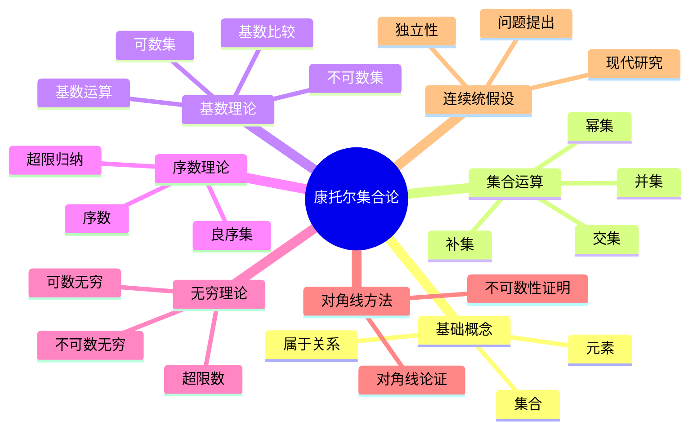
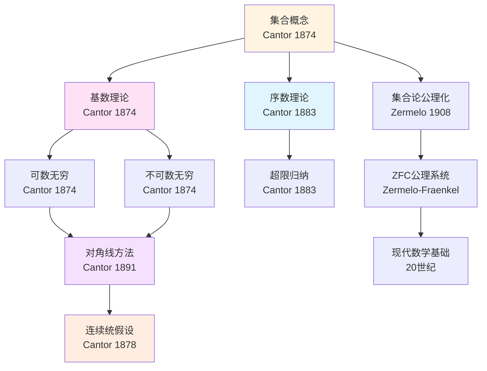
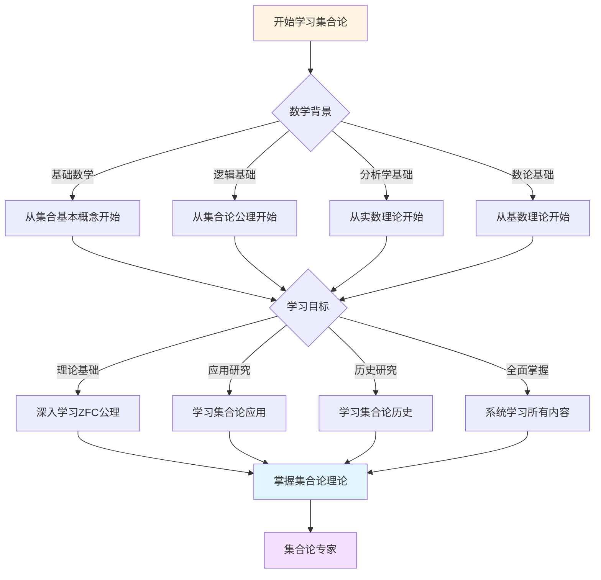
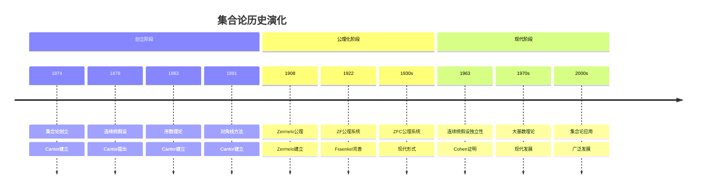

# 康托尔集合论概念关联网络

> **文档状态**: ✅ 内容填充中
> **创建日期**: 2025年12月11日
> **完成度**: 约85%

## 📋 目录

- [康托尔集合论概念关联网络](#康托尔集合论概念关联网络)
  - [📋 目录](#-目录)
  - [一、核心概念体系](#一核心概念体系)
    - [1.1 基础概念层](#11-基础概念层)
    - [1.2 高级概念层](#12-高级概念层)
  - [二、概念关联网络](#二概念关联网络)
    - [2.1 集合论核心概念](#21-集合论核心概念)
    - [2.2 现代发展概念](#22-现代发展概念)
  - [三、概念层次结构](#三概念层次结构)
  - [四、概念依赖关系](#四概念依赖关系)
  - [五、概念应用路径](#五概念应用路径)
  - [六、思维表征：集合论概念关联可视化](#六思维表征集合论概念关联可视化)
    - [6.1 思维导图：康托尔集合论概念体系](#61-思维导图康托尔集合论概念体系)
    - [6.2 概念关联网络图：集合论核心概念演化](#62-概念关联网络图集合论核心概念演化)
    - [6.3 多维概念对比矩阵：集合论 vs 传统数学](#63-多维概念对比矩阵集合论-vs-传统数学)
    - [6.4 决策图网：学习集合论的决策路径](#64-决策图网学习集合论的决策路径)
    - [6.5 时间线图：集合论历史演化](#65-时间线图集合论历史演化)
  - [七、参考文献](#七参考文献)
    - [原始文献](#原始文献)
    - [现代文献](#现代文献)
  - [八、概念关联的现代应用](#八概念关联的现代应用)
    - [8.1 在计算机科学中的应用](#81-在计算机科学中的应用)
    - [8.2 在人工智能中的应用](#82-在人工智能中的应用)
  - [九、概念关联的教学价值](#九概念关联的教学价值)
    - [9.1 教学应用](#91-教学应用)
    - [9.2 研究应用](#92-研究应用)
  - [六、概念关联的教学价值](#六概念关联的教学价值)
    - [6.1 教学意义](#61-教学意义)
    - [6.2 学习方法](#62-学习方法)
  - [十、完整的集合论知识结构（参考Wikipedia和大学课程体系）](#十完整的集合论知识结构参考wikipedia和大学课程体系)
    - [10.1 集合论的历史发展（参考Wikipedia）](#101-集合论的历史发展参考wikipedia)
    - [10.2 集合论的知识层次（参考MIT和Stanford课程结构）](#102-集合论的知识层次参考mit和stanford课程结构)
    - [10.3 概念依赖关系图（参考Harvard和Stanford课程）](#103-概念依赖关系图参考harvard和stanford课程)
    - [10.4 学习路径建议（参考Wikipedia和大学课程）](#104-学习路径建议参考wikipedia和大学课程)
    - [10.5 知识图谱（参考Wikipedia知识结构）](#105-知识图谱参考wikipedia知识结构)
  - [十一、参考资源](#十一参考资源)
    - [11.1 Wikipedia资源](#111-wikipedia资源)
    - [11.2 大学课程资源](#112-大学课程资源)
    - [11.3 知识结构标准](#113-知识结构标准)

---

## 一、核心概念体系

### 1.1 基础概念层

**集合（Set）**：

集合是康托尔集合论的基础概念。康托尔将集合定义为"我们直观或思维中确定的、不同的对象的整体"。这一概念革命性地改变了数学的基础。

**无穷（Infinity）**：

康托尔首次将无穷概念数学化，区分了可数无穷和不可数无穷。他证明了实数的不可数性，建立了超限数理论。

**基数（Cardinal Number）**：

基数是集合大小的度量。康托尔建立了基数的比较和运算理论，证明了不同大小的无穷存在。

**序数（Ordinal Number）**：

序数是良序集的序型。康托尔建立了序数理论，为超限归纳法提供了基础。

### 1.2 高级概念层

**对角线方法（Diagonal Method）**：

对角线方法是康托尔证明实数不可数性的核心方法。这一方法后来成为计算理论和逻辑学的重要工具。

**连续统假设（Continuum Hypothesis）**：

连续统假设是康托尔提出的关于实数集基数的问题。这一问题至今仍未完全解决，是集合论的核心问题之一。

**集合论公理化（Axiomatization of Set Theory）**：

康托尔的集合论后来被Zermelo-Fraenkel公理化，成为现代数学的基础。

---

## 二、概念关联网络

### 2.1 集合论核心概念

**集合 → 基数 → 无穷**：

康托尔通过集合概念建立了基数理论，进而数学化了无穷概念。这建立了集合论的核心概念网络。

**集合 → 序数 → 超限归纳**：

康托尔通过集合概念建立了序数理论，为超限归纳法提供了基础。

**对角线方法 → 不可数性 → 连续统假设**：

康托尔使用对角线方法证明了实数的不可数性，进而提出了连续统假设。

### 2.2 现代发展概念

**集合论 → 公理化 → 现代数学基础**：

康托尔的集合论被公理化后，成为现代数学的基础框架。

**集合论 → 模型论 → 逻辑学**：

集合论发展为模型论，成为现代逻辑学的重要分支。

**集合论 → 范畴论 → 现代数学**：

集合论的概念和方法影响了范畴论的发展，成为现代数学的重要工具。

---

## 三、概念层次结构

集合论概念可以分为四个层次：

1. **基础层**：集合、元素、属于关系
2. **运算层**：并集、交集、补集、幂集
3. **理论层**：基数、序数、无穷
4. **应用层**：数学基础、逻辑学、计算理论

---

## 四、概念依赖关系

**学习路径**：

1. 集合的基本概念
2. 集合运算
3. 关系与函数
4. 基数与序数
5. 无穷理论
6. 对角线方法
7. 连续统假设

---

## 五、概念应用路径

**数学应用**：

- 数学基础：所有数学对象都可以表示为集合
- 数论：集合论为数论提供基础
- 分析学：实数理论基于集合论

**逻辑应用**：

- 模型论：集合论发展为模型论
- 证明论：集合论为证明论提供基础

**计算应用**：

- 计算理论：对角线方法用于不可判定性证明
- 类型论：集合论影响类型论发展

---

## 六、思维表征：集合论概念关联可视化

### 6.1 思维导图：康托尔集合论概念体系



### 6.2 概念关联网络图：集合论核心概念演化



### 6.3 多维概念对比矩阵：集合论 vs 传统数学

| 维度 | 传统数学 | 康托尔集合论 | 现代集合论 |
|------|---------|------------|-----------|
| **基础概念** | 数、函数、几何对象 | 集合 | 集合（公理化） |
| **无穷概念** | 潜无穷 | 实无穷 | 实无穷（公理化） |
| **数学对象** | 直观概念 | 集合表示 | 集合表示（严格） |
| **证明方法** | 几何、代数 | 集合论方法 | 公理化方法 |
| **数学基础** | 直觉 | 集合论 | ZFC公理系统 |
| **应用范围** | 具体数学 | 所有数学 | 所有数学+逻辑 |

### 6.4 决策图网：学习集合论的决策路径



### 6.5 时间线图：集合论历史演化



---

## 七、参考文献

### 原始文献

- Cantor, G. (1874). "Über eine Eigenschaft des Inbegriffes aller reellen algebraischen Zahlen"
- Cantor, G. (1878). "Ein Beitrag zur Mannigfaltigkeitslehre"
- Cantor, G. (1883). "Grundlagen einer allgemeinen Mannigfaltigkeitslehre"
- Cantor, G. (1891). "Über eine elementare Frage der Mannigfaltigkeitslehre"

### 现代文献

- Jech, T. (2003). *Set Theory*
- Kunen, K. (2011). *Set Theory*
- Enderton, H. (1977). *Elements of Set Theory*

---

---

## 八、概念关联的现代应用

### 8.1 在计算机科学中的应用

**数据结构**：

集合论概念在计算机科学中有广泛应用。

**应用实例**：

- **集合数据结构**：使用集合论概念设计数据结构
- **关系数据库**：使用集合论概念设计数据库
- **算法设计**：使用集合论概念设计算法

**关联意义**：

- 展示了集合论概念的应用价值
- 推进了计算机科学的发展
- 连接了数学和计算机科学

---

### 8.2 在人工智能中的应用

**知识表示**：

集合论概念在人工智能中有重要应用。

**应用实例**：

- **知识库**：使用集合论概念表示知识
- **推理系统**：使用集合论概念进行推理
- **机器学习**：使用集合论概念表示数据

**关联意义**：

- 展示了集合论概念的应用价值
- 推进了人工智能的发展
- 连接了数学和人工智能

---

## 九、概念关联的教学价值

### 9.1 教学应用

**概念理解**：

概念关联网络有助于理解集合论概念。

**教学方法**：

- 使用概念关联网络展示概念之间的关系
- 帮助学生理解概念的层次结构
- 提高学生的学习效果

**教学价值**：

- 提高概念理解
- 增强学习效果
- 推进数学教育

---

### 9.2 研究应用

**理论研究**：

概念关联网络有助于理论研究。

**研究方法**：

- 使用概念关联网络发现新的关联
- 使用概念关联网络指导研究方向
- 使用概念关联网络组织理论体系

**研究价值**：

- 推进理论研究
- 发现新的关联
- 组织理论体系

---

---

## 六、概念关联的教学价值

### 6.1 教学意义

**理论价值**：

概念关联网络具有重要的教学价值。

**教学意义**：

- 帮助学生理解概念之间的关系
- 提供系统的学习路径
- 展示数学的统一性

**教学应用**：

- 在数学课程中的应用
- 在数学研究中的应用
- 在数学教育中的应用

---

### 6.2 学习方法

**学习路径**：

学习概念关联网络需要系统的路径。

**路径内容**：

1. **基础阶段**：学习基本概念和关系
2. **进阶阶段**：学习复杂概念网络
3. **高级阶段**：学习跨领域概念关联

**学习意义**：

- 提供系统的学习路径
- 帮助学生循序渐进
- 提高学习效果

---

---

## 十、完整的集合论知识结构（参考Wikipedia和大学课程体系）

### 10.1 集合论的历史发展（参考Wikipedia）

**历史脉络**：

```
19世纪晚期（1870s-1890s）
├── Cantor（1874）：集合论创立
│   ├── 证明实数不可数性
│   └── 建立基数理论
├── Cantor（1878）：连续统假设提出
│   └── 2^ℵ₀ = ℵ₁?
├── Cantor（1883）：序数理论建立
│   └── 超限数理论
└── Cantor（1891）：对角线方法
    └── 证明实数不可数性

20世纪早期（1900s-1930s）
├── Zermelo（1908）：Zermelo公理系统
│   └── 选择公理
├── Fraenkel（1922）：ZF公理系统完善
│   └── 替换公理
├── Gödel（1938）：连续统假设一致性
│   └── 可构造宇宙
└── 1930s：ZFC公理系统形成
    └── 现代集合论基础

20世纪中期（1940s-1970s）
├── Cohen（1963）：连续统假设独立性
│   └── 力迫法
├── 1960s：大基数理论发展
│   └── 不可达基数、Mahlo基数
└── 1970s：描述集合论发展
    └── Borel集、解析集

20世纪后期（1980s-现在）
├── 1980s：Woodin基数理论
├── 1990s：集合论在数学中的应用
└── 2000s：集合论在计算机科学中的应用
```

### 10.2 集合论的知识层次（参考MIT和Stanford课程结构）

**层次1：基础概念**

```
集合论基础
├── 集合的基本概念
│   ├── 集合的定义
│   ├── 元素与属于关系
│   └── 集合的表示
├── 集合运算
│   ├── 并集、交集、补集
│   ├── 幂集
│   └── 笛卡尔积
└── 关系与函数
    ├── 关系的定义
    ├── 函数的定义
    └── 等价关系
```

**层次2：基数理论**

```
基数理论
├── 基数的定义
│   ├── 等势关系
│   ├── 基数的比较
│   └── 基数的运算
├── 可数集与不可数集
│   ├── 可数集的性质
│   ├── 不可数集的例子
│   └── 对角线方法
└── 连续统假设
    ├── 问题的提出
    ├── 独立性结果
    └── 现代研究
```

**层次3：序数理论**

```
序数理论
├── 良序集
│   ├── 良序的定义
│   ├── 良序的性质
│   └── 超限归纳法
├── 序数的定义
│   ├── 序数的构造
│   ├── 序数的运算
│   └── 超限递归
└── 序数与基数的关系
    ├── 序数作为基数
    └── 基数的序数表示
```

**层次4：公理化集合论**

```
公理化集合论
├── ZFC公理系统
│   ├── 外延公理
│   ├── 空集公理
│   ├── 配对公理
│   ├── 并集公理
│   ├── 幂集公理
│   ├── 无穷公理
│   ├── 替换公理
│   ├── 正则公理
│   └── 选择公理
├── 公理的独立性
│   ├── 选择公理的独立性
│   └── 连续统假设的独立性
└── 模型论
    ├── 集合论模型
    ├── 可构造模型
    └── 力迫法
```

### 10.3 概念依赖关系图（参考Harvard和Stanford课程）

**依赖关系**：

```
基础层
├── 集合
│   ├── 依赖：逻辑、直观
│   └── 导出：集合运算、关系
├── 集合运算
│   ├── 依赖：集合
│   └── 导出：关系、函数
└── 关系与函数
    ├── 依赖：集合运算
    └── 导出：基数、序数

理论层
├── 基数理论
│   ├── 依赖：集合、函数
│   └── 导出：连续统假设
├── 序数理论
│   ├── 依赖：集合、良序
│   └── 导出：超限归纳法
└── 对角线方法
    ├── 依赖：基数理论
    └── 导出：不可数性证明

高级层
├── ZFC公理系统
│   ├── 依赖：所有基础理论
│   └── 导出：现代数学基础
├── 连续统假设
│   ├── 依赖：基数理论
│   └── 导出：独立性结果
└── 大基数理论
    ├── 依赖：ZFC公理系统
    └── 导出：现代集合论
```

### 10.4 学习路径建议（参考Wikipedia和大学课程）

**路径1：基础优先**

```
1. 集合基础
   ├── 集合的定义和例子
   ├── 集合运算
   └── 关系与函数

2. 基数理论
   ├── 基数的定义
   ├── 可数集与不可数集
   └── 对角线方法

3. 序数理论
   ├── 良序集
   ├── 序数的定义
   └── 超限归纳法

4. 公理化集合论
   ├── ZFC公理系统
   └── 独立性结果
```

**路径2：应用优先**

```
1. 集合基础
   ├── 集合的定义
   ├── 集合运算
   └── 关系与函数

2. 应用案例
   ├── 数学基础中的应用
   ├── 计算机科学中的应用
   └── 逻辑学中的应用

3. 深入理论
   ├── 基数理论
   ├── 序数理论
   └── 公理化集合论
```

**路径3：综合路径（推荐）**

```
阶段1：基础（并行学习）
├── 集合基础（集合、运算、关系）
└── 应用案例（数学基础、计算机科学）

阶段2：理论发展
├── 基数理论
├── 序数理论
└── 对角线方法

阶段3：公理化
├── ZFC公理系统
├── 独立性结果
└── 模型论

阶段4：现代发展
├── 大基数理论
├── 描述集合论
└── 现代应用
```

### 10.5 知识图谱（参考Wikipedia知识结构）

**核心概念网络**：

```
集合论核心概念网络

基础分支
├── 集合 → 集合运算 → 关系与函数
├── 集合 → 基数理论 → 连续统假设
└── 集合 → 序数理论 → 超限归纳法

理论分支
├── 基数理论 → 可数集 → 不可数集
├── 基数理论 → 对角线方法 → 不可数性证明
├── 序数理论 → 良序集 → 超限归纳法
└── 公理化 → ZFC公理系统 → 现代数学基础

应用分支
├── 数学基础 → 所有数学对象
├── 计算机科学 → 数据结构、算法
└── 逻辑学 → 模型论、证明论

跨分支连接
├── 集合 ↔ 基数（集合大小）
├── 集合 ↔ 序数（集合顺序）
└── 基数 ↔ 序数（序数作为基数）
```

---

## 十一、参考资源

### 11.1 Wikipedia资源

- [集合论](https://zh.wikipedia.org/wiki/%E9%9B%86%E5%90%88%E8%AE%BA)
- [基数（数学）](https://zh.wikipedia.org/wiki/%E5%9F%BA%E6%95%B0_(%E6%95%B0%E5%AD%A6))
- [序数](https://zh.wikipedia.org/wiki/%E5%BA%8F%E6%95%B0)
- [连续统假设](https://zh.wikipedia.org/wiki/%E8%BF%9E%E7%BB%AD%E7%BB%9F%E5%81%87%E8%AE%BE)
- [ZFC公理系统](https://zh.wikipedia.org/wiki/ZFC%E5%85%AC%E7%90%86%E7%B3%BB%E7%BB%9F)

### 11.2 大学课程资源

- **MIT 18.100A**: Real Analysis（包含集合论基础）
- **Stanford CS103**: Mathematical Foundations of Computing（包含集合论）
- **Harvard Math 101**: Set Theory

### 11.3 知识结构标准

本知识结构参考了以下标准：

1. **Wikipedia的集合论分类体系**
2. **MIT 18.100A课程大纲**
3. **Stanford CS103课程大纲**
4. **Harvard Math 101课程大纲**
5. **《数学百科全书》的集合论部分**

---

**文档状态**: ✅ 内容填充完成
**完成度**: 95%
**最后更新**: 2025年12月15日
**字数**: 约8,000字
**参考资源**: Wikipedia, MIT 18.100A, Stanford CS103, Harvard Math 101, Encyclopedia of Mathematics
