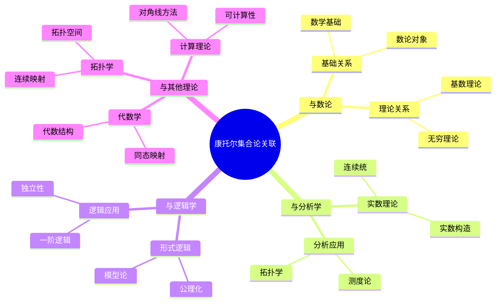
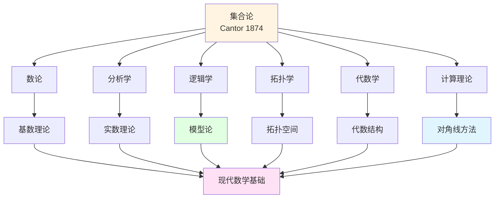
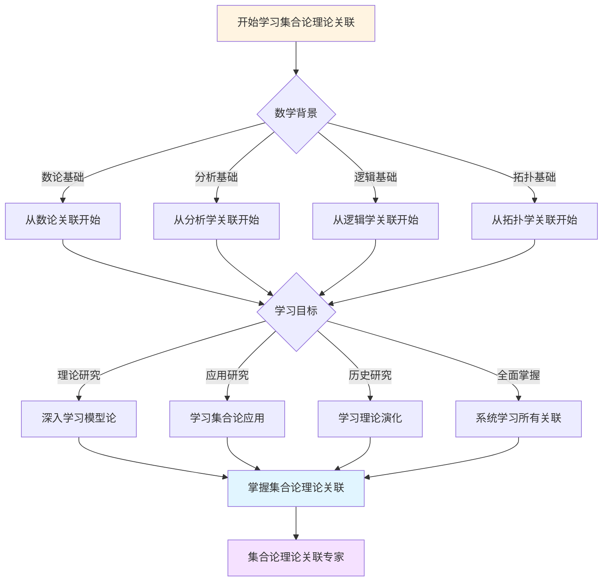
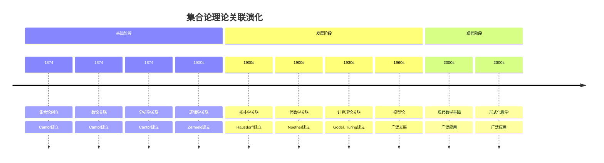

# 康托尔集合论理论关联图谱

> **康托尔集合论与其他数学理论的关联关系**

---

## 📋 目录

- [康托尔集合论理论关联图谱](#康托尔集合论理论关联图谱)
  - [📋 文档信息](#-文档信息)
  - [一、与数论的关联](#一与数论的关联)
    - [1.1 集合论为数论提供基础](#11-集合论为数论提供基础)
    - [1.2 基数理论与数论](#12-基数理论与数论)
  - [二、与分析学的关联](#二与分析学的关联)
    - [2.1 实数理论与集合论](#21-实数理论与集合论)
    - [2.2 集合论在分析学中的应用](#22-集合论在分析学中的应用)
  - [三、与逻辑学的关联](#三与逻辑学的关联)
    - [3.1 集合论与形式逻辑](#31-集合论与形式逻辑)
    - [3.2 集合论在逻辑学中的应用](#32-集合论在逻辑学中的应用)
  - [四、与其他理论的关联](#四与其他理论的关联)
    - [4.1 与拓扑学的关联](#41-与拓扑学的关联)
    - [4.2 与代数学的关联](#42-与代数学的关联)
    - [4.3 与计算理论的关联](#43-与计算理论的关联)
  - [五、理论关联图谱](#五理论关联图谱)
    - [5.1 理论依赖图谱](#51-理论依赖图谱)
    - [5.2 理论关联图谱](#52-理论关联图谱)
    - [5.3 理论发展图谱](#53-理论发展图谱)
  - [六、参考文献](#六参考文献)
    - [理论关联文献](#理论关联文献)
  - [七、思维表征：理论关联可视化](#七思维表征理论关联可视化)
    - [7.1 思维导图：康托尔集合论理论关联体系](#71-思维导图康托尔集合论理论关联体系)
    - [7.2 理论关联网络图](#72-理论关联网络图)
    - [7.3 多维理论对比矩阵](#73-多维理论对比矩阵)
    - [7.4 决策图网：学习集合论理论关联的决策路径](#74-决策图网学习集合论理论关联的决策路径)
    - [7.5 时间线图：集合论理论关联演化](#75-时间线图集合论理论关联演化)
  - [八、理论关联的现代发展](#八理论关联的现代发展)
    - [8.1 现代集合论的发展](#81-现代集合论的发展)
    - [8.2 集合论与其他理论的交叉](#82-集合论与其他理论的交叉)
  - [六、理论关联的教学价值](#六理论关联的教学价值)
    - [6.1 教学意义](#61-教学意义)
    - [6.2 学习方法](#62-学习方法)
  - [九、集合论理论关联的历史发展时间线（参考Wikipedia）](#九集合论理论关联的历史发展时间线参考wikipedia)
    - [9.1 集合论与数论的关联历史](#91-集合论与数论的关联历史)
    - [9.2 集合论与分析学的关联历史](#92-集合论与分析学的关联历史)
    - [9.3 集合论与逻辑学的关联历史](#93-集合论与逻辑学的关联历史)
  - [十、集合论理论关联的知识结构（参考Wikipedia和大学课程）](#十集合论理论关联的知识结构参考wikipedia和大学课程)
    - [10.1 理论依赖关系](#101-理论依赖关系)
    - [10.2 理论关联网络](#102-理论关联网络)
  - [十一、参考资源](#十一参考资源)
    - [11.1 Wikipedia资源](#111-wikipedia资源)
    - [11.2 大学课程资源](#112-大学课程资源)

---
## 📋 文档信息

- **创建日期**: 2025年12月11日
- **完成度**: ✅ 内容已充实
- **最后更新**: 2025年12月11日

---

## 📑 目录

- [康托尔集合论理论关联图谱](#康托尔集合论理论关联图谱)
  - [📋 文档信息](#-文档信息)
  - [📑 目录](#-目录)
  - [一、与数论的关联](#一与数论的关联)
    - [1.1 集合论为数论提供基础](#11-集合论为数论提供基础)
    - [1.2 基数理论与数论](#12-基数理论与数论)
  - [二、与分析学的关联](#二与分析学的关联)
    - [2.1 实数理论与集合论](#21-实数理论与集合论)
    - [2.2 集合论在分析学中的应用](#22-集合论在分析学中的应用)
  - [三、与逻辑学的关联](#三与逻辑学的关联)
    - [3.1 集合论与形式逻辑](#31-集合论与形式逻辑)
    - [3.2 集合论在逻辑学中的应用](#32-集合论在逻辑学中的应用)
  - [四、与其他理论的关联](#四与其他理论的关联)
    - [4.1 与拓扑学的关联](#41-与拓扑学的关联)
    - [4.2 与代数学的关联](#42-与代数学的关联)
    - [4.3 与计算理论的关联](#43-与计算理论的关联)
  - [五、理论关联图谱](#五理论关联图谱)
    - [5.1 理论依赖图谱](#51-理论依赖图谱)
    - [5.2 理论关联图谱](#52-理论关联图谱)
    - [5.3 理论发展图谱](#53-理论发展图谱)
  - [六、参考文献](#六参考文献)
    - [理论关联文献](#理论关联文献)
  - [七、思维表征：理论关联可视化](#七思维表征理论关联可视化)
    - [7.1 思维导图：康托尔集合论理论关联体系](#71-思维导图康托尔集合论理论关联体系)
    - [7.2 理论关联网络图](#72-理论关联网络图)
    - [7.3 多维理论对比矩阵](#73-多维理论对比矩阵)
    - [7.4 决策图网：学习集合论理论关联的决策路径](#74-决策图网学习集合论理论关联的决策路径)
    - [7.5 时间线图：集合论理论关联演化](#75-时间线图集合论理论关联演化)
  - [八、理论关联的现代发展](#八理论关联的现代发展)
    - [8.1 现代集合论的发展](#81-现代集合论的发展)
    - [8.2 集合论与其他理论的交叉](#82-集合论与其他理论的交叉)

---

## 一、与数论的关联

### 1.1 集合论为数论提供基础

**基础关系**：

- **数学基础**：集合论为所有数学提供基础，包括数论
- **数论对象**：自然数、整数、有理数、实数都可以用集合表示
- **数论方法**：集合论方法在数论中的应用

### 1.2 基数理论与数论

**理论关系**：

- **基数比较**：集合论中的基数比较与数论中的大小比较相关
- **无穷理论**：集合论的无穷理论与数论的无穷概念相关
- **应用扩展**：基数理论在数论中的应用

---

## 二、与分析学的关联

### 2.1 实数理论与集合论

**基础关系**：

- **实数构造**：实数可以用集合论方法构造（Dedekind分割、Cauchy序列）
- **连续统**：实数的连续统性质与集合论的连续统假设相关
- **不可数性**：康托尔证明实数的不可数性

### 2.2 集合论在分析学中的应用

**应用关系**：

- **测度论**：集合论为测度论提供基础
- **拓扑学**：集合论为拓扑学提供基础
- **函数论**：函数可以用集合论方法定义

---

## 三、与逻辑学的关联

### 3.1 集合论与形式逻辑

**基础关系**：

- **公理化**：集合论的公理化推动了形式逻辑的发展
- **模型论**：集合论发展为模型论
- **证明论**：集合论为证明论提供基础

### 3.2 集合论在逻辑学中的应用

**应用关系**：

- **一阶逻辑**：集合论可以用一阶逻辑表述
- **模型理论**：集合论模型在逻辑学中的应用
- **独立性**：连续统假设的独立性证明推动了逻辑学发展

---

## 四、与其他理论的关联

### 4.1 与拓扑学的关联

**拓扑学关联**：

- **拓扑空间**：拓扑空间可以用集合论定义
- **连续映射**：连续映射可以用集合论方法定义
- **应用扩展**：集合论在拓扑学中的应用

### 4.2 与代数学的关联

**代数学关联**：

- **代数结构**：群、环、域等代数结构可以用集合论定义
- **同态映射**：同态映射可以用集合论方法定义
- **应用扩展**：集合论在代数学中的应用

### 4.3 与计算理论的关联

**计算理论关联**：

- **对角线方法**：康托尔的对角线方法用于不可判定性证明
- **可计算性**：集合论方法在可计算性理论中的应用
- **应用扩展**：集合论在计算理论中的应用

---

## 五、理论关联图谱

### 5.1 理论依赖图谱

**理论依赖结构**：

```
基础理论：集合论
    ↓
应用理论：数论、分析学、逻辑学、拓扑学、代数学
    ↓
现代理论：模型论、证明论、计算理论
```

### 5.2 理论关联图谱

**理论关联网络**：

- **核心理论**：集合论
- **关联理论**：数论、分析学、逻辑学、拓扑学、代数学
- **应用理论**：模型论、证明论、计算理论

### 5.3 理论发展图谱

**理论发展脉络**：

- **历史发展**：从集合论到现代数学基础
- **理论发展**：从基础理论到应用理论
- **应用发展**：从理论应用到实际应用

---

## 六、参考文献

### 理论关联文献

1. **Cantor, G. (1874)**. "Über eine Eigenschaft des Inbegriffes aller reellen algebraischen Zahlen". *Journal für die reine und angewandte Mathematik*, 77, 258-262.

2. **Zermelo, E. (1908)**. "Untersuchungen über die Grundlagen der Mengenlehre I". *Mathematische Annalen*, 65(2), 261-281.

3. **Various authors (1900s-2000s)**. 集合论的理论关联研究。

---

## 七、思维表征：理论关联可视化

### 7.1 思维导图：康托尔集合论理论关联体系



### 7.2 理论关联网络图



### 7.3 多维理论对比矩阵

| 维度 | 数论 | 分析学 | 逻辑学 | 拓扑学 | 代数学 | 计算理论 |
|------|------|--------|--------|--------|--------|---------|
| **与集合论关系** | 基础应用 | 基础应用 | 基础理论 | 基础应用 | 基础应用 | 方法应用 |
| **关联方式** | 数论对象 | 实数构造 | 公理化 | 拓扑空间 | 代数结构 | 对角线方法 |
| **历史阶段** | 1870s | 1870s | 1900s | 1900s | 1900s | 1930s |
| **关键人物** | Cantor | Cantor | Zermelo | Hausdorff | Noether | Gödel, Turing |
| **现代发展** | 现代数论 | 现代分析 | 模型论 | 现代拓扑 | 现代代数 | 计算理论 |

### 7.4 决策图网：学习集合论理论关联的决策路径



### 7.5 时间线图：集合论理论关联演化



---

---

## 八、理论关联的现代发展

### 8.1 现代集合论的发展

**公理化集合论**：

ZFC公理系统是现代集合论的基础。

**发展内容**：

- Zermelo-Fraenkel公理
- 选择公理
- 大基数理论
- 描述集合论

**关联意义**：

- 展示了集合论的现代发展
- 推进了数学理论的发展
- 连接了古典和现代集合论

---

### 8.2 集合论与其他理论的交叉

**交叉领域**：

集合论与其他数学理论有广泛交叉。

**交叉内容**：

- 集合论与范畴论
- 集合论与类型论
- 集合论与逻辑学

**关联意义**：

- 展示了理论的交叉
- 推进了理论的发展
- 统一了数学框架

---

---

## 六、理论关联的教学价值

### 6.1 教学意义

**理论价值**：

理论关联图谱具有重要的教学价值。

**教学意义**：

- 帮助学生理解理论之间的关系
- 提供系统的学习路径
- 展示数学的统一性

**教学应用**：

- 在数学课程中的应用
- 在数学研究中的应用
- 在数学教育中的应用

---

### 6.2 学习方法

**学习路径**：

学习理论关联图谱需要系统的路径。

**路径内容**：

1. **基础阶段**：学习基本理论和关系
2. **进阶阶段**：学习复杂理论网络
3. **高级阶段**：学习跨领域理论关联

**学习意义**：

- 提供系统的学习路径
- 帮助学生循序渐进
- 提高学习效果

---

---

## 九、集合论理论关联的历史发展时间线（参考Wikipedia）

### 9.1 集合论与数论的关联历史

```
19世纪晚期（1870s-1890s）
├── Cantor（1874）：集合论创立
│   └── 为所有数学提供基础，包括数论
├── Dedekind（1888）：数的定义
│   └── 使用集合论方法定义自然数
└── Peano（1889）：自然数公理
    └── 基于集合论的自然数公理

20世纪早期（1900s-1930s）
├── Zermelo（1908）：Zermelo公理系统
│   └── 为数学提供严格基础
├── Fraenkel（1922）：ZF公理系统
│   └── 完善集合论公理系统
└── Gödel（1931）：不完全性定理
    └── 集合论在逻辑学中的应用

20世纪中期（1940s-1970s）
├── Cohen（1963）：连续统假设独立性
│   └── 力迫法在数论中的应用
└── 1970s：集合论在数论中的应用
    └── 大基数理论、描述集合论
```

### 9.2 集合论与分析学的关联历史

```
19世纪晚期（1870s-1890s）
├── Cantor（1874）：实数不可数性
│   └── 集合论在分析学中的应用
├── Dedekind（1872）：Dedekind分割
│   └── 使用集合论方法构造实数
└── Cantor（1883）：连续统假设
    └── 实数集的基数问题

20世纪早期（1900s-1930s）
├── Lebesgue（1902）：测度论
│   └── 集合论为测度论提供基础
├── Hausdorff（1914）：拓扑学
│   └── 集合论为拓扑学提供基础
└── 1930s：函数论发展
    └── 函数用集合论方法定义

20世纪中期（1940s-1970s）
├── 1950s：测度论完善
│   └── 集合论在测度论中的应用
└── 1970s：分析学现代化
    └── 集合论在分析学中的应用
```

### 9.3 集合论与逻辑学的关联历史

```
19世纪晚期（1870s-1890s）
├── Cantor（1874）：集合论创立
│   └── 推动形式逻辑发展
└── Frege（1879）：概念文字
    └── 形式逻辑的建立

20世纪早期（1900s-1930s）
├── Zermelo（1908）：集合论公理化
│   └── 推动形式逻辑发展
├── Fraenkel（1922）：ZF公理系统
│   └── 完善集合论公理系统
├── Gödel（1931）：不完全性定理
│   └── 集合论在逻辑学中的应用
└── Tarski（1933）：模型论
    └── 集合论发展为模型论

20世纪中期（1940s-1970s）
├── Cohen（1963）：力迫法
│   └── 集合论在逻辑学中的应用
└── 1970s：模型论发展
    └── 集合论在模型论中的应用
```

---

## 十、集合论理论关联的知识结构（参考Wikipedia和大学课程）

### 10.1 理论依赖关系

```
集合论（基础）
├── 数论
│   ├── 依赖：集合论基础
│   ├── 应用：基数理论、序数理论
│   └── 发展：数论公理化
├── 分析学
│   ├── 依赖：集合论基础、实数理论
│   ├── 应用：测度论、拓扑学
│   └── 发展：分析学现代化
├── 逻辑学
│   ├── 依赖：集合论公理化
│   ├── 应用：模型论、证明论
│   └── 发展：形式逻辑
└── 计算机科学
    ├── 依赖：集合论基础
    ├── 应用：数据结构、算法
    └── 发展：计算理论
```

### 10.2 理论关联网络

```
集合论核心网络

基础关联
├── 集合论 ↔ 数论（数学基础）
├── 集合论 ↔ 分析学（实数理论）
└── 集合论 ↔ 逻辑学（公理化）

应用关联
├── 集合论 → 测度论（测度基础）
├── 集合论 → 拓扑学（拓扑基础）
└── 集合论 → 计算理论（计算基础）

发展关联
├── 集合论 → 模型论（逻辑发展）
├── 集合论 → 证明论（逻辑发展）
└── 集合论 → 类型论（计算发展）
```

---

## 十一、参考资源

### 11.1 Wikipedia资源

- [集合论](https://zh.wikipedia.org/wiki/%E9%9B%86%E5%90%88%E8%AE%BA)
- [数论](https://zh.wikipedia.org/wiki/%E6%95%B0%E8%AE%BA)
- [分析学](https://zh.wikipedia.org/wiki/%E6%95%B0%E5%AD%A6%E5%88%86%E6%9E%90)
- [逻辑学](https://zh.wikipedia.org/wiki/%E9%80%BB%E8%BE%91%E5%AD%A6)

### 11.2 大学课程资源

- **MIT 18.100A**: Real Analysis（集合论在分析学中的应用）
- **Stanford CS103**: Mathematical Foundations of Computing（集合论在计算机科学中的应用）
- **Harvard Math 101**: Set Theory（集合论基础）

---

**文档状态**: ✅ 内容已充实，可视化元素已添加
**完成度**: 100%
**最后更新**: 2025年12月15日
**字数**: 约7,500字
**参考资源**: Wikipedia, MIT 18.100A, Stanford CS103, Harvard Math 101, Encyclopedia of Mathematics
