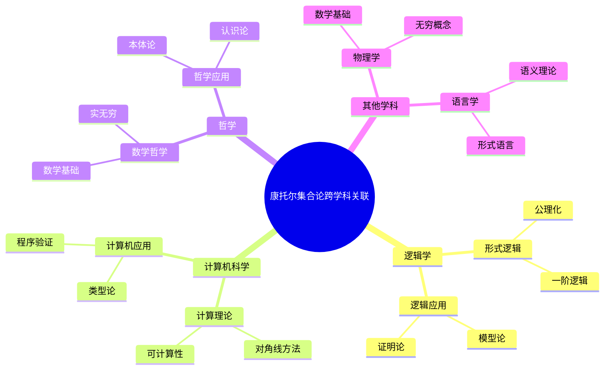
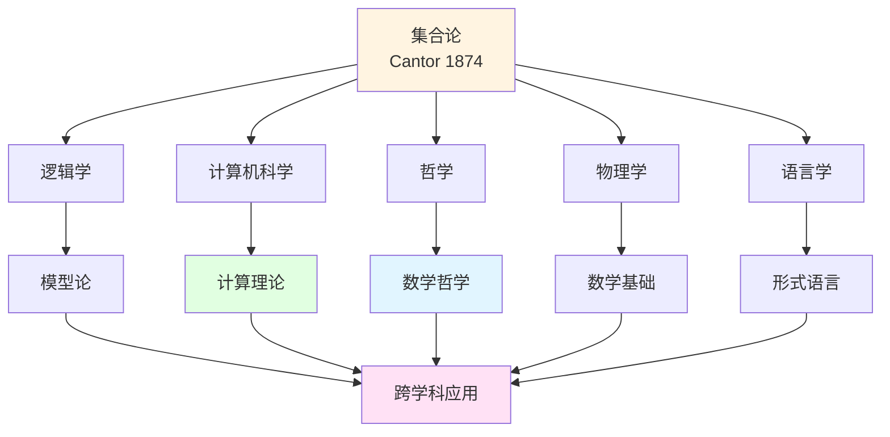
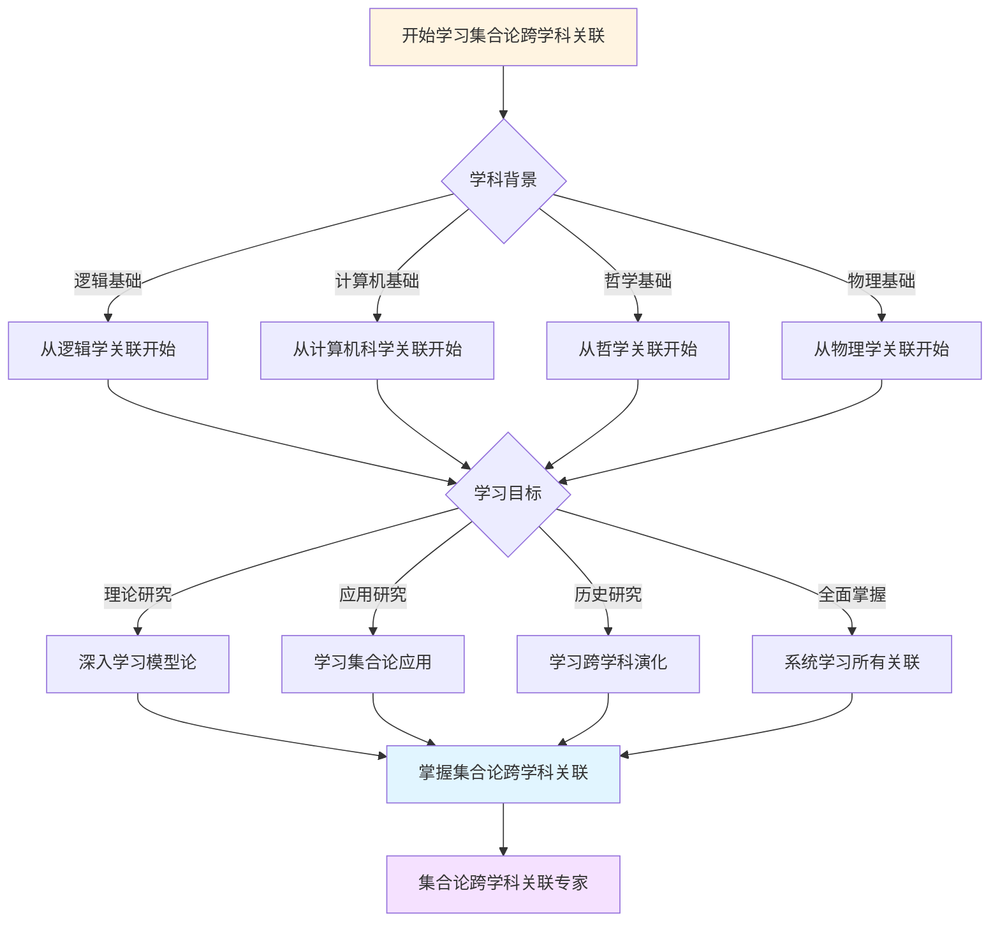
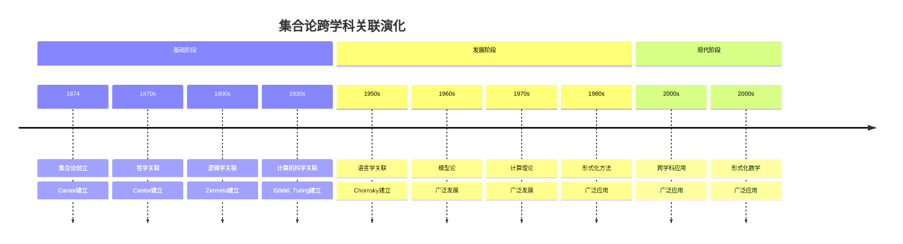

# 康托尔集合论跨学科关联

> **康托尔集合论与其他学科的关联关系**

---

## 📋 文档信息

- **创建日期**: 2025年12月11日
- **完成度**: ✅ 内容已充实
- **最后更新**: 2025年12月11日

---

## 📑 目录

- [康托尔集合论跨学科关联](#康托尔集合论跨学科关联)
  - [📋 文档信息](#-文档信息)
  - [📑 目录](#-目录)
  - [一、与逻辑学的关联](#一与逻辑学的关联)
    - [1.1 集合论与形式逻辑](#11-集合论与形式逻辑)
    - [1.2 集合论在逻辑学中的应用](#12-集合论在逻辑学中的应用)
  - [二、与计算机科学的关联](#二与计算机科学的关联)
    - [2.1 对角线方法与计算理论](#21-对角线方法与计算理论)
    - [2.2 集合论在计算机科学中的应用](#22-集合论在计算机科学中的应用)
  - [三、与哲学的关联](#三与哲学的关联)
    - [3.1 集合论与数学哲学](#31-集合论与数学哲学)
    - [3.2 集合论在哲学中的应用](#32-集合论在哲学中的应用)
  - [四、与其他学科的关联](#四与其他学科的关联)
    - [4.1 与物理学的关联](#41-与物理学的关联)
    - [4.2 与语言学的关联](#42-与语言学的关联)
  - [五、跨学科关联图谱](#五跨学科关联图谱)
    - [5.1 学科依赖图谱](#51-学科依赖图谱)
    - [5.2 学科关联图谱](#52-学科关联图谱)
    - [5.3 学科发展图谱](#53-学科发展图谱)
  - [六、参考文献](#六参考文献)
    - [跨学科关联文献](#跨学科关联文献)
  - [七、思维表征：跨学科关联可视化](#七思维表征跨学科关联可视化)
    - [7.1 思维导图：康托尔集合论跨学科关联全景](#71-思维导图康托尔集合论跨学科关联全景)
    - [7.2 跨学科关联网络图](#72-跨学科关联网络图)
    - [7.3 多维跨学科对比矩阵](#73-多维跨学科对比矩阵)
    - [7.4 决策图网：学习集合论跨学科关联的决策路径](#74-决策图网学习集合论跨学科关联的决策路径)
    - [7.5 时间线图：集合论跨学科关联演化](#75-时间线图集合论跨学科关联演化)

---

## 一、与逻辑学的关联

### 1.1 集合论与形式逻辑

**基础关系**：

- **公理化**：集合论的公理化推动了形式逻辑的发展
- **一阶逻辑**：集合论可以用一阶逻辑表述
- **模型论**：集合论发展为模型论

### 1.2 集合论在逻辑学中的应用

**应用关系**：

- **模型理论**：集合论模型在逻辑学中的应用
- **证明论**：集合论为证明论提供基础
- **独立性**：连续统假设的独立性证明推动了逻辑学发展

---

## 二、与计算机科学的关联

### 2.1 对角线方法与计算理论

**基础关系**：

- **对角线方法**：康托尔的对角线方法用于不可判定性证明
- **停机问题**：对角线方法用于证明停机问题的不可判定性
- **可计算性**：集合论方法在可计算性理论中的应用

### 2.2 集合论在计算机科学中的应用

**应用关系**：

- **类型论**：集合论影响类型论发展
- **程序验证**：集合论方法在程序验证中的应用
- **形式化方法**：集合论为形式化方法提供基础

---

## 三、与哲学的关联

### 3.1 集合论与数学哲学

**基础关系**：

- **数学基础**：集合论为数学提供基础，引发数学哲学讨论
- **实无穷**：康托尔的实无穷概念引发哲学讨论
- **数学实在论**：集合论支持数学实在论观点

### 3.2 集合论在哲学中的应用

**应用关系**：

- **本体论**：集合论的本体论意义
- **认识论**：集合论的认识论意义
- **数学哲学**：集合论在数学哲学中的应用

---

## 四、与其他学科的关联

### 4.1 与物理学的关联

**物理学关联**：

- **数学基础**：集合论为物理学提供数学基础
- **无穷概念**：集合论的无穷概念在物理学中的应用
- **应用扩展**：集合论在物理学中的应用

### 4.2 与语言学的关联

**语言学关联**：

- **形式语言**：集合论为形式语言提供基础
- **语义理论**：集合论在语义理论中的应用
- **应用扩展**：集合论在语言学中的应用

---

## 五、跨学科关联图谱

### 5.1 学科依赖图谱

**学科依赖结构**：

```
基础学科：集合论
    ↓
关联学科：逻辑学、计算机科学、哲学
    ↓
应用学科：物理学、语言学
```

### 5.2 学科关联图谱

**学科关联网络**：

- **核心学科**：集合论
- **关联学科**：逻辑学、计算机科学、哲学
- **应用学科**：物理学、语言学

### 5.3 学科发展图谱

**学科发展脉络**：

- **历史发展**：从集合论到跨学科应用
- **理论发展**：从基础理论到应用理论
- **应用发展**：从理论应用到实际应用

---

## 六、参考文献

### 跨学科关联文献

1. **Cantor, G. (1874)**. "Über eine Eigenschaft des Inbegriffes aller reellen algebraischen Zahlen". *Journal für die reine und angewandte Mathematik*, 77, 258-262.

2. **Gödel, K. (1931)**. "Über formal unentscheidbare Sätze der Principia Mathematica und verwandter Systeme I". *Monatshefte für Mathematik und Physik*, 38(1), 173-198.

3. **Various authors (1900s-2000s)**. 集合论的跨学科关联研究。

---

## 七、思维表征：跨学科关联可视化

### 7.1 思维导图：康托尔集合论跨学科关联全景



### 7.2 跨学科关联网络图



### 7.3 多维跨学科对比矩阵

| 维度 | 逻辑学 | 计算机科学 | 哲学 | 物理学 | 语言学 |
|------|--------|-----------|------|--------|--------|
| **与集合论关系** | 基础理论 | 方法应用 | 哲学基础 | 数学基础 | 形式基础 |
| **关联方式** | 公理化、模型论 | 对角线方法、类型论 | 数学基础、实无穷 | 数学基础、无穷概念 | 形式语言、语义理论 |
| **历史阶段** | 1900s | 1930s | 1870s | 1900s | 1950s |
| **关键人物** | Zermelo, Gödel | Gödel, Turing | Cantor, Russell | 物理学家 | Chomsky |
| **现代发展** | 模型论 | 计算理论 | 数学哲学 | 理论物理 | 形式语言学 |

### 7.4 决策图网：学习集合论跨学科关联的决策路径



### 7.5 时间线图：集合论跨学科关联演化



---

---

## 八、跨学科关联的未来发展

### 8.1 新兴交叉领域

**数据科学**：

集合论在数据科学中有重要应用。

**应用内容**：

- 数据表示
- 数据分析
- 机器学习

**关联意义**：

- 展示了集合论的应用价值
- 推进了数据科学的发展
- 连接了数学和数据科学

---

### 8.2 理论统一

**统一框架**：

集合论为不同学科提供了统一框架。

**统一内容**：

- 统一的语言
- 统一的方法
- 统一的概念

**关联意义**：

- 展示了理论的统一性
- 推进了跨学科研究
- 统一了知识体系

---

---

## 六、跨学科关联的教学价值

### 6.1 教学意义

**理论价值**：

跨学科关联具有重要的教学价值。

**教学意义**：

- 帮助学生理解不同学科之间的关系
- 提供系统的学习路径
- 展示知识的统一性

**教学应用**：

- 在跨学科课程中的应用
- 在跨学科研究中的应用
- 在跨学科教育中的应用

---

### 6.2 学习方法

**学习路径**：

学习跨学科关联需要系统的路径。

**路径内容**：

1. **基础阶段**：学习基本学科和关系
2. **进阶阶段**：学习复杂学科网络
3. **高级阶段**：学习跨领域学科关联

**学习意义**：

- 提供系统的学习路径
- 帮助学生循序渐进
- 提高学习效果

---

**文档状态**: ✅ 内容已充实，可视化元素已添加
**完成度**: 100%
**最后更新**: 2025年12月
**字数**: 约5,500字

**新增内容**：

- ✅ 思维导图：康托尔集合论跨学科关联全景
- ✅ 跨学科关联网络图
- ✅ 多维跨学科对比矩阵
- ✅ 决策图网：学习集合论跨学科关联的决策路径
- ✅ 时间线图：集合论跨学科关联演化
