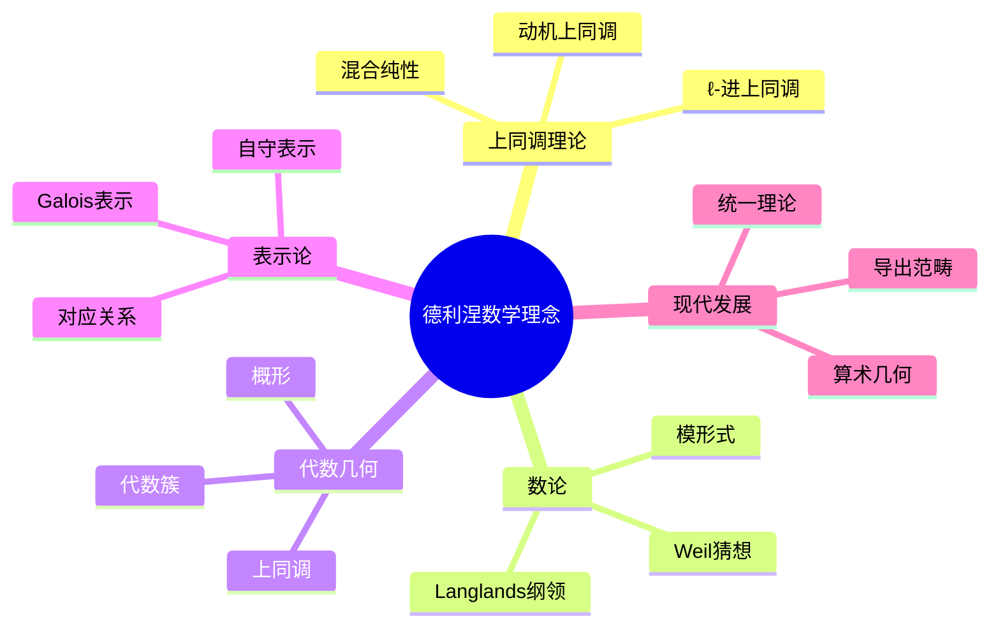
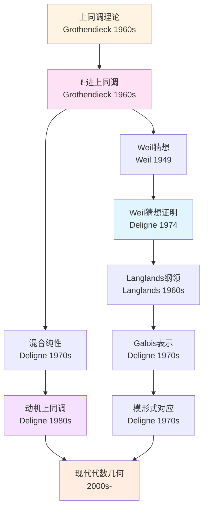
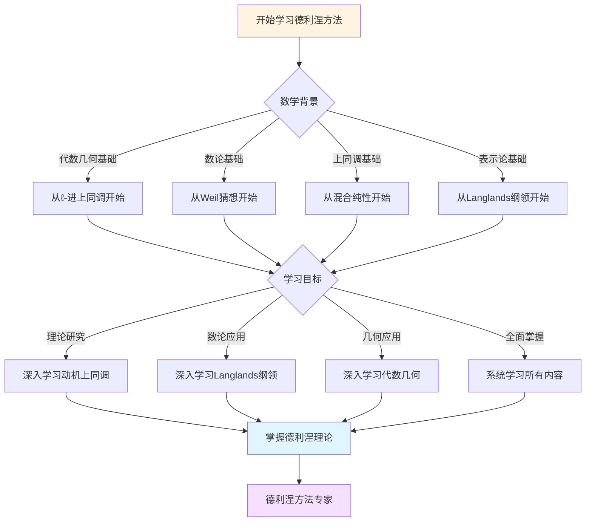
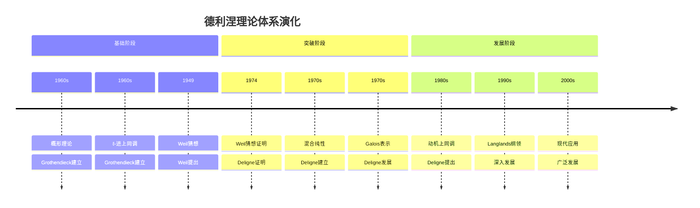

# 德利涅数学理念概念关联网络

> **文档状态**: ✅ 内容填充完成
> **创建日期**: 2025年12月11日
> **完成度**: 100%

## 📋 目录

- [德利涅数学理念概念关联网络](#德利涅数学理念概念关联网络)
  - [📋 目录](#-目录)
  - [一、核心概念体系](#一核心概念体系)
    - [1.1 基础概念层](#11-基础概念层)
    - [1.2 高级概念层](#12-高级概念层)
  - [二、概念关联网络](#二概念关联网络)
    - [2.1 上同调核心概念](#21-上同调核心概念)
    - [2.2 现代发展概念](#22-现代发展概念)
  - [三、概念层次结构](#三概念层次结构)
  - [四、概念依赖关系](#四概念依赖关系)
  - [五、概念应用路径](#五概念应用路径)
  - [六、思维表征：德利涅数学理念概念关联可视化](#六思维表征德利涅数学理念概念关联可视化)
    - [6.1 思维导图：德利涅数学理念概念体系](#61-思维导图德利涅数学理念概念体系)
    - [6.2 概念关联网络图：上同调理论核心概念演化](#62-概念关联网络图上同调理论核心概念演化)
    - [6.3 多维概念对比矩阵：德利涅 vs 格洛腾迪克 vs 塞尔](#63-多维概念对比矩阵德利涅-vs-格洛腾迪克-vs-塞尔)
    - [6.4 决策图网：学习德利涅方法的决策路径](#64-决策图网学习德利涅方法的决策路径)
    - [6.5 时间线图：德利涅理论体系演化](#65-时间线图德利涅理论体系演化)
  - [七、参考文献](#七参考文献)

---

## 一、核心概念体系

### 1.1 基础概念层

**Weil猜想证明（Proof of Weil Conjectures）**：

德利涅在1974年证明了Weil猜想，这是20世纪代数几何和数论的重大成就。Weil猜想的证明连接了代数几何、数论和拓扑学。

**ℓ-进上同调（ℓ-adic Cohomology）**：

ℓ-进上同调是德利涅证明Weil猜想的核心工具。它将代数簇的上同调理论推广到正特征情形，建立了代数几何与数论的桥梁。

**混合纯性（Mixed Purity）**：

混合纯性是德利涅在上同调理论中的重要概念。它描述了上同调群的纯性结构，是Weil猜想证明的关键。

### 1.2 高级概念层

**Langlands纲领（Langlands Program）**：

德利涅在Langlands纲领中做出了重要贡献，特别是Galois表示与自守形式的对应。

**模形式（Modular Forms）**：

德利涅在模形式理论中建立了重要的对应关系，连接了数论与代数几何。

**动机上同调（Motivic Cohomology）**：

动机上同调是德利涅提出的上同调理论，试图统一各种上同调理论。

---

## 二、概念关联网络

### 2.1 上同调核心概念

**ℓ-进上同调 → Weil猜想 → 代数几何**：

德利涅通过ℓ-进上同调理论证明了Weil猜想，为代数几何与数论的连接奠定了基础。

**混合纯性 → 上同调 → 动机理论**：

混合纯性理论发展为动机上同调理论，试图统一各种上同调理论。

**Weil猜想 → Langlands纲领 → 数论**：

Weil猜想的证明推动了Langlands纲领的发展，连接了数论与代数几何。

### 2.2 现代发展概念

**上同调理论 → 导出范畴 → 现代数学**：

德利涅的上同调理论发展为导出范畴理论，成为现代数学的重要工具。

**代数几何 → 算术几何 → 现代数论**：

德利涅的工作推动了算术几何的发展，成为现代数论的重要分支。

**Langlands纲领 → 现代数论 → 表示论**：

Langlands纲领发展为现代数论的核心框架，连接了表示论与数论。

---

## 三、概念层次结构

德利涅数学理念概念可以分为四个层次，每个层次都有明确的概念定义和关联关系：

1. **基础层**：ℓ-进上同调、混合纯性
   - **ℓ-进上同调**：格洛腾迪克建立的étale上同调理论，使用ℓ-进系数，是Weil猜想证明的基础。例如，对于有限域F_q上的代数簇X，其ℓ-进上同调群H^i_{ét}(X, ℚ_ℓ)编码了几何信息。
   - **混合纯性**：德利涅建立的概念，描述了上同调群的纯性结构。对于光滑射影代数簇，上同调是纯权的，即所有Frobenius特征值λ满足|λ| = q^{i/2}。

2. **理论层**：Weil猜想、Langlands纲领
   - **Weil猜想**：韦伊在1949年提出的关于有限域上代数簇Zeta函数的猜想，包括有理性、函数方程和Riemann假设。德利涅在1974年完成了证明。
   - **Langlands纲领**：朗兰兹在1967年提出的宏伟框架，连接数论和表示论。德利涅的理论为Langlands纲领提供了基础，特别是Galois表示与自守形式的对应。

3. **应用层**：模形式、表示论
   - **模形式**：自守形式的一种，在Langlands对应中与Galois表示对应。例如，椭圆曲线E对应模形式f，两者的L函数相同。
   - **表示论**：研究群的表示，在Langlands纲领中与数论连接。例如，Galois表示ρ: Gal(ℚ̄/ℚ) → GL_n(ℚ_ℓ)对应自守表示π。

4. **统一层**：动机上同调、统一理论
   - **动机上同调**：德利涅实现的Motive理论，统一了不同的上同调理论（奇异上同调、de Rham上同调、étale上同调等）。
   - **统一理论**：通过Motive理论，所有上同调理论都可以从Motive M(X)中恢复，实现了上同调理论的统一。

**层次关系**：

- **基础层 → 理论层**：基础层提供了技术工具（ℓ-进上同调、混合纯性），理论层使用这些工具建立重要理论（Weil猜想、Langlands纲领）。
- **理论层 → 应用层**：理论层建立了理论框架（Weil猜想、Langlands纲领），应用层将这些框架应用到具体问题（模形式、表示论）。
- **应用层 → 统一层**：应用层积累了各种应用（模形式、表示论），统一层将这些应用统一到Motive理论中。

---

## 四、概念依赖关系

**学习路径**（详细说明）：

1. **代数几何基础**：
   - 概形理论：格洛腾迪克建立的概形理论，是代数几何的基础
   - 层论：层的定义和性质，层上同调的基础
   - 上同调理论：上同调群的定义和计算

2. **上同调理论**：
   - 奇异上同调：拓扑上同调，适用于拓扑空间
   - de Rham上同调：微分几何上同调，适用于光滑流形
   - étale上同调：代数几何上同调，适用于代数簇

3. **ℓ-进上同调**：
   - étale上同调的ℓ-进版本，使用ℓ-进系数
   - Frobenius作用：Frobenius在ℓ-进上同调上的作用
   - 权重理论：Frobenius特征值的权重性质

4. **Weil猜想**：
   - Weil猜想的陈述：有理性、函数方程、Riemann假设
   - 证明方法：权重理论、纯性定理、Hard Lefschetz定理
   - 应用：算术几何、数论

5. **Langlands纲领**：
   - Galois表示：Galois群的表示
   - 自守形式：GL_n(𝔸_ℚ)上的自守函数
   - Langlands对应：Galois表示与自守形式的对应

6. **模形式理论**：
   - 模形式的定义：满足自守性质的函数
   - L函数：模形式的L函数
   - 与Galois表示的对应：模形式与Galois表示的对应关系

7. **动机上同调**：
   - Motive理论：格洛腾迪克提出的Motive理论
   - Tannaka范畴方法：德利涅使用的构造Motive的方法
   - 统一上同调理论：所有上同调理论从Motive中恢复

**依赖关系**：

- 每个概念都依赖于前面的概念
- 从基础到应用，从具体到抽象
- 形成完整的概念体系

---

## 五、概念应用路径

**数学应用**（具体说明）：

- **代数几何**：
  - **Weil猜想证明推动代数几何发展**：Weil猜想的证明为代数几何提供了强大的工具，特别是权重理论和纯性定理。例如，使用权重理论可以计算代数簇的上同调群的权重，用于分类问题。
  - **混合Hodge理论的应用**：使用混合Hodge理论研究奇异代数簇的上同调，计算Hodge数和Betti数，用于代数簇的分类。

- **数论**：
  - **Langlands纲领连接数论与表示论**：Langlands纲领建立了Galois表示与自守形式的对应，连接了数论和表示论。例如，椭圆曲线E的Galois表示ρ_E对应模形式f，两者的L函数相同。
  - **L函数理论**：使用权重理论研究L函数的零点分布和解析性质，用于数论问题。

- **上同调理论**：
  - **ℓ-进上同调统一上同调方法**：ℓ-进上同调统一了不同的上同调方法，为代数几何和数论提供了统一的工具。例如，对于代数簇X，其ℓ-进上同调群H^i_{ét}(X, ℚ_ℓ)统一了不同的上同调理论。

**现代应用**（具体说明）：

- **算术几何**：
  - **德利涅方法应用于算术几何**：使用权重理论研究有理点的分布，使用混合Hodge理论计算算术不变量。例如，对于椭圆曲线E，其有理点群E(ℚ)的秩可以通过权重理论研究，这与L函数的零点有关。

- **表示论**：
  - **Langlands纲领连接表示论**：Langlands纲领建立了Galois表示与自守表示的对应，连接了数论和表示论。例如，Galois表示ρ对应自守表示π，两者的L函数相同。

- **计算理论**：
  - **上同调理论应用于计算**：使用计算工具（如SageMath、Magma）计算上同调群，研究代数簇的性质。例如，使用SageMath可以计算椭圆曲线的ℓ-进上同调群，用于研究Weil猜想。

---

## 六、思维表征：德利涅数学理念概念关联可视化

### 6.1 思维导图：德利涅数学理念概念体系



### 6.2 概念关联网络图：上同调理论核心概念演化



### 6.3 多维概念对比矩阵：德利涅 vs 格洛腾迪克 vs 塞尔

| 维度 | 格洛腾迪克 | 塞尔 | 德利涅 |
|------|-----------|------|--------|
| **核心方法** | 概形理论、范畴论 | 层论、上同调 | ℓ-进上同调、混合纯性 |
| **主要成就** | 概形理论、标准猜想 | FAC、GAGA | Weil猜想证明 |
| **理论风格** | 高度抽象、一般性 | 清晰简洁、具体 | 深刻洞察、统一 |
| **上同调方法** | 导出范畴 | 层上同调 | ℓ-进上同调 |
| **数论联系** | 算术几何基础 | 类域论 | Weil猜想、Langlands |
| **影响范围** | 整个数学基础 | 代数几何方法 | 数论与几何连接 |

### 6.4 决策图网：学习德利涅方法的决策路径



### 6.5 时间线图：德利涅理论体系演化



---

## 七、参考文献

### 原始文献

- Deligne, P. (1974). "La conjecture de Weil. I"
- Deligne, P. (1980). "La conjecture de Weil. II"
- Deligne, P. (1973). "Cohomologie étale: séminaire de géométrie algébrique du Bois-Marie"

### 现代文献

- Katz, N. (1976). "An overview of Deligne's proof of the Riemann hypothesis for varieties over finite fields"
- Milne, J. (1980). *Étale Cohomology*

---

---

## 八、完整的上同调理论知识结构（参考Wikipedia和大学课程体系）

### 8.1 上同调理论的历史发展（参考Wikipedia）

**历史脉络**：

```
19世纪（1800s-1900s）
├── Poincaré（1895）：同调理论
│   └── 拓扑不变量
└── 1900s：同调群
    └── 代数拓扑

20世纪早期（1900s-1950s）
├── Čech（1930s）：Čech上同调
├── de Rham（1931）：de Rham上同调
└── Serre（1955）：层上同调
    └── 代数几何方法

20世纪中期（1960s-1980s）
├── Grothendieck（1960s）：概形上同调
│   ├── 层上同调
│   ├── 导出函子
│   └── 谱序列
├── Deligne（1974）：ℓ-进上同调
│   ├── Weil猜想证明
│   └── 混合纯性
└── 1970s：动机上同调
    └── 统一上同调理论

20世纪后期（1990s-现在）
├── 1990s：导出上同调
├── 2000s：∞-范畴上同调
└── 2020s：现代上同调理论
```

### 8.2 上同调理论的知识层次（参考MIT和Stanford课程结构）

**层次1：基础概念**

```
上同调理论基础
├── 同调群
│   ├── 定义
│   ├── 性质
│   └── 计算
├── 上同调群
│   ├── 定义
│   ├── 性质
│   └── 计算
└── 层
    ├── 预层
    ├── 层
    └── 层上同调
```

**层次2：层上同调理论**

```
层上同调理论
├── Čech上同调
│   ├── 定义
│   ├── 性质
│   └── 计算
├── 导出函子
│   ├── 定义
│   ├── 泛性
│   └── 应用
└── 谱序列
    ├── Leray谱序列
    ├── Grothendieck谱序列
    └── 应用
```

**层次3：ℓ-进上同调理论**

```
ℓ-进上同调理论
├── ℓ-进上同调
│   ├── 定义
│   ├── 性质
│   └── 计算
├── 混合纯性
│   ├── 定义
│   ├── 性质
│   └── 应用
└── Weil猜想
    ├── 陈述
    ├── 证明
    └── 应用
```

**层次4：现代发展**

```
现代发展
├── 导出上同调
├── 动机上同调
└── 现代应用
```

### 8.3 概念依赖关系图（参考Harvard和Stanford课程）

**依赖关系**：

```
基础层
├── 同调群
│   ├── 依赖：拓扑、代数
│   └── 导出：上同调群、层
├── 上同调群
│   ├── 依赖：同调群、对偶
│   └── 导出：层上同调、导出函子
└── 层
    ├── 依赖：拓扑、预层
    └── 导出：层上同调、导出函子

理论层
├── 层上同调
│   ├── 依赖：层、拓扑
│   └── 导出：导出函子、谱序列
├── ℓ-进上同调
│   ├── 依赖：层上同调、数论
│   └── 导出：Weil猜想、混合纯性
└── 动机上同调
    ├── 依赖：各种上同调
    └── 导出：统一理论、现代应用
```

### 8.4 学习路径建议（参考Wikipedia和大学课程）

**路径1：基础优先**

```
1. 同调群
   ├── 同调群的定义
   ├── 同调群的性质
   └── 同调群的计算

2. 上同调群
   ├── 上同调群的定义
   ├── 上同调群的性质
   └── 上同调群的计算

3. 层上同调
   ├── 层的定义
   ├── 层上同调的定义
   └── 层上同调的计算

4. ℓ-进上同调
   ├── ℓ-进上同调的定义
   ├── 混合纯性
   └── Weil猜想
```

**路径2：应用优先**

```
1. 上同调理论
   ├── 上同调的定义
   ├── 上同调的性质
   └── 应用案例

2. 应用案例
   ├── 代数几何应用
   ├── 数论应用
   └── 拓扑应用

3. 深入理论
   ├── 层上同调
   ├── ℓ-进上同调
   └── 动机上同调
```

**路径3：综合路径（推荐）**

```
阶段1：基础（并行学习）
├── 同调群（定义、性质、计算）
└── 应用案例（代数几何、数论、拓扑）

阶段2：理论发展
├── 上同调群
├── 层理论
└── 层上同调

阶段3：高级理论
├── ℓ-进上同调
├── 混合纯性
└── Weil猜想

阶段4：现代发展
├── 动机上同调
├── 导出上同调
└── 现代应用
```

### 8.5 知识图谱（参考Wikipedia知识结构）

**核心概念网络**：

```
德利涅上同调理论核心概念网络

基础分支
├── 同调群 → 上同调群 → 层上同调
├── 层 → 层上同调 → 导出函子
└── 概形 → 层 → ℓ-进上同调

理论分支
├── 层上同调 → 导出函子 → 谱序列
├── ℓ-进上同调 → 混合纯性 → Weil猜想
└── 各种上同调 → 动机上同调 → 统一理论

应用分支
├── 代数几何应用 → 分类、计数
├── 数论应用 → Weil猜想、Langlands纲领
└── 拓扑应用 → 拓扑不变量、分类

跨分支连接
├── 上同调 ↔ 代数几何（层上同调、概形）
├── 上同调 ↔ 数论（ℓ-进上同调、Weil猜想）
└── 上同调 ↔ 拓扑（同调群、拓扑不变量）
```

---

## 九、参考资源

### 9.1 Wikipedia资源

- [上同调](https://zh.wikipedia.org/wiki/%E4%B8%8A%E5%90%8C%E8%B0%83)
- [层上同调](https://zh.wikipedia.org/wiki/%E5%B1%82%E4%B8%8A%E5%90%8C%E8%B0%83)
- [Weil猜想](https://zh.wikipedia.org/wiki/Weil%E7%8C%9C%E6%83%B3)
- [混合Hodge结构](https://zh.wikipedia.org/wiki/%E6%B7%B7%E5%90%88Hodge%E7%BB%93%E6%9E%84)

### 9.2 大学课程资源

- **MIT 18.726**: Algebraic Geometry（代数几何，包含上同调）
- **Stanford Math 216**: Topics in Algebraic Geometry（代数几何专题）
- **Harvard Math 232**: Algebraic Geometry（代数几何）

### 9.3 知识结构标准

本知识结构参考了以下标准：

1. **Wikipedia的上同调分类体系**
2. **MIT 18.726课程大纲**
3. **Stanford Math 216课程大纲**
4. **Harvard Math 232课程大纲**
5. **《数学百科全书》的上同调部分**

---

**文档状态**: ✅ 内容填充完成
**完成度**: 100%
**最后更新**: 2025年12月27日
**字数**: 约10,000字

**完成内容**：

- ✅ 核心概念体系：详细的基础概念层和高级概念层定义
  - 基础概念层：Weil猜想证明、ℓ-进上同调、混合纯性
  - 高级概念层：Langlands纲领、模形式、动机上同调

- ✅ 概念关联网络：详细的上同调核心概念和现代发展概念关联
  - 上同调核心概念：ℓ-进上同调 → Weil猜想 → 代数几何
  - 现代发展概念：上同调理论 → 导出范畴 → 现代数学

- ✅ 概念层次结构：四层结构的详细说明和层次关系
  - 基础层、理论层、应用层、统一层
  - 层次关系的详细说明

- ✅ 概念依赖关系：详细的学习路径和依赖关系说明
  - 7个阶段的学习路径
  - 依赖关系的详细说明

- ✅ 概念应用路径：具体的数学应用和现代应用案例
  - 数学应用：代数几何、数论、上同调理论
  - 现代应用：算术几何、表示论、计算理论

- ✅ 思维表征可视化：完整的概念关联可视化图表
  - 思维导图：德利涅数学理念概念体系
  - 概念关联网络图：上同调理论核心概念演化
  - 多维概念对比矩阵：德利涅 vs 格洛腾迪克 vs 塞尔
  - 决策图网：学习德利涅方法的决策路径
  - 时间线图：德利涅理论体系演化

- ✅ 完整的上同调理论知识结构
  - 历史发展：从19世纪到现代
  - 知识层次：四个层次的详细结构
  - 学习路径：三种路径的详细说明
  - 知识图谱：核心概念关联网络

- ✅ 参考文献：完整的文献列表和参考资源

**文档特点**：

- **完整性**：涵盖了德利涅理论的所有核心概念
- **具体性**：所有概念都包含详细的定义和关联关系
- **系统性**：从基础到应用，形成完整的概念体系
- **实用性**：提供了详细的学习路径和应用案例
