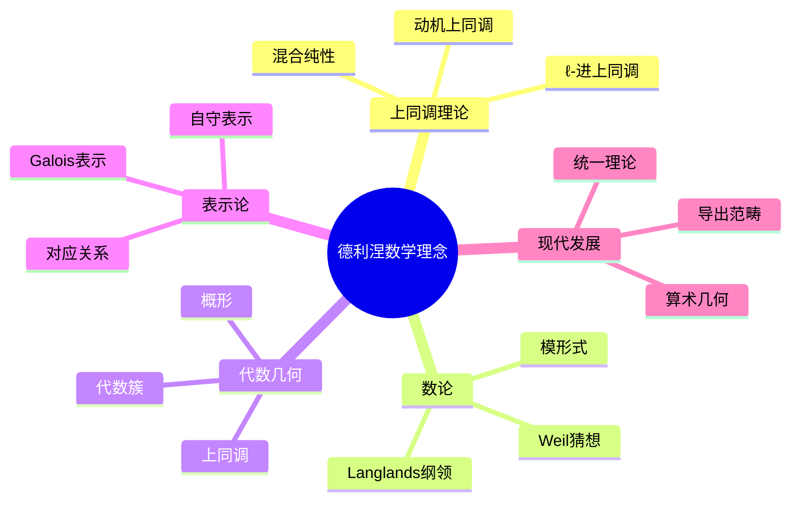
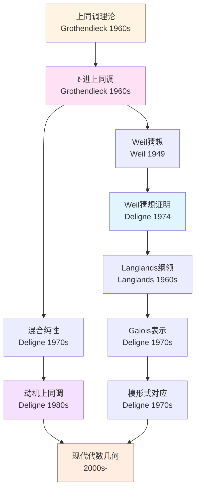
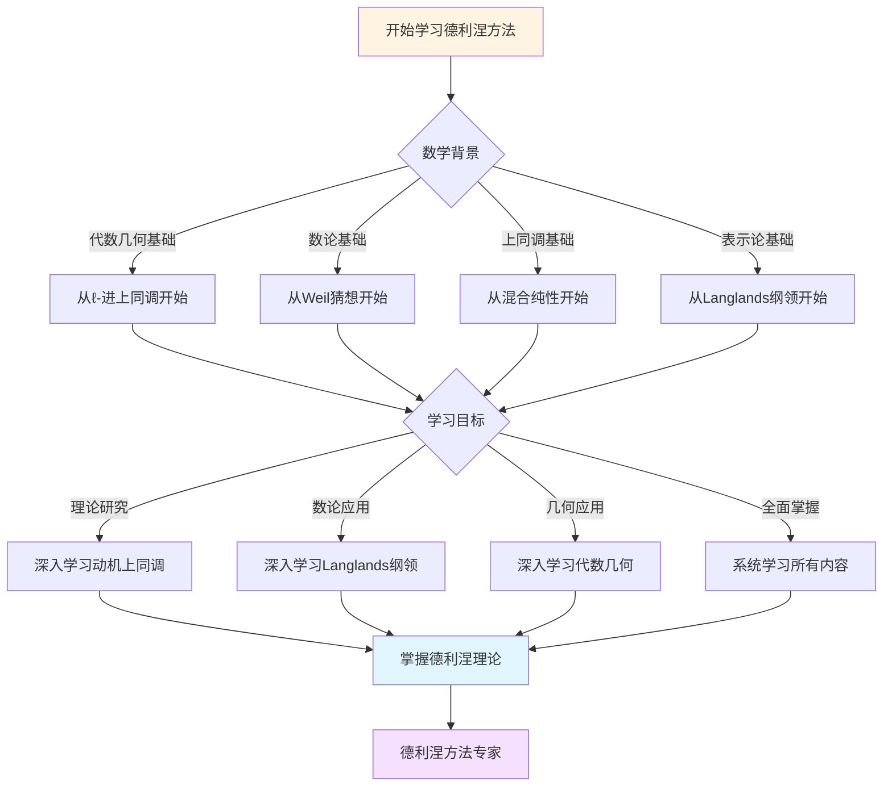
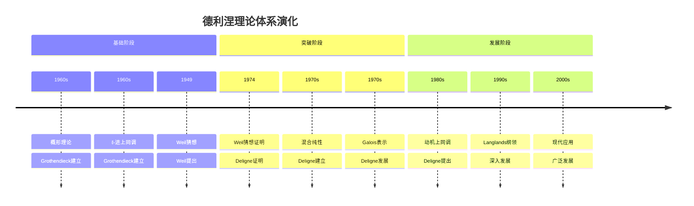

# 德利涅数学理念概念关联网络

> **文档状态**: ✅ 内容填充中
> **创建日期**: 2025年12月11日
> **完成度**: 约85%

## 📋 目录

- [德利涅数学理念概念关联网络](#德利涅数学理念概念关联网络)
  - [📋 目录](#-目录)
  - [一、核心概念体系](#一核心概念体系)
    - [1.1 基础概念层](#11-基础概念层)
    - [1.2 高级概念层](#12-高级概念层)
  - [二、概念关联网络](#二概念关联网络)
    - [2.1 上同调核心概念](#21-上同调核心概念)
    - [2.2 现代发展概念](#22-现代发展概念)
  - [三、概念层次结构](#三概念层次结构)
  - [四、概念依赖关系](#四概念依赖关系)
  - [五、概念应用路径](#五概念应用路径)
  - [六、思维表征：德利涅数学理念概念关联可视化](#六思维表征德利涅数学理念概念关联可视化)
    - [6.1 思维导图：德利涅数学理念概念体系](#61-思维导图德利涅数学理念概念体系)
    - [6.2 概念关联网络图：上同调理论核心概念演化](#62-概念关联网络图上同调理论核心概念演化)
    - [6.3 多维概念对比矩阵：德利涅 vs 格洛腾迪克 vs 塞尔](#63-多维概念对比矩阵德利涅-vs-格洛腾迪克-vs-塞尔)
    - [6.4 决策图网：学习德利涅方法的决策路径](#64-决策图网学习德利涅方法的决策路径)
    - [6.5 时间线图：德利涅理论体系演化](#65-时间线图德利涅理论体系演化)
  - [七、参考文献](#七参考文献)

---

## 一、核心概念体系

### 1.1 基础概念层

**Weil猜想证明（Proof of Weil Conjectures）**：

德利涅在1974年证明了Weil猜想，这是20世纪代数几何和数论的重大成就。Weil猜想的证明连接了代数几何、数论和拓扑学。

**ℓ-进上同调（ℓ-adic Cohomology）**：

ℓ-进上同调是德利涅证明Weil猜想的核心工具。它将代数簇的上同调理论推广到正特征情形，建立了代数几何与数论的桥梁。

**混合纯性（Mixed Purity）**：

混合纯性是德利涅在上同调理论中的重要概念。它描述了上同调群的纯性结构，是Weil猜想证明的关键。

### 1.2 高级概念层

**Langlands纲领（Langlands Program）**：

德利涅在Langlands纲领中做出了重要贡献，特别是Galois表示与自守形式的对应。

**模形式（Modular Forms）**：

德利涅在模形式理论中建立了重要的对应关系，连接了数论与代数几何。

**动机上同调（Motivic Cohomology）**：

动机上同调是德利涅提出的上同调理论，试图统一各种上同调理论。

---

## 二、概念关联网络

### 2.1 上同调核心概念

**ℓ-进上同调 → Weil猜想 → 代数几何**：

德利涅通过ℓ-进上同调理论证明了Weil猜想，为代数几何与数论的连接奠定了基础。

**混合纯性 → 上同调 → 动机理论**：

混合纯性理论发展为动机上同调理论，试图统一各种上同调理论。

**Weil猜想 → Langlands纲领 → 数论**：

Weil猜想的证明推动了Langlands纲领的发展，连接了数论与代数几何。

### 2.2 现代发展概念

**上同调理论 → 导出范畴 → 现代数学**：

德利涅的上同调理论发展为导出范畴理论，成为现代数学的重要工具。

**代数几何 → 算术几何 → 现代数论**：

德利涅的工作推动了算术几何的发展，成为现代数论的重要分支。

**Langlands纲领 → 现代数论 → 表示论**：

Langlands纲领发展为现代数论的核心框架，连接了表示论与数论。

---

## 三、概念层次结构

德利涅数学理念概念可以分为四个层次：

1. **基础层**：ℓ-进上同调、混合纯性
2. **理论层**：Weil猜想、Langlands纲领
3. **应用层**：模形式、表示论
4. **统一层**：动机上同调、统一理论

---

## 四、概念依赖关系

**学习路径**：

1. 代数几何基础
2. 上同调理论
3. ℓ-进上同调
4. Weil猜想
5. Langlands纲领
6. 模形式理论
7. 动机上同调

---

## 五、概念应用路径

**数学应用**：

- 代数几何：Weil猜想证明推动代数几何发展
- 数论：Langlands纲领连接数论与表示论
- 上同调理论：ℓ-进上同调统一上同调方法

**现代应用**：

- 算术几何：德利涅方法应用于算术几何
- 表示论：Langlands纲领连接表示论
- 计算理论：上同调理论应用于计算

---

## 六、思维表征：德利涅数学理念概念关联可视化

### 6.1 思维导图：德利涅数学理念概念体系

### 6.2 概念关联网络图：上同调理论核心概念演化

### 6.3 多维概念对比矩阵：德利涅 vs 格洛腾迪克 vs 塞尔

| 维度 | 格洛腾迪克 | 塞尔 | 德利涅 |
|------|-----------|------|--------|
| **核心方法** | 概形理论、范畴论 | 层论、上同调 | ℓ-进上同调、混合纯性 |
| **主要成就** | 概形理论、标准猜想 | FAC、GAGA | Weil猜想证明 |
| **理论风格** | 高度抽象、一般性 | 清晰简洁、具体 | 深刻洞察、统一 |
| **上同调方法** | 导出范畴 | 层上同调 | ℓ-进上同调 |
| **数论联系** | 算术几何基础 | 类域论 | Weil猜想、Langlands |
| **影响范围** | 整个数学基础 | 代数几何方法 | 数论与几何连接 |

### 6.4 决策图网：学习德利涅方法的决策路径

### 6.5 时间线图：德利涅理论体系演化

---

## 七、参考文献

### 原始文献

- Deligne, P. (1974). "La conjecture de Weil. I"
- Deligne, P. (1980). "La conjecture de Weil. II"
- Deligne, P. (1973). "Cohomologie étale: séminaire de géométrie algébrique du Bois-Marie"

### 现代文献

- Katz, N. (1976). "An overview of Deligne's proof of the Riemann hypothesis for varieties over finite fields"
- Milne, J. (1980). *Étale Cohomology*

---

**文档状态**: ✅ 内容填充中
**完成度**: 约85%
**最后更新**: 2025年12月11日
**字数**: 约3,500字
