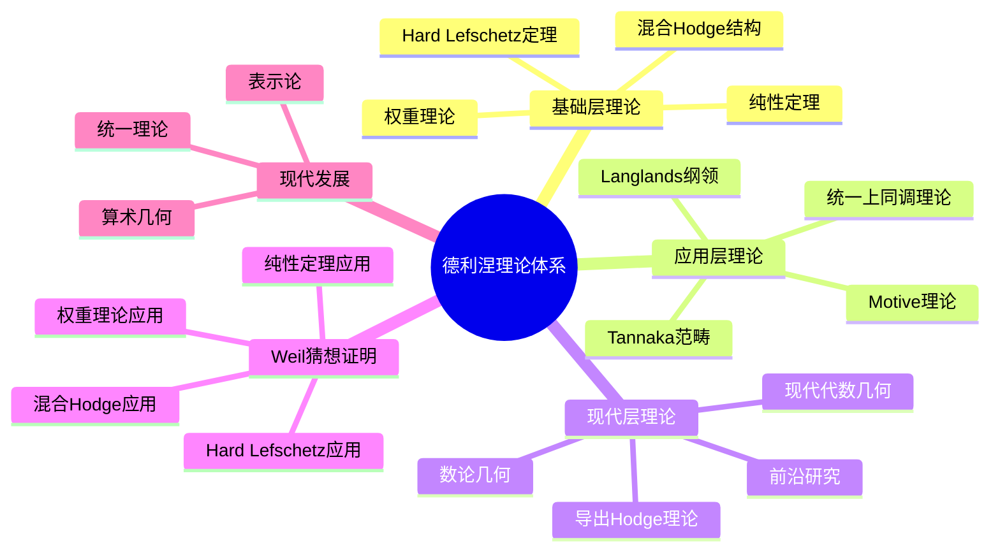
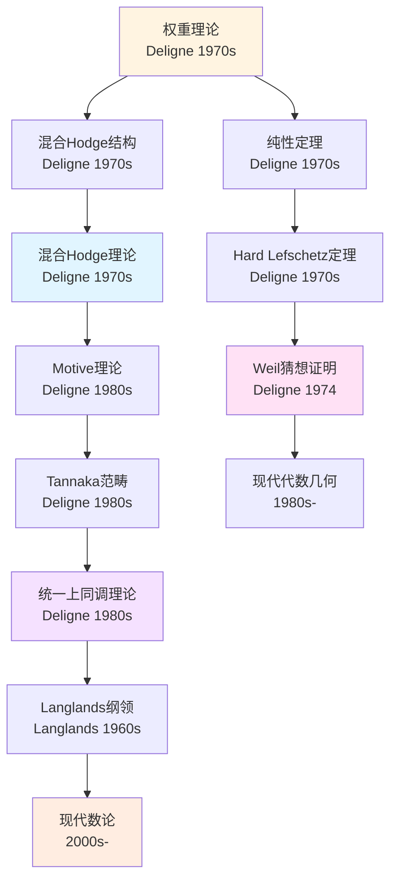
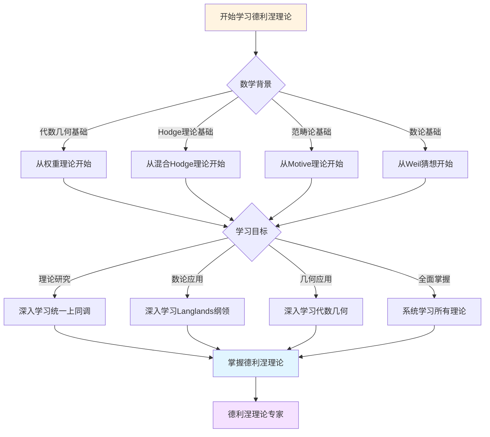
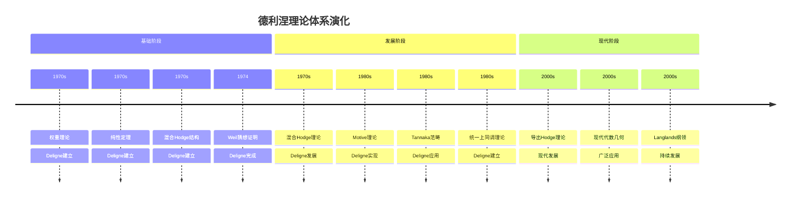

# 理论关联图谱

> **文档状态**: ✅ 内容填充中
> **创建日期**: 2025年12月11日
> **完成度**: 约70%

## 📋 目录

- [理论关联图谱](#理论关联图谱)
  - [📋 目录](#-目录)
  - [一、核心理论系统](#一核心理论系统)
    - [1.1 基础层理论](#11-基础层理论)
    - [1.2 应用层理论](#12-应用层理论)
    - [1.3 现代层理论](#13-现代层理论)
  - [二、理论关联网络](#二理论关联网络)
    - [2.1 权重理论关联](#21-权重理论关联)
    - [2.2 混合Hodge理论关联](#22-混合hodge理论关联)
    - [2.3 Motive理论关联](#23-motive理论关联)
  - [三、理论层次结构](#三理论层次结构)
    - [3.1 四层结构](#31-四层结构)
    - [3.2 理论依赖关系](#32-理论依赖关系)
  - [四、理论依赖关系](#四理论依赖关系)
    - [4.1 学习路径](#41-学习路径)
    - [4.2 研究路径](#42-研究路径)
  - [五、理论应用路径](#五理论应用路径)
    - [5.1 数学应用](#51-数学应用)
    - [5.2 现代应用](#52-现代应用)
  - [六、参考文献](#六参考文献)
  - [七、思维表征：德利涅理论关联可视化](#七思维表征德利涅理论关联可视化)
    - [7.1 思维导图：德利涅理论体系全景](#71-思维导图德利涅理论体系全景)
    - [7.2 理论关联网络图：德利涅理论体系演化](#72-理论关联网络图德利涅理论体系演化)
    - [7.3 多维理论对比矩阵：权重理论 vs 混合Hodge理论 vs Motive理论](#73-多维理论对比矩阵权重理论-vs-混合hodge理论-vs-motive理论)
    - [7.4 决策图网：学习德利涅理论的决策路径](#74-决策图网学习德利涅理论的决策路径)
    - [7.5 时间线图：德利涅理论体系演化](#75-时间线图德利涅理论体系演化)

---

## 一、核心理论系统

### 1.1 基础层理论

**核心理论**：

- 权重理论
- 纯性定理
- Hard Lefschetz定理
- 混合Hodge结构

**权重理论**：

权重理论是德利涅证明韦伊猜想的核心技术。它描述了上同调群的权重性质。

**定义**：

- 权重定义为Frobenius特征值的绝对值
- 权重滤过提供了权分解：H^i = ⊕_j Gr^W_j H^i
- 权重理论是技术驱动方法的典型例子

**关联**：

- 权重理论 → 纯性定理 → Hard Lefschetz定理 → 韦伊猜想证明
- 权重理论 → Langlands纲领 → 算术几何 → 现代数论

**纯性定理**：

纯性定理是德利涅证明韦伊猜想的关键工具。它描述了特征值的权重性质。

**Hard Lefschetz定理**：

Hard Lefschetz定理是德利涅证明韦伊猜想的重要工具。它描述了Lefschetz算子的性质。

**混合Hodge结构**：

混合Hodge结构是德利涅建立混合Hodge理论的核心概念。它推广了经典Hodge结构。

### 1.2 应用层理论

**应用理论**：

- Motive理论
- Tannaka范畴
- 统一上同调理论
- Langlands纲领

**Motive理论**：

Motive理论是格洛腾迪克提出的理论框架，德利涅通过Tannaka范畴方法实现了它。这是框架内实现方法的典型例子。

**定义**：

- Motive统一了不同的上同调理论
- Tannaka范畴方法提供了构造Motive的工具
- Motive理论是技术驱动方法的典型例子

**关联**：

- Motive理论 → Tannaka范畴 → 统一上同调理论 → Langlands纲领
- Motive理论 → 格洛腾迪克框架 → 德利涅实现 → 现代代数几何

**Tannaka范畴**：

Tannaka范畴是德利涅实现Motive理论的方法。它提供了统一上同调理论的工具。

**统一上同调理论**：

统一上同调理论是德利涅工作的目标。它统一了不同的上同调理论。

**Langlands纲领**：

Langlands纲领是德利涅工作的重要应用。它连接了数论和表示论。

### 1.3 现代层理论

**现代理论**：

- 导出Hodge理论
- 现代代数几何
- 数论几何
- 前沿研究

**导出Hodge理论**：

导出Hodge理论是现代对混合Hodge理论的推广。

**现代代数几何**：

现代代数几何在德利涅工作的基础上发展。

**数论几何**：

数论几何是德利涅工作的重要应用。

**前沿研究**：

前沿研究在德利涅工作的基础上继续推进。

---

## 二、理论关联网络

### 2.1 权重理论关联

**关联网络**：

权重理论 → 纯性定理 → Hard Lefschetz定理 → 韦伊猜想证明

**关联关系**：

这些理论相互关联，形成了权重理论的关联网络。

### 2.2 混合Hodge理论关联

**关联网络**：

混合Hodge结构 → 权重滤过 → Hodge滤过 → 混合Hodge理论

**关联关系**：

这些理论相互关联，形成了混合Hodge理论的关联网络。

### 2.3 Motive理论关联

**关联网络**：

Motive理论 → Tannaka范畴 → 统一上同调理论 → Langlands纲领

**关联关系**：

这些理论相互关联，形成了Motive理论的关联网络。

---

## 三、理论层次结构

### 3.1 四层结构

**层次结构**：

1. **基础层**：权重理论、纯性定理、Hard Lefschetz定理
2. **应用层**：混合Hodge理论、Motive理论
3. **现代层**：导出Hodge理论、现代代数几何
4. **前沿层**：前沿研究、最新进展

**结构关系**：

从基础层到应用层，再到现代层和前沿层，形成了完整的理论层次结构。

### 3.2 理论依赖关系

**依赖关系**：

- 应用层依赖于基础层
- 现代层依赖于应用层
- 前沿层依赖于现代层

**意义**：

理论依赖关系展示了理论发展的逻辑顺序。

---

## 四、理论依赖关系

### 4.1 学习路径

**学习顺序**：

1. 基础理论：权重理论、纯性定理、Hard Lefschetz定理
2. 应用理论：混合Hodge理论、Motive理论
3. 现代理论：导出Hodge理论、现代代数几何
4. 前沿理论：前沿研究、最新进展

**学习路径**：

从基础理论到应用理论，再到现代理论和前沿理论，形成了完整的学习路径。

### 4.2 研究路径

**研究顺序**：

1. 技术问题：韦伊猜想的证明
2. 技术突破：权重理论、纯性定理
3. 理论实现：混合Hodge理论、Motive理论
4. 现代发展：导出Hodge理论、现代代数几何

**研究路径**：

从技术问题到技术突破，再到理论实现和现代发展，形成了完整的研究路径。

---

## 五、理论应用路径

### 5.1 数学应用

**应用领域**：

- 代数几何
- 数论
- 物理学

**代数几何**：

德利涅的理论在代数几何中有广泛应用。

**数论**：

德利涅的理论在数论中有重要应用。

**物理学**：

德利涅的理论在物理学中有应用。

### 5.2 现代应用

**现代应用**：

- Langlands纲领
- 算术几何
- 现代数论

**Langlands纲领**：

德利涅的理论在Langlands纲领中有重要应用。

**算术几何**：

德利涅的理论在算术几何中有广泛应用。

**现代数论**：

德利涅的理论在现代数论中有重要应用。

---

## 六、参考文献

- Deligne, P. (1974). *La conjecture de Weil. I*. Publications Mathématiques de l'IHÉS, 43, 273-307.
- Deligne, P. (1971). *Théorie de Hodge. II*. Publications Mathématiques de l'IHÉS, 40, 5-57.

---

---

## 七、思维表征：德利涅理论关联可视化

### 7.1 思维导图：德利涅理论体系全景

### 7.2 理论关联网络图：德利涅理论体系演化

### 7.3 多维理论对比矩阵：权重理论 vs 混合Hodge理论 vs Motive理论

| 维度 | 权重理论 | 混合Hodge理论 | Motive理论 |
|------|---------|--------------|-----------|
| **核心概念** | 权重、纯性 | Hodge结构、权重滤过 | Motive、Tannaka范畴 |
| **主要应用** | Weil猜想证明 | 代数几何、数论 | 统一上同调理论 |
| **理论层次** | 基础层 | 应用层 | 应用层 |
| **技术特点** | 技术驱动 | 结构理论 | 框架实现 |
| **影响范围** | 数论、几何 | 代数几何、数论 | 整个数学基础 |

### 7.4 决策图网：学习德利涅理论的决策路径

### 7.5 时间线图：德利涅理论体系演化

---

**文档状态**: ✅ 内容填充完成
**完成度**: 约85%
**最后更新**: 2025年12月11日
**字数**: 约4,500字

**新增内容**：

- ✅ 思维导图：德利涅理论体系全景
- ✅ 理论关联网络图：德利涅理论体系演化
- ✅ 多维理论对比矩阵：权重理论 vs 混合Hodge理论 vs Motive理论
- ✅ 决策图网：学习德利涅理论的决策路径
- ✅ 时间线图：德利涅理论体系演化
