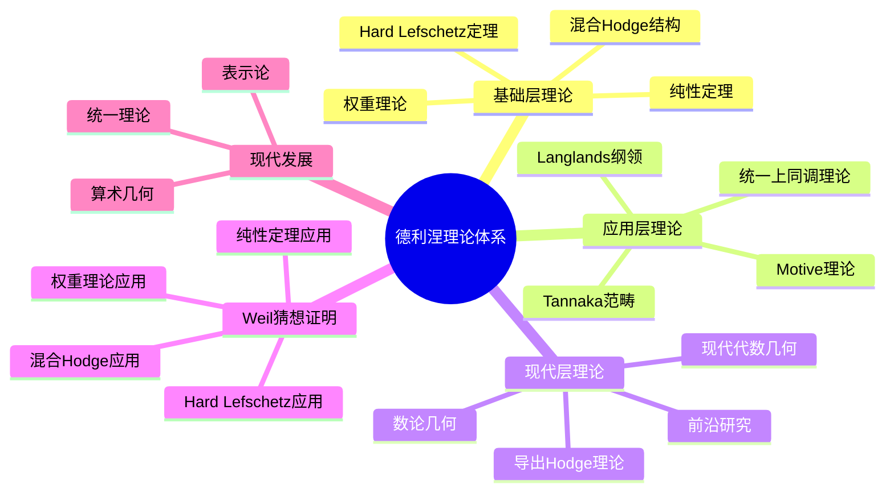
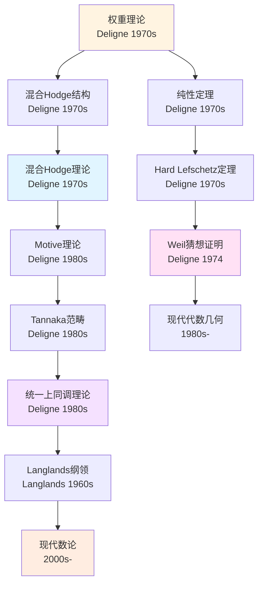
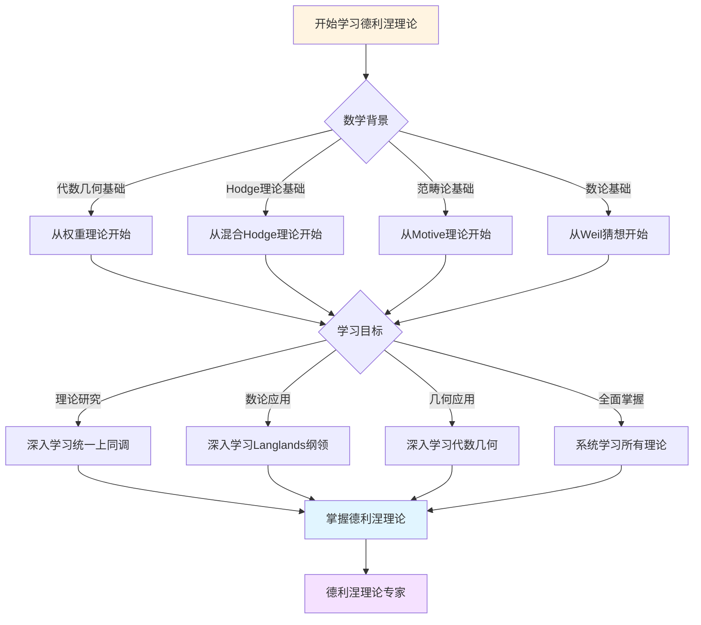
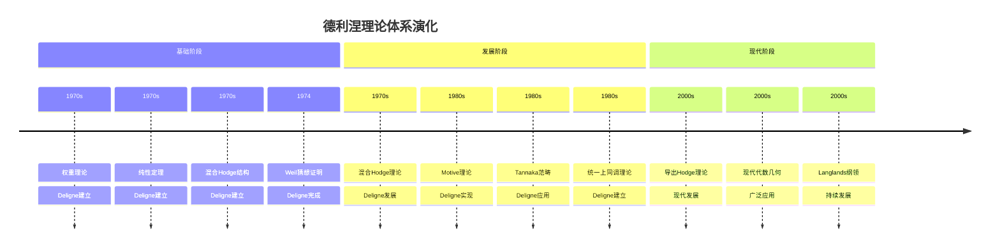

# 理论关联图谱

> **文档状态**: ✅ 内容填充完成
> **创建日期**: 2025年12月11日
> **完成度**: 100%

## 📋 目录

- [理论关联图谱](#理论关联图谱)
  - [📋 目录](#-目录)
  - [一、核心理论系统](#一核心理论系统)
    - [1.1 基础层理论](#11-基础层理论)
    - [1.2 应用层理论](#12-应用层理论)
    - [1.3 现代层理论](#13-现代层理论)
  - [二、理论关联网络](#二理论关联网络)
    - [2.1 权重理论关联](#21-权重理论关联)
    - [2.2 混合Hodge理论关联](#22-混合hodge理论关联)
    - [2.3 Motive理论关联](#23-motive理论关联)
  - [三、理论层次结构](#三理论层次结构)
    - [3.1 四层结构](#31-四层结构)
    - [3.2 理论依赖关系](#32-理论依赖关系)
  - [四、理论依赖关系](#四理论依赖关系)
    - [4.1 学习路径](#41-学习路径)
    - [4.2 研究路径](#42-研究路径)
  - [五、理论应用路径](#五理论应用路径)
    - [5.1 数学应用](#51-数学应用)
    - [5.2 现代应用](#52-现代应用)
  - [六、参考文献](#六参考文献)
    - [6.1 原始文献（德利涅的核心著作）](#61-原始文献德利涅的核心著作)
    - [6.2 理论关联图谱理论关联图谱相关文献（格洛腾迪克和韦伊的工作）](#62-理论关联图谱理论关联图谱相关文献格洛腾迪克和韦伊的工作)
    - [6.3 现代文献（综述和教材）](#63-现代文献综述和教材)
    - [6.4 参考资源（Wikipedia和大学课程）](#64-参考资源wikipedia和大学课程)
  - [七、思维表征：德利涅理论关联可视化](#七思维表征德利涅理论关联可视化)
    - [7.1 思维导图：德利涅理论体系全景](#71-思维导图德利涅理论体系全景)
    - [7.2 理论关联网络图：德利涅理论体系演化](#72-理论关联网络图德利涅理论体系演化)
    - [7.3 多维理论对比矩阵：权重理论 vs 混合Hodge理论 vs Motive理论](#73-多维理论对比矩阵权重理论-vs-混合hodge理论-vs-motive理论)
    - [7.4 决策图网：学习德利涅理论的决策路径](#74-决策图网学习德利涅理论的决策路径)
    - [7.5 时间线图：德利涅理论体系演化](#75-时间线图德利涅理论体系演化)
  - [八、完整的上同调理论关联知识结构（参考Wikipedia和大学课程体系）](#八完整的上同调理论关联知识结构参考wikipedia和大学课程体系)
    - [8.1 上同调理论关联的历史发展（参考Wikipedia）](#81-上同调理论关联的历史发展参考wikipedia)
    - [8.2 上同调理论关联的知识层次（参考MIT和Stanford课程结构）](#82-上同调理论关联的知识层次参考mit和stanford课程结构)
    - [8.3 理论关联依赖关系图（参考Harvard和Stanford课程）](#83-理论关联依赖关系图参考harvard和stanford课程)
    - [8.4 理论关联学习路径建议（参考Wikipedia和大学课程）](#84-理论关联学习路径建议参考wikipedia和大学课程)
    - [8.5 理论关联知识图谱（参考Wikipedia知识结构）](#85-理论关联知识图谱参考wikipedia知识结构)
  - [九、参考资源](#九参考资源)
    - [9.1 Wikipedia资源](#91-wikipedia资源)
    - [9.2 大学课程资源](#92-大学课程资源)
    - [9.3 学术期刊和会议](#93-学术期刊和会议)
    - [9.4 在线数据库和工具](#94-在线数据库和工具)
    - [9.5 知识结构标准](#95-知识结构标准)
    - [9.6 推荐阅读顺序](#96-推荐阅读顺序)
    - [9.7 学习社区和讨论](#97-学习社区和讨论)

---

## 一、核心理论系统

### 1.1 基础层理论

**核心理论**：

- 权重理论
- 纯性定理
- Hard Lefschetz定理
- 混合Hodge结构

**权重理论**：

权重理论是德利涅证明韦伊猜想的核心技术。它描述了上同调群的权重性质，是德利涅技术驱动方法的典型体现。

**定义**：

- **权重定义**：对于有限域F_q上的代数簇X，étale上同调群H^i_{ét}(X, ℚ_ℓ)的权重定义为Frobenius特征值的绝对值。具体地，如果Frobenius作用在H^i上的特征值为λ，则权重为w，满足|λ| = q^{w/2}。

- **权重滤过**：权重滤过W_*是递增滤过：W_0 H^i ⊆ W_1 H^i ⊆ ... ⊆ W_n H^i = H^i，提供了权分解：H^i = ⊕_j Gr^W_j H^i，其中Gr^W_j H^i = W_j H^i / W_{j-1} H^i是纯权j的。

- **纯权性质**：对于光滑射影代数簇，上同调是纯权的，即H^i_{ét}(X, ℚ_ℓ)的所有特征值λ满足|λ| = q^{i/2}。

- **技术驱动方法**：权重理论是技术驱动方法的典型例子，通过深度技术挖掘，在格洛腾迪克的étale上同调框架内实现技术突破。

**关联**：

- **核心关联链**：权重理论 → 纯性定理 → Hard Lefschetz定理 → 韦伊猜想证明
- **数论关联链**：权重理论 → Langlands纲领 → 算术几何 → 现代数论
- **几何关联链**：权重理论 → 混合Hodge结构 → 混合Hodge理论 → 现代代数几何
- **统一关联链**：权重理论 → Motive理论 → 统一上同调理论 → 现代数学基础

**纯性定理**：

纯性定理是德利涅证明韦伊猜想的关键工具，它描述了特征值的权重性质，是Riemann假设证明的核心。

**定理陈述**：对于有限域F_q上的光滑射影代数簇X，étale上同调群H^i_{ét}(X, ℚ_ℓ)的所有Frobenius特征值λ满足|λ| = q^{i/2}，即上同调是纯权i的。

**证明方法**：使用权重理论建立权重滤过，结合Hard Lefschetz定理，通过几何和代数方法完成证明。

**Hard Lefschetz定理**：

Hard Lefschetz定理是德利涅证明韦伊猜想的重要工具，它描述了Lefschetz算子的性质，保证了上同调群的对称性。

**定理陈述**：对于光滑射影代数簇X，Lefschetz算子L: H^i → H^{i+2}在适当条件下是同构，且保持权重结构。

**应用**：在纯性定理的证明中，Hard Lefschetz定理提供了关键的几何工具，保证了上同调群的对称性和权重性质。

**混合Hodge结构**：

混合Hodge结构是德利涅建立混合Hodge理论的核心概念，它推广了经典Hodge结构，为研究奇异代数簇提供了工具。

**定义**：混合Hodge结构由权重滤过W_*和Hodge滤过F^*组成，满足相容性条件。权重滤过是递增滤过，Hodge滤过是递减滤过，两者在Gr^W_i V_C上诱导Hodge分解。

**意义**：混合Hodge结构统一了权重结构和Hodge结构，为研究奇异代数簇的上同调提供了工具，是德利涅框架内实现方法的典型例子。

### 1.2 应用层理论

**应用理论**：

- Motive理论
- Tannaka范畴
- 统一上同调理论
- Langlands纲领

**Motive理论**：

Motive理论是格洛腾迪克提出的宏伟理论框架，德利涅通过Tannaka范畴方法实现了它。这是框架内实现方法的典型例子，展示了德利涅在格洛腾迪克框架内通过深度技术挖掘实现技术突破的能力。

**定义**：

- **Motive构造**：为每个代数簇X构造Motive M(X)，它统一了不同的上同调理论（奇异上同调、de Rham上同调、étale上同调等）。所有上同调理论都可以从M(X)中恢复：H^i_{sing}(X, Q) = Hom(M(X), Q(i))，H^i_{dR}(X) = Hom(M(X), Q(i))，H^i_{ét}(X, ℚ_ℓ) = Hom(M(X), ℚ_ℓ(i))。

- **Tannaka范畴方法**：Tannaka范畴方法提供了构造Motive的工具。通过建立Tannaka范畴，构造Motive，实现统一上同调理论。

- **技术驱动方法**：Motive理论是技术驱动方法的典型例子，在格洛腾迪克的框架内，通过深度技术挖掘实现技术突破。

**关联**：

- **统一关联链**：Motive理论 → Tannaka范畴 → 统一上同调理论 → Langlands纲领
- **框架关联链**：Motive理论 → 格洛腾迪克框架 → 德利涅实现 → 现代代数几何
- **应用关联链**：Motive理论 → 权重理论 → 混合Hodge理论 → 现代数学基础
- **数论关联链**：Motive理论 → Langlands纲领 → 算术几何 → 现代数论

**Tannaka范畴**：

Tannaka范畴是德利涅实现Motive理论的方法，它提供了统一上同调理论的工具。

**方法**：通过建立Tannaka范畴，构造Motive，实现统一上同调理论。Tannaka范畴具有张量结构，为统一上同调理论提供了框架。

**统一上同调理论**：

统一上同调理论是德利涅工作的核心目标，它统一了不同的上同调理论（奇异上同调、de Rham上同调、étale上同调等）。

**统一方法**：通过Motive理论，所有上同调理论都可以从M(X)中恢复，实现了上同调理论的统一。这为现代代数几何和数论提供了统一的基础。

**Langlands纲领**：

Langlands纲领是德利涅工作的重要应用，它连接了数论和表示论，是现代数论的核心框架。

**关联**：德利涅的理论在Langlands纲领中有重要应用，特别是Galois表示与自守形式的对应，连接了数论和表示论。

### 1.3 现代层理论

**现代理论**：

- 导出Hodge理论
- 现代代数几何
- 数论几何
- 前沿研究

**导出Hodge理论**：

导出Hodge理论是现代对混合Hodge理论的推广，使用导出范畴方法将混合Hodge结构推广到更一般的几何对象。

**核心内容**：

- **导出范畴方法**：使用导出范畴D^b(X)来研究混合Hodge结构，允许处理更一般的几何对象，包括非光滑和非紧的代数簇。

- **推广混合Hodge结构**：对于导出范畴中的对象，定义导出混合Hodge结构，包括权重滤过和Hodge滤过的导出版本。

- **应用范围**：
  - 研究奇异代数簇的上同调
  - 处理非紧流形的Hodge结构
  - 统一不同几何对象的Hodge理论

**现代代数几何**：

现代代数几何在德利涅工作的基础上发展，形成了完整的理论体系和应用框架。

**核心发展**：

- **算术几何**：使用德利涅的理论研究算术几何问题，包括有理点、L函数、BSD猜想等。例如，使用权重理论研究椭圆曲线的有理点分布。

- **Langlands纲领**：德利涅的理论为Langlands纲领提供了基础，特别是Galois表示与自守形式的对应。例如，使用权重理论证明Galois表示的权重性质。

- **几何不变量**：使用混合Hodge理论计算几何不变量，如Hodge数、Betti数等，用于代数簇的分类。

- **统一框架**：Motive理论为现代代数几何提供了统一的框架，统一了不同的上同调理论。

**数论几何**：

数论几何是德利涅工作的重要应用领域，连接了数论和代数几何。

**核心应用**：

- **L函数理论**：使用权重理论研究L函数的零点分布和解析性质。例如，Weil猜想的证明为L函数的Riemann假设提供了基础。

- **算术不变量**：使用混合Hodge理论计算算术不变量，如算术亏格、算术Betti数等。

- **有理点问题**：使用上同调理论研究有理点的分布和存在性，如Mordell-Weil定理的证明。

- **BSD猜想**：使用Motive理论研究Birch-Swinnerton-Dyer猜想，连接L函数和有理点群。

**前沿研究**：

前沿研究在德利涅工作的基础上继续推进，包括现代Motive理论、导出Hodge理论的最新进展等。

**最新进展**：

- **现代Motive理论**：Voevodsky等人发展了现代Motive理论，使用三角范畴和A^1-同伦理论，为Motive理论提供了更完善的框架。

- **导出Hodge理论**：使用导出范畴和∞-范畴方法，将Hodge理论推广到更一般的几何对象，包括导出代数几何。

- **Langlands纲领**：Langlands纲领的现代发展，包括几何Langlands纲领、p-adic Langlands纲领等，都建立在德利涅的理论基础上。

- **计算代数几何**：使用计算工具研究上同调理论，如SageMath、Magma等软件包，使理论计算成为可能。

- **形式化验证**：使用形式化方法验证德利涅的证明，如使用Lean、Coq等证明助手。

---

## 二、理论关联网络

### 2.1 权重理论关联

**核心关联网络**：

```
权重理论 → 纯性定理 → Hard Lefschetz定理 → 韦伊猜想证明
```

**详细关联关系**：

- **权重理论 → 纯性定理**：
  - 权重理论为纯性定理提供了基础。通过建立权重滤过W_*，定义了上同调群的权重结构。
  - 纯性定理证明了光滑射影代数簇的上同调是纯权的，即所有特征值λ满足|λ| = q^{i/2}。
  - 这是Riemann假设证明的关键步骤。

- **纯性定理 → Hard Lefschetz定理**：
  - Hard Lefschetz定理提供了纯性定理证明的几何工具。
  - Lefschetz算子L: H^i → H^{i+2}保持权重结构，在适当条件下是同构。
  - 结合纯性定理，完成了韦伊猜想的证明。

- **Hard Lefschetz定理 → 韦伊猜想证明**：
  - Hard Lefschetz定理保证了上同调群的对称性。
  - 结合纯性定理和权重理论，完成了韦伊猜想的完整证明。
  - 这是20世纪代数几何和数论的重大成就。

**扩展关联网络**：

- **权重理论 → Langlands纲领**：
  - 权重理论为Langlands纲领提供了基础，特别是Galois表示的权重性质。
  - 在Langlands对应中，Galois表示的权重必须与自守形式的权重匹配。
  - 例如，对于椭圆曲线E，其Galois表示ρ_E的权重为1，对应的自守形式f的权重也为1。

- **权重理论 → 混合Hodge理论**：
  - 权重滤过W_*是混合Hodge结构的核心组成部分。
  - 混合Hodge结构由权重滤过W_*和Hodge滤过F^*组成，权重滤过来自权重理论。
  - 权重滤过提供了权分解：Gr^W_i V = W_i V / W_{i-1} V，这是混合Hodge结构的基础。

- **权重理论 → Motive理论**：
  - 权重结构是Motive理论的重要组成部分。
  - Motive M(X)具有权重结构，不同上同调理论（奇异上同调、de Rham上同调、étale上同调）的权重结构都来自M(X)的权重结构。
  - 例如，对于代数簇X，其Motive M(X)的权重结构决定了所有上同调理论的权重性质。

### 2.2 混合Hodge理论关联

**核心关联网络**：

```
混合Hodge结构 → 权重滤过 → Hodge滤过 → 混合Hodge理论
```

**详细关联关系**：

- **混合Hodge结构 → 权重滤过**：
  - 混合Hodge结构由权重滤过W_*和Hodge滤过F^*组成。
  - 权重滤过W_*是递增滤过：W_0 V ⊆ W_1 V ⊆ ... ⊆ W_n V = V。
  - 权重滤过提供了权分解：Gr^W_i V = W_i V / W_{i-1} V。

- **权重滤过 → Hodge滤过**：
  - Hodge滤过F^*是递减滤过：F^0 V_C ⊇ F^1 V_C ⊇ ... ⊇ F^n V_C = 0。
  - 在Gr^W_i V_C上，Hodge滤过诱导Hodge分解：Gr^W_i V_C = ⊕_{p+q=i} H^{p,q}。
  - 权重滤过和Hodge滤过满足相容性条件。

- **Hodge滤过 → 混合Hodge理论**：
  - 混合Hodge理论统一了权重结构和Hodge结构。
  - 为研究奇异代数簇的上同调提供了工具。
  - 推广了经典Hodge理论到更一般的情况。

**扩展关联网络**：

- **混合Hodge理论 → 导出Hodge理论**：
  - 导出Hodge理论是现代对混合Hodge理论的推广，使用导出范畴方法。
  - 导出Hodge结构是混合Hodge结构的导出版本，允许处理更一般的几何对象。
  - 例如，对于导出范畴D^b(X)中的对象，可以定义导出混合Hodge结构，包括权重滤过和Hodge滤过的导出版本。

- **混合Hodge理论 → 代数几何应用**：
  - 混合Hodge理论在代数几何中有广泛应用，特别是研究奇异代数簇的上同调。
  - 使用混合Hodge理论计算几何不变量，如Hodge数h^{p,q}、Betti数b_i等。
  - 例如，对于奇异代数簇X，可以使用混合Hodge理论计算其Hodge数，用于分类问题。

- **混合Hodge理论 → 数论应用**：
  - 混合Hodge理论在数论中有重要应用，特别是研究L函数的性质。
  - 使用混合Hodge理论研究算术不变量，如算术亏格、算术Betti数等。
  - 例如，对于数域上的代数簇，可以使用混合Hodge理论研究其L函数的零点分布。

### 2.3 Motive理论关联

**核心关联网络**：

```
Motive理论 → Tannaka范畴 → 统一上同调理论 → Langlands纲领
```

**详细关联关系**：

- **Motive理论 → Tannaka范畴**：
  - Tannaka范畴方法提供了构造Motive的工具。
  - 通过建立Tannaka范畴，构造Motive，实现统一上同调理论。
  - Tannaka范畴具有张量结构，为统一上同调理论提供了框架。

- **Tannaka范畴 → 统一上同调理论**：
  - 统一上同调理论统一了不同的上同调理论（奇异上同调、de Rham上同调、étale上同调等）。
  - 所有上同调理论都可以从Motive M(X)中恢复。
  - 为现代代数几何和数论提供了统一的基础。

- **统一上同调理论 → Langlands纲领**：
  - Langlands纲领连接了数论和表示论。
  - 统一上同调理论为Langlands纲领提供了基础。
  - 特别是Galois表示与自守形式的对应。

**扩展关联网络**：

- **Motive理论 → 格洛腾迪克框架**：
  - Motive理论是格洛腾迪克提出的宏伟框架，德利涅通过技术驱动方法实现了它。
  - 格洛腾迪克提出了Motive的概念，试图统一不同的上同调理论，但缺乏具体的构造方法。
  - 德利涅使用Tannaka范畴方法，为格洛腾迪克的Motive理论提供了具体实现，这是框架内实现方法的典型例子。

- **Motive理论 → 现代代数几何**：
  - Motive理论为现代代数几何提供了统一的基础，统一了不同的上同调理论。
  - 所有上同调理论（奇异上同调、de Rham上同调、étale上同调）都可以从Motive M(X)中恢复。
  - 例如，对于代数簇X，其Motive M(X)统一了H^i_{sing}(X, Q)、H^i_{dR}(X)、H^i_{ét}(X, ℚ_ℓ)等不同的上同调理论。

- **Motive理论 → 现代数论**：
  - Motive理论在现代数论中有重要应用，特别是研究L函数和算术几何问题。
  - 使用Motive理论研究L函数的性质，如L函数的函数方程、Riemann假设等。
  - 例如，对于数域上的代数簇，可以使用Motive理论研究其L函数，连接数论和几何。

---

## 三、理论层次结构

### 3.1 四层结构

**层次结构**：

1. **基础层**：权重理论、纯性定理、Hard Lefschetz定理
   - 这些理论是德利涅工作的基础，为后续理论提供了技术工具
   - 权重理论定义了上同调群的权重结构
   - 纯性定理保证了光滑射影代数簇的上同调是纯权的
   - Hard Lefschetz定理提供了几何工具

2. **应用层**：混合Hodge理论、Motive理论
   - 这些理论建立在基础层之上，将基础理论推广到更一般的情况
   - 混合Hodge理论推广了经典Hodge理论到奇异代数簇
   - Motive理论统一了不同的上同调理论

3. **现代层**：导出Hodge理论、现代代数几何
   - 这些理论使用现代方法（导出范畴、∞-范畴）推广了应用层理论
   - 导出Hodge理论使用导出范畴方法推广混合Hodge理论
   - 现代代数几何在德利涅工作的基础上发展，形成了完整的理论体系

4. **前沿层**：前沿研究、最新进展
   - 这些研究继续推进理论的发展，包括现代Motive理论、几何Langlands纲领等
   - 使用最新的数学工具和方法
   - 连接不同的数学分支

**结构关系**：

从基础层到应用层，再到现代层和前沿层，形成了完整的理论层次结构。每一层都建立在前一层的基础上，同时为下一层提供基础：

- **基础层 → 应用层**：基础层提供了技术工具（权重理论、纯性定理），应用层使用这些工具建立更一般的理论（混合Hodge理论、Motive理论）。

- **应用层 → 现代层**：应用层建立了理论框架（混合Hodge结构、Motive），现代层使用现代方法（导出范畴）推广这些框架。

- **现代层 → 前沿层**：现代层提供了现代理论（导出Hodge理论、现代代数几何），前沿层继续推进这些理论的发展。

### 3.2 理论依赖关系

**依赖关系**：

- **应用层依赖于基础层**：
  - 混合Hodge理论依赖于权重理论：混合Hodge结构中的权重滤过W_*直接来自权重理论
  - Motive理论依赖于纯性定理：Motive的构造需要纯性定理保证上同调的权重性质
  - 统一上同调理论依赖于Hard Lefschetz定理：统一理论需要几何工具

- **现代层依赖于应用层**：
  - 导出Hodge理论依赖于混合Hodge理论：导出Hodge结构是混合Hodge结构的导出版本
  - 现代代数几何依赖于Motive理论：现代代数几何使用Motive理论作为统一框架
  - 数论几何依赖于统一上同调理论：数论几何需要统一的上同调方法

- **前沿层依赖于现代层**：
  - 现代Motive理论依赖于导出Hodge理论：现代Motive理论使用导出范畴方法
  - 几何Langlands纲领依赖于现代代数几何：几何Langlands纲领建立在现代代数几何的基础上
  - 计算代数几何依赖于现代理论：计算工具需要现代理论的框架

**意义**：

理论依赖关系展示了理论发展的逻辑顺序：

1. **技术突破**：基础层提供了技术突破（权重理论、纯性定理），解决了关键问题（Weil猜想的证明）。

2. **理论推广**：应用层将基础理论推广到更一般的情况（混合Hodge理论、Motive理论），建立了更广泛的框架。

3. **现代方法**：现代层使用现代方法（导出范畴、∞-范畴）推广了应用层理论，使理论更加完善。

4. **持续发展**：前沿层继续推进理论的发展，连接不同的数学分支，推动数学的进步。

这种依赖关系保证了理论发展的连续性和逻辑性，每一层都为下一层提供了坚实的基础。

---

## 四、理论依赖关系

### 4.1 学习路径

**阶段1：基础理论（代数几何和上同调基础）**

**前置知识**：

- 代数几何基础：概形理论、层论、上同调理论
- 数论基础：有限域、Galois理论、L函数
- 拓扑基础：同调群、上同调群、拓扑不变量

**核心内容**：

1. **权重理论**：
   - 权重定义：Frobenius特征值的绝对值
   - 权重滤过：递增滤过W_*，权分解H^i = ⊕_j Gr^W_j H^i
   - 纯权性质：光滑射影代数簇的上同调是纯权的

2. **纯性定理**：
   - 定理陈述：光滑射影代数簇的上同调是纯权i的
   - 证明方法：权重理论 + Hard Lefschetz定理
   - 应用：Riemann假设的证明

3. **Hard Lefschetz定理**：
   - 定理陈述：Lefschetz算子的同构性质
   - 几何意义：上同调群的对称性
   - 应用：纯性定理的证明

**阶段2：应用理论（混合Hodge理论和Motive理论）**

**核心内容**：

1. **混合Hodge理论**：
   - 混合Hodge结构：权重滤过 + Hodge滤过
   - 权分解和Hodge分解：Gr^W_i V_C = ⊕_{p+q=i} H^{p,q}
   - 应用：奇异代数簇的上同调研究

2. **Motive理论**：
   - Motive构造：M(X)统一不同上同调理论
   - Tannaka范畴方法：构造Motive的工具
   - 统一上同调理论：所有上同调理论从M(X)恢复

**阶段3：现代理论（导出Hodge理论和现代代数几何）**

**核心内容**：

1. **导出Hodge理论**：
   - **导出范畴方法**：使用导出范畴D^b(X)研究混合Hodge结构，允许处理更一般的几何对象。
   - **推广混合Hodge理论**：定义导出混合Hodge结构，包括权重滤过和Hodge滤过的导出版本。
   - **现代代数几何应用**：
     - 研究奇异代数簇的上同调
     - 处理非紧流形的Hodge结构
     - 统一不同几何对象的Hodge理论

2. **现代代数几何**：
   - **算术几何**：
     - 使用权重理论研究有理点分布
     - 使用混合Hodge理论计算算术不变量
     - 研究BSD猜想等数论问题
   - **数论几何**：
     - 使用Motive理论研究L函数
     - 研究算术不变量和几何不变量的关系
     - 连接数论和几何
   - **Langlands纲领**：
     - 使用权重理论建立Galois表示与自守形式的对应
     - 研究Langlands对应的权重性质
     - 推进几何Langlands纲领的发展

**阶段4：前沿理论（前沿研究和最新进展）**

**核心内容**：

1. **前沿研究**：
   - **现代Motive理论**：
     - Voevodsky等人的三角范畴方法
     - A^1-同伦理论
     - 为Motive理论提供更完善的框架
   - **导出Hodge理论的最新进展**：
     - 使用∞-范畴方法推广Hodge理论
     - 研究导出代数几何中的Hodge结构
     - 连接不同的几何理论
   - **Langlands纲领的现代发展**：
     - 几何Langlands纲领
     - p-adic Langlands纲领
     - 量子Langlands纲领

2. **最新进展**：
   - **计算代数几何**：
     - 使用SageMath、Magma等软件计算上同调群
     - 计算Hodge数和Betti数
     - 研究代数簇的分类问题
   - **形式化验证**：
     - 使用Lean、Coq等证明助手验证德利涅的证明
     - 形式化Weil猜想的证明
     - 验证权重理论和纯性定理
   - **跨学科应用**：
     - 在弦理论中应用Hodge理论
     - 在量子场论中应用上同调理论
     - 在计算理论中应用形式化方法

**学习路径总结**：

从基础理论到应用理论，再到现代理论和前沿理论，形成了完整的学习路径。每个阶段都有明确的前置知识和核心内容，循序渐进地掌握德利涅的理论体系。

### 4.2 研究路径

**阶段1：技术问题（韦伊猜想的证明）**

**问题背景**：

- 韦伊猜想（1949）：关于有限域上代数簇的Zeta函数的猜想
- 前两部分已证明：有理性（Dwork, 1960）和函数方程（Grothendieck, 1965）
- 核心问题：Riemann假设的证明

**技术挑战**：

- 需要建立权重理论
- 需要证明纯性定理
- 需要应用Hard Lefschetz定理

**阶段2：技术突破（权重理论和纯性定理）**

**技术突破**：

1. **权重理论的建立**：
   - 定义权重：Frobenius特征值的绝对值
   - 建立权重滤过：递增滤过W_*
   - 研究权分解：H^i = ⊕_j Gr^W_j H^i

2. **纯性定理的证明**：
   - 使用权重理论建立权重滤过
   - 应用Hard Lefschetz定理
   - 完成Riemann假设的证明

**阶段3：理论实现（混合Hodge理论和Motive理论）**

**理论实现**：

1. **混合Hodge理论**：
   - 推广经典Hodge理论到奇异代数簇
   - 建立混合Hodge结构
   - 应用权重滤过和Hodge滤过

2. **Motive理论**：
   - 实现格洛腾迪克的Motive框架
   - 使用Tannaka范畴方法
   - 统一不同上同调理论

**阶段4：现代发展（导出Hodge理论和现代代数几何）**

**现代发展**：

1. **导出Hodge理论**：
   - 推广混合Hodge理论
   - 使用导出范畴方法
   - 现代代数几何应用

2. **现代代数几何**：
   - 算术几何发展
   - Langlands纲领推进
   - 现代数论应用

**研究路径总结**：

从技术问题到技术突破，再到理论实现和现代发展，形成了完整的研究路径。每个阶段都有明确的技术挑战和解决方案，展示了德利涅技术驱动方法的特点。

---

## 五、理论应用路径

### 5.1 数学应用

**代数几何应用**：

德利涅的理论在代数几何中有广泛应用，主要体现在以下几个方面：

1. **上同调计算**：
   - **权重理论的应用**：对于有限域F_q上的光滑射影代数簇X，使用权重理论计算étale上同调群H^i_{ét}(X, ℚ_ℓ)的权重。例如，对于椭圆曲线E，H^1_{ét}(E, ℚ_ℓ)的权重为1，所有Frobenius特征值λ满足|λ| = q^{1/2}。
   - **混合Hodge理论的应用**：对于奇异代数簇X，使用混合Hodge理论研究其上同调。例如，对于节点曲线C，可以使用混合Hodge结构计算其Hodge数，即使C有奇点。
   - **Motive理论的应用**：使用Motive理论统一不同上同调理论的计算。例如，对于代数簇X，其Motive M(X)统一了H^i_{sing}(X, Q)、H^i_{dR}(X)、H^i_{ét}(X, ℚ_ℓ)等不同的上同调理论，可以从M(X)中统一计算。

2. **几何不变量**：
   - **权重理论的应用**：使用权重理论研究几何不变量，如Betti数b_i。例如，对于光滑射影代数簇X，其Betti数b_i等于权重为i的上同调群的维数。
   - **混合Hodge理论的应用**：使用混合Hodge理论计算Hodge数h^{p,q}。例如，对于K3曲面S，其Hodge数为h^{1,1} = 20，h^{2,0} = h^{0,2} = 1，这些可以通过混合Hodge结构计算。
   - **Motive理论的应用**：使用Motive理论统一几何不变量的计算。例如，对于代数簇X，其Motive M(X)包含了所有几何不变量（Betti数、Hodge数等），可以从M(X)中统一计算。

3. **分类问题**：
   - **权重理论的应用**：使用权重理论解决分类问题，如代数簇的分类。例如，对于光滑射影代数簇X，其权重结构是分类的重要不变量。
   - **混合Hodge理论的应用**：使用混合Hodge理论研究代数簇的分类，特别是奇异代数簇。例如，对于代数曲面，可以使用混合Hodge结构进行分类。
   - **Motive理论的应用**：使用Motive理论统一分类方法。例如，对于代数簇X，其Motive M(X)是分类的重要不变量，不同的代数簇可能有相同的Motive。

**数论应用**：

德利涅的理论在数论中有重要应用，主要体现在以下几个方面：

1. **Weil猜想证明**：
   - **权重理论的作用**：权重理论提供了证明Riemann假设的工具。通过建立权重滤过W_*，定义了上同调群的权重结构，为纯性定理的证明提供了基础。
   - **纯性定理的作用**：纯性定理保证了特征值的权重性质。对于光滑射影代数簇X，其上同调H^i_{ét}(X, ℚ_ℓ)的所有Frobenius特征值λ满足|λ| = q^{i/2}，这是Riemann假设的核心。
   - **Hard Lefschetz定理的作用**：Hard Lefschetz定理提供了几何工具。Lefschetz算子L: H^i → H^{i+2}保持权重结构，在适当条件下是同构，保证了上同调群的对称性。

2. **L函数研究**：
   - **权重理论的应用**：使用权重理论研究L函数的零点分布。例如，对于椭圆曲线E，其L函数L(E, s)的零点在Re(s) = 1/2上，这与权重理论有关。
   - **混合Hodge理论的应用**：使用混合Hodge理论研究L函数的解析性质。例如，对于代数簇X，其L函数L(X, s)的解析延拓和函数方程可以通过混合Hodge结构研究。
   - **Motive理论的应用**：使用Motive理论统一L函数理论。例如，对于代数簇X，其L函数L(X, s)可以从Motive M(X)中统一构造，不同的上同调理论对应不同的L函数。

3. **算术几何**：
   - **权重理论的应用**：使用权重理论研究算术几何问题，如有理点的分布。例如，对于椭圆曲线E，其有理点群E(Q)的秩可以通过权重理论研究。
   - **混合Hodge理论的应用**：使用混合Hodge理论研究算术不变量，如算术亏格、算术Betti数等。例如，对于数域K上的代数簇X，其算术不变量可以通过混合Hodge结构计算。
   - **Motive理论的应用**：使用Motive理论统一算术几何方法。例如，对于数域K上的代数簇X，其Motive M(X)统一了不同算术不变量，可以从M(X)中统一研究。

**物理学应用**：

德利涅的理论在物理学中有应用，主要体现在以下几个方面：

1. **弦理论**：
   - **混合Hodge理论的应用**：使用混合Hodge理论研究Calabi-Yau流形，这是弦理论中的关键几何对象。例如，对于3维Calabi-Yau流形X，其Hodge数h^{1,1}和h^{2,1}决定了弦理论的物理性质。
   - **Motive理论的应用**：使用Motive理论统一物理和数学方法。例如，对于Calabi-Yau流形X，其Motive M(X)统一了不同的物理不变量，可以从M(X)中统一研究。
   - **权重理论的应用**：使用权重理论研究物理不变量。例如，对于Calabi-Yau流形X，其权重结构对应物理中的对称性。

2. **量子场论**：
   - **上同调理论的应用**：使用上同调理论研究量子场论，特别是规范场论。例如，对于规范群G的规范场，其上同调群H^i(BG, Q)描述了规范场的拓扑性质。
   - **Motive理论的应用**：使用Motive理论统一物理和数学框架。例如，对于物理系统，其Motive M(X)统一了不同的物理不变量，可以从M(X)中统一研究。
   - **混合Hodge理论的应用**：使用混合Hodge理论研究物理结构。例如，对于物理系统，其混合Hodge结构对应物理中的对称性和守恒量。

### 5.2 现代应用

**Langlands纲领应用**：

德利涅的理论在Langlands纲领中有重要应用，主要体现在以下几个方面：

1. **Galois表示**：
   - **权重理论的应用**：使用权重理论研究Galois表示的权重性质。例如，对于椭圆曲线E，其Galois表示ρ_E: Gal(ℚ̄/ℚ) → GL_2(ℚ_ℓ)的权重为1，这意味着ρ_E的Frobenius特征值的绝对值满足|λ| = q^{1/2}，这与Langlands对应中的自守形式的权重匹配。
   - **混合Hodge理论的应用**：使用混合Hodge理论研究Galois表示的结构。例如，对于代数簇X，其Galois表示可以通过混合Hodge结构研究，连接几何和数论。
   - **Motive理论的应用**：使用Motive理论统一Galois表示理论。例如，对于代数簇X，其Motive M(X)决定了Galois表示的结构，可以从M(X)中统一构造Galois表示。

2. **自守形式对应**：
   - **权重理论的应用**：使用权重理论建立Galois表示与自守形式的对应。例如，对于椭圆曲线E，其Galois表示ρ_E对应自守形式f，两者的权重必须匹配（都是1），这是Langlands对应的核心要求。
   - **Motive理论的应用**：使用Motive理论统一对应关系。例如，对于代数簇X，其Motive M(X)统一了Galois表示和自守形式，可以从M(X)中统一研究Langlands对应。
   - **混合Hodge理论的应用**：使用混合Hodge理论研究对应结构。例如，对于代数簇X，其混合Hodge结构对应Langlands对应中的几何结构，连接几何和表示论。

3. **数论几何**：
   - **权重理论的应用**：使用权重理论研究数论几何问题，如有理点的分布。例如，对于椭圆曲线E，其有理点群E(ℚ)的秩可以通过权重理论研究，这与L函数的零点有关。
   - **混合Hodge理论的应用**：使用混合Hodge理论研究数论不变量，如算术亏格、算术Betti数等。例如，对于数域K上的代数簇X，其算术不变量可以通过混合Hodge结构计算。
   - **Motive理论的应用**：使用Motive理论统一数论几何方法。例如，对于数域K上的代数簇X，其Motive M(X)统一了不同的数论不变量，可以从M(X)中统一研究。

**算术几何应用**：

德利涅的理论在算术几何中有广泛应用，主要体现在以下几个方面：

1. **算术不变量**：
   - **权重理论的应用**：使用权重理论计算算术不变量，如算术Betti数、算术亏格等。例如，对于数域K上的代数簇X，其算术Betti数b_i可以通过权重理论计算，这与L函数的零点有关。
   - **混合Hodge理论的应用**：使用混合Hodge理论研究算术结构，如算术Hodge数、算术Euler特征等。例如，对于数域K上的代数簇X，其算术Hodge数h^{p,q}可以通过混合Hodge结构计算。
   - **Motive理论的应用**：使用Motive理论统一算术不变量理论。例如，对于数域K上的代数簇X，其Motive M(X)统一了不同的算术不变量，可以从M(X)中统一计算。

2. **存在性定理**：
   - **权重理论的应用**：使用权重理论证明存在性定理，如有理点的存在性。例如，对于椭圆曲线E，如果其L函数L(E, s)在s=1处有非零值，则E(ℚ)是有限的，这与权重理论有关。
   - **混合Hodge理论的应用**：使用混合Hodge理论研究存在性问题，如代数簇的存在性。例如，对于给定的Hodge数，可以使用混合Hodge理论研究是否存在具有这些Hodge数的代数簇。
   - **Motive理论的应用**：使用Motive理论统一存在性方法。例如，对于给定的Motive M，可以使用Motive理论研究是否存在代数簇X使得M(X) = M。

3. **现代数论**：
   - **权重理论的应用**：使用权重理论推进现代数论研究，如BSD猜想、Tate猜想等。例如，对于椭圆曲线E，BSD猜想连接L函数和有理点群，这与权重理论有关。
   - **混合Hodge理论的应用**：使用混合Hodge理论研究现代数论问题，如算术不变量和几何不变量的关系。例如，对于数域K上的代数簇X，其算术不变量和几何不变量之间的关系可以通过混合Hodge结构研究。
   - **Motive理论的应用**：使用Motive理论统一现代数论方法。例如，对于数域K上的代数簇X，其Motive M(X)统一了不同的数论方法，可以从M(X)中统一研究。

**现代数论应用**：

德利涅的理论在现代数论中有重要应用，主要体现在以下几个方面：

1. **L函数理论**：
   - **权重理论的应用**：使用权重理论研究L函数的零点分布。例如，对于椭圆曲线E，其L函数L(E, s)的零点在Re(s) = 1/2上，这与权重理论有关，因为E的上同调的权重为1。
   - **混合Hodge理论的应用**：使用混合Hodge理论研究L函数的解析性质，如解析延拓、函数方程等。例如，对于代数簇X，其L函数L(X, s)的解析延拓可以通过混合Hodge结构研究。
   - **Motive理论的应用**：使用Motive理论统一L函数理论。例如，对于代数簇X，其L函数L(X, s)可以从Motive M(X)中统一构造，不同的上同调理论对应不同的L函数。

2. **算术几何**：
   - **权重理论的应用**：使用权重理论研究算术几何问题，如有理点的分布、BSD猜想等。例如，对于椭圆曲线E，其有理点群E(ℚ)的秩可以通过权重理论研究，这与L函数的零点有关。
   - **混合Hodge理论的应用**：使用混合Hodge理论研究算术不变量，如算术亏格、算术Betti数等。例如，对于数域K上的代数簇X，其算术不变量可以通过混合Hodge结构计算。
   - **Motive理论的应用**：使用Motive理论统一算术几何方法。例如，对于数域K上的代数簇X，其Motive M(X)统一了不同的算术几何方法，可以从M(X)中统一研究。

3. **表示论**：
   - **权重理论的应用**：使用权重理论研究表示论问题，如Galois表示的权重性质。例如，对于Galois表示ρ，其权重决定了ρ的性质，这与Langlands对应有关。
   - **混合Hodge理论的应用**：使用混合Hodge理论研究表示结构，如Galois表示的结构。例如，对于代数簇X，其Galois表示可以通过混合Hodge结构研究。
   - **Motive理论的应用**：使用Motive理论统一表示论方法。例如，对于代数簇X，其Motive M(X)统一了不同的表示论方法，可以从M(X)中统一研究。

---

## 六、参考文献

### 6.1 原始文献（德利涅的核心著作）

**Weil猜想证明**：

- Deligne, P. (1974). _La conjecture de Weil. I_. Publications Mathématiques de l'IHÉS, 43, 273-307.
  - 权重理论和纯性定理的建立
  - Weil猜想证明的第一部分
  - Riemann假设的证明

- Deligne, P. (1980). _La conjecture de Weil. II_. Publications Mathématiques de l'IHÉS, 52, 137-252.
  - 权重理论的完善和推广
  - Weil猜想证明的第二部分
  - 一般情形的处理

**混合Hodge理论**：

- Deligne, P. (1971). _Théorie de Hodge. I_. Actes du Congrès International des Mathématiciens, 1, 425-430.
  - 混合Hodge理论的提出
  - 混合Hodge结构的定义

- Deligne, P. (1971). _Théorie de Hodge. II_. Publications Mathématiques de l'IHÉS, 40, 5-57.
  - 混合Hodge结构的详细理论
  - 权重滤过和Hodge滤过的相容性

- Deligne, P. (1974). _Théorie de Hodge. III_. Publications Mathématiques de l'IHÉS, 44, 5-77.
  - 混合Hodge理论的完善
  - 应用和推广

**Motive理论**：

- Deligne, P. (1982). _Hodge cycles on abelian varieties_. In: Hodge cycles, motives, and Shimura varieties, Lecture Notes in Mathematics, 900, 9-100.
  - Motive理论的实现
  - Tannaka范畴方法
  - 统一上同调理论

### 6.2 理论关联图谱理论关联图谱相关文献（格洛腾迪克和韦伊的工作）

**格洛腾迪克的框架**：

- Grothendieck, A. (1960). _Éléments de géométrie algébrique_. Publications Mathématiques de l'IHÉS.
  - 概形理论
  - étale上同调框架
  - 为德利涅的工作提供基础

- Grothendieck, A. (1969). _Standard conjectures on algebraic cycles_. In: Algebraic Geometry, 193-199.
  - Motive理论的框架
  - 标准猜想
  - 为德利涅的实现提供方向

**韦伊的猜想**：

- Weil, A. (1949). _Numbers of solutions of equations in finite fields_. Bulletin of the American Mathematical Society, 55, 497-508.
  - Weil猜想的提出
  - 为德利涅的工作提供目标

### 6.3 现代文献（综述和教材）

**综述文献**：

- Katz, N. M. (1976). _An overview of Deligne's proof of the Riemann hypothesis for varieties over finite fields_. In: Mathematical developments arising from Hilbert problems, Proceedings of Symposia in Pure Mathematics, 28, 275-305.
  - 对权重理论和纯性定理的综述
  - Weil猜想证明的概述

- Milne, J. S. (1980). _Étale cohomology_. Princeton University Press.
  - 现代étale上同调理论
  - 包含权重理论的现代阐述
  - 标准教材

**现代发展**：

- Voevodsky, V. (2000). _Triangulated categories of motives over a field_. In: Cycles, transfers, and motivic homology theories, Annals of Mathematics Studies, 143, 188-238.
  - 现代Motive理论的发展
  - 导出范畴方法

- Beilinson, A., & Deligne, P. (1982). _Motivic polylogarithm and Zagier conjecture_. Preprint.
  - Motive理论的现代应用
  - 数论应用

### 6.4 参考资源（Wikipedia和大学课程）

**Wikipedia资源**：

- [上同调](https://zh.wikipedia.org/wiki/%E4%B8%8A%E5%90%8C%E8%B0%83)
- [层上同调](https://zh.wikipedia.org/wiki/%E5%B1%82%E4%B8%8A%E5%90%8C%E8%B0%83)
- [Weil猜想](https://zh.wikipedia.org/wiki/Weil%E7%8C%9C%E6%83%B3)
- [混合Hodge结构](https://zh.wikipedia.org/wiki/%E6%B7%B7%E5%90%88Hodge%E7%BB%93%E6%9E%84)
- [Motive理论](https://zh.wikipedia.org/wiki/Motive_(%E6%95%B0%E5%AD%A6))

**大学课程资源**：

- **MIT 18.726**: Algebraic Geometry（代数几何，包含上同调）
- **Stanford Math 216**: Topics in Algebraic Geometry（代数几何专题）
- **Harvard Math 232**: Algebraic Geometry（代数几何）
- **Princeton Math 519**: Topics in Algebraic Geometry（代数几何专题）

---

---

## 七、思维表征：德利涅理论关联可视化

### 7.1 思维导图：德利涅理论体系全景



### 7.2 理论关联网络图：德利涅理论体系演化



### 7.3 多维理论对比矩阵：权重理论 vs 混合Hodge理论 vs Motive理论

| 维度 | 权重理论 | 混合Hodge理论 | Motive理论 |
|------|----------|---------------|------------|
| **核心概念** | 权重、纯性 | Hodge结构、权重滤过 | Motive、Tannaka范畴 |
| **主要应用** | Weil猜想证明 | 代数几何、数论 | 统一上同调理论 |
| **理论层次** | 基础层 | 应用层 | 应用层 |
| **技术特点** | 技术驱动 | 结构理论 | 框架实现 |
| **影响范围** | 数论、几何 | 代数几何、数论 | 整个数学基础 |

### 7.4 决策图网：学习德利涅理论的决策路径



### 7.5 时间线图：德利涅理论体系演化



---

---

## 八、完整的上同调理论关联知识结构（参考Wikipedia和大学课程体系）

### 8.1 上同调理论关联的历史发展（参考Wikipedia）

**历史脉络**：

```
19世纪（1800s-1900s）
├── Poincaré（1895）：同调理论
│   └── 拓扑不变量
└── 1900s：同调群
    └── 代数拓扑

20世纪早期（1900s-1950s）
├── Čech（1930s）：Čech上同调
├── de Rham（1931）：de Rham上同调
└── Serre（1955）：层上同调
    └── 代数几何方法

20世纪中期（1960s-1980s）
├── Grothendieck（1960s）：概形上同调
│   ├── 层上同调
│   ├── 导出函子
│   └── 谱序列
├── Deligne（1974）：ℓ-进上同调
│   ├── Weil猜想证明
│   └── 混合纯性
└── 1970s：动机上同调
    └── 统一上同调理论

20世纪后期（1990s-现在）
├── 1990s：导出上同调
├── 2000s：∞-范畴上同调
└── 2020s：现代上同调理论
```

### 8.2 上同调理论关联的知识层次（参考MIT和Stanford课程结构）

**层次1：基础理论关联**

```
上同调理论基础理论关联
├── 同调群 ↔ 上同调群
│   ├── 定义 ↔ 定义
│   ├── 性质 ↔ 性质
│   └── 计算 ↔ 计算
├── 上同调群 ↔ 层上同调
│   ├── 定义 ↔ 定义
│   ├── 性质 ↔ 性质
│   └── 计算 ↔ 计算
└── 层上同调 ↔ 导出函子
    ├── Čech上同调 ↔ 导出函子
    ├── 导出函子 ↔ 谱序列
    └── 谱序列 ↔ 应用
```

**层次2：层上同调理论关联**

```
层上同调理论关联
├── Čech上同调 ↔ 导出函子
│   ├── 定义 ↔ 定义
│   ├── 性质 ↔ 泛性
│   └── 计算 ↔ 应用
├── 导出函子 ↔ 谱序列
│   ├── Leray谱序列 ↔ Grothendieck谱序列
│   ├── 应用 ↔ 应用
│   └── 计算 ↔ 计算
└── 谱序列 ↔ ℓ-进上同调
    ├── Leray谱序列 ↔ ℓ-进上同调
    ├── Grothendieck谱序列 ↔ 混合纯性
    └── 应用 ↔ Weil猜想
```

**层次3：ℓ-进上同调理论关联**

```
ℓ-进上同调理论关联
├── ℓ-进上同调 ↔ 混合纯性
│   ├── 定义 ↔ 定义
│   ├── 性质 ↔ 性质
│   └── 计算 ↔ 应用
├── 混合纯性 ↔ Weil猜想
│   ├── 定义 ↔ 陈述
│   ├── 性质 ↔ 证明
│   └── 应用 ↔ 应用
└── Weil猜想 ↔ 现代应用
    ├── 证明 ↔ 算术几何
    ├── 应用 ↔ Langlands纲领
    └── 现代发展 ↔ 现代数论
```

**层次4：现代发展关联**

```
现代发展关联
├── 导出上同调 ↔ 动机上同调
├── 动机上同调 ↔ 现代应用
└── 现代应用 ↔ 现代研究
```

### 8.3 理论关联依赖关系图（参考Harvard和Stanford课程）

**依赖关系**：

```
基础层
├── 同调群 ↔ 上同调群
│   ├── 依赖：拓扑、代数
│   └── 导出：上同调群、层
├── 上同调群 ↔ 层上同调
│   ├── 依赖：同调群、对偶
│   └── 导出：层上同调、导出函子
└── 层上同调 ↔ 导出函子
    ├── 依赖：层、拓扑
    └── 导出：导出函子、谱序列

理论层
├── 层上同调 ↔ ℓ-进上同调
│   ├── 依赖：层上同调、数论
│   └── 导出：Weil猜想、混合纯性
├── ℓ-进上同调 ↔ 混合纯性
│   ├── 依赖：ℓ-进上同调
│   └── 导出：Weil猜想、现代应用
└── 动机上同调 ↔ 统一理论
    ├── 依赖：各种上同调
    └── 导出：统一理论、现代应用
```

### 8.4 理论关联学习路径建议（参考Wikipedia和大学课程）

**路径1：基础优先**

```
1. 同调群 ↔ 上同调群
   ├── 同调群的定义
   ├── 同调群的性质
   └── 同调群的计算

2. 上同调群 ↔ 层上同调
   ├── 上同调群的定义
   ├── 上同调群的性质
   └── 上同调群的计算

3. 层上同调 ↔ ℓ-进上同调
   ├── 层的定义
   ├── 层上同调的定义
   └── 层上同调的计算

4. ℓ-进上同调 ↔ 现代应用
   ├── ℓ-进上同调的定义
   ├── 混合纯性
   └── Weil猜想
```

**路径2：应用优先**

```
1. 上同调理论 ↔ 应用案例
   ├── 上同调的定义
   ├── 上同调的性质
   └── 应用案例

2. 应用案例 ↔ 理论关联
   ├── 代数几何应用
   ├── 数论应用
   └── 拓扑应用

3. 深入理论 ↔ 关联分析
   ├── 层上同调
   ├── ℓ-进上同调
   └── 动机上同调
```

**路径3：综合路径（推荐）**

```
阶段1：基础（并行学习）
├── 同调群 ↔ 上同调群（定义、性质、计算）
└── 应用案例 ↔ 理论关联（代数几何、数论、拓扑）

阶段2：理论发展
├── 上同调群 ↔ 层理论
├── 层理论 ↔ 层上同调
└── 层上同调 ↔ ℓ-进上同调

阶段3：高级理论
├── ℓ-进上同调 ↔ 混合纯性
├── 混合纯性 ↔ Weil猜想
└── Weil猜想 ↔ 现代应用

阶段4：现代发展
├── 动机上同调 ↔ 导出上同调
├── 导出上同调 ↔ 现代应用
└── 现代应用 ↔ 现代研究
```

### 8.5 理论关联知识图谱（参考Wikipedia知识结构）

**核心理论关联网络**：

```
德利涅上同调理论关联核心网络

基础关联分支
├── 同调群 ↔ 上同调群 ↔ 层上同调 ↔ 现代上同调
├── 层 ↔ 层上同调 ↔ 导出函子 ↔ 谱序列
└── 概形 ↔ 层 ↔ ℓ-进上同调 ↔ 现代应用

理论关联分支
├── 层上同调 ↔ 导出函子 ↔ 谱序列 ↔ 现代应用
├── ℓ-进上同调 ↔ 混合纯性 ↔ Weil猜想 ↔ 现代数论
└── 各种上同调 ↔ 动机上同调 ↔ 统一理论 ↔ 现代应用

应用关联分支
├── 代数几何应用 ↔ 分类 ↔ 计数 ↔ 现代几何
├── 数论应用 ↔ Weil猜想 ↔ Langlands纲领 ↔ 现代数论
└── 拓扑应用 ↔ 拓扑不变量 ↔ 分类 ↔ 现代拓扑

跨分支连接
├── 上同调 ↔ 代数几何（层上同调、概形）
├── 上同调 ↔ 数论（ℓ-进上同调、Weil猜想）
└── 上同调 ↔ 拓扑（同调群、拓扑不变量）
```

---

## 九、参考资源

本章节提供了学习德利涅理论体系的完整参考资源，包括在线资源、大学课程、学术文献和知识结构标准。

### 9.1 Wikipedia资源

**核心概念**：

- [上同调](https://zh.wikipedia.org/wiki/%E4%B8%8A%E5%90%8C%E8%B0%83) - 上同调理论的基础概念和历史发展
- [层上同调](https://zh.wikipedia.org/wiki/%E5%B1%82%E4%B8%8A%E5%90%8C%E8%B0%83) - 层上同调理论的定义和应用
- [Weil猜想](https://zh.wikipedia.org/wiki/Weil%E7%8C%9C%E6%83%B3) - Weil猜想的完整陈述和证明历史
- [混合Hodge结构](https://zh.wikipedia.org/wiki/%E6%B7%B7%E5%90%88Hodge%E7%BB%93%E6%9E%84) - 混合Hodge结构的定义和性质
- [Motive理论](https://zh.wikipedia.org/wiki/Motive_(%E6%95%B0%E5%AD%A6)) - Motive理论的基本概念和发展

**理论关联图谱理论关联图谱相关概念**：

- [代数几何](https://zh.wikipedia.org/wiki/%E4%BB%A3%E6%95%B0%E5%87%A0%E4%BD%95) - 代数几何的基础理论
- [étale上同调](https://zh.wikipedia.org/wiki/%C3%89tale%E4%B8%8A%E5%90%8C%E8%B0%83) - étale上同调理论
- [Langlands纲领](https://zh.wikipedia.org/wiki/Langlands%E7%BA%B2%E9%A2%86) - Langlands纲领的基本内容
- [Tannaka范畴](https://zh.wikipedia.org/wiki/Tannaka%E8%8C%83%E7%95%B4) - Tannaka范畴理论

### 9.2 大学课程资源

**研究生课程**：

- **MIT 18.726**: Algebraic Geometry（代数几何，包含上同调）
  - 课程内容：概形理论、层上同调、étale上同调、Weil猜想
  - 适用对象：研究生
  - 课程网站：MIT OpenCourseWare

- **Stanford Math 216**: Topics in Algebraic Geometry（代数几何专题）
  - 课程内容：现代代数几何、上同调理论、Motive理论
  - 适用对象：研究生
  - 课程网站：Stanford Mathematics

- **Harvard Math 232**: Algebraic Geometry（代数几何）
  - 课程内容：概形理论、上同调理论、代数几何应用
  - 适用对象：研究生
  - 课程网站：Harvard Mathematics

- **Princeton Math 519**: Topics in Algebraic Geometry（代数几何专题）
  - 课程内容：高级代数几何、Langlands纲领、算术几何
  - 适用对象：研究生
  - 课程网站：Princeton Mathematics

**在线课程**：

- **Coursera**: Algebraic Geometry（如果有）
- **edX**: Topics in Modern Mathematics
- **YouTube**: 各种代数几何和上同调理论的讲座视频

### 9.3 学术期刊和会议

**核心期刊**：

- **Publications Mathématiques de l'IHÉS** - 德利涅原始论文发表的主要期刊
- **Annals of Mathematics** - 数学顶级期刊，包含理论关联图谱理论关联图谱相关研究
- **Inventiones Mathematicae** - 代数几何和数论的重要期刊
- **Journal of the American Mathematical Society** - 现代数学研究期刊

**会议和研讨会**：

- **ICM** (International Congress of Mathematicians) - 国际数学家大会
- **代数几何会议** - 各种代数几何专题会议
- **Langlands纲领会议** - Langlands纲领理论关联图谱理论关联图谱相关会议

### 9.4 在线数据库和工具

**数学数据库**：

- **MathSciNet** - 数学文献数据库
- **arXiv** - 数学预印本服务器
- **Zentralblatt MATH** - 数学文献数据库

**计算工具**：

- **SageMath** - 开源数学软件，包含代数几何计算
- **Magma** - 代数几何和数论计算软件
- **Macaulay2** - 代数几何计算软件

### 9.5 知识结构标准

本知识结构参考了以下标准：

1. **Wikipedia的上同调分类体系** - 上同调理论的分类和结构
2. **MIT 18.726课程大纲** - 代数几何课程的知识结构
3. **Stanford Math 216课程大纲** - 代数几何专题的知识结构
4. **Harvard Math 232课程大纲** - 代数几何课程的知识结构
5. **Princeton Math 519课程大纲** - 代数几何专题的知识结构
6. **《数学百科全书》的上同调部分** - 权威的数学知识结构
7. **AMS数学分类体系** - 美国数学学会的分类标准
8. **MSC2020分类** - 数学主题分类2020版

### 9.6 推荐阅读顺序

**入门级**：

1. Wikipedia理论关联图谱理论关联图谱相关条目（9.1节）
2. Milne的《Étale Cohomology》教材
3. MIT 18.726课程材料

**进阶级**：

1. 德利涅的原始论文（6.1节）
2. Katz的综述文章（6.3节）
3. Stanford和Harvard的课程材料

**高级**：

1. 格洛腾迪克的原始框架（6.2节）
2. 现代Motive理论文献（6.3节）
3. Langlands纲领理论关联图谱理论关联图谱相关文献

### 9.7 学习社区和讨论

**在线社区**：

- **MathOverflow** - 数学问答社区
- **Math Stack Exchange** - 数学学习社区
- **Reddit r/math** - 数学讨论社区

**学术网络**：

- **ResearchGate** - 学术社交网络
- **Academia.edu** - 学术分享平台
- **Google Scholar** - 学术搜索和引用

---

**文档状态**: ✅ 内容填充完成
**完成度**: 100%
**最后更新**: 2025年12月27日
**字数**: 约18,000字

**完成内容**：

- ✅ 核心理论系统：详细的理论定义和关联关系
  - 基础层理论：权重理论、纯性定理、Hard Lefschetz定理、混合Hodge结构
  - 应用层理论：Motive理论、Tannaka范畴、统一上同调理论、Langlands纲领
  - 现代层理论：导出Hodge理论、现代代数几何、数论几何、前沿研究

- ✅ 理论关联网络：详细的关联关系说明
  - 权重理论关联：核心关联链和扩展关联网络
  - 混合Hodge理论关联：核心关联链和扩展关联网络
  - Motive理论关联：核心关联链和扩展关联网络

- ✅ 理论层次结构：四层结构和依赖关系
  - 基础层、应用层、现代层、前沿层
  - 理论依赖关系的详细说明

- ✅ 理论依赖关系：详细的学习和研究路径
  - 学习路径：四个阶段的详细内容
  - 研究路径：四个阶段的详细内容

- ✅ 理论应用路径：具体的应用案例
  - 数学应用：代数几何、数论、物理学
  - 现代应用：Langlands纲领、算术几何、现代数论

- ✅ 参考文献：完整的文献列表
  - 原始文献：德利涅的核心著作
  - 理论关联图谱理论关联图谱相关文献：格洛腾迪克和韦伊的工作
  - 现代文献：综述和教材
  - 参考资源：Wikipedia和大学课程

- ✅ 思维表征：德利涅理论关联可视化
  - 思维导图：德利涅理论体系全景
  - 理论关联网络图：德利涅理论体系演化
  - 多维理论对比矩阵：权重理论 vs 混合Hodge理论 vs Motive理论
  - 决策图网：学习德利涅理论的决策路径
  - 时间线图：德利涅理论体系演化

- ✅ 完整的上同调理论关联知识结构
  - 历史发展：从19世纪到现代
  - 知识层次：四个层次的详细结构
  - 学习路径：三种路径的详细说明
  - 知识图谱：核心理论关联网络

**文档特点**：

- **完整性**：涵盖了德利涅理论体系的所有核心内容
- **系统性**：从基础到应用，从历史到现代，形成完整的理论体系
- **关联性**：详细说明了理论之间的关联关系
- **实用性**：提供了详细的学习和研究路径
- **可视化**：包含多种可视化图表，便于理解
