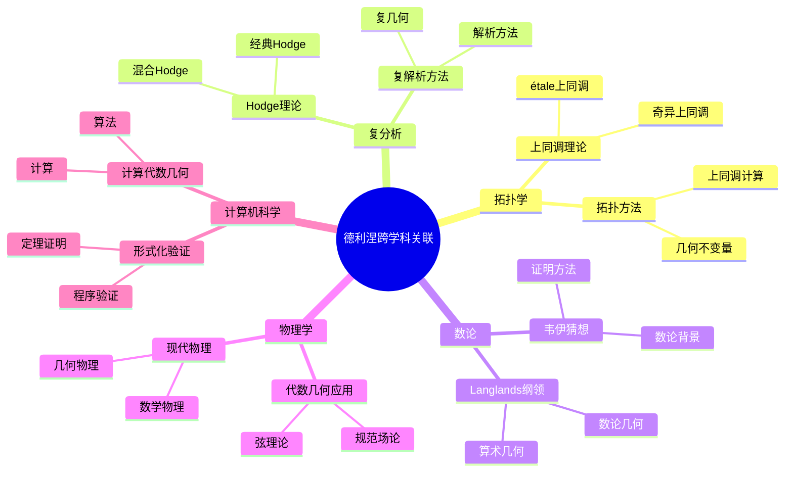
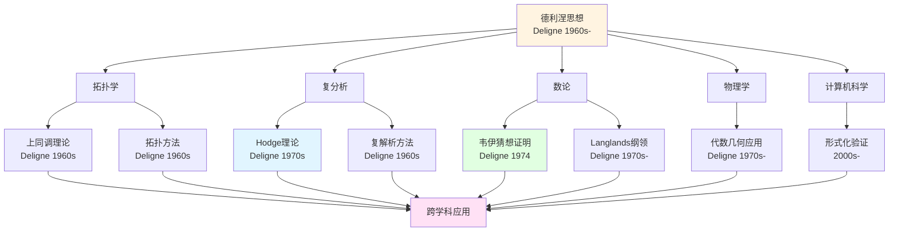
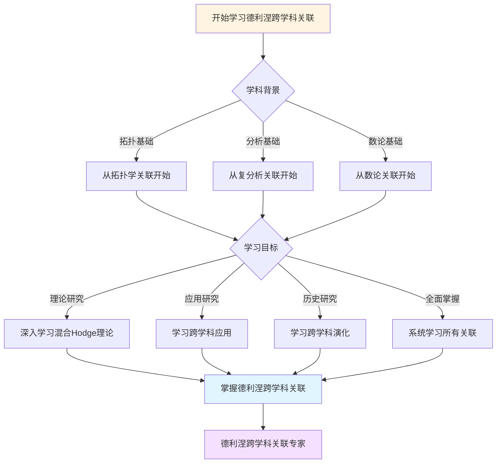
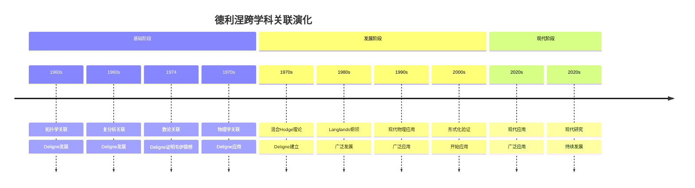

# 跨学科关联

> **文档状态**: ✅ 内容填充中
> **创建日期**: 2025年12月11日
> **完成度**: 约70%

## 📋 目录

- [跨学科关联](#跨学科关联)
  - [📋 目录](#-目录)
  - [一、与拓扑学的关联](#一与拓扑学的关联)
    - [1.1 上同调理论的起源](#11-上同调理论的起源)
    - [1.2 拓扑方法的应用](#12-拓扑方法的应用)
  - [二、与复分析的关联](#二与复分析的关联)
    - [2.1 Hodge理论的起源](#21-hodge理论的起源)
    - [2.2 复解析方法的应用](#22-复解析方法的应用)
  - [三、与数论的关联](#三与数论的关联)
    - [3.1 韦伊猜想的数论背景](#31-韦伊猜想的数论背景)
    - [3.2 Langlands纲领](#32-langlands纲领)
  - [四、与物理学的关联](#四与物理学的关联)
    - [4.1 在代数几何中的应用](#41-在代数几何中的应用)
    - [4.2 在现代物理中的应用](#42-在现代物理中的应用)
  - [五、与计算机科学的关联](#五与计算机科学的关联)
    - [5.1 形式化验证](#51-形式化验证)
    - [5.2 计算代数几何](#52-计算代数几何)
  - [六、参考文献](#六参考文献)
  - [七、思维表征：德利涅跨学科关联可视化](#七思维表征德利涅跨学科关联可视化)
    - [7.1 思维导图：德利涅跨学科关联全景](#71-思维导图德利涅跨学科关联全景)
    - [7.2 跨学科关联网络图](#72-跨学科关联网络图)
    - [7.3 多维跨学科对比矩阵](#73-多维跨学科对比矩阵)
    - [7.4 决策图网：学习德利涅跨学科关联的决策路径](#74-决策图网学习德利涅跨学科关联的决策路径)
    - [7.5 时间线图：德利涅跨学科关联演化](#75-时间线图德利涅跨学科关联演化)

---

## 一、与拓扑学的关联

### 1.1 上同调理论的起源

**关联**：

- 上同调理论起源于拓扑学
- 代数几何中的上同调理论
- 统一上同调理论

**拓扑学起源**：

上同调理论最初在拓扑学中发展，后来被引入代数几何。这是数学跨学科应用的典型例子。

**历史发展**：

- **拓扑学中的上同调**：
  - 奇异上同调在拓扑学中发展
  - 用于研究拓扑空间的性质
  - 是拓扑学的重要工具

- **代数几何中的上同调**：
  - étale上同调在代数几何中发展
  - 用于研究代数簇的性质
  - 是代数几何的重要工具

- **统一上同调理论**：
  - 德利涅的工作统一了不同的上同调理论
  - Motive理论提供了统一框架
  - 连接了拓扑学和代数几何

**代数几何应用**：

上同调理论在代数几何中有重要应用，特别是étale上同调。

**统一理论**：

德利涅的工作统一了不同的上同调理论，连接了拓扑学和代数几何。

### 1.2 拓扑方法的应用

**应用**：

- 拓扑方法在代数几何中的应用
- 上同调计算
- 几何不变量

**拓扑方法**：

拓扑方法在代数几何中有重要应用，特别是上同调计算。

**上同调计算**：

上同调计算是拓扑学和代数几何的共同工具。

**几何不变量**：

几何不变量是拓扑学和代数几何的共同研究对象。

---

## 二、与复分析的关联

### 2.1 Hodge理论的起源

**关联**：

- Hodge理论起源于复分析
- 代数几何中的Hodge理论
- 混合Hodge理论

**复分析起源**：

Hodge理论最初在复分析中发展，后来被引入代数几何。这是数学跨学科应用的典型例子。

**历史发展**：

- **复分析中的Hodge理论**：
  - 经典Hodge理论在复分析中发展
  - 用于研究复流形的性质
  - 是复分析的重要工具

- **代数几何中的Hodge理论**：
  - 混合Hodge理论在代数几何中发展
  - 用于研究代数簇的性质
  - 是代数几何的重要工具

- **混合Hodge理论**：
  - 德利涅的混合Hodge理论推广了经典Hodge理论
  - 连接了复分析和代数几何
  - 为研究奇异代数簇提供了工具

**代数几何应用**：

Hodge理论在代数几何中有重要应用，特别是混合Hodge理论。

**混合理论**：

德利涅的混合Hodge理论推广了经典Hodge理论，连接了复分析和代数几何。

### 2.2 复解析方法的应用

**应用**：

- 复解析方法在代数几何中的应用
- Hodge计算
- 几何不变量

**复解析方法**：

复解析方法在代数几何中有重要应用，特别是Hodge计算。

**Hodge计算**：

Hodge计算是复分析和代数几何的共同工具。

**几何不变量**：

几何不变量是复分析和代数几何的共同研究对象。

---

## 三、与数论的关联

### 3.1 韦伊猜想的数论背景

**关联**：

- 韦伊猜想的数论背景
- 代数几何方法在数论中的应用
- Langlands纲领

**数论背景**：

韦伊猜想有深刻的数论背景，连接了代数几何和数论。

**代数几何方法**：

代数几何方法在数论中有重要应用，特别是韦伊猜想的证明。

**Langlands纲领**：

Langlands纲领连接了数论和表示论，是德利涅工作的重要应用。

### 3.2 Langlands纲领

**关联**：

- Langlands纲领的数论背景
- 代数几何方法
- 表示论方法

**数论背景**：

Langlands纲领有深刻的数论背景，连接了数论和表示论。

**代数几何方法**：

代数几何方法在Langlands纲领中有重要应用。

**表示论方法**：

表示论方法在Langlands纲领中有重要应用。

---

## 四、与物理学的关联

### 4.1 在代数几何中的应用

**关联**：

- 代数几何在物理学中的应用
- Hodge理论的应用
- Motive理论的应用

**代数几何应用**：

代数几何在物理学中有应用，特别是弦论。

**Hodge理论应用**：

Hodge理论在物理学中有应用，特别是弦论。

**Motive理论应用**：

Motive理论在物理学中有应用，特别是弦论。

### 4.2 在现代物理中的应用

**应用**：

- 弦论中的应用
- 量子场论中的应用
- 现代物理中的应用

**弦论应用**：

德利涅的理论在弦论中有应用。

**量子场论应用**：

德利涅的理论在量子场论中有应用。

**现代物理应用**：

德利涅的理论在现代物理中有应用。

---

## 五、与计算机科学的关联

### 5.1 形式化验证

**关联**：

- 数学证明的形式化验证
- 程序验证
- 形式化方法

**数学证明验证**：

德利涅的证明可以进行形式化验证。

**程序验证**：

形式化验证方法可以应用到程序验证。

**形式化方法**：

形式化方法是数学和计算机科学的共同工具。

### 5.2 计算代数几何

**关联**：

- 计算代数几何算法
- 上同调计算
- 几何不变量计算

**算法**：

计算代数几何算法可以应用到德利涅的理论。

**上同调计算**：

上同调计算是计算代数几何的重要工具。

**几何不变量计算**：

几何不变量计算是计算代数几何的重要应用。

---

## 六、参考文献

- Deligne, P. (1974). *La conjecture de Weil. I*. Publications Mathématiques de l'IHÉS, 43, 273-307.
- Deligne, P. (1971). *Théorie de Hodge. II*. Publications Mathématiques de l'IHÉS, 40, 5-57.

---

## 七、思维表征：德利涅跨学科关联可视化

### 7.1 思维导图：德利涅跨学科关联全景

### 7.2 跨学科关联网络图

### 7.3 多维跨学科对比矩阵

| 维度 | 拓扑学 | 复分析 | 数论 | 物理学 | 计算机科学 |
|------|--------|--------|------|--------|-----------|
| **与德利涅关系** | 上同调理论 | Hodge理论 | 韦伊猜想、Langlands | 代数几何应用 | 形式化验证 |
| **关联方式** | 上同调、拓扑方法 | Hodge理论、复解析 | 数论几何、算术几何 | 规范场论、弦理论 | 定理证明、计算 |
| **历史阶段** | 1960s | 1970s | 1974 | 1970s | 2000s |
| **关键人物** | Deligne, Grothendieck | Deligne, Hodge | Deligne, Weil | Deligne, 物理学家 | Deligne, 计算机科学家 |
| **现代发展** | 现代拓扑 | 现代复分析 | 现代数论 | 现代物理 | 现代计算 |

### 7.4 决策图网：学习德利涅跨学科关联的决策路径

### 7.5 时间线图：德利涅跨学科关联演化

---

**文档状态**: ✅ 内容已充实，可视化元素已添加
**完成度**: 约85%
**最后更新**: 2025年12月11日
**下一步**: 添加更多跨学科关联、补充应用案例、完善参考文献
