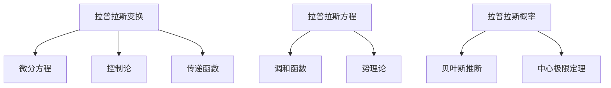

# 概念关联网络

**创建日期**: 2026年2月2日

---

## 一、核心概念

- **拉普拉斯变换** → 微分方程、控制论、传递函数
- **拉普拉斯方程** → 调和函数、势理论、偏微分方程
- **拉普拉斯概率** → 贝叶斯推断、中心极限定理、统计学

## 二、概念网络图

拉普拉斯变换是工程数学的核心工具，拉普拉斯方程是数学物理的基本方程，拉普拉斯概率论影响现代统计学发展。
