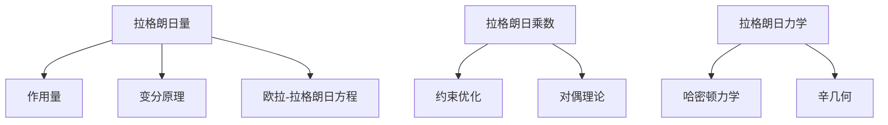

# 概念关联网络

**创建日期**: 2026年2月2日

---

## 一、核心概念

- **拉格朗日量** → 作用量、变分原理、欧拉-拉格朗日方程
- **拉格朗日乘数** → 约束优化、对偶理论
- **拉格朗日力学** → 哈密顿力学、辛几何

## 二、概念网络图

```mermaid
graph TB
    A[拉格朗日量] --> B[作用量]
    A --> C[变分原理]
    A --> D[欧拉-拉格朗日方程]
    E[拉格朗日乘数] --> F[约束优化]
    E --> G[对偶理论]
    H[拉格朗日力学] --> I[哈密顿力学]
    H --> J[辛几何]
```

拉格朗日力学连接分析学、力学、几何、现代物理。拉格朗日量是经典力学、量子场论、广义相对论的标准表述工具。
