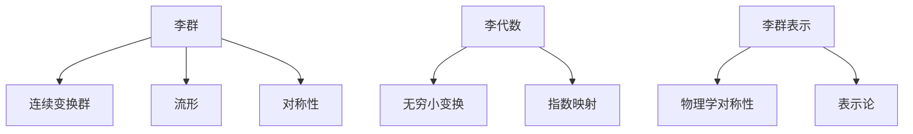

# 概念关联网络

**创建日期**: 2026年2月2日

---

## 一、核心概念

- **李群** → 连续变换群、流形、对称性
- **李代数** → 无穷小变换、切空间、指数映射
- **李群表示** → 物理学对称性、表示论

## 二、概念网络图

```mermaid
graph TB
    A[李群] --> B[连续变换群]
    A --> C[流形]
    A --> D[对称性]
    E[李代数] --> F[无穷小变换]
    E --> G[指数映射]
    H[李群表示] --> I[物理学对称性]
    H --> J[表示论]
```

李群理论连接几何学、代数学、物理学、微分方程。李群是现代微分几何、粒子物理、规范场论的核心工具。
