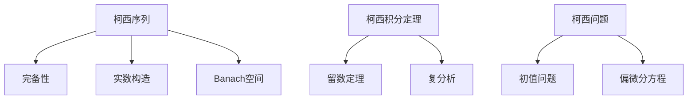

# 概念关联网络

**创建日期**: 2026年2月2日

---

## 一、核心概念

- **柯西序列** → 完备性、实数构造、 Banach空间
- **柯西积分定理** → 留数定理、复分析
- **柯西问题** → 初值问题、偏微分方程

## 二、概念网络图

柯西的分析严格化连接微积分、实分析、复分析、泛函分析。$\varepsilon$-$\delta$方法、柯西积分定理是现代分析的核心工具。
