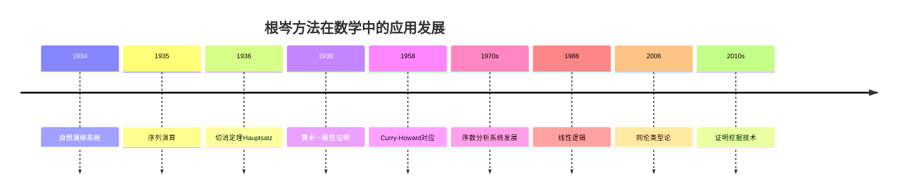
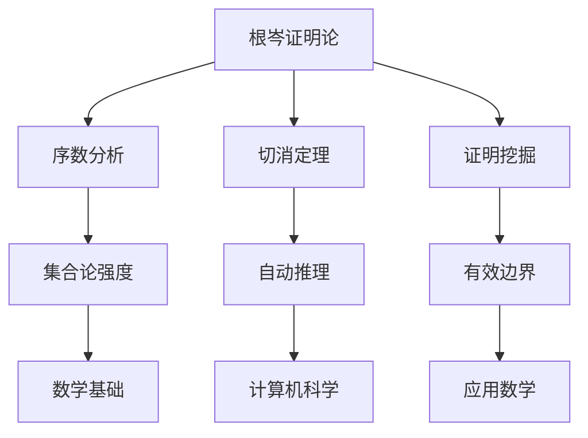

# 根岑数学理念在现代数学中的应用

**创建日期**: 2026年4月2日
**研究领域**: 根岑数学理念 - 现代应用与拓展 - 现代数学中的应用
**主题编号**: G.05.01 (Gentzen.现代应用与拓展.现代数学中的应用)
**优先级**: P1（高优先级）⭐⭐⭐⭐

---

## 📋 目录

- [根岑数学理念在现代数学中的应用](#根岑数学理念在现代数学中的应用)
  - [📋 目录](#-目录)
  - [一、应用概述](#一应用概述)
    - [1.1 根岑思想的现代影响](#11-根岑思想的现代影响)
    - [1.2 应用时间线](#12-应用时间线)
  - [二、证明论中的应用](#二证明论中的应用)
    - [2.1 序数分析](#21-序数分析)
    - [2.2 逆向数学](#22-逆向数学)
    - [2.3 证明挖掘](#23-证明挖掘)
  - [三、代数几何中的应用](#三代数几何中的应用)
    - [3.1 消除理论](#31-消除理论)
    - [3.2 解析几何](#32-解析几何)
    - [3.3 动机理论](#33-动机理论)
  - [四、数论中的应用](#四数论中的应用)
    - [4.1 超越数理论](#41-超越数理论)
    - [4.2 丢番图方程](#42-丢番图方程)
    - [4.3 算术几何](#43-算术几何)
  - [五、同伦类型论中的应用](#五同伦类型论中的应用)
    - [5.1 证明归约作为路径计算](#51-证明归约作为路径计算)
    - [5.2 立方类型论中的归约](#52-立方类型论中的归约)
    - [5.3 高维范畴语义](#53-高维范畴语义)
  - [六、未来展望](#六未来展望)
    - [6.1 新兴领域](#61-新兴领域)
    - [6.2 跨学科应用](#62-跨学科应用)
    - [6.3 根岑遗产的延续](#63-根岑遗产的延续)

---

## 一、应用概述

### 1.1 根岑思想的现代影响

根岑创立的序列演算和切消定理不仅是证明论的基础工具，也在现代数学的多个分支中发挥着重要作用：

**主要应用领域**：

- 证明论：序数分析、逆向数学
- 代数几何：消除理论、解析引理
- 数论：超越数理论、丢番图方程
- 同伦类型论：证明归约、计算解释

### 1.2 应用时间线



---

## 二、证明论中的应用

### 2.1 序数分析

**核心问题**：确定数学理论的证明论序数。

**根岑的贡献**：

- 使用序数ε₀证明PA的一致性
- 开创了序数分析技术

**现代发展**：

| 理论 | 证明论序数 | 研究者 |
|-----|-----------|-------|
| PA | ε₀ | 根岑 |
| ATR₀ | Γ₀ | Friedman |
| Π¹₁-CA₀ | ψ(Ω_ω) | Rathjen |
| Π¹₂-CA | 巨大序数 | Rathjen |

### 2.2 逆向数学

**目标**：确定证明特定定理所需的最弱公理。

**根岑方法的应用**：

```
五公理系统 (RCA₀, WKL₀, ACA₀, ATR₀, Π¹₁-CA₀)

技术工具:
- 切消定理
- 序数分析
- 强制方法（根岑风格的扩展）
```

**应用案例**：

- 组合定理的逆向分析（Ramsey理论）
- 分析定理的公理依赖
- 代数定理的构造性内容

### 2.3 证明挖掘

**乌尔里希·科伦巴赫的程序**：

从纯存在性证明中提取有效边界：

```
输入: 经典证明 ∃x A(x)
      ↓ 证明解释（根岑风格）
输出: 有效程序 t, A(t)
```

**应用**：

- 逼近理论中的有效边界
- 非线性分析的定量结果
- 遍历理论的有效收敛率

---

## 三、代数几何中的应用

### 3.1 消除理论

**问题**：从多项式方程组中消除变量。

**与切消的联系**：

```
证明论切消      代数几何消除
─────────      ───────────
消除切规则      消除变量
子公式性质      子变元性质
证明简化        表达式简化
```

**应用案例**：

- 复代数几何中的解析引理
- 实代数几何的量化消除
- 计算代数几何的算法设计

### 3.2 解析几何

**解析引理**：
> 如果一个解析函数在某点的所有导数都为零，则该函数在该点的邻域内恒为零。

**证明论方法**：

- 使用根岑的切消技术分析证明结构
- 提取构造性内容
- 应用于D-模理论

### 3.3 动机理论

**Grothendieck的动机理论**：

- 将代数簇分解为动机
- 标准猜想的证明论分析

**根岑方法的可能应用**：

- 动机范畴的构造性处理
- 标准猜想的序数分析

---

## 四、数论中的应用

### 4.1 超越数理论

**问题**：证明特定数是超越数。

**根岑方法的应用**：

```
林德曼-魏尔斯特拉斯定理的证明分析:

经典证明（使用反证法）
    ↓ 证明解释
构造性内容: 对代数数的逼近测度
```

**科伦巴赫的工作**：

- 从超越性证明中提取有效逼近
- 应用于e和π的研究

### 4.2 丢番图方程

**希尔伯特第十问题**：

- 不可解性的证明（Matiyasevich）
- 根岑风格的证明分析

**应用**：

- 特定类型方程的可判定性
- 指数丢番图方程

### 4.3 算术几何

**p进Hodge理论**：

- 比较定理的证明论分析
- 构造性p进分析

**根岑方法的潜在应用**：

- Fontaine理论的构造性版本
- 完美胚空间的证明论

---

## 五、同伦类型论中的应用

### 5.1 证明归约作为路径计算

**核心对应**：

```
证明论              同伦类型论
─────────────────────────────
切消归约           路径计算
证明等式           路径空间
正规证明           典范形式
```

### 5.2 立方类型论中的归约

**立方类型论**（Cubical Type Theory）：

- 提供计算意义的路径类型
- 证明归约有明确的计算规则

**与根岑的联系**：

- 证明归约的系统化处理
- 局部展开（focalization）
- 切消的立方版本

### 5.3 高维范畴语义

**高维范畴与证明论**：

- 证明作为高维胞腔
- 切消作为高维复合
- 根岑系统的范畴语义

**应用案例**：

- 同调代数的证明论
- 代数拓扑的形式化
- 高维自动机的理论

---

## 六、未来展望

### 6.1 新兴领域

**微分证明论**：

- 将微分结构引入证明论
- 连续证明变换
- 机器学习的证明论基础

**量子证明论**：

- 量子逻辑的序列演算
- 量子纠缠与证明结构
- 量子计算的证明论解释

**概率证明论**：

- 随机化证明系统
- 概率切消
- 近似证明的分析

### 6.2 跨学科应用



### 6.3 根岑遗产的延续

**在21世纪的重要性**：

- 构造性数学的复兴
- 形式化数学的实现
- 证明与计算的统一

**未解决问题**：

- 分析的一致性（子系统）
- 大基数与证明论序数
- 证明复杂性的分类

---

**相关文档**：

- [02-物理学中的应用](./02-物理学中的应用.md)
- [03-计算机科学中的应用](./03-计算机科学中的应用.md)
- [../08-知识关联分析/01-概念关联网络.md](../08-知识关联分析/01-概念关联网络.md)

*最后更新：2026年4月2日*
