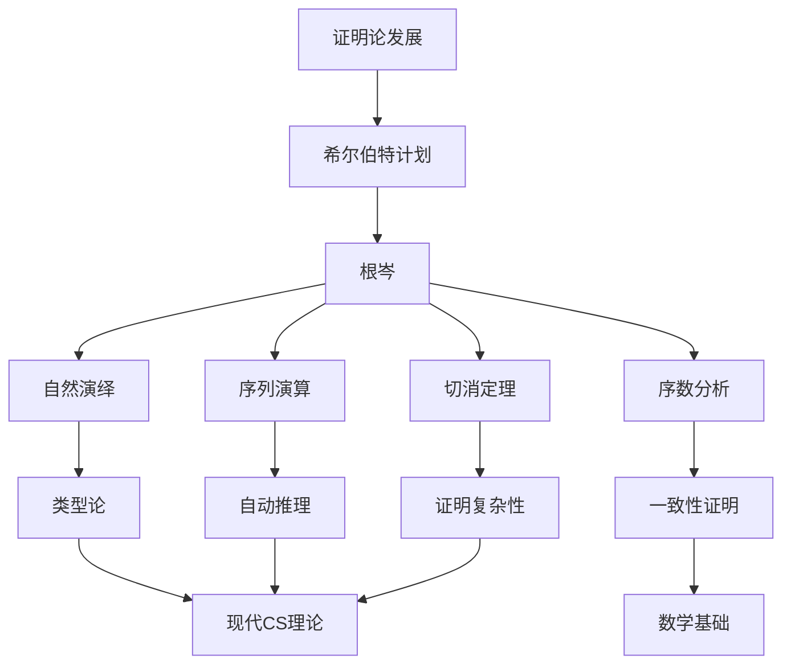

# 现代数学家对根岑的观点

**创建日期**: 2026年4月2日
**研究领域**: 根岑数学理念 - 现代视角与评价 - 现代数学家观点
**主题编号**: G.07.01 (Gentzen.现代视角与评价.现代数学家观点)
**优先级**: P1（高优先级）⭐⭐⭐⭐

---

## 📋 目录

- [现代数学家对根岑的观点](#现代数学家对根岑的观点)
  - [一、评价概述](#一评价概述)
  - [二、证明论学家的评价](#二证明论学家的评价)
  - [三、计算机科学家的评价](#三计算机科学家的评价)
  - [四、类型理论家的评价](#四类型理论家的评价)
  - [五、数学基础学者的评价](#五数学基础学者的评价)
  - [六、综合评价](#六综合评价)

---

## 一、评价概述

### 1.1 历史地位

格哈德·根岑（Gerhard Gentzen，1909-1945）是20世纪最重要的证明论学家，尽管他的生命因二战而 tragically 短暂，但他的工作对数理逻辑产生了深远影响。

**核心贡献的地位**：

- **自然演绎**：直观、对称的证明系统
- **序列演算**：分析性证明的理论框架
- **切消定理**：证明论的核心工具
- **序数分析**：一致性的证明方法

### 1.2 评价的演变

| 时期 | 评价重点 |
|-----|---------|
| 1930s-40s | 希尔伯特计划的新工具 |
| 1950s-60s | 证明论的标准方法 |
| 1970s-80s | 自动定理证明的基础 |
| 1990s-2000s | 类型论与证明的关系 |
| 2010s-至今 | 同伦类型论的先驱 |

---

## 二、证明论学家的评价

### 2.1 序数分析学者的评价

**竹内外史**（Gaisi Takeuti，日本证明论学派领袖）：
> "根岑的序数分析方法是证明论的核心技术。他使用序数ε₀证明算术一致性的方法，开启了证明论 Ordinal Analysis 的研究方向。"

**沃尔弗拉姆·波勒斯**（Wolfram Pohlers）：
> "根岑关于算术一致性的证明是证明论的里程碑。他将希尔伯特的思想转化为严格的技术，证明了证明论的可行性。"

**迈克尔·拉思延**（Michael Rathjen）：
> "根岑开创的序数分析技术已经发展到可以分析强理论（如Π¹₂-CA）的程度。这是根岑愿景的现代实现。"

### 2.2 构造性数学学者的评价

**佩尔·马丁-洛夫**（Per Martin-Löf）：
> "根岑的自然演绎系统是构造性类型论的直接前身。引入和消去规则的对称性直接对应于Curry-Howard对应。"

**安妮·斯乔林·布里塞**（Anne Sjerp Troelstra）：
> "根岑对直觉主义逻辑的研究揭示了经典逻辑和构造性逻辑之间的深层联系。他的Glivenko定理和负翻译是构造性数学的基础工具。"

### 2.3 证明复杂性学者的评价

**萨缪尔·布瑟**（Samuel Buss）：
> "切消定理是证明复杂性理论的基础。根岑不仅证明了切可消去，还提供了算法。这对理解证明的大小和结构至关重要。"

**杰·斯莱曼**（Pavel Pudlák）：
> "根岑的序列演算提供了分析证明复杂性的理想框架。Frege系统和序列演算之间的关系是现代研究的核心主题。"

---

## 三、计算机科学家的评价

### 3.1 逻辑编程研究者的评价

**罗伯特·科瓦尔斯基**（Robert Kowalski，逻辑编程先驱）：
> "根岑的序列演算是逻辑编程的理论基础。Prolog的执行机制本质上就是序列演算的证明搜索过程。"

**约翰·艾伦·罗宾逊**（John Alan Robinson，归结原理发明者）：
> "归结原理可以看作是对序列演算的简化。根岑的切规则对应于归结中的合一操作。"

### 3.2 自动定理证明学者的评价

**吴文俊**（自动推理先驱）：
> "几何定理自动证明的方法需要高效的处理逻辑公式。根岑的序列演算和切消定理为此提供了理论基础。"

**罗伯特·博伊尔**（Robert Boyer，Boyer-Moore定理证明器）：
> "我们的定理证明器中的重写技术可以追溯到根岑的证明归约思想。证明的规范化和简化是自动定理证明的核心。"

### 3.3 编程语言理论家的评价

**约翰·C·米切尔**（John C. Mitchell，类型理论家）：
> "根岑的自然演绎系统是类型系统的自然语法。引入规则对应于构造器，消去规则对应于选择器。"

**本杰明·皮尔斯**（Benjamin Pierce，《类型和编程语言》作者）：
> "现代类型系统的教材都将根岑的自然演绎作为起点。类型规则的呈现方式直接继承自根岑的格式。"

---

## 四、类型理论家的评价

### 4.1 Curry-Howard对应视角

**威廉·霍华德**（William Howard，Curry-Howard对应发现者）：
> "根岑的自然演绎系统揭示了证明和程序之间的深刻联系。这种对应不是偶然的，而是根岑系统设计的自然结果。"

**蒂埃里·科康德**（Thierry Coquand）：
> "构造演算（Calculus of Constructions）可以看作是对根岑系统的计算机科学重构。证明作为程序的思想源于根岑的证明结构分析。"

### 4.2 同伦类型论视角

**史蒂夫·阿沃德**（Steve Awodey）：
> "同伦类型论将根岑的证明等式提升到了新的高度。证明之间的等价（同伦）可以看作是根岑证明归约的现代扩展。"

**弗拉基米尔·沃耶沃茨基**（Vladimir Voevodsky）：
> "根岑的切消过程对应于类型论中的计算规则。同伦类型论中的路径计算可以看作是高维的切消。"

---

## 五、数学基础学者的评价

### 5.1 希尔伯特计划研究者的评价

**格奥尔格·克赖泽尔**（Georg Kreisel）：
> "根岑证明了希尔伯特计划的部分可行性。虽然他未能证明分析的一致性，但他的方法开创了证明论的新纪元。"

**所罗门·费弗曼**（Solomon Feferman）：
> "根岑的序数分析方法是理解数学理论强度的精确工具。这种方法已经成为证明论的标准技术。"

### 5.2 逆向数学学者的评价

**斯蒂芬·辛普森**（Stephen Simpson，《Subsystems of Second Order Arithmetic》作者）：
> "根岑的方法在逆向数学中有重要应用。通过证明论技术分析子系统的证明论序数，我们可以精确测量其强度。"

**哈维·弗里德曼**（Harvey Friedman，逆向数学创始人）：
> "根岑的切消定理是逆向数学中许多结果的基础。理解什么定理需要什么样的证明技术，这是逆向数学的核心。"

---

## 六、综合评价

### 6.1 评价的维度

| 维度 | 评价 |
|-----|-----|
| 技术贡献 | 创立自然演绎、序列演算、切消定理 |
| 方法论 | 证明的结构分析、序数分析 |
| 影响范围 | 证明论、CS、类型论、数学基础 |
| 持续性 | 至今仍是核心理论 |

### 6.2 历史定位

### 6.3 当代意义

**在21世纪的重要性**：

1. **证明助手开发**：Coq、Agda、Lean基于根岑的方法
2. **程序验证**：形式化方法中的证明技术
3. **量子证明论**：量子计算中的逻辑结构
4. **同伦类型论**：证明等式与路径的对应
5. **深度证明论**：深度学习与证明生成的结合

### 6.4 根岑的遗产

**持久的学术遗产**：

> "根岑的工作展示了证明不仅是验证真理的工具，其本身也具有丰富的结构和深刻的数学性质。在计算机科学和数学基础研究中，根岑的思想继续发挥着核心作用。"
> —— 当代证明论学界的共识

**对年轻研究者的启示**：

- 追求技术的优雅和深刻
- 跨学科思维的重要性
- 形式化方法的威力

---

**相关文档**：

- [02-最新研究进展](./02-最新研究进展.md)
- [03-未解决问题](./03-未解决问题.md)
- [../08-知识关联分析/01-概念关联网络.md](../08-知识关联分析/01-概念关联网络.md)

*最后更新：2026年4月2日*
