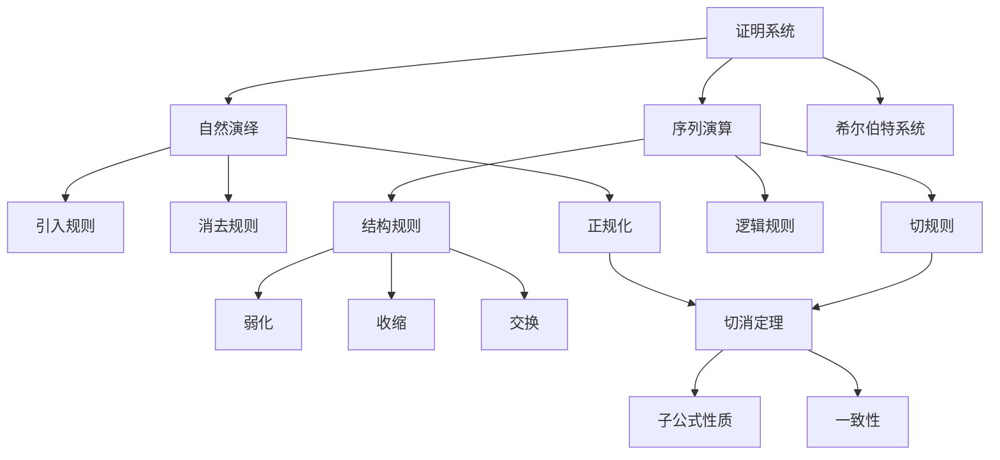
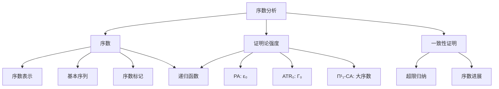
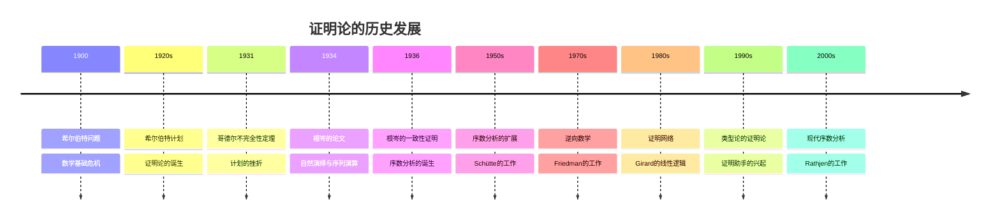

# 概念关联网络

**创建日期**: 2026年4月3日
**研究领域**: 根岑数学理念 - 知识关联分析 - 概念关联网络
**主题编号**: G.08.01 (Gentzen.知识关联.概念关联网络)
**优先级**: P1（高优先级）⭐⭐⭐⭐

---

## 📋 目录

- [概念关联网络](#概念关联网络)
  - [一、核心概念体系](#一核心概念体系)
  - [二、根岑理论的关联图谱](#二根岑理论的关联图谱)
  - [三、跨学科概念映射](#三跨学科概念映射)
  - [四、历史发展脉络](#四历史发展脉络)
  - [五、现代应用关联](#五现代应用关联)
  - [🔖 原始文献引用](#原始文献引用)
  - [📚 现代研究文献](#现代研究文献)

---

## 一、核心概念体系

### 1.1 根岑概念体系总览

根岑的工作围绕证明的形式化分析展开，建立了独特的概念网络。

```
┌─────────────────────────────────────────────────────────────┐
│                     根岑概念体系                            │
├─────────────────────────────────────────────────────────────┤
│  第一层：证明系统                                            │
│  ├── 自然演绎（NJ/NK）                                       │
│  ├── 序列演算（LJ/LK）                                       │
│  └── 切消定理（Hauptsatz）                                   │
├─────────────────────────────────────────────────────────────┤
│  第二层：证明性质                                            │
│  ├── 正规化                                                  │
│  ├── 子公式性质                                              │
│  └── 一致性                                                  │
├─────────────────────────────────────────────────────────────┤
│  第三层：序数分析                                            │
│  ├── 证明论序数                                              │
│  ├── 超限归纳                                                │
│  └── 一致性证明                                              │
└─────────────────────────────────────────────────────────────┘
```

### 1.2 核心定理关系

**切消定理与正规化的关系**：
$$\text{切消定理（序列演算）} \leftrightarrow \text{正规化定理（自然演绎）}$$

**序数分析的基本等式**：
$$\text{理论 } T \text{ 的一致性} \leftrightarrow \text{直到 } |T| \text{ 的序数归纳}$$

---

## 二、根岑理论的关联图谱

### 2.1 证明系统概念图谱



### 2.2 序数分析概念图谱



---

## 三、跨学科概念映射

### 3.1 证明-程序-范畴映射

**Curry-Howard-Lambek对应**：

| 证明论 | 类型论 | 范畴论 |
|-------|-------|-------|
| 证明 | 项 | 态射 |
| 合取引入 | 元组 | 积 |
| 蕴含引入 | λ抽象 | 指数 |
| 切消 | β归约 | 组合 |

### 3.2 逻辑-计算映射

**自然演绎与λ演算**：

| 自然演绎 | λ演算 | 编程 |
|---------|-------|-----|
| 假设 | 变量 | 标识符 |
| →引入 | λ抽象 | 函数定义 |
| →消去 | 应用 | 函数调用 |
| 正规化 | β归约 | 求值 |

---

## 四、历史发展脉络

### 4.1 证明论的历史源流



### 4.2 概念演化的分支图

```
根岑工作（1930s）
├── 证明系统分支
│   ├── 自然演绎
│   │   ├── Prawitz的正规化理论
│   │   └── 构造性数学
│   ├── 序列演算
│   │   ├── 切消理论
│   │   ├── 聚焦证明
│   │   └── 线性逻辑
│   └── 模态逻辑证明论
│
├── 序数分析分支
│   ├── 算术理论
│   │   └── ε₀分析
│   ├── 分析理论
│   │   └── Γ₀分析
│   └── 集合论
│       └── 大基数分析
│
└── 应用分支
    ├── 自动定理证明
    ├── 逻辑编程
    └── 程序验证
```

---

## 五、现代应用关联

### 5.1 证明助手中的根岑方法

**Coq证明助手的证明策略**：

```coq
(* 自然演绎风格的证明 *)
Theorem example : A -> B -> A /\ B.
Proof.
  intros H1 H2.      (* →引入 *)
  split.             (* /\引入 *)
  - exact H1.        (* 假设 *)
  - exact H2.        (* 假设 *)
Qed.
```

**Curry-Howard对应**：

$$\text{证明} \leftrightarrow \text{程序}$$
$$\text{命题} \leftrightarrow \text{类型}$$

### 5.2 逻辑编程中的根岑传统

**Prolog的归结原理**：
归结可以看作是受限的切规则应用。

**切规则**：
$$\frac{\Gamma \vdash \Delta, A \quad A, \Sigma \vdash \Pi}{\Gamma, \Sigma \vdash \Delta, \Pi}$$

**归结规则**：
$$\frac{C_1 \vee L \quad C_2 \vee \neg L}{C_1 \vee C_2}$$

---

## 🔖 原始文献引用

1. **Gentzen, G.** (1934-1935). "Untersuchungen über das logische Schließen". *Mathematische Zeitschrift*, 39, 176-210, 405-431.
   - 根岑最著名的论文

2. **Gentzen, G.** (1936). "Die Widerspruchsfreiheit der reinen Zahlentheorie". *Mathematische Annalen*, 112, 493-565.
   - 算术一致性证明

3. **Gentzen, G.** (1938). "Neue Fassung des Widerspruchsfreiheitsbeweises". *Forschungen zur Logik*, 4, 19-44.
   - 一致性证明的新版本

4. **Prawitz, D.** (1965). *Natural Deduction: A Proof-Theoretical Study*. Almqvist & Wiksell.
   - 自然演绎证明论的标准参考书

5. **Schütte, K.** (1977). *Proof Theory*. Springer.
   - 证明论的经典教材

---

## 📚 现代研究文献

1. **Troelstra, A. S., & Schwichtenberg, H.** (2000). *Basic Proof Theory* (2nd ed.). Cambridge University Press.
   - 证明论基础教材

2. **Rathjen, M.** (2006). "The art of ordinal analysis". *Proceedings of the ICM*, 2, 45-69.
   - 序数分析的现代综述

3. **Girard, J. Y.** (1987). "Linear logic". *Theoretical Computer Science*, 50, 1-101.
   - 线性逻辑的奠基性论文

4. **Buss, S. R.** (1998). *Handbook of Proof Theory*. North-Holland.
   - 证明论手册

5. **von Plato, J.** (2020). *Give Me a Kappa: The Story of Proof Theory*. Oxford University Press.
   - 证明论历史的最新著作

---

**文档结束**

*本文件是根岑数学理念体系的第08模块第01部分，属于知识关联分析主题。*
