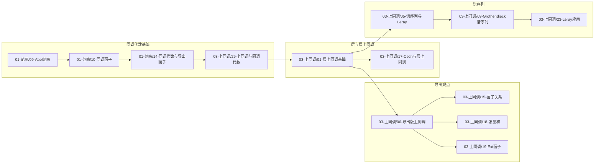

# 02-数学内容深度分析：推荐阅读顺序

**文档类型**：学习路径 · 推荐顺序图
**创建日期**：2026年2月10日
**关联**：[00-数学内容深度分析-层次化推进计划与任务](./00-数学内容深度分析-层次化推进计划与任务.md)、[project/00-国际课程与机构对齐对照表](../../../project/00-国际课程与机构对齐对照表-2026年2月.md)。各子目录概念总览：[01-范畴论与函子理论-概念总览](./01-范畴论与函子理论/00-范畴论与函子理论-概念总览.md)、[02-概形理论-概念总览](./02-概形理论/00-概形理论-概念总览.md)、[03-上同调理论-概念总览](./03-上同调理论/00-上同调理论-概念总览.md)。

---

## 一、总览说明

本顺序与 MIT 18.726、Oxford C2.2、Stacks Project 等课程/权威资料的典型顺序可对照使用。先修依赖已标出，便于按“先修 → 核心 → 下游”分阶段学习。

---

## 二、推荐阅读顺序图（上同调与导出核心链）

---

## 三、分主题推荐顺序

### 3.1 上同调理论（03-上同调理论）

| 阶段 | 篇目顺序 | 说明 |
|------|----------|------|
| 基础 | 01-层上同调基础 → 17-Cech上同调与层上同调 | 层、截面、内射消解、H^i |
| 同调代数 | 29-上同调与同调代数（与 01-范畴论 09/10/14 配合） | 导出函子、消解 |
| 导出 | 06-导出版上同调 → 15-上同调与函子关系、18-张量积、19-Ext函子 | D(A)、RΓ、Rf_*、RHom |
| 谱序列 | 05-谱序列与Leray谱序列 → 09-Grothendieck谱序列 → 23-Leray谱序列应用 | 复合函子、Leray |
| 几何应用 | 25-凝聚层上同调、22-上同调与Grothendieck对偶 | 需 02-概形理论 部分先修 |

### 3.2 范畴论与函子理论（01-范畴论与函子理论）

建议顺序：01-范畴基础 → 02-函子与自然变换 → 03-极限与余极限 → 04-伴随与等价 → 09-Abel范畴 → 10-同调函子与导出函子 → 14-同调代数与导出函子 → 07-三角范畴与导出范畴。再进入 03-上同调理论 的导出部分。

### 3.3 概形理论（02-概形理论）

建议顺序：01-仿射概形基础 → 02-概形定义与构造 → 05-拟凝聚层与凝聚层 → 31-层理论与层范畴（与上同调衔接）。其余篇目按索引按需阅读。

### 3.4 跨子目录依赖

- 读 **03-上同调理论** 前建议：**01-范畴论**（Abel 范畴、导出函子、三角范畴）、**02-概形理论**（层、概形基础）部分篇目。
- 读 **04-Topos理论** 的 étale 相关前建议：03-上同调（01-层上同调、02-étale上同调）。
- 读 **06-其他数学贡献**（如 11-导出范畴与同调代数、09-六函子理论）前建议：03-上同调（06-导出版、15-函子关系）与 01-范畴论（07-三角范畴）。

### 3.5 核心篇目最小先修集合

以下为「学本篇前必须掌握」的**最小**篇目集（时间有限时可仅读此集再进入本篇）。完整先修见各 00-XX-概念总览。

| 目标篇目 | 最小先修集合 |
|----------|--------------|
| 03-上同调/01-层上同调基础 | 01-范畴/09-Abel范畴、10-同调函子（或 14-同调代数与导出函子）；02-概形/05-拟凝聚层与凝聚层 或 层概念 |
| 03-上同调/06-导出版上同调 | 01-层上同调基础、29-上同调与同调代数；01-范畴/07-三角范畴与导出范畴 |
| 03-上同调/05-谱序列与Leray谱序列 | 01-层上同调基础、29-上同调与同调代数 |
| 03-上同调/25-凝聚层上同调 | 01-层上同调基础；02-概形/01-仿射概形、02-概形定义、05-拟凝聚与凝聚层 |
| 03-上同调/02-étale上同调 | 01-层上同调基础；02-概形（概形、层） |
| 02-概形/01-仿射概形基础 | 交换代数基础（环、理想、局部化）；01-范畴/01-范畴基础 更佳 |
| 02-概形/05-拟凝聚层与凝聚层 | 02-概形/01-仿射概形、02-概形定义与构造 |

---

## 四、与课程对照

| 课程 | 本顺序对应 |
|------|------------|
| MIT 18.726 | 02-概形 + 03-上同调（01→05→06→25 等） |
| Oxford C2.2 | 01-范畴（同调代数部分）→ 03-上同调（29、06） |
| 东京/ESSEN étale | 03-上同调（01→02-étale→07-平展基本群） |

详见 [project/00-国际课程与机构对齐对照表](../../../project/00-国际课程与机构对齐对照表-2026年2月.md)。

---

## 五、交错路径建议

除按「整块」顺序（先完成 01-范畴论 再进入 03-上同调）外，可采用**交错路径**以加强概念联系与提取练习效果：

| 交错阶段 | 建议交替篇目 | 说明 |
|----------|--------------|------|
| 同调代数与层 | 01-范畴（09-加法范畴与Abel范畴、10-同调函子、14-同调代数与导出函子）↔ 03-上同调（29a-上同调与同调代数） | 先 01-09/10，再 03-29a，再 01-14，形成「范畴—上同调—导出函子」交替 |
| 层与导出 | 03-上同调（01-层上同调基础）↔ 03-上同调（06-导出版上同调）↔ 01-范畴（07-三角范畴与导出范畴） | 层上同调定义后即可接触导出版表述，再回看三角范畴 |
| 概形与上同调 | 02-概形（01–02、05、31）↔ 03-上同调（01、25-凝聚层上同调） | 概形基础与凝聚层上同调交替，便于几何直观 |

各子目录 00-XX-概念总览 中，支持交错的篇目可在先修栏注明「可交错」；与 [00-数学内容深度分析-层次化推进计划与任务](./00-数学内容深度分析-层次化推进计划与任务.md) 配合使用。

---

## 六、自测要点说明

为支持**间隔重复与提取练习**，建议在关键篇目末尾或思维表征中增加「自测要点」或「回忆问题」列表。本处给出总体说明与示例，具体条目由各篇主文或思维表征维护。

**自测要点示例（可置于篇末或思维表征）**：

- **01-层上同调基础**：能写出 H^i(X,F) 的定义（内射消解、R^i Γ）；能说明为何与消解选取无关。
- **06-导出版上同调**：D(A) 如何由 K(A) 得到；RΓ、Rf_*、Lf^* 的含义与关系。
- **09-加法范畴与Abel范畴**：Abel 范畴公理；正合列、Ker/Coker 在 Abel 范畴中的表述。

**使用建议**：读完全篇后遮住正文，仅看自测要点尝试回忆；若与 [project/00-认知诊断系统框架设计文档](../../../project/00-认知诊断系统框架设计文档-2025年11月30日.md) 联动，可将自测要点对应到知识层次 L0–L3，供后续诊断题开发锚点。

**说明（与认知科学一致）**：自测要点作为**「回忆与间隔复习的锚点」**使用；实证表明数学学习中**间隔重复**效果稳健，**测试效应**（仅靠测验提升）在数学上证据较弱。因此建议以**间隔重复为主**（如 1 天 / 1 周 / 1 月 回顾），自测要点用于引导回忆，而非承诺「仅靠测验即可显著提升」。详见 [project/00-认知诊断与内容对接说明-2026年2月](../../../project/00-认知诊断与内容对接说明-2026年2月.md)。

### 6.1 建议复习间隔（与自测要点绑定）

各篇思维表征中「七、自测要点与复习要点」下均有**建议复习间隔**表，格式示例如下。具体以各篇为准。

| 建议复习间隔 | 适用 |
|--------------|------|
| 1 天 | 术语与定义、核心符号 |
| 1 周 | 与先修篇联合回忆、定理陈述 |
| 1 月 | 与下游篇衔接、决策树（何时用本篇） |

### 6.2 学完本篇后自问（元认知问题示例）

读完全篇并做完自测要点后，可问自己 2–3 个元认知问题以巩固与监控理解：

- **01-层上同调基础**：① 能否不看书写出 H^i(X,F) 的定义？② 仿射上拟凝聚 H^{>0}=0 在本理论中扮演什么角色？
- **06-导出版上同调**：① D(A) 与 K(A) 的差别是什么？② 经典 H^i 与 RΓ 的 cohomology 对象如何对应？
- **通用**：① 本篇的核心「一句话」是什么？② 若向他人解释本篇，会先提哪三个概念？

---

## 七、按主题归纳小结

便于复习与自我检测是否覆盖主干；与各 00-XX-概念总览的「快速定位」一致。

- **层上同调核心**：H^i(X,F)、R^i Γ(X,-)、内射消解、Čech 与层上同调一致（好覆盖）、消失定理（仿射上拟凝聚 H^{>0}=0）、Leray 谱序列 E_2^{p,q}=H^p(Y,R^q f_* F)⇒H^{p+q}(X,F)。
- **导出观点核心**：D(A)、RΓ、Rf_*、Lf^*、⊗^L、RHom；经典 H^i 为 RΓ 的 cohomology 对象；Grothendieck 谱序列来自复合函子。
- **同调代数衔接**：Abel 范畴、导出函子、消解、Tor/Ext；29-上同调与同调代数 为 01-层上同调 与 06-导出版 的桥梁。
- **概形与几何应用**：仿射概形、概形、拟凝聚/凝聚层、固有/分离态射；25-凝聚层上同调、21-Serre对偶、22-Grothendieck对偶。
- **étale 与拓扑**：平展拓扑、H^i_ét、比较定理、ℓ-adic、韦伊猜想（07-平展基本群 为下游）。

---

**文档状态**：v1.3（含建议复习间隔、元认知自问示例、自测要点与间隔重复说明）
**最后更新**：2026年2月10日
