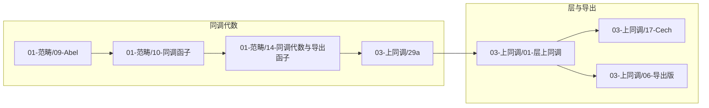

# 02-数学内容深度分析：篇目先修/下游汇总

**文档类型**：篇目—篇目 先修/下游 汇总 · 查询入口  
**创建日期**：2026年2月10日  
**关联**：[00-推荐阅读顺序](./00-推荐阅读顺序.md)、各子目录 [00-XX-概念总览](./01-范畴论与函子理论/00-范畴论与函子理论-概念总览.md) 与各篇思维表征内「先修篇目与下游篇目」表。

---

## 一、如何查询「学 X 前需读哪些」「学 X 后可读哪些」

- **学 X 前需读哪些**：打开 X 所在子目录的 **00-XX-概念总览**，在「篇目 × 核心概念 × 先修」表中找到 X 所在行，查看「先修篇目」列；或打开 **X-思维表征**，在「先修篇目与下游篇目」表中查看先修。
- **学 X 后可读哪些**：在同一 **概念总览** 中，查找「先修篇目」列包含 X 的篇目；或打开 **X-思维表征** 中的「下游篇目」表。
- **跨子目录**：先修可能来自另一子目录（如 03-上同调 的篇目常以 01-范畴、02-概形 为先修），见 [00-推荐阅读顺序](./00-推荐阅读顺序.md) 的「跨子目录依赖」与分主题顺序。

---

## 二、核心链先修/下游汇总表（篇目—篇目）

以下为部分核心篇目的先修→本篇→下游关系；完整关系见各 00-XX-概念总览。

### 2.1 同调代数与层上同调链（01-范畴 + 03-上同调）

| 篇目（子目录/编号） | 先修篇目（本项目内） | 下游篇目（典型） |
|--------------------|----------------------|------------------|
| 01-范畴/09-加法范畴与Abel范畴 | 01-范畴基础、交换代数 | 10-同调函子、14-同调代数与导出函子、03-上同调/29a |
| 01-范畴/10-同调函子与导出函子 | 09-Abel范畴 | 14-同调代数与导出函子、03-上同调/29a、06-导出版 |
| 01-范畴/14-同调代数与导出函子 | 09、10 | 03-上同调/29a、01-范畴/07-三角范畴 |
| 03-上同调/29a-上同调与同调代数 | 01-范畴/09、10、14 | 03-上同调/01-层上同调基础、06-导出版 |
| 03-上同调/01-层上同调基础 | 01-范畴（Abel、导出函子）；02-概形（层） | 17-Cech、06-导出版、05-谱序列、25-凝聚层 |
| 03-上同调/06-导出版上同调 | 01-层上同调、29a；01-范畴/07-三角范畴 | 15-函子关系、18-张量积、19-Ext、22-Grothendieck对偶 |

### 2.2 概形与上同调衔接链（02-概形 + 03-上同调）

| 篇目（子目录/编号） | 先修篇目（本项目内） | 下游篇目（典型） |
|--------------------|----------------------|------------------|
| 02-概形/01-仿射概形基础 | 交换代数；01-范畴基础 | 02-概形定义、05-拟凝聚与凝聚层 |
| 02-概形/02-概形定义与构造 | 01-仿射概形；01-范畴/08-预层与层化 | 03-纤维积、05-拟凝聚、31-层理论与层范畴 |
| 02-概形/05-拟凝聚层与凝聚层 | 01、02；03-上同调/01-层 | 31-层范畴、03-上同调/25-凝聚层上同调 |
| 02-概形/31-层理论与层范畴 | 02、05；03-上同调/01 | 03-上同调/25、01-层上同调应用 |

### 2.3 谱序列链（03-上同调）

| 篇目 | 先修篇目 | 下游篇目（典型） |
|------|----------|------------------|
| 05-谱序列与Leray谱序列 | 01-层上同调、29a | 09-Grothendieck谱序列、23-Leray应用 |
| 09-Grothendieck谱序列 | 05、06-导出版、29a | 23-Leray谱序列应用 |

*更多篇目见 [03-上同调理论-概念总览](./03-上同调理论/00-上同调理论-概念总览.md)、[02-概形理论-概念总览](./02-概形理论/00-概形理论-概念总览.md)、[01-范畴论与函子理论-概念总览](./01-范畴论与函子理论/00-范畴论与函子理论-概念总览.md)。*

---

## 三、篇目—篇目 关系图（核心链，简化）

与 [00-推荐阅读顺序](./00-推荐阅读顺序.md) 第二节图一致；此处为同一核心链的示意，便于与上表对照。

---

## 四、子目录概念总览与索引入口（完整篇目×先修）

| 子目录 | 概念总览（篇目 × 核心概念 × 先修） | 对齐与推进索引 |
|--------|------------------------------------|----------------|
| 01-范畴论与函子理论 | [00-范畴论与函子理论-概念总览](./01-范畴论与函子理论/00-范畴论与函子理论-概念总览.md) | [00-范畴论与函子理论-对齐与推进索引](./01-范畴论与函子理论/00-范畴论与函子理论-对齐与推进索引.md) |
| 02-概形理论 | [00-概形理论-概念总览](./02-概形理论/00-概形理论-概念总览.md) | [00-概形理论-对齐与推进索引](./02-概形理论/00-概形理论-对齐与推进索引.md) |
| 03-上同调理论 | [00-上同调理论-概念总览](./03-上同调理论/00-上同调理论-概念总览.md) | [00-上同调理论-对齐与推进索引](./03-上同调理论/00-上同调理论-对齐与推进索引.md) |
| 04-Topos理论 | — | [00-Topos理论-对齐与推进索引](./04-Topos理论/00-Topos理论-对齐与推进索引.md)（篇目与先修见各篇思维表征） |
| 05-代数几何现代化 | — | [00-代数几何现代化-对齐与推进索引](./05-代数几何现代化/00-代数几何现代化-对齐与推进索引.md) |
| 06-其他数学贡献 | — | [00-其他数学贡献-对齐与推进索引](./06-其他数学贡献/00-其他数学贡献-对齐与推进索引.md) |

**文档状态**：v1.0  
**最后更新**：2026年2月10日
