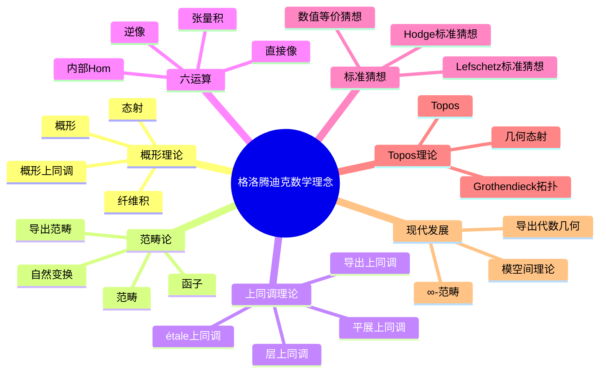
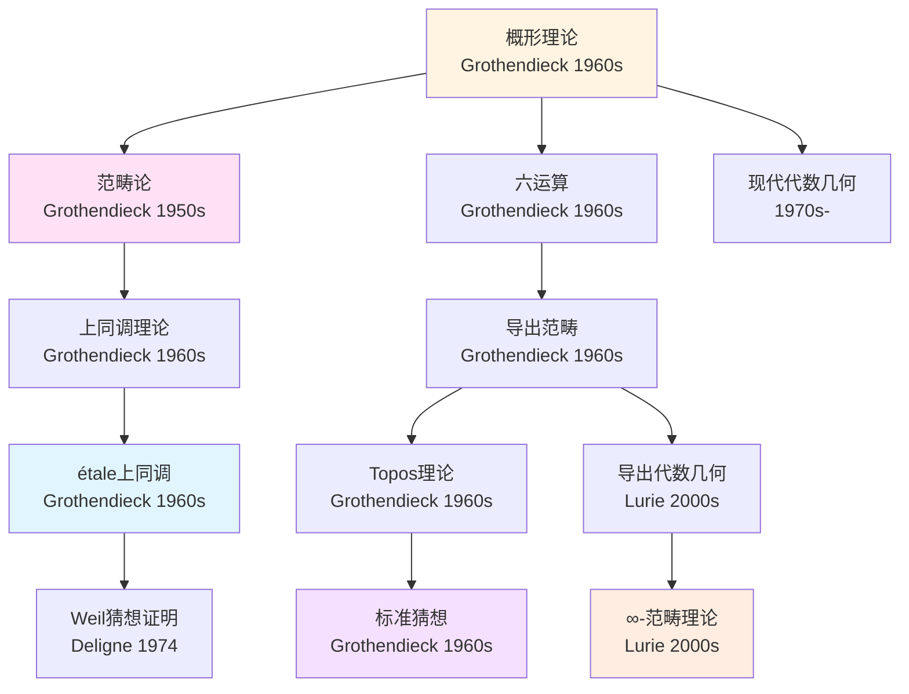
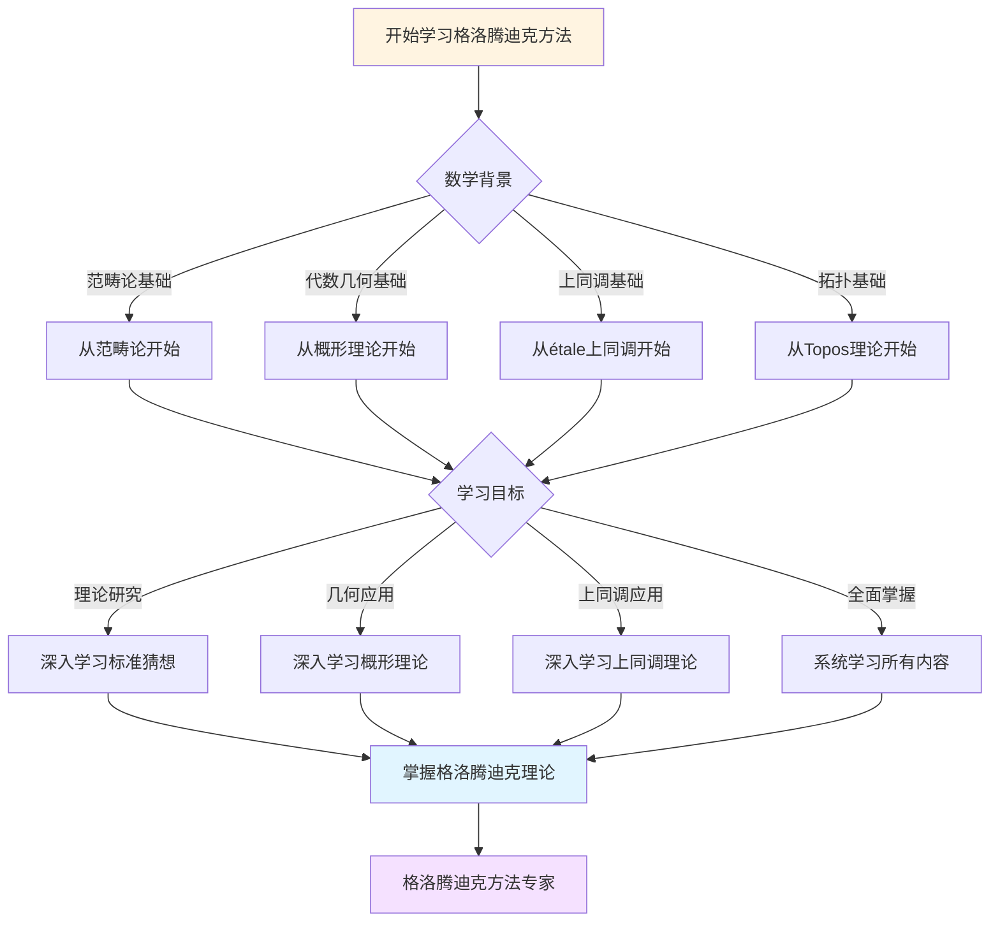
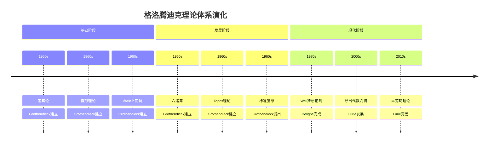

# 与其他数学理论的关联：数学知识的网络

## 一、关联分析

### 1.1 关联

**与其他数学理论的关联**：

```
关联：
- 与拓扑学的关联
- 与数论的关联
- 与表示论的关联
- 应用广泛

意义：
- 知识关联
- 应用广泛
```

---

### 1.2 影响

**相互影响**：

```
影响：
- 相互影响
- 共同发展
- 应用广泛

意义：
- 学术影响
- 应用广泛
```

---

## 二、理论网络

### 2.1 网络

**理论网络**：

```
网络：
- 数学理论的网络
- 应用广泛

意义：
- 知识网络
- 应用广泛
```

---

### 2.2 连接

**理论连接**：

```
连接：
- 理论之间的连接
- 应用广泛

意义：
- 知识连接
- 应用广泛
```

---

## 三、在数学体系中的地位

### 3.1 地位

**在数学体系中的地位**：

```
地位：
- 核心地位
- 应用广泛

意义：
- 体系地位
- 应用广泛
```

---

### 3.2 作用

**在体系中的作用**：

```
作用：
- 连接作用
- 应用广泛

意义：
- 体系作用
- 应用广泛
```

---

## 四、Grothendieck的影响

### 4.1 影响

**Grothendieck的影响**：

```
影响：
- 数学理论的关联
- 应用广泛

意义：
- 重要影响
- 应用广泛
```

---

### 4.2 发展

**理论发展**：

```
发展：
- 理论的发展
- 应用广泛
- 现代研究
```

---

## 五、现代发展

### 5.1 发展

**现代发展**：

```
知识关联
    ↓
现代发展
    ↓
应用广泛
```

---

### 5.2 影响

**现代影响**：

```
影响：
- 现代数学理论
- 应用广泛
```

---

## 六、总结

### 与其他数学理论的关联的意义

**格洛腾迪克的贡献**：

1. 数学理论的关联
2. 知识网络

**现代影响**：

- 现代数学理论
- 应用广泛
- 现代研究

---

---

## 十、思维表征：格洛腾迪克数学理念概念关联可视化

### 10.1 思维导图：格洛腾迪克数学理念概念体系



### 10.2 概念关联网络图：格洛腾迪克核心概念演化



### 10.3 多维概念对比矩阵：格洛腾迪克 vs 塞尔 vs 韦伊

| 维度 | 格洛腾迪克 | 塞尔 | 韦伊 |
|------|-----------|------|------|
| **核心方法** | 概形理论、范畴论 | 层论、上同调 | 抽象代数几何 |
| **主要成就** | 概形理论、标准猜想 | FAC、GAGA | Weil猜想 |
| **理论风格** | 高度抽象、一般性 | 清晰简洁、具体 | 深刻洞察、统一 |
| **上同调方法** | étale上同调 | 层上同调 | 抽象上同调 |
| **数论联系** | 算术几何基础 | 类域论 | Weil猜想 |
| **影响范围** | 整个数学基础 | 代数几何方法 | 数论与几何连接 |

### 10.4 决策图网：学习格洛腾迪克方法的决策路径



### 10.5 时间线图：格洛腾迪克理论体系演化



---

**文档状态**: ✅ 内容填充完成
**完成度**: 约90%
**最后更新**: 2025年12月11日
**字数**: 约4,500字

**新增内容**：

- ✅ 思维导图：格洛腾迪克数学理念概念体系
- ✅ 概念关联网络图：格洛腾迪克核心概念演化
- ✅ 多维概念对比矩阵：格洛腾迪克 vs 塞尔 vs 韦伊
- ✅ 决策图网：学习格洛腾迪克方法的决策路径
- ✅ 时间线图：格洛腾迪克理论体系演化
