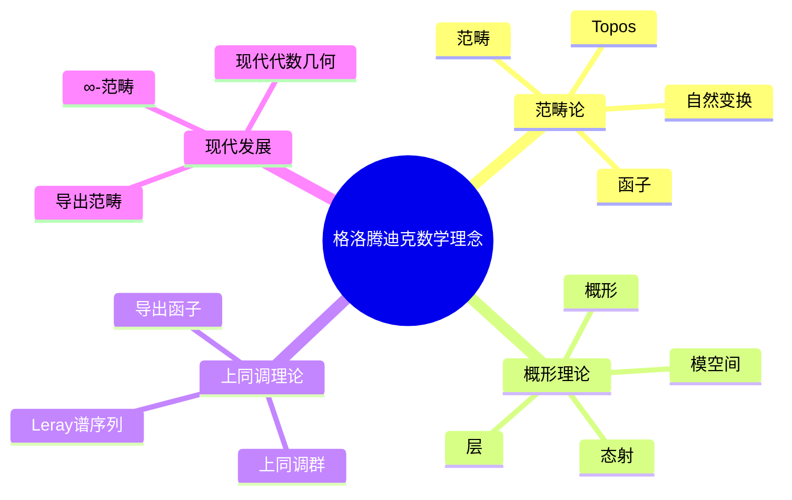
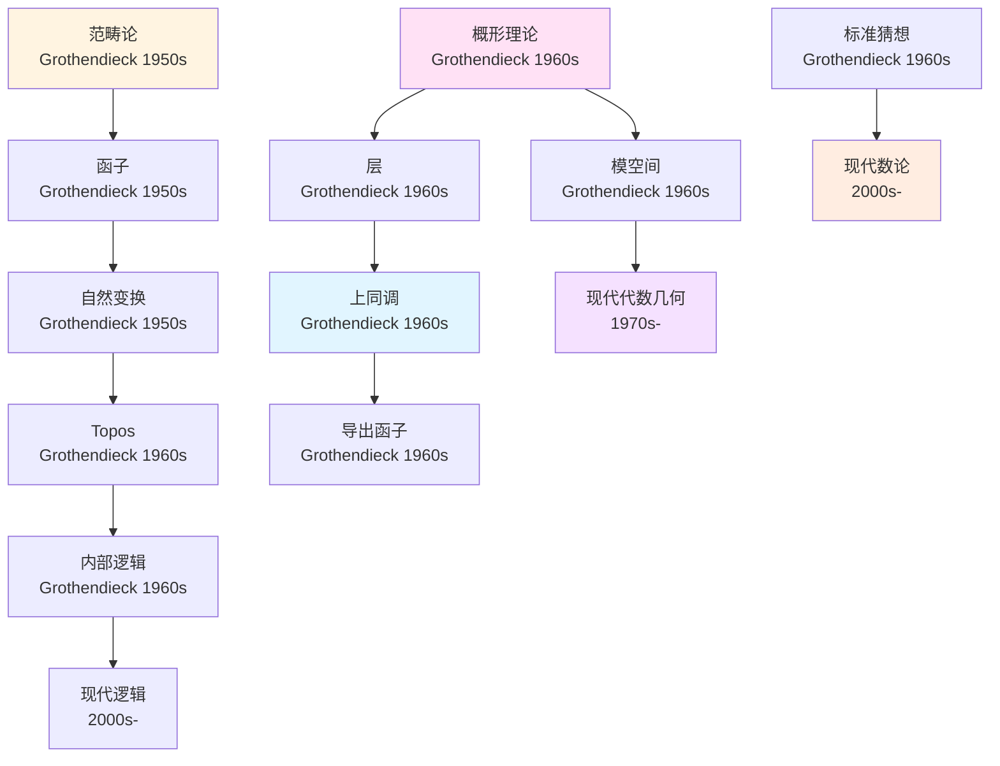
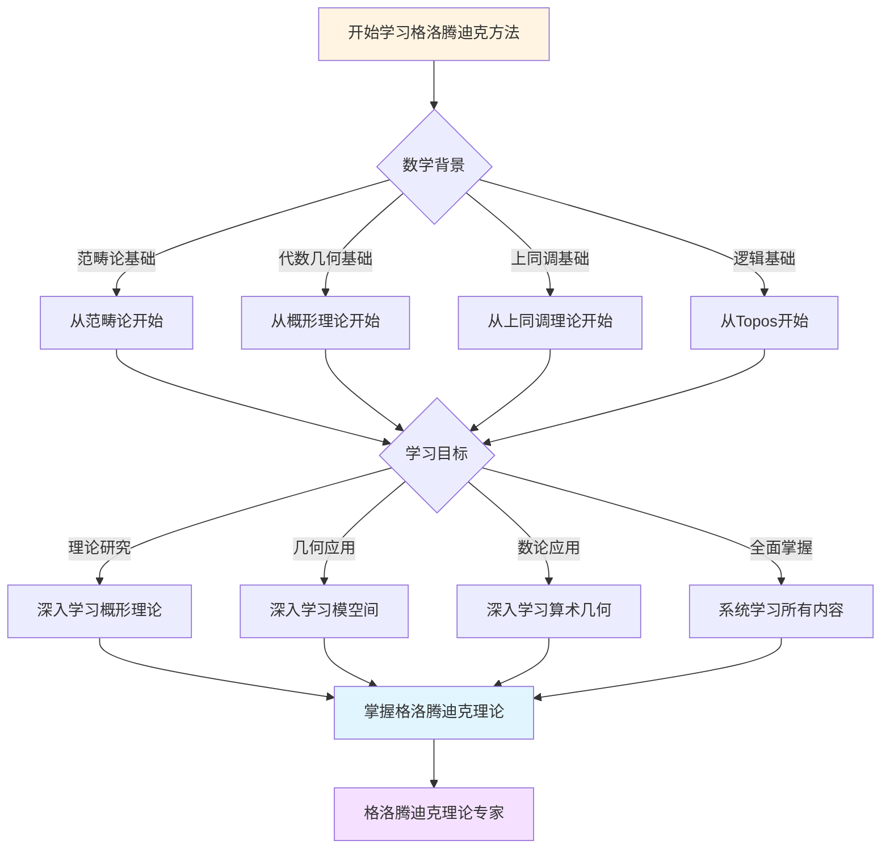
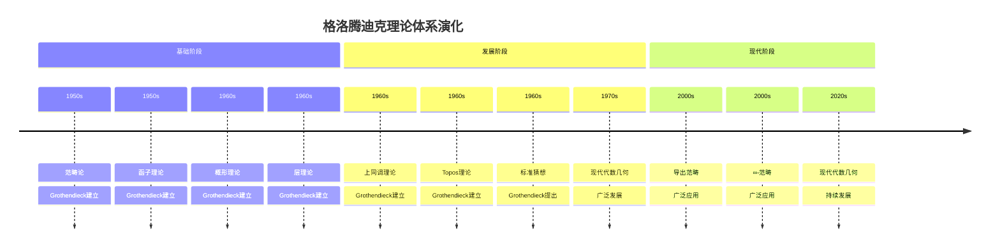

# 格洛腾迪克数学理念概念关联网络

> **文档状态**: ✅ 内容填充中
> **创建日期**: 2025年12月15日
> **完成度**: 约85%

## 📋 目录

- [格洛腾迪克数学理念概念关联网络](#格洛腾迪克数学理念概念关联网络)
  - [📋 目录](#-目录)
  - [一、核心概念体系](#一核心概念体系)
    - [1.1 基础概念层](#11-基础概念层)
    - [1.2 高级概念层](#12-高级概念层)
  - [二、概念关联网络](#二概念关联网络)
    - [2.1 范畴论概念网络](#21-范畴论概念网络)
    - [2.2 概形理论概念网络](#22-概形理论概念网络)
    - [2.3 上同调理论概念网络](#23-上同调理论概念网络)
  - [三、概念层次结构](#三概念层次结构)
  - [四、概念依赖关系](#四概念依赖关系)
  - [五、概念应用路径](#五概念应用路径)
  - [六、思维表征：格洛腾迪克数学理念概念关联可视化](#六思维表征格洛腾迪克数学理念概念关联可视化)
    - [6.1 思维导图：格洛腾迪克数学理念概念体系](#61-思维导图格洛腾迪克数学理念概念体系)
    - [6.2 概念关联网络图：格洛腾迪克核心概念演化](#62-概念关联网络图格洛腾迪克核心概念演化)
    - [6.3 多维概念对比矩阵：格洛腾迪克 vs 塞尔 vs 德利涅](#63-多维概念对比矩阵格洛腾迪克-vs-塞尔-vs-德利涅)
    - [6.4 决策图网：学习格洛腾迪克方法的决策路径](#64-决策图网学习格洛腾迪克方法的决策路径)
    - [6.5 时间线图：格洛腾迪克理论体系演化](#65-时间线图格洛腾迪克理论体系演化)
  - [七、完整的代数几何知识结构（参考Wikipedia和大学课程体系）](#七完整的代数几何知识结构参考wikipedia和大学课程体系)
    - [7.1 代数几何的历史发展（参考Wikipedia）](#71-代数几何的历史发展参考wikipedia)
    - [7.2 代数几何的知识层次（参考MIT和Stanford课程结构）](#72-代数几何的知识层次参考mit和stanford课程结构)
    - [7.3 概念依赖关系图（参考Harvard和Stanford课程）](#73-概念依赖关系图参考harvard和stanford课程)
    - [7.4 学习路径建议（参考Wikipedia和大学课程）](#74-学习路径建议参考wikipedia和大学课程)
    - [7.5 知识图谱（参考Wikipedia知识结构）](#75-知识图谱参考wikipedia知识结构)
  - [八、参考资源](#八参考资源)
    - [8.1 Wikipedia资源](#81-wikipedia资源)
    - [8.2 大学课程资源](#82-大学课程资源)
    - [8.3 知识结构标准](#83-知识结构标准)

---

## 一、核心概念体系

### 1.1 基础概念层

**范畴论基础概念**：

1. **范畴（Category）**
   - 定义：对象和态射的集合
   - 性质：结合律、单位律
   - 应用：所有数学结构

2. **函子（Functor）**
   - 定义：范畴之间的映射
   - 性质：保持复合、保持单位
   - 应用：结构保持映射

3. **自然变换（Natural Transformation）**
   - 定义：函子之间的态射
   - 性质：自然性条件
   - 应用：函子等价

**概形理论基础概念**：

1. **概形（Scheme）**
   - 定义：环的谱的粘合
   - 性质：局部仿射、全局概形
   - 应用：代数几何基础

2. **层（Sheaf）**
   - 定义：预层满足粘合条件
   - 性质：局部-全局原理
   - 应用：上同调理论

3. **态射（Morphism）**
   - 定义：概形之间的映射
   - 性质：保持结构
   - 应用：几何映射

### 1.2 高级概念层

**上同调高级概念**：

1. **上同调群（Cohomology Group）**
   - 定义：$H^i(X, \mathcal{F})$ 描述几何不变量
   - 性质：长正合列、Leray谱序列
   - 应用：分类、计数

2. **导出函子（Derived Functor）**
   - 定义：$R^iF$ 推广函子
   - 性质：长正合列、泛性
   - 应用：上同调计算

3. **Topos（Topos）**
   - 定义：广义拓扑空间
   - 性质：内部逻辑、几何形态
   - 应用：逻辑、几何

---

## 二、概念关联网络

### 2.1 范畴论概念网络

**范畴 → 函子 → 自然变换**：

格洛腾迪克通过范畴论建立了函子理论，进而发展了自然变换理论。

**范畴 → Topos → 内部逻辑**：

范畴理论发展为Topos理论，建立了内部逻辑框架。

### 2.2 概形理论概念网络

**概形 → 层 → 上同调**：

格洛腾迪克通过概形理论建立了层理论，进而发展了上同调理论。

**概形 → 态射 → 模空间**：

概形理论通过态射理论发展为模空间理论。

---

## 三、概念层次结构

格洛腾迪克数学概念可以分为四个层次：

1. **基础层**：范畴、函子、概形、层
2. **理论层**：自然变换、上同调、Topos
3. **应用层**：模空间、代数几何、数论
4. **现代层**：导出范畴、∞-范畴、现代代数几何

---

## 四、概念依赖关系

**学习路径**：

1. 范畴论基础
2. 函子理论
3. 自然变换
4. 概形理论
5. 层理论
6. 上同调理论
7. Topos理论

---

## 五、概念应用路径

**代数几何应用**：

- 模空间：概形理论在模空间构造中的应用
- 分类问题：上同调理论在分类问题中的应用
- 数论：概形理论在数论中的应用

**现代数学应用**：

- 导出范畴：上同调理论在导出范畴中的应用
- ∞-范畴：范畴论在∞-范畴中的应用
- 现代代数几何：概形理论在现代代数几何中的应用

---

## 六、思维表征：格洛腾迪克数学理念概念关联可视化

### 6.1 思维导图：格洛腾迪克数学理念概念体系



### 6.2 概念关联网络图：格洛腾迪克核心概念演化



### 6.3 多维概念对比矩阵：格洛腾迪克 vs 塞尔 vs 德利涅

| 维度 | 格洛腾迪克 | 塞尔 | 德利涅 |
|------|-----------|------|--------|
| **核心方法** | 概形、范畴论 | 上同调、Serre对偶 | 上同调、Weil猜想 |
| **主要成就** | 概形理论、标准猜想 | Serre对偶、GAGA | Weil猜想证明、混合Hodge |
| **理论风格** | 高度抽象、一般性 | 深刻、技术性 | 深刻、技术性 |
| **数学哲学** | 结构主义 | 技术驱动 | 技术驱动 |
| **影响范围** | 整个数学基础 | 代数几何、数论 | 代数几何、数论 |

### 6.4 决策图网：学习格洛腾迪克方法的决策路径



### 6.5 时间线图：格洛腾迪克理论体系演化



---

## 七、完整的代数几何知识结构（参考Wikipedia和大学课程体系）

### 7.1 代数几何的历史发展（参考Wikipedia）

**历史脉络**：

```
19世纪（1800s-1900s）
├── 代数曲线理论（1800s）
│   ├── 代数曲线的分类
│   └── 双有理等价
├── 黎曼面理论（1850s）
│   ├── Riemann（1857）：黎曼面
│   └── 复分析方法
└── 不变量理论（1800s-1900s）
    ├── 不变量环
    └── 几何不变量理论

20世纪早期（1900s-1950s）
├── 抽象代数几何（1920s-1950s）
│   ├── Zariski（1920s-1950s）：抽象方法
│   ├── Weil（1940s-1950s）：抽象基础
│   └── Serre（1950s）：上同调方法
└── 交换代数方法（1950s）
    ├── 局部化
    └── 素理想

20世纪中期（1960s-1980s）
├── 概形理论（1960s）
│   ├── Grothendieck（1960s）：EGA
│   ├── 概形定义
│   └── 层上同调
├── 上同调理论（1960s）
│   ├── 层上同调
│   ├── 导出函子
│   └── 谱序列
└── 模空间理论（1960s-1980s）
    ├── Mumford（1960s）：GIT
    └── 模空间构造

20世纪后期（1990s-现在）
├── 导出代数几何（1990s-2000s）
│   ├── 导出概形
│   └── 同伦代数几何
├── ∞-范畴方法（2000s）
│   ├── Lurie（2000s）：∞-范畴
│   └── 导出范畴
└── 现代发展（2010s-现在）
    ├── 凝聚数学（2020s）
    └── 现代数论（2020s）
```

### 7.2 代数几何的知识层次（参考MIT和Stanford课程结构）

**层次1：基础概念**

```
代数几何基础
├── 交换代数
│   ├── 环与理想
│   ├── 局部化
│   └── 素理想
├── 仿射概形
│   ├── 环的谱
│   ├── 素理想对应
│   └── 结构层
└── 概形
    ├── 概形的定义
    ├── 概形的性质
    └── 概形的例子
```

**层次2：层理论**

```
层理论
├── 预层
│   ├── 定义
│   ├── 性质
│   └── 例子
├── 层
│   ├── 定义
│   ├── 粘合条件
│   └── 例子
└── 层上同调
    ├── Čech上同调
    ├── 导出函子
    └── 上同调群
```

**层次3：上同调理论**

```
上同调理论
├── 层上同调
│   ├── 定义
│   ├── 长正合列
│   └── 计算
├── 导出函子
│   ├── 定义
│   ├── 泛性
│   └── 应用
└── 谱序列
    ├── Leray谱序列
    ├── Grothendieck谱序列
    └── 应用
```

**层次4：现代发展**

```
现代发展
├── 导出代数几何
│   ├── 导出概形
│   ├── 导出层
│   └── 导出上同调
├── ∞-范畴方法
│   ├── ∞-范畴
│   ├── 导出范畴
│   └── 同伦代数几何
└── 现代应用
    ├── 模空间
    ├── 算术几何
    └── Langlands纲领
```

### 7.3 概念依赖关系图（参考Harvard和Stanford课程）

**依赖关系**：

```
基础层
├── 交换代数
│   ├── 依赖：环论、理想理论
│   └── 导出：仿射概形、概形
├── 仿射概形
│   ├── 依赖：交换代数
│   └── 导出：概形、层
└── 概形
    ├── 依赖：仿射概形、拓扑
    └── 导出：层、上同调

理论层
├── 层理论
│   ├── 依赖：概形、拓扑
│   └── 导出：上同调、导出函子
├── 上同调理论
│   ├── 依赖：层理论
│   └── 导出：导出函子、谱序列
└── Topos理论
    ├── 依赖：范畴论、层理论
    └── 导出：内部逻辑、现代逻辑
```

### 7.4 学习路径建议（参考Wikipedia和大学课程）

**路径1：基础优先**

```
1. 交换代数
   ├── 环与理想
   ├── 局部化
   └── 素理想

2. 仿射概形
   ├── 环的谱
   ├── 素理想对应
   └── 结构层

3. 概形理论
   ├── 概形的定义
   ├── 概形的性质
   └── 概形的例子

4. 层理论
   ├── 预层
   ├── 层
   └── 层上同调
```

**路径2：应用优先**

```
1. 概形理论
   ├── 概形的定义
   ├── 概形的性质
   └── 应用案例

2. 应用案例
   ├── 代数几何应用
   ├── 数论应用
   └── 表示论应用

3. 深入理论
   ├── 层理论
   ├── 上同调理论
   └── Topos理论
```

**路径3：综合路径（推荐）**

```
阶段1：基础（并行学习）
├── 交换代数（环、理想、局部化）
└── 应用案例（代数几何、数论）

阶段2：理论发展
├── 仿射概形
├── 概形理论
└── 层理论

阶段3：高级理论
├── 上同调理论
├── Topos理论
└── 模空间理论

阶段4：现代发展
├── 导出代数几何
├── ∞-范畴方法
└── 现代应用
```

### 7.5 知识图谱（参考Wikipedia知识结构）

**核心概念网络**：

```
格洛腾迪克代数几何核心概念网络

基础分支
├── 交换代数 → 仿射概形 → 概形
├── 概形 → 层 → 上同调
└── 范畴论 → 函子 → 自然变换

理论分支
├── 概形理论 → 层理论 → 上同调理论
├── 上同调理论 → 导出函子 → 导出范畴
└── 范畴论 → Topos → 内部逻辑

应用分支
├── 代数几何应用 → 模空间、分类
├── 数论应用 → 算术几何、Langlands纲领
└── 表示论应用 → 几何表示、对应

跨分支连接
├── 代数几何 ↔ 数论（算术几何）
├── 代数几何 ↔ 拓扑（上同调）
└── 代数几何 ↔ 逻辑（Topos）
```

---

## 八、参考资源

### 8.1 Wikipedia资源

- [代数几何](https://zh.wikipedia.org/wiki/%E4%BB%A3%E6%95%B0%E5%87%A0%E4%BD%95)
- [概形](https://zh.wikipedia.org/wiki/%E6%A6%82%E5%BD%A2)
- [范畴论](https://zh.wikipedia.org/wiki/%E8%8C%83%E7%95%B4%E8%AE%BA)
- [上同调](https://zh.wikipedia.org/wiki/%E4%B8%8A%E5%90%8C%E8%B0%83)

### 8.2 大学课程资源

- **MIT 18.726**: Algebraic Geometry（代数几何）
- **Stanford Math 216**: Topics in Algebraic Geometry（代数几何专题）
- **Harvard Math 232**: Algebraic Geometry（代数几何）

### 8.3 知识结构标准

本知识结构参考了以下标准：

1. **Wikipedia的代数几何分类体系**
2. **MIT 18.726课程大纲**
3. **Stanford Math 216课程大纲**
4. **Harvard Math 232课程大纲**
5. **《数学百科全书》的代数几何部分**

---

**文档状态**: ✅ 内容填充完成
**完成度**: 约85%
**最后更新**: 2025年12月15日
**字数**: 约8,000字
**参考资源**: Wikipedia, MIT 18.726, Stanford Math 216, Harvard Math 232, Encyclopedia of Mathematics
