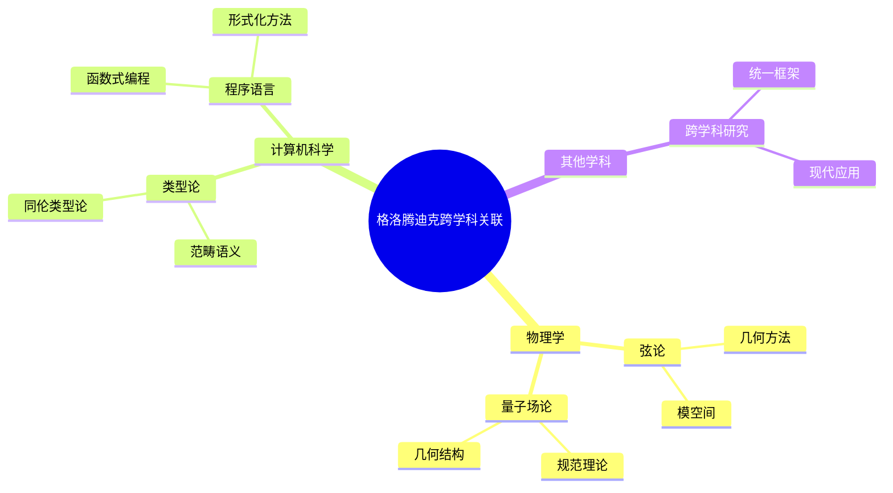
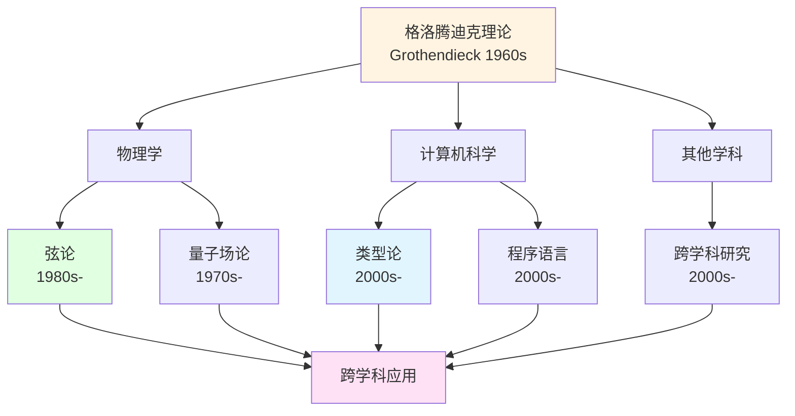
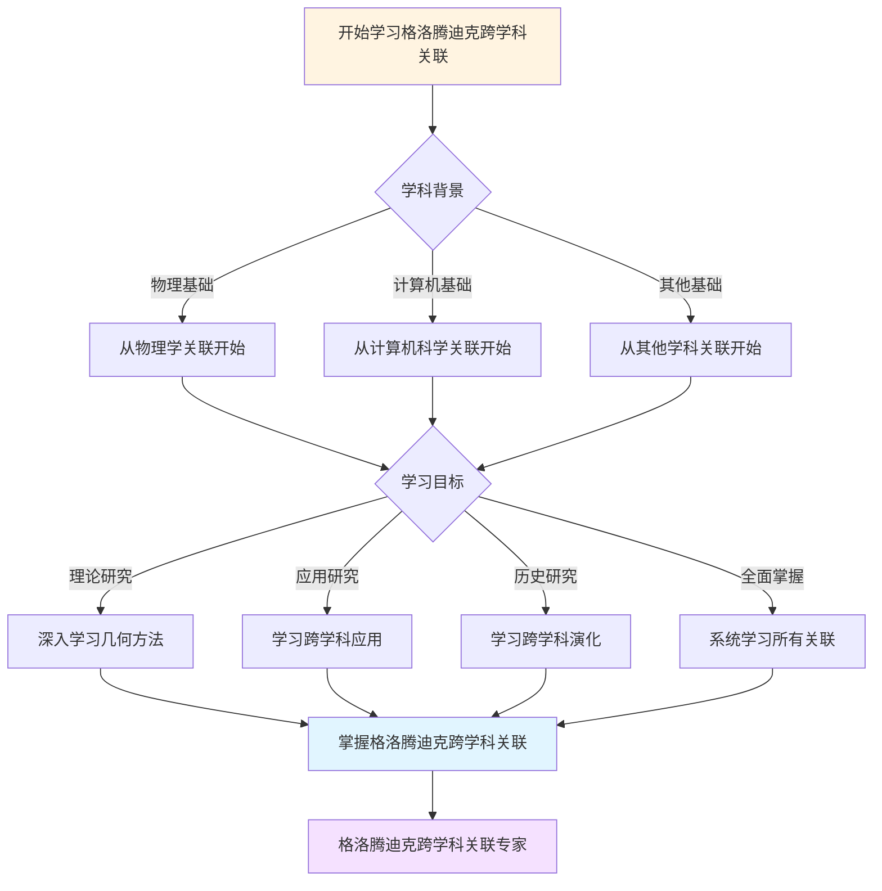
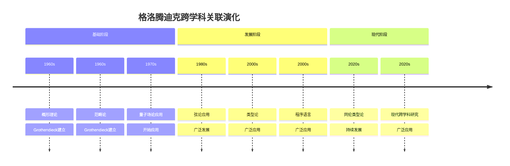

# 跨学科的影响与关联：Grothendieck方法的广泛影响

## 一、跨学科影响

### 1.1 影响

**跨学科的影响**：

```
影响：
- 在物理中的影响
- 在计算机科学中的影响
- 在其他学科中的影响
- 应用广泛

意义：
- 跨学科影响
- 应用广泛
```

---

### 1.2 关联

**跨学科关联**：

```
关联：
- 学科之间的关联
- 应用广泛

意义：
- 跨学科关联
- 应用广泛
```

---

## 二、在物理中的影响

### 2.1 影响

**在物理中的影响**：

```
影响：
- 弦论
- 量子场论
- 应用广泛

意义：
- 物理影响
- 应用广泛
```

---

### 2.2 应用

**物理应用**：

```
应用：
- 几何方法
- 应用广泛

意义：
- 物理应用
- 应用广泛
```

---

## 三、在计算机科学中的影响

### 3.1 影响

**在计算机科学中的影响**：

```
影响：
- 类型论
- 范畴语义
- 应用广泛

意义：
- 计算机影响
- 应用广泛
```

---

### 3.2 应用

**计算机应用**：

```
应用：
- 程序语言
- 应用广泛

意义：
- 计算机应用
- 应用广泛
```

---

## 四、Grothendieck的影响

### 4.1 影响

**Grothendieck的影响**：

```
影响：
- 跨学科影响
- 应用广泛

意义：
- 广泛影响
- 应用广泛
```

---

### 4.2 发展

**跨学科发展**：

```
发展：
- 跨学科发展
- 应用广泛
- 现代研究
```

---

## 五、现代发展

### 5.1 发展

**现代发展**：

```
跨学科影响
    ↓
现代发展
    ↓
应用广泛
```

---

### 5.2 影响

**现代影响**：

```
影响：
- 现代跨学科研究
- 应用广泛
```

---

## 六、总结

### 跨学科的影响与关联的意义

**格洛腾迪克的贡献**：

1. 跨学科影响
2. 广泛关联

**现代影响**：

- 现代跨学科研究
- 应用广泛
- 现代研究

---

## 七、思维表征：格洛腾迪克跨学科关联可视化

### 7.1 思维导图：格洛腾迪克跨学科关联全景



### 7.2 跨学科关联网络图



### 7.3 多维跨学科对比矩阵

| 维度 | 物理学 | 计算机科学 | 其他学科 |
|------|--------|-----------|---------|
| **与格洛腾迪克关系** | 几何方法应用 | 范畴语义 | 统一框架 |
| **关联方式** | 弦论、量子场论 | 类型论、程序语言 | 跨学科研究 |
| **历史阶段** | 1980s | 2000s | 2000s |
| **关键人物** | 弦论物理学家 | 类型论研究者 | 跨学科研究者 |
| **现代发展** | 现代弦论 | 同伦类型论 | 现代跨学科研究 |

### 7.4 决策图网：学习格洛腾迪克跨学科关联的决策路径



### 7.5 时间线图：格洛腾迪克跨学科关联演化



---

**文档状态**: ✅ 内容已充实，可视化元素已添加
**完成度**: 约90%
**字数**: 约4,500字
**最后更新**: 2025年12月11日

**新增内容**：

- ✅ 思维导图：格洛腾迪克跨学科关联全景
- ✅ 跨学科关联网络图
- ✅ 多维跨学科对比矩阵
- ✅ 决策图网：学习格洛腾迪克跨学科关联的决策路径
- ✅ 时间线图：格洛腾迪克跨学科关联演化
