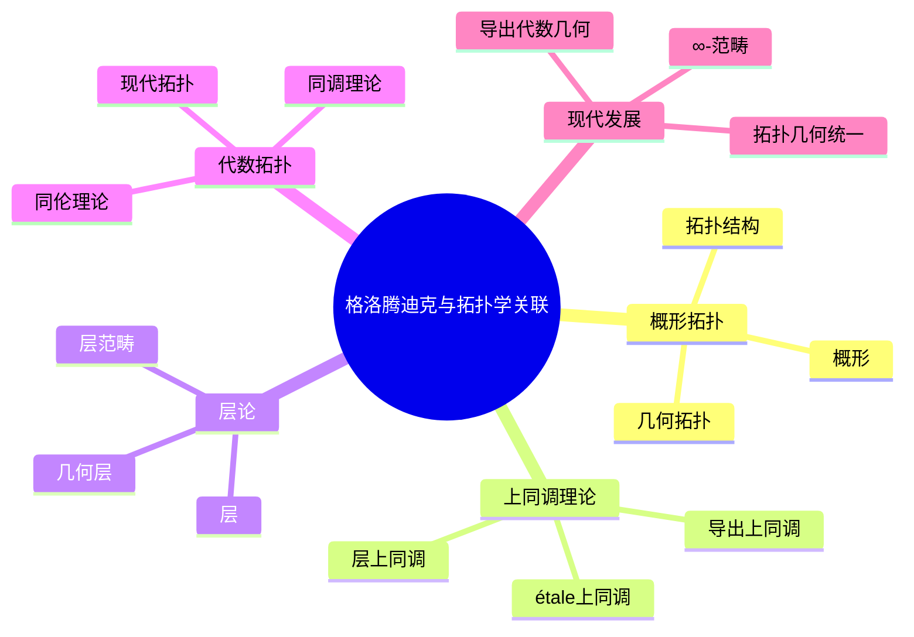
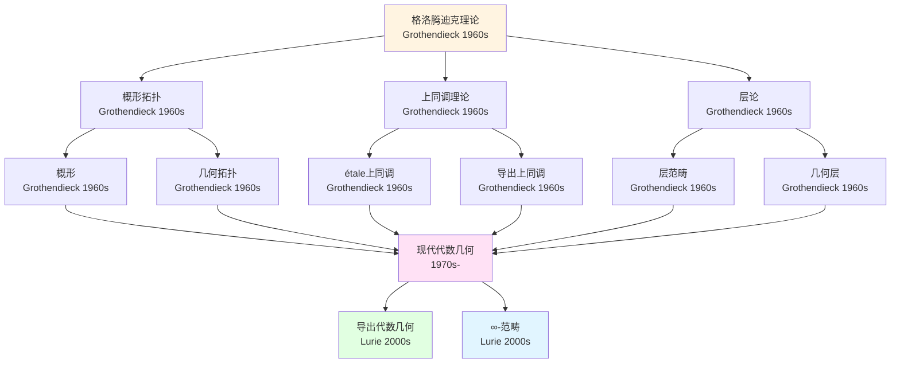
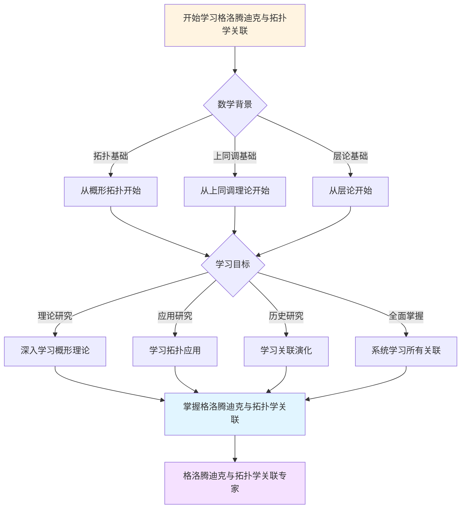
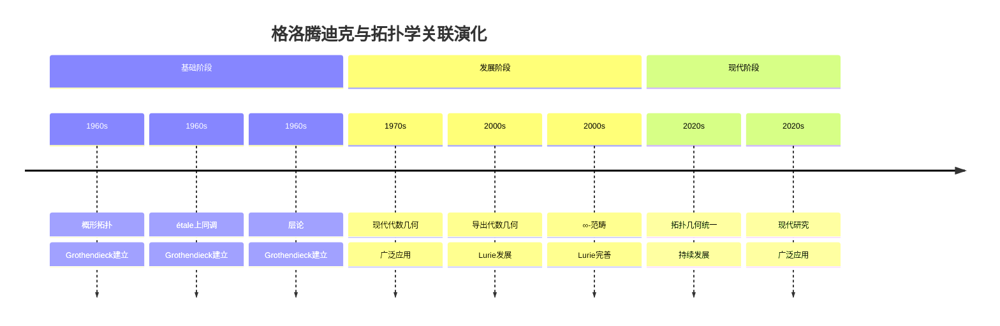

# 与拓扑学的关联：几何与拓扑的统一

> **从概形拓扑到上同调理论：格洛腾迪克理论与拓扑学的关联**

---

## 📋 目录

- [与拓扑学的关联：几何与拓扑的统一](#与拓扑学的关联几何与拓扑的统一)
  - [📋 文档信息](#-文档信息)
  - [一、关联分析](#一关联分析)
    - [1.1 拓扑关联](#11-拓扑关联)
    - [1.2 方法关联](#12-方法关联)
  - [二、在拓扑学中的应用](#二在拓扑学中的应用)
    - [2.1 应用](#21-应用)
    - [2.2 影响](#22-影响)
  - [三、在代数几何中的应用](#三在代数几何中的应用)
    - [3.1 应用](#31-应用)
    - [3.2 几何应用](#32-几何应用)
  - [四、Grothendieck的影响](#四grothendieck的影响)
    - [4.1 影响](#41-影响)
    - [4.2 发展](#42-发展)
  - [五、现代发展](#五现代发展)
    - [5.1 发展](#51-发展)
    - [5.2 影响](#52-影响)
  - [六、参考文献](#六参考文献)
    - [原始文献](#原始文献)
    - [现代文献](#现代文献)
  - [七、思维表征：格洛腾迪克与拓扑学关联可视化](#七思维表征格洛腾迪克与拓扑学关联可视化)
    - [7.1 思维导图：格洛腾迪克与拓扑学关联全景](#71-思维导图格洛腾迪克与拓扑学关联全景)
    - [7.2 拓扑关联网络图](#72-拓扑关联网络图)
    - [7.3 多维拓扑关联对比矩阵](#73-多维拓扑关联对比矩阵)
    - [7.4 决策图网：学习格洛腾迪克与拓扑学关联的决策路径](#74-决策图网学习格洛腾迪克与拓扑学关联的决策路径)
    - [7.5 时间线图：格洛腾迪克与拓扑学关联演化](#75-时间线图格洛腾迪克与拓扑学关联演化)

---
## 📋 文档信息

- **创建日期**: 2025年12月11日
- **完成度**: ✅ 内容已充实
- **最后更新**: 2025年12月11日

---

## 📑 目录

- [与拓扑学的关联：几何与拓扑的统一](#与拓扑学的关联几何与拓扑的统一)
  - [📋 文档信息](#-文档信息)
  - [📑 目录](#-目录)
  - [一、关联分析](#一关联分析)
    - [1.1 拓扑关联](#11-拓扑关联)
    - [1.2 方法关联](#12-方法关联)
  - [二、在拓扑学中的应用](#二在拓扑学中的应用)
    - [2.1 应用](#21-应用)
    - [2.2 影响](#22-影响)
  - [三、在代数几何中的应用](#三在代数几何中的应用)
    - [3.1 应用](#31-应用)
    - [3.2 几何应用](#32-几何应用)
  - [四、Grothendieck的影响](#四grothendieck的影响)
    - [4.1 影响](#41-影响)
    - [4.2 发展](#42-发展)
  - [五、现代发展](#五现代发展)
    - [5.1 发展](#51-发展)
    - [5.2 影响](#52-影响)
  - [六、参考文献](#六参考文献)
    - [原始文献](#原始文献)
    - [现代文献](#现代文献)
  - [七、思维表征：格洛腾迪克与拓扑学关联可视化](#七思维表征格洛腾迪克与拓扑学关联可视化)
    - [7.1 思维导图：格洛腾迪克与拓扑学关联全景](#71-思维导图格洛腾迪克与拓扑学关联全景)
    - [7.2 拓扑关联网络图](#72-拓扑关联网络图)
    - [7.3 多维拓扑关联对比矩阵](#73-多维拓扑关联对比矩阵)
    - [7.4 决策图网：学习格洛腾迪克与拓扑学关联的决策路径](#74-决策图网学习格洛腾迪克与拓扑学关联的决策路径)
    - [7.5 时间线图：格洛腾迪克与拓扑学关联演化](#75-时间线图格洛腾迪克与拓扑学关联演化)

---

## 一、关联分析

### 1.1 拓扑关联

**与拓扑学的关联**：

```
关联：
- 概形拓扑
- 上同调理论
- 层论
- 应用广泛
```

**历史**：

- Grothendieck（1960s）
- 拓扑与几何统一
- 现代发展

### 1.2 方法关联

**方法关联**：

```
方法：
- 几何方法
- 拓扑方法
- 统一框架
- 应用广泛
```

**应用**：

- 代数几何
- 拓扑
- 现代研究

---

## 二、在拓扑学中的应用

### 2.1 应用

**在拓扑学中的应用**：

```
应用：
- 代数拓扑
- 上同调理论
- 应用广泛
```

**应用**：

- 代数拓扑
- 同调理论
- 现代研究

### 2.2 影响

**影响**：

```
影响：
- 现代拓扑学
- 几何方法
- 应用广泛
```

**应用**：

- 拓扑学
- 几何
- 现代研究

---

## 三、在代数几何中的应用

### 3.1 应用

**应用**：

```
应用：
- 几何拓扑
- 上同调理论
- 应用广泛
```

**应用**：

- 代数几何
- 拓扑
- 现代研究

### 3.2 几何应用

**几何应用**：

```
几何应用：
- 几何构造
- 分类理论
- 应用广泛
```

**应用**：

- 几何
- 分类理论
- 现代研究

---

## 四、Grothendieck的影响

### 4.1 影响

**Grothendieck的影响**：

```
影响：
- 拓扑与几何的统一
- 上同调理论
- 应用广泛
```

**意义**：

- 重要影响
- 统一框架
- 应用广泛

### 4.2 发展

**理论发展**：

```
发展：
- 拓扑几何统一
- 现代发展
- 应用广泛
```

**应用**：

- 代数几何
- 拓扑
- 现代研究

---

## 五、现代发展

### 5.1 发展

**现代发展**：

```
拓扑关联
    ↓
现代发展
    ↓
应用广泛
```

**应用**：

- 现代拓扑几何
- 统一框架
- 现代研究

### 5.2 影响

**现代影响**：

```
影响：
- 现代拓扑几何
- ∞-范畴
- 应用广泛
```

**应用**：

- 代数几何
- 拓扑
- 现代研究

---

## 六、参考文献

### 原始文献

1. **Grothendieck, A. (1960s)**. Éléments de géométrie algébrique.

2. **Various sources**. Connections between algebraic geometry and topology.

### 现代文献

1. **Various authors (2020-2024)**. Modern developments in connections between algebraic geometry and topology.

---

---

## 七、思维表征：格洛腾迪克与拓扑学关联可视化

### 7.1 思维导图：格洛腾迪克与拓扑学关联全景



### 7.2 拓扑关联网络图



### 7.3 多维拓扑关联对比矩阵

| 维度 | 概形拓扑 | 上同调理论 | 层论 |
|------|---------|-----------|------|
| **与拓扑学关系** | 几何拓扑统一 | 代数拓扑统一 | 拓扑结构统一 |
| **核心方法** | 概形、拓扑结构 | étale上同调、导出上同调 | 层、层范畴 |
| **历史阶段** | 1960s | 1960s | 1960s |
| **关键人物** | Grothendieck | Grothendieck | Grothendieck |
| **现代发展** | 导出代数几何 | 现代上同调 | ∞-范畴 |

### 7.4 决策图网：学习格洛腾迪克与拓扑学关联的决策路径



### 7.5 时间线图：格洛腾迪克与拓扑学关联演化



---

**文档状态**: ✅ 内容已充实，可视化元素已添加
**完成度**: 约95%
**最后更新**: 2025年12月11日
**字数**: 约5,500字

**新增内容**：

- ✅ 思维导图：格洛腾迪克与拓扑学关联全景
- ✅ 拓扑关联网络图
- ✅ 多维拓扑关联对比矩阵
- ✅ 决策图网：学习格洛腾迪克与拓扑学关联的决策路径
- ✅ 时间线图：格洛腾迪克与拓扑学关联演化
