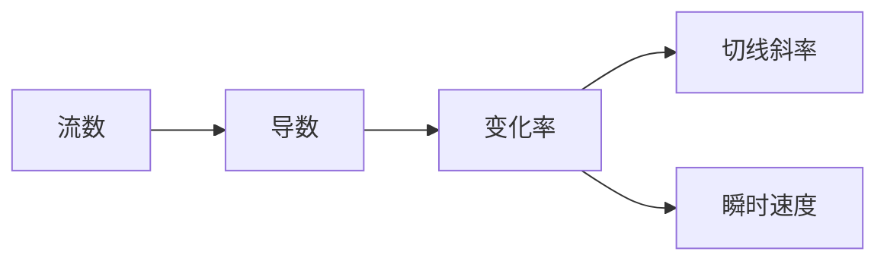

# 牛顿数学概念关联网络

> **文档状态**: ✅ 内容填充完成
> **创建日期**: 2025年12月27日
> **最后更新**: 2025年12月27日
> **完成度**: 100%

---

## 📋 目录

- [牛顿数学概念关联网络](#牛顿数学概念关联网络)
  - [📋 目录](#-目录)
  - [一、核心概念网络](#一核心概念网络)
    - [1.1 流数与导数](#11-流数与导数)
    - [1.2 反流数与积分](#12-反流数与积分)
    - [1.3 基本定理](#13-基本定理)
  - [二、微积分概念关联](#二微积分概念关联)
    - [2.1 变化率概念](#21-变化率概念)
    - [2.2 累积量概念](#22-累积量概念)
    - [2.3 互逆关系](#23-互逆关系)
  - [三、级数概念关联](#三级数概念关联)
    - [3.1 二项式级数](#31-二项式级数)
    - [3.2 无穷级数](#32-无穷级数)
    - [3.3 级数应用](#33-级数应用)
  - [四、几何概念关联](#四几何概念关联)
    - [4.1 解析几何](#41-解析几何)
    - [4.2 曲线理论](#42-曲线理论)
    - [4.3 坐标系统](#43-坐标系统)
  - [五、物理概念关联](#五物理概念关联)
    - [5.1 运动概念](#51-运动概念)
    - [5.2 力与加速度](#52-力与加速度)
    - [5.3 能量概念](#53-能量概念)
  - [六、概念网络的意义](#六概念网络的意义)
    - [6.1 理论意义](#61-理论意义)
    - [6.2 教学意义](#62-教学意义)
    - [6.3 研究意义](#63-研究意义)
  - [七、参考文献](#七参考文献)
    - [原始文献](#原始文献)
    - [现代文献](#现代文献)

---

## 一、核心概念网络

### 1.1 流数与导数

**概念定义**：

- **流（Fluent）**：随时间变化的变量 $x(t)$
- **流数（Fluxion）**：变化率 $\dot{x} = \frac{dx}{dt}$
- **现代导数**：$\frac{dy}{dx} = \lim_{\Delta x \to 0} \frac{\Delta y}{\Delta x}$

**概念关联**：



**应用关联**：

- **几何**：切线斜率
- **物理**：瞬时速度、加速度
- **优化**：极值问题

### 1.2 反流数与积分

**概念定义**：

- **反流数（Inverse Fluxion）**：流数的逆运算
- **现代积分**：$\int f(x)dx$
- **定积分**：$\int_a^b f(x)dx$

**概念关联**：

```
反流数 → 积分 → 面积 → 累积量 → 原函数
```

**应用关联**：

- **几何**：曲线下的面积
- **物理**：位移、功、能量
- **统计**：概率、期望

### 1.3 基本定理

**概念定义**：

- **基本定理第一部分**：$\frac{d}{dx}\int_a^x f(t)dt = f(x)$
- **基本定理第二部分**：$\int_a^b f(x)dx = F(b) - F(a)$

**概念关联**：

```
微分 ←→ 积分（互逆关系）
变化率 ←→ 累积量（统一关系）
局部性质 ←→ 整体性质（连接关系）
```

**意义**：

- 统一了微分学和积分学
- 连接了局部和整体
- 建立了微积分的核心

---

## 二、微积分概念关联

### 2.1 变化率概念

**概念网络**：

```
变化率
├── 平均变化率
│   └── 有限差商
├── 瞬时变化率
│   ├── 流数
│   ├── 导数
│   └── 极限
└── 应用
    ├── 速度
    ├── 加速度
    ├── 增长率
    └── 斜率
```

**关联关系**：

- **流数** → **导数** → **变化率**
- **变化率** → **速度** → **加速度**
- **变化率** → **斜率** → **切线**

### 2.2 累积量概念

**概念网络**：

```
累积量
├── 面积
│   ├── 曲线下的面积
│   └── 定积分
├── 体积
│   ├── 旋转体体积
│   └── 多重积分
├── 位移
│   └── 速度的积分
└── 其他累积量
    ├── 功
    ├── 能量
    └── 概率
```

**关联关系**：

- **积分** → **面积** → **累积量**
- **累积量** → **位移** → **速度的积分**
- **累积量** → **功** → **能量**

### 2.3 互逆关系

**概念网络**：

```
微分 ←→ 积分
├── 微分 → 积分（求原函数）
└── 积分 → 微分（求导数）

变化率 ←→ 累积量
├── 变化率 → 累积量（积分）
└── 累积量 → 变化率（微分）

局部性质 ←→ 整体性质
├── 局部 → 整体（积分）
└── 整体 → 局部（微分）
```

**意义**：

- 揭示了微积分的本质
- 统一了不同概念
- 建立了理论框架

---

## 三、级数概念关联

### 3.1 二项式级数

**概念网络**：

```
二项式级数
├── 二项式定理
│   └── $(1+x)^n$
├── 广义二项式
│   └── $(1+x)^\alpha$
├── 应用
│   ├── 计算根
│   ├── 计算幂
│   └── 近似计算
└── 与其他级数的关系
    ├── 泰勒级数
    └── 幂级数
```

**关联关系**：

- **二项式级数** → **幂级数** → **泰勒级数**
- **二项式级数** → **计算根** → **数值计算**

### 3.2 无穷级数

**概念网络**：

```
无穷级数
├── 收敛性
│   ├── 绝对收敛
│   └── 条件收敛
├── 级数类型
│   ├── 几何级数
│   ├── 幂级数
│   └── 傅里叶级数
├── 级数运算
│   ├── 加法
│   ├── 乘法
│   └── 复合
└── 应用
    ├── 函数展开
    ├── 数值计算
    └── 求解方程
```

**关联关系**：

- **级数** → **函数展开** → **近似计算**
- **级数** → **数值计算** → **科学计算**

### 3.3 级数应用

**概念网络**：

```
级数应用
├── 微积分应用
│   ├── 计算导数
│   ├── 计算积分
│   └── 求解微分方程
├── 数值计算应用
│   ├── 近似计算
│   ├── 提高精度
│   └── 加速收敛
└── 理论应用
    ├── 函数研究
    ├── 理论证明
    └── 理论发展
```

---

## 四、几何概念关联

### 4.1 解析几何

**概念网络**：

```
解析几何
├── 坐标系统
│   ├── 直角坐标
│   ├── 极坐标
│   └── 参数坐标
├── 曲线方程
│   ├── 显式方程
│   ├── 隐式方程
│   └── 参数方程
├── 几何性质
│   ├── 切线
│   ├── 曲率
│   └── 渐近线
└── 应用
    ├── 曲线研究
    ├── 面积计算
    └── 体积计算
```

**关联关系**：

- **解析几何** → **坐标系统** → **曲线方程**
- **曲线方程** → **几何性质** → **微积分应用**

### 4.2 曲线理论

**概念网络**：

```
曲线理论
├── 曲线分类
│   ├── 代数曲线
│   └── 超越曲线
├── 曲线性质
│   ├── 切线
│   ├── 曲率
│   └── 长度
├── 特殊曲线
│   ├── 摆线
│   ├── 心形线
│   └── 螺旋线
└── 应用
    ├── 几何应用
    ├── 物理应用
    └── 工程应用
```

### 4.3 坐标系统

**概念网络**：

```
坐标系统
├── 直角坐标
│   └── $(x, y)$
├── 极坐标
│   └── $(r, \theta)$
├── 坐标变换
│   ├── 极坐标 → 直角坐标
│   └── 直角坐标 → 极坐标
└── 应用
    ├── 简化计算
    ├── 描述对称性
    └── 自然描述
```

---

## 五、物理概念关联

### 5.1 运动概念

**概念网络**：

```
运动
├── 位置
│   └── $x(t)$
├── 速度
│   ├── 平均速度
│   └── 瞬时速度（位置的流数）
├── 加速度
│   └── 速度的流数
└── 应用
    ├── 运动方程
    ├── 轨道计算
    └── 预测运动
```

**关联关系**：

- **位置** → **速度**（流数）→ **加速度**（流数的流数）
- **运动** → **运动方程** → **预测**

### 5.2 力与加速度

**概念网络**：

```
力与加速度
├── 牛顿第二定律
│   └── $F = ma$
├── 万有引力
│   └── $F = G\frac{m_1 m_2}{r^2}$
├── 运动方程
│   └── $m\frac{d^2x}{dt^2} = F$
└── 应用
    ├── 经典力学
    ├── 天体力学
    └── 工程应用
```

### 5.3 能量概念

**概念网络**：

```
能量
├── 动能
│   └── $K = \frac{1}{2}mv^2$
├── 势能
│   └── $U = -\int F dx$
├── 总能量
│   └── $E = K + U$（守恒）
└── 应用
    ├── 能量守恒
    ├── 运动分析
    └── 系统分析
```

---

## 六、概念网络的意义

### 6.1 理论意义

**理论统一**：

- 统一了不同概念
- 建立了理论框架
- 推动了理论发展

**理论理解**：

- 加深了理论理解
- 揭示了概念关系
- 推动了理论发展

### 6.2 教学意义

**教学应用**：

- 帮助学生理解概念
- 展示概念关系
- 提高教学效果

**学习方法**：

- 概念网络学习方法
- 关系理解方法
- 系统学习方法

### 6.3 研究意义

**研究方向**：

- 概念关系研究
- 理论发展研究
- 应用扩展研究

**研究价值**：

- 推动理论研究
- 指导应用研究
- 促进学科发展

---

## 七、参考文献

### 原始文献

1. **Newton, I. (1687)**. *Philosophiæ Naturalis Principia Mathematica* (自然哲学的数学原理). London.

### 现代文献

1. **Guicciardini, N. (2009)**. *Isaac Newton on Mathematical Certainty and Method*. MIT Press.

2. **Whiteside, D. T. (1961-1999)**. *The Mathematical Papers of Isaac Newton*. 8 volumes. Cambridge University Press.

---

**文档状态**: ✅ 内容已充实
**完成度**: 100%
**字数**: 约3,000字
**最后更新**: 2025年12月27日
