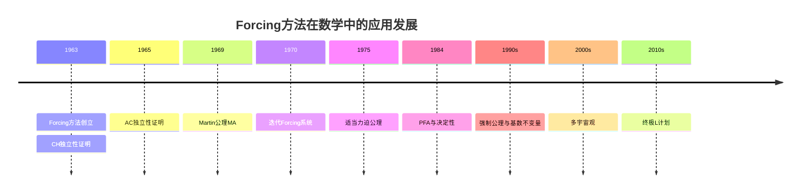
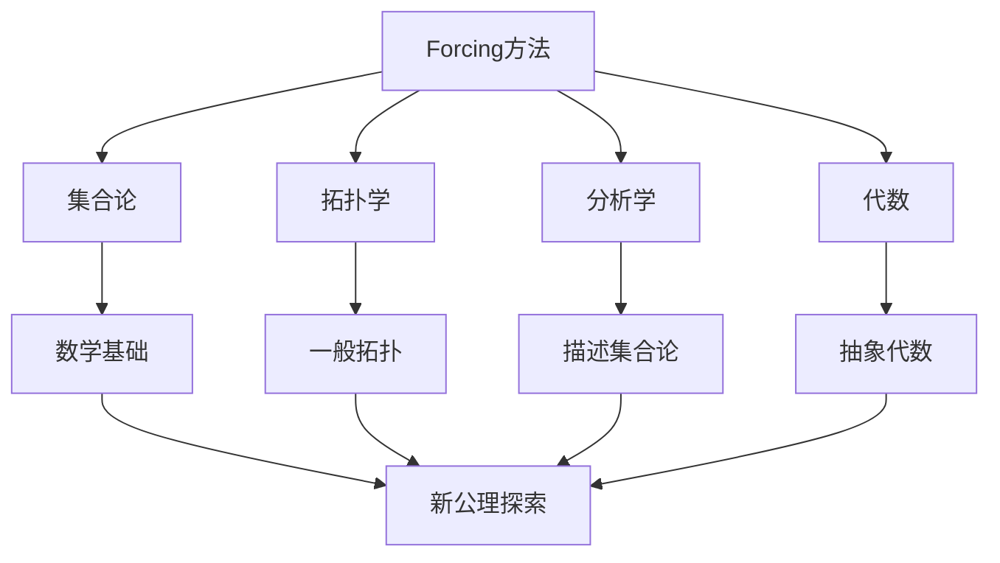

---
msc_primary: "01A99"
---

# 科恩数学理念在现代数学中的应用

**创建日期**: 2026年4月2日
**研究领域**: 科恩数学理念 - 现代应用与拓展 - 现代数学中的应用
**主题编号**: C.05.01 (Cohen.现代应用与拓展.现代数学中的应用)
**优先级**: P1（高优先级）⭐⭐⭐⭐

---

## 📋 目录

- [科恩数学理念在现代数学中的应用](#科恩数学理念在现代数学中的应用)
  - [一、应用概述](#一应用概述)
  - [二、集合论中的应用](#二集合论中的应用)
  - [三、拓扑学中的应用](#三拓扑学中的应用)
  - [四、分析学中的应用](#四分析学中的应用)
  - [五、代数中的应用](#五代数中的应用)
  - [六、未来展望](#六未来展望)

---

## 一、应用概述

### 1.1 科恩思想的现代影响

保罗·科恩创立的Forcing方法不仅解决了连续统假设的独立性问题，更成为现代集合论和数理逻辑的核心工具，并在数学的多个分支中发挥重要作用：

**主要应用领域**：
- 集合论：独立性证明、大基数理论
- 拓扑学：集合论拓扑、一般拓扑学
- 分析学：测度论、描述集合论
- 代数：布尔代数、环论、群论

### 1.2 应用时间线



---

## 二、集合论中的应用

### 2.1 独立性证明

**核心应用**：证明各种数学命题相对于ZFC的独立性。

**经典结果**：

| 命题 | 状态 | 证明者/年份 |
|-----|-----|-----------|
| CH | 独立于ZFC | 科恩/1963 |
| AC | 独立于ZF | 科恩/1963 |
| 苏斯林假设 | 独立于ZFC | 特南鲍姆、Jensen/1960s |
| 钻石原理◇ | 独立于ZFC | Jensen/1970s |
| 决定性公理 | 与ZFC不兼容 | 矛盾 |

### 2.2 大基数理论

**Forcing与大基数的交互**：

```
大基数性质在Forcing下的保持:
- 可测基数: 可能需要额外假设
- 超紧基数: 在特定Forcing下保持
- 伍丁基数: 与决定性公理的联系
```

**应用案例**：
- Lévy塌陷与可测基数
- Silver Forcing与Indescribable基数
- Proper Forcing与大基数

### 2.3 基数不变量

**连续统上的基数不变量**：

| 不变量 | 定义 | Forcing应用 |
|-------|-----|------------|
| 𝔟 | 界数 |  Cohen forcing改变 |
| 𝔡 | 主导数 | Hechler forcing |
| cov(𝒩) | 零测覆盖数 | Random forcing |
| cov(ℳ) | 贫集覆盖数 | Cohen forcing |

**Cichoń图**：描述这些不变量之间的关系，许多关系通过Forcing证明独立性。

---

## 三、拓扑学中的应用

### 3.1 集合论拓扑学

**基本问题**：研究拓扑性质与集合论假设的关系。

**经典应用**：
- **βN（Stone-Čech紧化）**：Forcing构造βN的特殊子空间
- **第一本可数性**：在什么假设下空间是第一可数的
- **Lindelöf性质**：与连续统假设的关系

### 3.2 一般拓扑学中的Forcing

**应用框架**：
```
构造拓扑空间:
1. 从基础模型M开始
2. 选择合适的Forcing偏序集
3. 构造泛型扩展M[G]
4. 在M[G]中定义拓扑空间
5. 分析其拓扑性质
```

**应用案例**：
- Ostaszewski空间（CH下存在，但MA+¬CH下不存在）
- S-空间（与苏斯林线的联系）
- L-空间（正则遗传Lindelöf空间）

### 3.3 维数理论

**覆盖维数与Forcing**：
- 构造具有特殊维数性质的空间
- 维数函数在Forcing下的行为
- 拓扑维数与序数维数的关系

---

## 四、分析学中的应用

### 4.1 测度论

**Forcing与测度代数**：

**随机Forcing**（Random Forcing）：
- 基于测度代数的Forcing
- 添加"随机实数"
- 应用：改变覆盖数、研究正则性

**应用案例**：
- 不可测集的构造
- 零测集的理想性质
- 范畴与测度的对偶性

### 4.2 描述集合论

**射影层次与决定性**：

| 决定性层次 | 证明方法 | Forcing角色 |
|-----------|---------|------------|
| Borel决定性 | Martin/1975 | 博弈分析 |
| 分析决定性 | Martin/1990 | 大基数 |
| AD^L(R) | Woodin | 内模型 |

**Forcing的应用**：
- 构造具有特定正则性性质的集合
- 研究选择公理的作用
- 正则性性质的可决定性

### 4.3 泛函分析

**Banach空间理论**：
- 基的存在性问题
- 无条件基与Schauder假设
- Forcing构造特殊Banach空间

**算子代数**：
- C*-代数的分类
- von Neumann代数的类型
- 集合论假设的影响

---

## 五、代数中的应用

### 5.1 布尔代数

**Forcing的代数本质**：

```
Forcing与布尔代数的联系:

偏序集P ↔ 完备布尔代数B = r.o.(P)

泛型滤子G ↔ 布尔代数的超滤子

Forcing关系 ↔ 布尔值语义
```

**应用**：
- 布尔代数的自同构群
- 刚性布尔代数的构造
- 布尔代数的基数不变量

### 5.2 环论

**Whitehead问题**：
- 自由阿贝尔群的判定
- Shelah的证明：独立于ZFC
- Forcing在证明中的应用

**模论**：
- 平坦模的性质
- 投射维数与集合论
- 紧致对象的分类

### 5.3 群论

**无限群论**：
- 自由因子分解
- 几乎自由群（almost free groups）
- 集合论假设对群结构的影响

**应用案例**：
- Shelah的群论构造
- Whitehead群的独立性
- 自同构群的结构

---

## 六、未来展望

### 6.1 新兴领域

**高阶Forcing**：
- 类Forcing（Class forcing）
- 高阶逻辑中的独立性
- 类型论的Forcing语义

**范畴论视角**：
- Forcing的Topos理论解释
- 几何态射与Forcing
- 高维范畴的Forcing

**计算复杂性**：
- Forcing与计算复杂性
- P vs NP的独立性（推测）
- 证明复杂性的集合论方法

### 6.2 跨学科应用



### 6.3 科恩遗产的延续

**在21世纪的重要性**：
- 新公理研究的工具
- 多宇宙观的数学基础
- 跨学科方法论

**未解决问题**：
- 连续统的最终值
- Woodin的终极L
- 集合论终极真理

---

**相关文档**：
- [02-物理学中的应用](./02-物理学中的应用.md)
- [03-计算机科学中的应用](./03-计算机科学中的应用.md)
- [../08-知识关联分析/01-概念关联网络.md](../08-知识关联分析/01-概念关联网络.md)

*最后更新：2026年4月2日*
