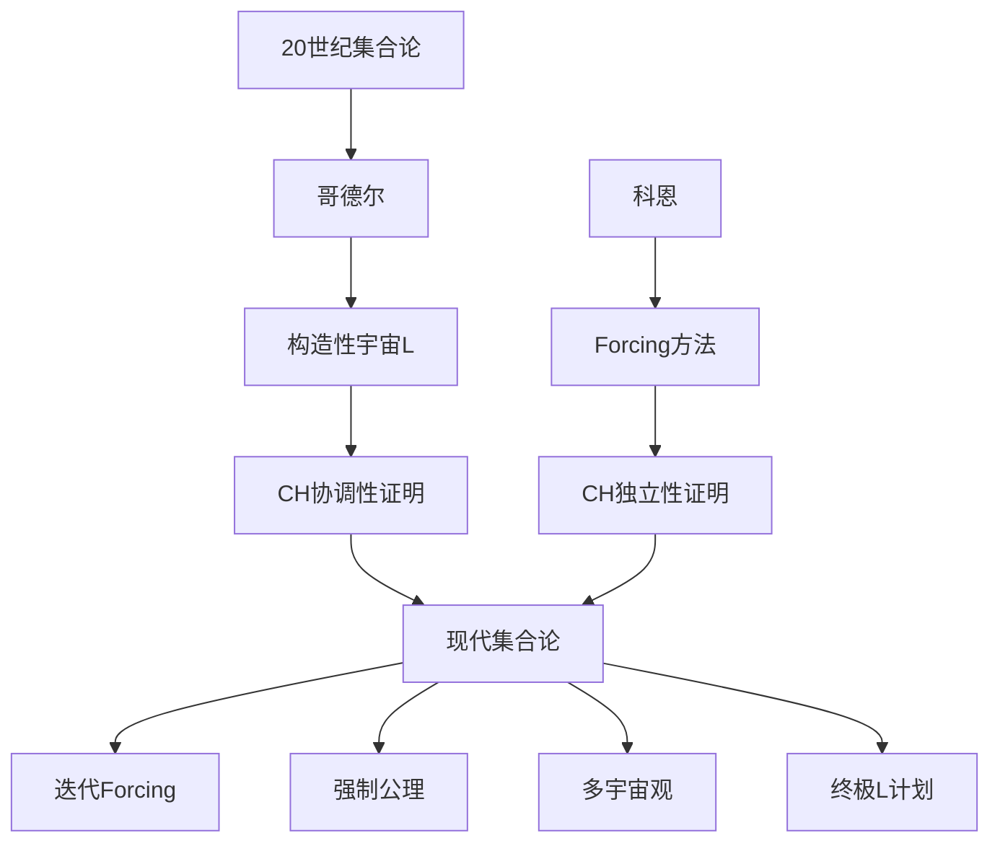

# 现代数学家对科恩的观点

**创建日期**: 2026年4月2日
**研究领域**: 科恩数学理念 - 现代视角与评价 - 现代数学家观点
**主题编号**: C.07.01 (Cohen.现代视角与评价.现代数学家观点)
**优先级**: P1（高优先级）⭐⭐⭐⭐

---

## 📋 目录

- [现代数学家对科恩的观点](#现代数学家对科恩的观点)
  - [一、评价概述](#一评价概述)
  - [二、集合论学家的评价](#二集合论学家的评价)
  - [三、数学基础学者的评价](#三数学基础学者的评价)
  - [四、逻辑学家的评价](#四逻辑学家的评价)
  - [五、其他领域数学家的评价](#五其他领域数学家的评价)
  - [六、综合评价](#六综合评价)

---

## 一、评价概述

### 1.1 历史地位

保罗·科恩（Paul Cohen，1934-2007）是20世纪最具影响力的数学家之一，他创立的Forcing方法彻底改变了集合论和数理逻辑的面貌。

**核心贡献的地位**：
- **Forcing方法**：集合论的核心技术工具
- **独立性证明**：解决希尔伯特第一问题
- **数学哲学影响**：多宇宙观的数学基础

### 1.2 评价的演变

| 时期 | 评价重点 |
|-----|---------|
| 1963-1970s | 希尔伯特问题的解决者 |
| 1980s-1990s | 集合论方法论的革新者 |
| 2000s-2010s | 数学基础的关键人物 |
| 2020s-至今 | 多宇宙观的先驱 |

---

## 二、集合论学家的评价

### 2.1 当代集合论领袖的评价

**休·伍丁**（Hugh Woodin，当代集合论领袖）：
> "科恩的Forcing方法是20世纪集合论最伟大的发明。它不仅解决了CH的独立性问题，更开启了一个全新的研究领域。今天，没有Forcing就无法想象现代集合论。"

**萨哈伦·谢拉**（Saharon Shelah，稳定性理论创立者）：
> "科恩的Forcing提供了构造模型的一种全新方式。与模型论方法不同，Forcing允许我们精确控制模型的性质。这种技术对我和我的学生的工作产生了深远影响。"

**威廉·休夫林**（William Hugh Woodin）：
> "科恩的工作引发了关于集合论终极真理的深层问题。终极L计划、武丁公理——这些都是对科恩挑战的回应。"

### 2.2 大基数理论学者的评价

**加布里埃尔·戈德堡**（Gabriel Goldberg）：
> "大基数理论与Forcing有着深刻的联系。科恩方法的可迭代性使得我们可以研究大基数在强制扩张下的行为。"

**拉尔夫·辛德勒**（Ralf Schindler）：
> "内模型理论的发展在很大程度上是对Forcing的回应。我们需要理解在什么情况下Forcing不能改变某些性质。"

### 2.3 描述集合论学者的评价

**亚历山大·基勒奇**（Alexander Kechris）：
> "描述集合论中的决定性公理研究离不开Forcing。随机和范畴力迫提供了研究正则性的重要工具。"

**唐纳德·马丁**（Donald A. Martin，决定性定理证明者）：
> "我关于分析决定性（Borel决定性）的工作使用了迭代Forcing。科恩的方法为证明确定性结果提供了技术基础。"

---

## 三、数学基础学者的评价

### 3.1 公理集合论学者的评价

**托马斯·杰赫**（Thomas Jech，《Set Theory》作者）：
> "我的书中有整整一章讲述Forcing。科恩的方法已经成为任何集合论学者必须掌握的基本技术。"

**肯尼思·库宁**（Kenneth Kunen，《Set Theory》作者）：
> "科恩的Forcing是20世纪数学最重要的技术突破之一。它将元数学思维转化为可操作的技术。"

### 3.2 数学哲学学者的评价

**佩内洛普·麦迪**（Penelope Maddy，数学哲学家）：
> "科恩的独立性结果对数学哲学产生了深远影响。它迫使我们重新思考数学真理的本质和公理选择的依据。"

**休·伍丁**（从哲学角度）：
> "科恩的工作提出了一个根本问题：如果CH没有确定的真理值，那么集合论的真理是什么？这引导我们探索新的公理。"

### 3.3 多宇宙观的评价

**乔尔·大卫·哈姆金斯**（Joel David Hamkins，多宇宙观倡导者）：
> "科恩的Forcing直接支持了集合论多宇宙观。每次Forcing都产生一个有效的集合论宇宙，没有唯一的'真实'宇宙。"

**约翰·斯蒂尔**（John R. Steel，终极L计划）：
> "虽然我是单宇宙观的支持者，但我承认科恩的挑战是严肃的。我们需要强有力的内在理由来选择公理。"

---

## 四、逻辑学家的评价

### 4.1 模型论学者的评价

**威尔弗里德·霍奇斯**（Wilfrid Hodges，《Model Theory》作者）：
> "科恩的Forcing是模型论历史上最重要的技术之一。它展示了如何通过外部扩展来改变模型的性质。"

**迈克尔·马凯**（Michael Makkai）：
> "从范畴论的角度看，Forcing与层论有深刻联系。这是几何逻辑与集合论交汇的地方。"

**陈蜃**（Saharon Shelah的学生，中国模型论学者）：
> "Shelah的稳定性理论在很大程度上是对模型论方法的革新，但他始终承认科恩Forcing在集合论中的核心地位。"

### 4.2 证明论学者的评价

**乌尔里希·科伦巴赫**（Ulrich Kohlenbach，证明挖掘）：
> "虽然科恩的工作主要在集合论，但他的方法也影响了证明论。理解强制扩张中的可计算性是一个活跃的研究领域。"

---

## 五、其他领域数学家的评价

### 5.1 拓扑学家的评价

**拓扑学界的观点**：
> "科恩的Forcing与布尔值代数有深刻联系。这启发我们使用拓扑方法研究集合论问题。"

**集合论拓扑学**：
> "Forcing在集合论拓扑学中有广泛应用。从βN到连续统的拓扑性质，Forcing提供了构造反例的强大工具。"

### 5.2 分析学家的评价

**测度论学者**：
> "随机Forcing与测度论有天然联系。科恩的方法为研究正则性性质提供了新的视角。"

**描述集合论与分析**：
> "科恩的工作使得我们可以精确控制实数集的性质。这对描述集合论和分析学都有重要意义。"

### 5.3 数学史家的评价

**约瑟夫·道本**（Joseph Dauben，数学史家）：
> "科恩的菲尔兹奖是实至名归的。他解决了希尔伯特第一问题，这是20世纪数学最重大的成就之一。"

**格雷厄姆·摩尔**（Gregory H. Moore，集合论史专家）：
> "科恩的Forcing方法代表了20世纪数学方法论的转折点。它展示了元数学技术如何解决实质性数学问题。"

---

## 六、综合评价

### 6.1 评价的维度

| 维度 | 评价 |
|-----|-----|
| 技术贡献 | 创立Forcing方法，解决CH独立性 |
| 方法论 | 元数学技术的典范 |
| 影响范围 | 集合论、数学基础、逻辑 |
| 持续性 | 至今仍是核心技术 |

### 6.2 历史定位

### 6.3 当代意义

**在21世纪的重要性**：

1. **集合论研究**：Forcing仍是核心工具
2. **数学基础**：独立性问题的深入研究
3. **数学哲学**：多宇宙观的讨论
4. **新公理探索**：终极L、武丁公理
5. **跨学科应用**：计算机科学的强制方法

### 6.4 科恩的遗产

**持久的学术遗产**：

> "科恩的Forcing方法不仅是一种技术，更是一种思维方式。它教会我们如何通过受控的扩展来探索数学宇宙的多样性。在21世纪，随着集合论新公理研究的深入，科恩的思想继续指引着我们。"
> —— 当代集合论学界的共识

**未完成的探索**：
- 新公理的内在必要性
- 集合论终极真理的问题
- Forcing在计算复杂性中的应用

---

**相关文档**：
- [02-最新研究进展](./02-最新研究进展.md)
- [03-未解决问题](./03-未解决问题.md)
- [../08-知识关联分析/01-概念关联网络.md](../08-知识关联分析/01-概念关联网络.md)

*最后更新：2026年4月2日*
