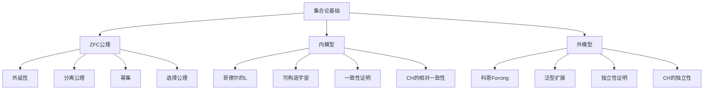
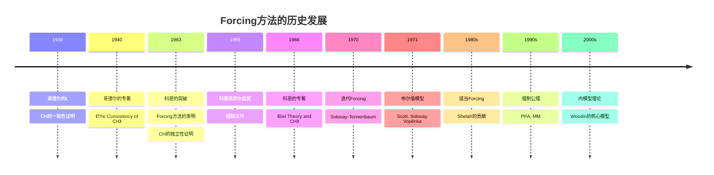

# 概念关联网络

**创建日期**: 2026年4月3日
**研究领域**: 科恩数学理念 - 知识关联分析 - 概念关联网络
**主题编号**: CO.08.01 (Cohen.知识关联.概念关联网络)
**优先级**: P1（高优先级）⭐⭐⭐⭐

---

## 📋 目录

- [概念关联网络](#概念关联网络)
  - [一、核心概念体系](#一核心概念体系)
  - [二、科恩理论的关联图谱](#二科恩理论的关联图谱)
  - [三、跨学科概念映射](#三跨学科概念映射)
  - [四、历史发展脉络](#四历史发展脉络)
  - [五、现代应用关联](#五现代应用关联)
  - [🔖 原始文献引用](../README.md)
  - [📚 现代研究文献](../README.md)

---

## 一、核心概念体系

### 1.1 科恩概念体系总览

科恩的工作围绕集合论独立性证明展开，形成了独特的概念网络。

```
┌─────────────────────────────────────────────────────────────┐
│                     科恩概念体系                            │
├─────────────────────────────────────────────────────────────┤
│  第一层：Forcing基础                                         │
│  ├── 部分序集（Forcing概念）                                 │
│  ├── 泛型滤子                                                │
│  └── 泛型扩展                                                │
├─────────────────────────────────────────────────────────────┤
│  第二层：独立性证明                                          │
│  ├── 连续统假设（CH）                                        │
│  ├── 选择公理（AC）                                          │
│  └── 相对一致性                                              │
├─────────────────────────────────────────────────────────────┤
│  第三层：技术扩展                                            │
│  ├── 迭代Forcing                                             │
│  ├── 适当Forcing                                             │
│  └── 强制公理                                                │
└─────────────────────────────────────────────────────────────┘
```

### 1.2 核心关系

**独立性关系**：
$$\text{ZFC} \nvdash \text{CH} \quad \text{且} \quad \text{ZFC} \nvdash \neg\text{CH}$$

**相对一致性**：
$$\text{Con(ZFC)} \to \text{Con(ZFC + \neg CH)}$$

---

## 二、科恩理论的关联图谱

### 2.1 Forcing概念图谱

```mermaid
graph TD
    A[Forcing] --> B[部分序集]
    A --> C[泛型滤子]
    A --> D[泛型扩展]
    
    B --> B1[Forcing条件]
    B --> B2[偏序关系 ≤]
    B --> B3[稠密集]
    
    C --> C1[泛型性]
    C --> C2[与稠密集相交]
    
    D --> D1[名称]
    D --> D2[解释函数]
    D --> D3[M[G]]
    
    A --> E[Forcing关系]
    E --> E1[p ⊩ φ]
    E --> E2[真值引理]
    
    D --> F[独立性证明]
    F --> F1[CH的独立性]
    F --> F2[AC的独立性]
```

### 2.2 集合论概念图谱



---

## 三、跨学科概念映射

### 3.1 集合论-拓扑映射

**Stone空间与布尔代数**：

| 集合论 | 拓扑 | 布尔代数 |
|-------|-----|---------|
| 泛型滤子 | 稠密开集 | 超滤 |
| 名称 | 层 | 布尔值集合 |
| 泛型扩展 | 层化空间 | 布尔值模型 |

### 3.2 集合论-逻辑映射

**模型论与集合论的联系**：

| 模型论 | 集合论 | 说明 |
|-------|-------|-----|
| 模型 | 传递集 | 结构解释 |
| 初等等价 | 泛型绝对性 | 不可区分性 |
| 超积 | 布尔值模型 | 构造方法 |
| 饱和模型 | 泛型扩展 | 丰富性 |

---

## 四、历史发展脉络

### 4.1 Forcing方法的历史源流



### 4.2 概念演化的分支图

```
科恩工作（1963）
├── Forcing方法论分支
│   ├── 基本Forcing
│   │   ├── Cohen Forcing
│   │   ├── 随机Forcing
│   │   └── 坍塌Forcing
│   ├── 迭代Forcing
│   │   ├── 有限支撑迭代
│   │   └── 可数支撑迭代
│   └── 适当Forcing
│       ├── 适当偏序
│       └── PFA
│
├── 独立性结果分支
│   ├── 连续统假设
│   ├── 选择公理
│   ├── Suslin假设
│   └── 大量组合学命题
│
└── 哲学影响分支
    ├── 多宇宙观点
    ├── 数学真理问题
    └── 新公理探索
```

---

## 五、现代应用关联

### 5.1 集合论在其他数学分支中的应用

**拓扑学中的应用**：

** Dowker空间的存在性**：
通过Forcing构造具有特殊性质的拓扑空间。

**测度论中的应用**：

**Solovay模型**：
在ZF + DC + "所有实数集Lebesgue可测"的模型中：
- 不可测集不存在
- 依赖选择公理（DC）成立
- AC不成立

### 5.2 递归论中的应用

**Forcing在计算理论中的应用**：

**构造特殊图灵度**：
使用Forcing方法构造具有特殊性质的图灵度。

**数学表述**：
$$\exists G \text{ 使得 } G \text{ 是泛型的，且 } \deg(G) \text{ 具有性质 } P$$

---

## 🔖 原始文献引用

1. **Cohen, P. J.** (1963). "The independence of the Continuum Hypothesis I". *PNAS*, 50, 1143-1148.
   - 证明CH独立性的开创性论文

2. **Cohen, P. J.** (1964). "The independence of the Continuum Hypothesis II". *PNAS*, 51, 105-110.
   - 证明CH独立性的第二部分

3. **Cohen, P. J.** (1966). *Set Theory and the Continuum Hypothesis*. W. A. Benjamin.
   - 科恩的经典专著

4. **Scott, D., & Solovay, R. M.** (1967). "Boolean-valued models of set theory". *Proceedings of the American Mathematical Society*, 18, 435-442.
   - 布尔值模型的开创性工作

5. **Shelah, S.** (1982). *Proper Forcing*. Springer.
   - 适当Forcing的奠基著作

---

## 📚 现代研究文献

1. **Kunen, K.** (1980). *Set Theory: An Introduction to Independence Proofs*. North-Holland.
   - Forcing方法的标准教材

2. **Jech, T.** (2003). *Set Theory* (3rd ed.). Springer.
   - 集合论的百科全书式参考书

3. **Woodin, W. H.** (2010). "The continuum hypothesis, the generic-multiverse of sets, and the Ω conjecture". In *Set Theory, Arithmetic, and Foundations of Mathematics*. Cambridge University Press.
   - 伍丁关于CH的最新研究

4. **Hamkins, J. D.** (2012). "The set-theoretic multiverse". *Review of Symbolic Logic*, 5, 416-449.
   - 多宇宙观点的奠基性论文

5. **Kanamori, A.** (2008). "Cohen and set theory". *Bulletin of Symbolic Logic*, 14, 351-378.
   - 科恩与集合论发展的综述

---

**文档结束**

*本文件是科恩数学理念体系的第08模块第01部分，属于知识关联分析主题。*
