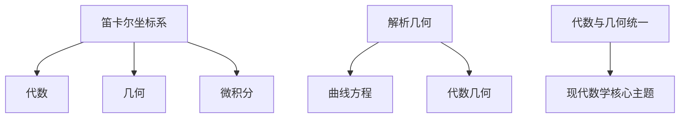

# 概念关联网络

**创建日期**: 2026年2月2日

---

## 一、核心概念

- **笛卡尔坐标系** → 代数、几何、微积分
- **解析几何** → 曲线方程、代数几何、微分几何
- **代数与几何统一** → 现代数学的核心主题

## 二、概念网络图

```mermaid
graph TB
    A[笛卡尔坐标系] --> B[代数]
    A --> C[几何]
    A --> D[微积分]
    E[解析几何] --> F[曲线方程]
    E --> G[代数几何]
    H[代数与几何统一] --> I[现代数学核心主题]
```

笛卡尔解析几何连接代数学、几何学、微积分、物理学。坐标系是实现代数与几何统一的基石，是微积分、微分几何发展的前提。
