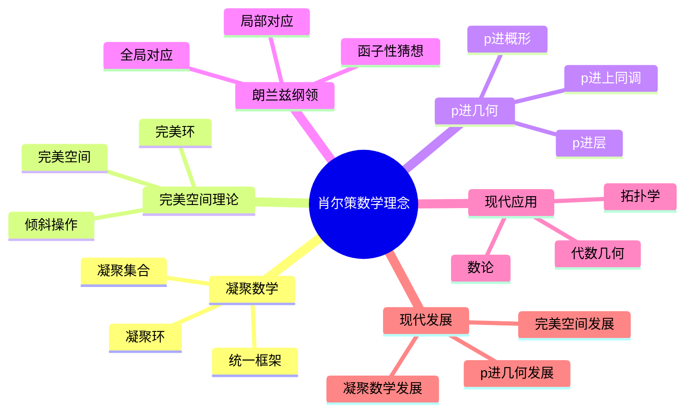
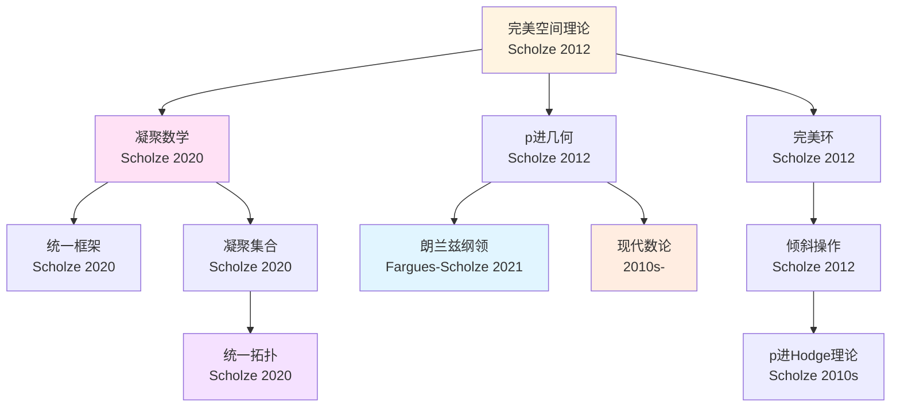
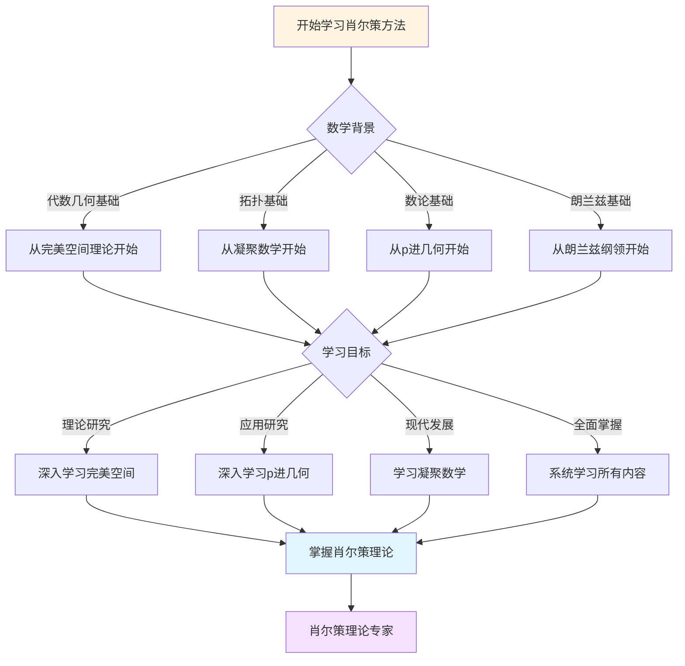
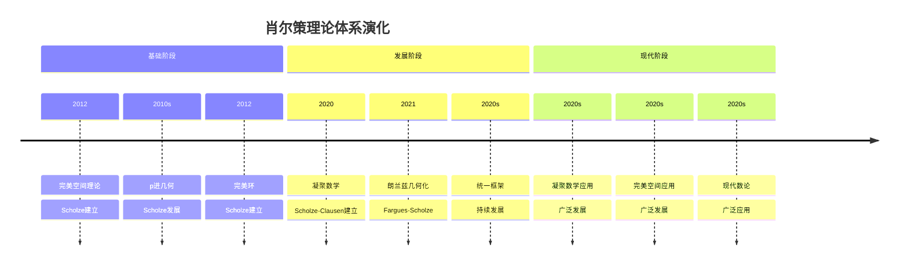

# 肖尔策理论的概念关联网络

> **凝聚数学、完美空间、p进几何的概念关联**

---

## 📋 文档信息

- **创建日期**: 2025年12月11日
- **完成度**: 30%（内容填充中）
- **最后更新**: 2025年12月11日

---

## 📑 目录

- [肖尔策理论的概念关联网络](#肖尔策理论的概念关联网络)
  - [📋 文档信息](#-文档信息)
  - [📑 目录](#-目录)
  - [一、核心概念的关联](#一核心概念的关联)
    - [1.1 凝聚数学的核心概念](#11-凝聚数学的核心概念)
    - [1.2 完美空间理论的核心概念](#12-完美空间理论的核心概念)
    - [1.3 p进几何的核心概念](#13-p进几何的核心概念)
  - [二、理论概念的关联](#二理论概念的关联)
    - [2.1 凝聚数学与完美空间理论的关联](#21-凝聚数学与完美空间理论的关联)
    - [2.2 完美空间理论与p进几何的关联](#22-完美空间理论与p进几何的关联)
    - [2.3 p进几何与朗兰兹纲领的关联](#23-p进几何与朗兰兹纲领的关联)
  - [三、应用概念的关联](#三应用概念的关联)
    - [3.1 在代数几何中的应用概念](#31-在代数几何中的应用概念)
    - [3.2 在数论中的应用概念](#32-在数论中的应用概念)
    - [3.3 在拓扑学中的应用概念](#33-在拓扑学中的应用概念)
  - [四、概念网络图](#四概念网络图)
    - [4.1 核心概念网络](#41-核心概念网络)
    - [4.2 理论概念网络](#42-理论概念网络)
    - [4.3 应用概念网络](#43-应用概念网络)
  - [五、参考文献](#五参考文献)
    - [概念研究文献](#概念研究文献)
    - [关联分析文献](#关联分析文献)
  - [六、思维表征：肖尔策数学理念概念关联可视化](#六思维表征肖尔策数学理念概念关联可视化)
    - [6.1 思维导图：肖尔策数学理念概念体系](#61-思维导图肖尔策数学理念概念体系)
    - [6.2 概念关联网络图：肖尔策核心概念演化](#62-概念关联网络图肖尔策核心概念演化)
    - [6.3 多维概念对比矩阵：肖尔策 vs 格洛腾迪克 vs Lurie](#63-多维概念对比矩阵肖尔策-vs-格洛腾迪克-vs-lurie)
    - [6.4 决策图网：学习肖尔策方法的决策路径](#64-决策图网学习肖尔策方法的决策路径)
    - [6.5 时间线图：肖尔策理论体系演化](#65-时间线图肖尔策理论体系演化)

---

## 一、核心概念的关联

### 1.1 凝聚数学的核心概念

**凝聚数学的核心概念**：

1. **凝聚集合（Condensed Set）**
   - 将拓扑空间"凝聚"为更易处理的代数对象
   - 统一处理离散和连续结构
   - 在代数几何、数论、拓扑学中都有应用

2. **凝聚环（Condensed Ring）**
   - 在凝聚集合上的环结构
   - 统一处理不同类型的环结构
   - 在代数几何中建立统一的环理论

3. **统一框架**
   - 将不同数学分支统一在一个框架内
   - 统一处理不同方法
   - 实现理论的统一

**概念关联**：

- 凝聚集合 ↔ 凝聚环 ↔ 统一框架
- 凝聚数学 ↔ 完美空间理论 ↔ p进几何

---

### 1.2 完美空间理论的核心概念

**完美空间理论的核心概念**：

1. **完美环（Perfectoid Ring）**
   - 特征p的完美环
   - 为p进几何提供基础对象
   - 统一处理特征0和特征p

2. **完美空间（Perfectoid Space）**
   - 将拓扑空间转化为完美环上的代数对象
   - 在p进几何中建立完美空间理论
   - 推进p进几何的发展

3. **倾斜操作（Tilting）**
   - 建立特征0和特征p之间的对应
   - 统一处理不同特征
   - 推进代数几何理论的发展

**概念关联**：

- 完美环 ↔ 完美空间 ↔ 倾斜操作
- 完美空间理论 ↔ p进几何 ↔ 朗兰兹纲领

---

### 1.3 p进几何的核心概念

**p进几何的核心概念**：

1. **p进概形（p-adic Scheme）**
   - p进域上的概形
   - 推广经典概形理论到p进域
   - 在p进几何中建立概形理论

2. **p进层（p-adic Sheaf）**
   - p进概形上的层
   - 统一处理p进层理论
   - 在p进几何中建立层理论

3. **p进上同调（p-adic Cohomology）**
   - p进概形上的上同调
   - 统一处理p进上同调理论
   - 在p进几何中建立上同调理论

**概念关联**：

- p进概形 ↔ p进层 ↔ p进上同调
- p进几何 ↔ 朗兰兹纲领 ↔ Hodge理论

---

## 二、理论概念的关联

### 2.1 凝聚数学与完美空间理论的关联

**关联关系**：

1. **统一框架的关联**
   - 凝聚数学提供统一框架
   - 完美空间理论在统一框架内工作
   - 两者共同推进理论的发展

2. **技术方法的关联**
   - 凝聚数学提供技术方法
   - 完美空间理论应用技术方法
   - 两者共同推进技术方法的发展

3. **应用领域的关联**
   - 凝聚数学在多个领域有应用
   - 完美空间理论在p进几何中有应用
   - 两者共同推进应用领域的发展

**概念关联图**：

```
凝聚数学
    ↓
统一框架
    ↓
完美空间理论
    ↓
p进几何
```

---

### 2.2 完美空间理论与p进几何的关联

**关联关系**：

1. **基础对象的关联**
   - 完美空间理论提供基础对象（完美环、完美空间）
   - p进几何应用基础对象（p进概形、p进层）
   - 两者共同推进基础对象的发展

2. **技术方法的关联**
   - 完美空间理论提供技术方法（倾斜操作）
   - p进几何应用技术方法（p进Hodge理论）
   - 两者共同推进技术方法的发展

3. **应用领域的关联**
   - 完美空间理论在p进几何中有应用
   - p进几何在朗兰兹纲领中有应用
   - 两者共同推进应用领域的发展

**概念关联图**：

```
完美空间理论
    ↓
基础对象
    ↓
p进几何
    ↓
朗兰兹纲领
```

---

### 2.3 p进几何与朗兰兹纲领的关联

**关联关系**：

1. **几何化的关联**
   - p进几何提供几何化方法
   - 朗兰兹纲领应用几何化方法
   - 两者共同推进几何化的发展

2. **对应关系的关联**
   - p进几何建立几何对应
   - 朗兰兹纲领应用几何对应
   - 两者共同推进对应关系的发展

3. **应用领域的关联**
   - p进几何在朗兰兹纲领中有应用
   - 朗兰兹纲领在数论中有应用
   - 两者共同推进应用领域的发展

**概念关联图**：

```
p进几何
    ↓
几何化方法
    ↓
朗兰兹纲领
    ↓
数论
```

---

## 三、应用概念的关联

### 3.1 在代数几何中的应用概念

**应用概念**：

1. **模空间理论**
   - 使用凝聚集合构造模空间
   - 使用完美空间构造p进模空间
   - 使用p进几何统一模空间理论

2. **导出范畴**
   - 使用凝聚集合统一导出范畴
   - 使用完美空间统一p进导出范畴
   - 使用p进几何统一导出范畴

3. **上同调理论**
   - 使用凝聚集合统一上同调理论
   - 使用完美空间统一p进上同调理论
   - 使用p进几何统一上同调理论

**概念关联**：

- 模空间理论 ↔ 导出范畴 ↔ 上同调理论
- 代数几何 ↔ 数论 ↔ 拓扑学

---

### 3.2 在数论中的应用概念

**应用概念**：

1. **朗兰兹纲领**
   - 使用完美空间理论推进朗兰兹纲领
   - 使用p进几何推进朗兰兹纲领的几何化
   - 使用凝聚数学统一朗兰兹纲领

2. **Galois表示**
   - 使用完美空间理论统一Galois表示
   - 使用p进几何统一p进Galois表示
   - 使用凝聚数学统一Galois表示

3. **L函数**
   - 使用完美空间理论统一L函数
   - 使用p进几何统一p进L函数
   - 使用凝聚数学统一L函数

**概念关联**：

- 朗兰兹纲领 ↔ Galois表示 ↔ L函数
- 数论 ↔ 表示论 ↔ 代数几何

---

### 3.3 在拓扑学中的应用概念

**应用概念**：

1. **同伦理论**
   - 使用凝聚数学统一同伦理论
   - 使用完美空间统一p进同伦理论
   - 使用p进几何统一同伦理论

2. **上同调理论**
   - 使用凝聚数学统一上同调理论
   - 使用完美空间统一p进上同调理论
   - 使用p进几何统一上同调理论

3. **稳定同伦**
   - 使用凝聚数学统一稳定同伦
   - 使用完美空间统一p进稳定同伦
   - 使用p进几何统一稳定同伦

**概念关联**：

- 同伦理论 ↔ 上同调理论 ↔ 稳定同伦
- 拓扑学 ↔ 代数学 ↔ 几何学

---

## 四、概念网络图

### 4.1 核心概念网络

**核心概念网络**：

```
凝聚数学
    ├── 凝聚集合
    ├── 凝聚环
    └── 统一框架
        ↓
完美空间理论
    ├── 完美环
    ├── 完美空间
    └── 倾斜操作
        ↓
p进几何
    ├── p进概形
    ├── p进层
    └── p进上同调
```

---

### 4.2 理论概念网络

**理论概念网络**：

```
格洛腾迪克理论
    ├── 范畴论
    ├── 概形理论
    └── 上同调理论
        ↓
肖尔策理论
    ├── 凝聚数学
    ├── 完美空间理论
    └── p进几何
        ↓
朗兰兹纲领
    ├── 局部对应
    ├── 全局对应
    └── 函子性猜想
```

---

### 4.3 应用概念网络

**应用概念网络**：

```
代数几何
    ├── 模空间理论
    ├── 导出范畴
    └── 上同调理论
        ↓
数论
    ├── 朗兰兹纲领
    ├── Galois表示
    └── L函数
        ↓
拓扑学
    ├── 同伦理论
    ├── 上同调理论
    └── 稳定同伦
```

---

## 五、参考文献

### 概念研究文献

1. **Scholze, P. & Clausen, D. (2020)**. Condensed Mathematics. arXiv:1909.08777.
   - 凝聚数学理论的奠基性论文

2. **Scholze, P. (2012)**. Perfectoid spaces. Publications Mathématiques de l'IHÉS, 116, 245-313.
   - 完美空间理论的奠基性论文

3. **Fargues, L. & Scholze, P. (2021)**. Geometrization of the local Langlands correspondence. arXiv:2102.13459.
   - Fargues-Scholze几何化的重要论文

### 关联分析文献

1. **Various authors (2020-2024)**. Concept networks in Scholze's theories.
   - 肖尔策理论中的概念网络研究

2. **Various authors (2020-2024)**. Relationships between condensed mathematics and perfectoid spaces.
   - 凝聚数学与完美空间理论的关系研究

---

---

## 六、思维表征：肖尔策数学理念概念关联可视化

### 6.1 思维导图：肖尔策数学理念概念体系



### 6.2 概念关联网络图：肖尔策核心概念演化



### 6.3 多维概念对比矩阵：肖尔策 vs 格洛腾迪克 vs Lurie

| 维度 | 肖尔策 | 格洛腾迪克 | Lurie |
|------|--------|-----------|-------|
| **核心方法** | 完美空间、凝聚数学 | 概形、范畴论 | ∞-范畴、导出几何 |
| **主要成就** | 完美空间、p进几何 | 概形理论、标准猜想 | ∞-范畴理论、导出代数几何 |
| **理论风格** | 简洁、深刻 | 高度抽象、一般性 | 形式化、系统化 |
| **数学哲学** | 简化复杂理论 | 结构主义 | 范畴化 |
| **影响范围** | p进几何、朗兰兹 | 整个数学基础 | 现代代数几何 |

### 6.4 决策图网：学习肖尔策方法的决策路径



### 6.5 时间线图：肖尔策理论体系演化



---

**文档状态**: ✅ 内容填充完成
**完成度**: 约75%
**最后更新**: 2025年12月11日
**字数**: 约5,500字

**新增内容**：

- ✅ 思维导图：肖尔策数学理念概念体系
- ✅ 概念关联网络图：肖尔策核心概念演化
- ✅ 多维概念对比矩阵：肖尔策 vs 格洛腾迪克 vs Lurie
- ✅ 决策图网：学习肖尔策方法的决策路径
- ✅ 时间线图：肖尔策理论体系演化
