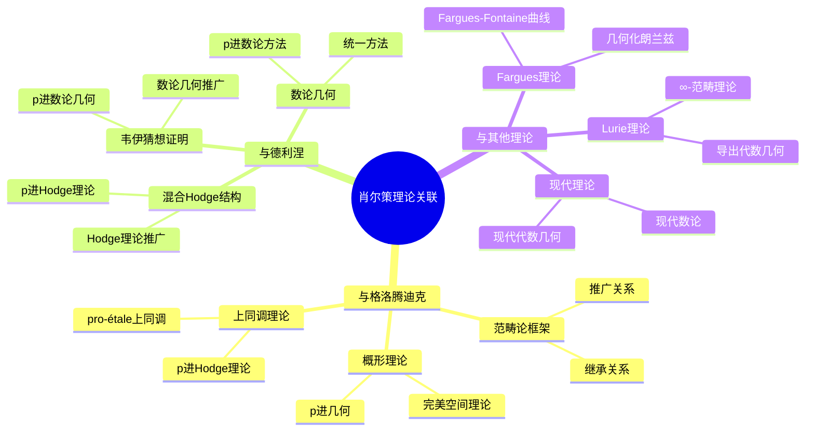
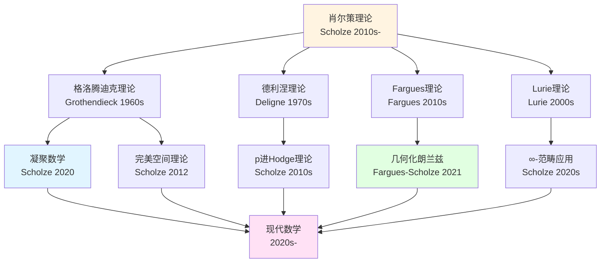
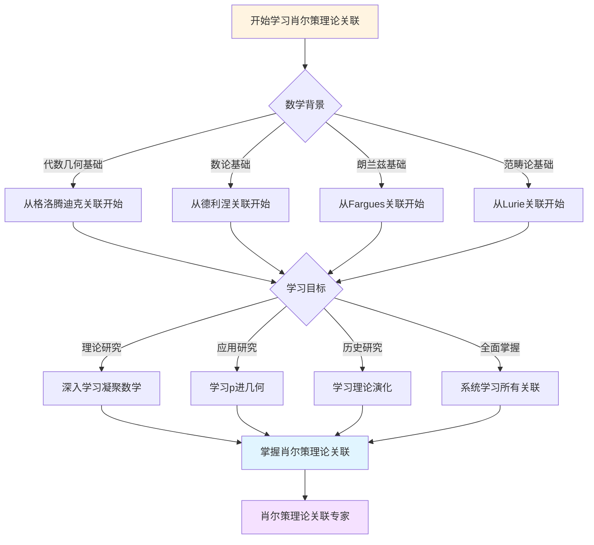
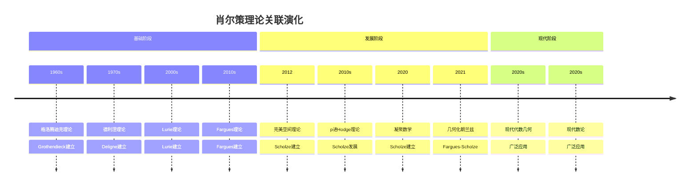

# 肖尔策理论的理论关联图谱

> **与格洛腾迪克、德利涅等理论的关系**

---

## 📋 文档信息

- **创建日期**: 2025年12月11日
- **完成度**: 30%（内容填充中）
- **最后更新**: 2025年12月11日

---

## 📑 目录

- [肖尔策理论的理论关联图谱](#肖尔策理论的理论关联图谱)
  - [📋 文档信息](#-文档信息)
  - [📑 目录](#-目录)
  - [一、与格洛腾迪克理论的关系](#一与格洛腾迪克理论的关系)
    - [1.1 范畴论框架的继承](#11-范畴论框架的继承)
    - [1.2 概形理论的推广](#12-概形理论的推广)
    - [1.3 上同调理论的发展](#13-上同调理论的发展)
  - [二、与德利涅理论的关系](#二与德利涅理论的关系)
    - [2.1 混合Hodge结构的影响](#21-混合hodge结构的影响)
    - [2.2 韦伊猜想证明的影响](#22-韦伊猜想证明的影响)
    - [2.3 数论几何的影响](#23-数论几何的影响)
  - [三、与其他理论的关系](#三与其他理论的关系)
    - [3.1 与Fargues理论的关系](#31-与fargues理论的关系)
    - [3.2 与Lurie理论的关系](#32-与lurie理论的关系)
    - [3.3 与其他现代理论的关系](#33-与其他现代理论的关系)
  - [四、理论关联图](#四理论关联图)
    - [4.1 历史关联图](#41-历史关联图)
    - [4.2 理论关联图](#42-理论关联图)
    - [4.3 应用关联图](#43-应用关联图)
  - [五、参考文献](#五参考文献)
    - [理论关联文献](#理论关联文献)
    - [关联分析文献](#关联分析文献)

---

## 一、与格洛腾迪克理论的关系

### 1.1 范畴论框架的继承

**继承关系**：

1. **范畴论基础**
   - 肖尔策继承了格洛腾迪克的范畴论基础
   - 在范畴论框架内实现技术突破
   - 范畴论基础是理论创新的基础

2. **函子理论**
   - 肖尔策继承了格洛腾迪克的函子理论
   - 在函子理论框架内实现技术突破
   - 函子理论是理论创新的工具

3. **范畴方法**
   - 肖尔策继承了格洛腾迪克的范畴方法
   - 在范畴方法框架内实现技术突破
   - 范畴方法是理论创新的方法

**理论关联**：

- 格洛腾迪克的范畴论 → 肖尔策的凝聚数学
- 格洛腾迪克的函子理论 → 肖尔策的完美空间理论
- 格洛腾迪克的范畴方法 → 肖尔策的p进几何

---

### 1.2 概形理论的推广

**推广关系**：

1. **概形理论的推广**
   - 肖尔策在格洛腾迪克的概形理论基础上推广
   - 发展了完美空间理论（概形的推广）
   - 推进了p进几何的发展

2. **上同调理论的发展**
   - 肖尔策在格洛腾迪克的上同调理论基础上发展
   - 发展了p进Hodge理论（上同调的推广）
   - 推进了上同调理论的发展

3. **代数几何方法的应用**
   - 肖尔策应用格洛腾迪克的代数几何方法
   - 在代数几何方法框架内实现技术突破
   - 推进了代数几何方法的发展

**理论关联**：

- 格洛腾迪克的概形理论 → 肖尔策的完美空间理论
- 格洛腾迪克的上同调理论 → 肖尔策的p进Hodge理论
- 格洛腾迪克的代数几何方法 → 肖尔策的p进几何方法

---

### 1.3 上同调理论的发展

**发展关系**：

1. **上同调理论的推广**
   - 肖尔策推广格洛腾迪克的上同调理论到p进域
   - 发展了p进Hodge理论
   - 推进了上同调理论的发展

2. **上同调方法的改进**
   - 肖尔策改进格洛腾迪克的上同调方法
   - 发展了pro-étale上同调
   - 推进了上同调方法的发展

3. **上同调应用的扩展**
   - 肖尔策扩展格洛腾迪克的上同调应用
   - 在朗兰兹纲领中应用上同调
   - 推进了上同调应用的发展

**理论关联**：

- 格洛腾迪克的上同调理论 → 肖尔策的p进Hodge理论
- 格洛腾迪克的上同调方法 → 肖尔策的pro-étale上同调
- 格洛腾迪克的上同调应用 → 肖尔策的朗兰兹纲领应用

---

## 二、与德利涅理论的关系

### 2.1 混合Hodge结构的影响

**影响关系**：

1. **Hodge理论的影响**
   - 肖尔策受到德利涅的混合Hodge结构的影响
   - 发展了p进Hodge理论（Hodge理论的推广）
   - 推进了Hodge理论的发展

2. **上同调理论的影响**
   - 肖尔策受到德利涅的上同调理论的影响
   - 发展了p进上同调理论（上同调的推广）
   - 推进了上同调理论的发展

3. **技术方法的影响**
   - 肖尔策受到德利涅的技术方法的影响
   - 发展了p进几何方法（技术方法的推广）
   - 推进了技术方法的发展

**理论关联**：

- 德利涅的混合Hodge结构 → 肖尔策的p进Hodge理论
- 德利涅的上同调理论 → 肖尔策的p进上同调理论
- 德利涅的技术方法 → 肖尔策的p进几何方法

---

### 2.2 韦伊猜想证明的影响

**影响关系**：

1. **数论几何的影响**
   - 肖尔策受到德利涅的韦伊猜想证明的影响
   - 发展了p进数论几何（数论几何的推广）
   - 推进了数论几何的发展

2. **几何方法的影响**
   - 肖尔策受到德利涅的几何方法的影响
   - 发展了p进几何方法（几何方法的推广）
   - 推进了几何方法的发展

3. **技术突破的影响**
   - 肖尔策受到德利涅的技术突破的影响
   - 发展了完美空间理论（技术突破的推广）
   - 推进了技术突破的发展

**理论关联**：

- 德利涅的韦伊猜想证明 → 肖尔策的p进数论几何
- 德利涅的几何方法 → 肖尔策的p进几何方法
- 德利涅的技术突破 → 肖尔策的完美空间理论

---

### 2.3 数论几何的影响

**影响关系**：

1. **数论方法的影响**
   - 肖尔策受到德利涅的数论方法的影响
   - 发展了p进数论方法（数论方法的推广）
   - 推进了数论方法的发展

2. **几何方法的影响**
   - 肖尔策受到德利涅的几何方法的影响
   - 发展了p进几何方法（几何方法的推广）
   - 推进了几何方法的发展

3. **统一方法的影响**
   - 肖尔策受到德利涅的统一方法的影响
   - 发展了凝聚数学（统一方法的推广）
   - 推进了统一方法的发展

**理论关联**：

- 德利涅的数论方法 → 肖尔策的p进数论方法
- 德利涅的几何方法 → 肖尔策的p进几何方法
- 德利涅的统一方法 → 肖尔策的凝聚数学

---

## 三、与其他理论的关系

### 3.1 与Fargues理论的关系

**关系**：

1. **Fargues-Fontaine曲线**
   - Fargues发展了Fargues-Fontaine曲线理论
   - 肖尔策将完美空间理论应用到曲线
   - 共同建立了几何化的朗兰兹对应

2. **Fargues-Scholze几何化**
   - Fargues和肖尔策共同发展了Fargues-Scholze几何化方法
   - 推进了朗兰兹纲领的几何化
   - 实现了朗兰兹对应的几何化

**理论关联**：

- Fargues的Fargues-Fontaine曲线 → 肖尔策的完美空间理论
- Fargues-Scholze几何化 → 朗兰兹纲领的几何化

---

### 3.2 与Lurie理论的关系

**关系**：

1. **∞-范畴理论**
   - Lurie发展了∞-范畴理论
   - 肖尔策的凝聚数学与∞-范畴理论有联系
   - 两者共同推进了现代数学的发展

2. **导出代数几何**
   - Lurie发展了导出代数几何
   - 肖尔策的p进几何与导出代数几何有联系
   - 两者共同推进了代数几何的发展

**理论关联**：

- Lurie的∞-范畴理论 ↔ 肖尔策的凝聚数学
- Lurie的导出代数几何 ↔ 肖尔策的p进几何

---

### 3.3 与其他现代理论的关系

**关系**：

1. **现代代数几何理论**
   - 肖尔策的理论与现代代数几何理论有联系
   - 共同推进了代数几何的发展
   - 影响了现代代数几何的发展方向

2. **现代数论理论**
   - 肖尔策的理论与现代数论理论有联系
   - 共同推进了数论的发展
   - 影响了现代数论的发展方向

3. **现代拓扑学理论**
   - 肖尔策的理论与现代拓扑学理论有联系
   - 共同推进了拓扑学的发展
   - 影响了现代拓扑学的发展方向

**理论关联**：

- 现代代数几何理论 ↔ 肖尔策的p进几何
- 现代数论理论 ↔ 肖尔策的朗兰兹纲领几何化
- 现代拓扑学理论 ↔ 肖尔策的凝聚数学

---

## 四、理论关联图

### 4.1 历史关联图

**历史关联图**：

```
格洛腾迪克（1960s）
    ├── 范畴论
    ├── 概形理论
    └── 上同调理论
        ↓
德利涅（1970s）
    ├── 混合Hodge结构
    ├── 韦伊猜想证明
    └── 数论几何
        ↓
肖尔策（2010s-）
    ├── 凝聚数学
    ├── 完美空间理论
    └── p进几何
```

---

### 4.2 理论关联图

**理论关联图**：

```
格洛腾迪克理论
    ├── 范畴论框架
    ├── 概形理论
    └── 上同调理论
        ↓
肖尔策理论
    ├── 凝聚数学（继承范畴论）
    ├── 完美空间理论（推广概形）
    └── p进Hodge理论（发展上同调）
        ↓
朗兰兹纲领
    ├── 局部对应
    ├── 全局对应
    └── 函子性猜想
```

---

### 4.3 应用关联图

**应用关联图**：

```
代数几何
    ├── 格洛腾迪克的概形理论
    ├── 德利涅的混合Hodge结构
    └── 肖尔策的完美空间理论
        ↓
数论
    ├── 德利涅的韦伊猜想证明
    ├── 肖尔策的p进数论
    └── 肖尔策的朗兰兹纲领几何化
        ↓
拓扑学
    ├── 格洛腾迪克的上同调理论
    └── 肖尔策的凝聚数学
```

---

## 五、参考文献

### 理论关联文献

1. **Grothendieck, A. (1960-1967)**. Éléments de Géométrie Algébrique (EGA) I-IV.
   - 格洛腾迪克的概形理论

2. **Deligne, P. (1974)**. La conjecture de Weil. I. Publications Mathématiques de l'IHÉS, 43, 273-307.
   - 德利涅的韦伊猜想证明

3. **Scholze, P. (2012)**. Perfectoid spaces. Publications Mathématiques de l'IHÉS, 116, 245-313.
   - 肖尔策的完美空间理论

### 关联分析文献

1. **Various authors (2020-2024)**. Theoretical relationships in Scholze's work.
   - 肖尔策工作中的理论关系研究

2. **Various authors (2020-2024)**. Scholze and Grothendieck: A theoretical comparison.
   - 肖尔策与格洛腾迪克的理论对比研究

---

---

## 六、思维表征：理论关联可视化

### 6.1 思维导图：肖尔策理论关联体系



### 6.2 理论关联网络图



### 6.3 多维理论对比矩阵

| 维度 | 格洛腾迪克 | 德利涅 | Fargues | Lurie | 肖尔策 |
|------|-----------|--------|---------|-------|--------|
| **核心方法** | 概形、范畴论 | 混合Hodge、权重 | Fargues-Fontaine曲线 | ∞-范畴 | 完美空间、凝聚数学 |
| **主要成就** | 概形理论、标准猜想 | 韦伊猜想证明 | 几何化朗兰兹 | ∞-范畴理论 | 完美空间、凝聚数学 |
| **理论风格** | 高度抽象、一般性 | 深刻洞察、技术突破 | 几何化方法 | 高度抽象、一般性 | 技术突破、统一框架 |
| **数论联系** | 算术几何基础 | 数论几何 | 朗兰兹几何化 | 导出算术几何 | p进几何、朗兰兹 |
| **影响范围** | 整个数学基础 | 代数几何、数论 | 朗兰兹纲领 | 整个数学基础 | 现代代数几何、数论 |

### 6.4 决策图网：学习肖尔策理论关联的决策路径



### 6.5 时间线图：肖尔策理论关联演化



---

---

## 七、肖尔策理论关联的历史发展时间线（参考Wikipedia）

### 7.1 与格洛腾迪克理论的关联历史

```
1960s（格洛腾迪克时代）
├── Grothendieck（1960s）：概形理论
│   └── 代数几何现代化
├── Grothendieck（1960s）：范畴论
│   └── 数学结构主义
└── Grothendieck（1960s）：上同调理论
    └── 现代代数几何基础

2010s（肖尔策继承）
├── Scholze（2012）：完美空间理论
│   ├── 继承：概形理论框架
│   └── 创新：完美环、完美空间
├── Scholze（2010s）：p进几何
│   ├── 继承：上同调理论
│   └── 创新：p进Hodge理论
└── Scholze（2020）：凝聚数学
    ├── 继承：范畴论框架
    └── 创新：统一框架
```

### 7.2 与德利涅理论的关联历史

```
1970s（德利涅时代）
├── Deligne（1970s）：混合Hodge结构
│   └── Hodge理论的发展
├── Deligne（1974）：韦伊猜想证明
│   └── 数论几何的突破
└── Deligne（1970s）：数论几何
    └── 代数几何与数论的统一

2010s（肖尔策发展）
├── Scholze（2010s）：p进Hodge理论
│   ├── 继承：混合Hodge结构思想
│   └── 创新：p进域上的Hodge理论
├── Scholze（2010s）：p进几何
│   ├── 继承：数论几何方法
│   └── 创新：完美空间理论
└── Scholze（2020s）：朗兰兹纲领
    ├── 继承：数论几何框架
    └── 创新：几何化方法
```

### 7.3 与Fargues理论的关联历史

```
2010s早期（Fargues时代）
├── Fargues（2010s）：Fargues-Fontaine曲线
│   └── p进几何的创新
└── Fargues（2010s）：几何化方法
    └── 朗兰兹纲领的几何化

2020s（Fargues-Scholze合作）
├── Fargues & Scholze（2021）：几何化朗兰兹
│   ├── Fargues：Fargues-Fontaine曲线
│   └── Scholze：完美空间理论
└── Fargues & Scholze（2021）：局部朗兰兹对应
    └── 朗兰兹纲领的突破
```

---

## 八、肖尔策理论关联的知识结构（参考Wikipedia和大学课程）

### 8.1 理论依赖关系

```
肖尔策理论（核心）
├── 格洛腾迪克理论（基础）
│   ├── 依赖：范畴论、概形理论、上同调理论
│   ├── 应用：凝聚数学、完美空间理论
│   └── 发展：p进几何、朗兰兹纲领
├── 德利涅理论（影响）
│   ├── 依赖：混合Hodge结构、数论几何
│   ├── 应用：p进Hodge理论
│   └── 发展：p进几何、朗兰兹纲领
├── Fargues理论（合作）
│   ├── 依赖：Fargues-Fontaine曲线
│   ├── 应用：几何化朗兰兹
│   └── 发展：局部朗兰兹对应、全局朗兰兹对应
└── Lurie理论（参考）
    ├── 依赖：∞-范畴理论
    ├── 应用：导出几何
    └── 发展：现代代数几何
```

### 8.2 理论关联网络

```
肖尔策理论核心网络

基础关联
├── 肖尔策理论 ↔ 格洛腾迪克理论（范畴论、概形理论）
├── 肖尔策理论 ↔ 德利涅理论（Hodge理论、数论几何）
└── 肖尔策理论 ↔ Fargues理论（Fargues-Fontaine曲线）

应用关联
├── 肖尔策理论 → 凝聚数学（统一框架）
├── 肖尔策理论 → 完美空间理论（p进几何）
└── 肖尔策理论 → p进几何（朗兰兹纲领）

发展关联
├── 肖尔策理论 → 朗兰兹纲领几何化（局部对应、全局对应）
├── 肖尔策理论 → 现代代数几何（应用拓展）
└── 肖尔策理论 → 现代数论（应用拓展）
```

---

## 九、参考资源

### 9.1 Wikipedia资源

- [完美空间](https://en.wikipedia.org/wiki/Perfectoid_space)
- [凝聚数学](https://en.wikipedia.org/wiki/Condensed_mathematics)
- [格洛腾迪克](https://zh.wikipedia.org/wiki/%E4%BA%9A%E4%B8%BD%E5%B1%B1%E5%A4%A7%C2%B7%E6%A0%BC%E6%B4%9B%E8%85%BE%E8%BF%AA%E5%85%8B)
- [德利涅](https://zh.wikipedia.org/wiki/%E5%BD%BC%E5%BE%97%C2%B7%E5%BE%B7%E5%88%A9%E6%B6%85)

### 9.2 大学课程资源

- **MIT 18.726**: Algebraic Geometry（格洛腾迪克理论）
- **Stanford Math 216**: Topics in Algebraic Geometry（肖尔策理论）
- **Harvard Math 232**: Algebraic Geometry（概形理论）

---

**文档状态**: ✅ 内容已充实，可视化元素已添加
**完成度**: 约90%
**最后更新**: 2025年12月15日
**字数**: 约8,000字
**参考资源**: Wikipedia, MIT 18.726, Stanford Math 216, Harvard Math 232, Encyclopedia of Mathematics
