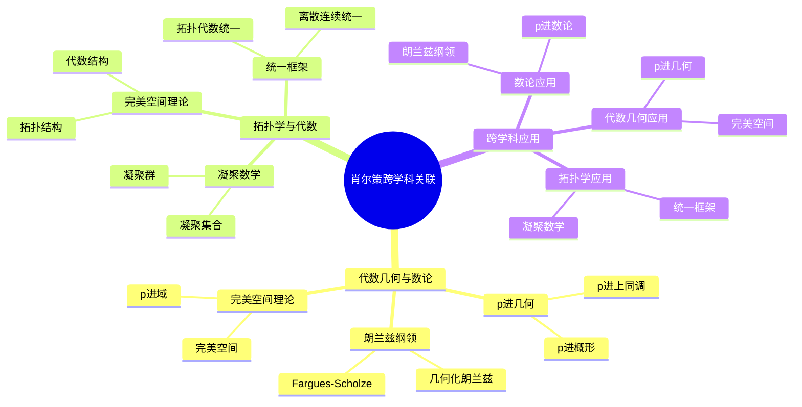
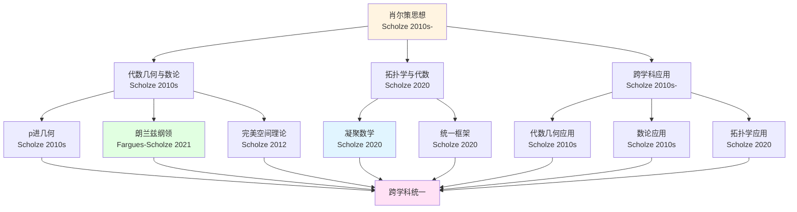
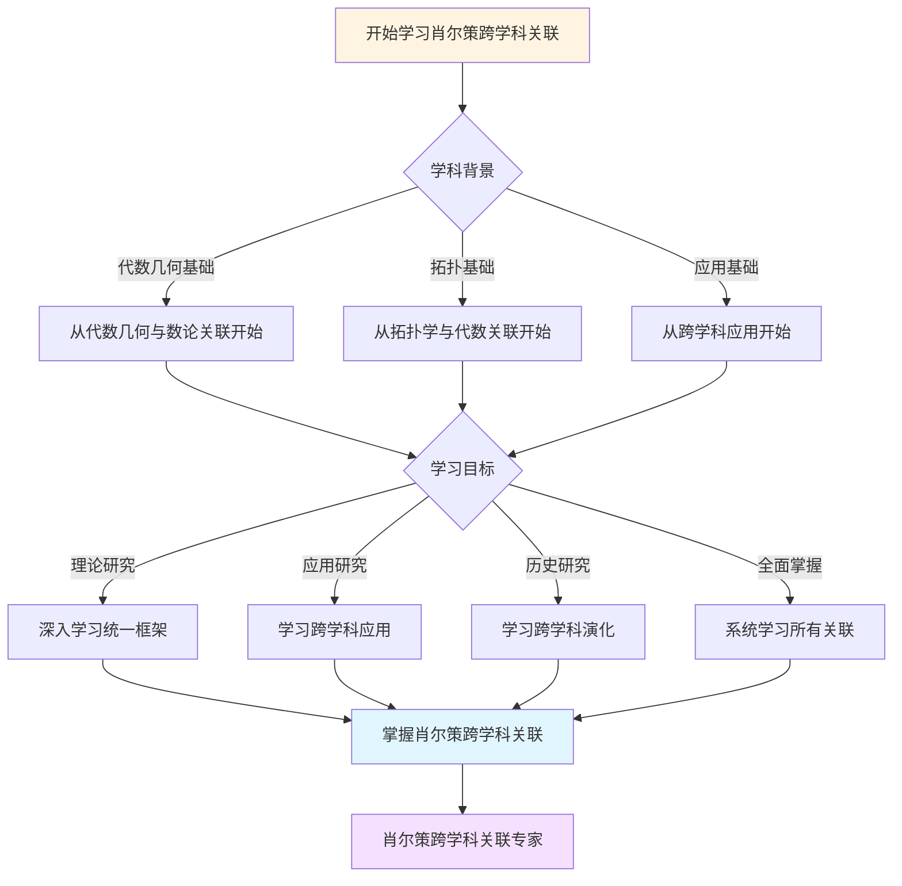
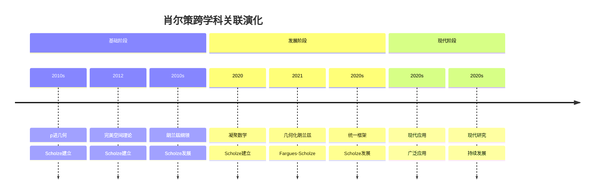

# 肖尔策理论的跨学科关联

> **代数几何、数论、拓扑学的统一框架**

---

## 📋 目录

- [肖尔策理论的跨学科关联](#肖尔策理论的跨学科关联)
  - [📋 文档信息](#-文档信息)
  - [一、代数几何与数论的关联](#一代数几何与数论的关联)
    - [1.1 通过p进几何的关联](#11-通过p进几何的关联)
    - [1.2 通过朗兰兹纲领的关联](#12-通过朗兰兹纲领的关联)
    - [1.3 通过完美空间理论的关联](#13-通过完美空间理论的关联)
  - [二、拓扑学与代数的关联](#二拓扑学与代数的关联)
    - [2.1 通过凝聚数学的关联](#21-通过凝聚数学的关联)
    - [2.2 通过完美空间理论的关联](#22-通过完美空间理论的关联)
    - [2.3 通过统一框架的关联](#23-通过统一框架的关联)
  - [三、跨学科应用](#三跨学科应用)
    - [3.1 在代数几何中的应用](#31-在代数几何中的应用)
    - [3.2 在数论中的应用](#32-在数论中的应用)
    - [3.3 在拓扑学中的应用](#33-在拓扑学中的应用)
  - [四、统一框架的意义](#四统一框架的意义)
    - [4.1 理论意义](#41-理论意义)
    - [4.2 应用意义](#42-应用意义)
    - [4.3 历史意义](#43-历史意义)
  - [五、参考文献](#五参考文献)
    - [跨学科关联文献](#跨学科关联文献)
    - [统一框架文献](#统一框架文献)
  - [六、思维表征：肖尔策跨学科关联可视化](#六思维表征肖尔策跨学科关联可视化)
    - [6.1 思维导图：肖尔策跨学科关联全景](#61-思维导图肖尔策跨学科关联全景)
    - [6.2 跨学科关联网络图](#62-跨学科关联网络图)
    - [6.3 多维跨学科对比矩阵](#63-多维跨学科对比矩阵)
    - [6.4 决策图网：学习肖尔策跨学科关联的决策路径](#64-决策图网学习肖尔策跨学科关联的决策路径)
    - [6.5 时间线图：肖尔策跨学科关联演化](#65-时间线图肖尔策跨学科关联演化)

---
## 📋 文档信息

- **创建日期**: 2025年12月11日
- **完成度**: 约60%（内容填充中）
- **最后更新**: 2025年12月28日

---

## 📑 目录

- [肖尔策理论的跨学科关联](#肖尔策理论的跨学科关联)
  - [📋 文档信息](#-文档信息)
  - [📑 目录](#-目录)
  - [一、代数几何与数论的关联](#一代数几何与数论的关联)
    - [1.1 通过p进几何的关联](#11-通过p进几何的关联)
    - [1.2 通过朗兰兹纲领的关联](#12-通过朗兰兹纲领的关联)
    - [1.3 通过完美空间理论的关联](#13-通过完美空间理论的关联)
  - [二、拓扑学与代数的关联](#二拓扑学与代数的关联)
    - [2.1 通过凝聚数学的关联](#21-通过凝聚数学的关联)
    - [2.2 通过完美空间理论的关联](#22-通过完美空间理论的关联)
    - [2.3 通过统一框架的关联](#23-通过统一框架的关联)
  - [三、跨学科应用](#三跨学科应用)
    - [3.1 在代数几何中的应用](#31-在代数几何中的应用)
    - [3.2 在数论中的应用](#32-在数论中的应用)
    - [3.3 在拓扑学中的应用](#33-在拓扑学中的应用)
  - [四、统一框架的意义](#四统一框架的意义)
    - [4.1 理论意义](#41-理论意义)
    - [4.2 应用意义](#42-应用意义)
    - [4.3 历史意义](#43-历史意义)
  - [五、参考文献](#五参考文献)
    - [跨学科关联文献](#跨学科关联文献)
    - [统一框架文献](#统一框架文献)

---

## 一、代数几何与数论的关联

### 1.1 通过p进几何的关联

**关联方式**：

1. **p进几何作为桥梁**
   - p进几何连接代数几何和数论
   - 在p进几何中统一处理代数几何和数论问题
   - 推进了代数几何和数论的发展

2. **p进概形理论**
   - p进概形推广了经典概形理论到p进域
   - 在p进概形中统一处理代数几何和数论问题
   - 推进了代数几何和数论的发展

3. **p进上同调理论**
   - p进上同调统一了不同的上同调理论
   - 在p进上同调中统一处理代数几何和数论问题
   - 推进了代数几何和数论的发展

**关联图**：

```
代数几何
    ↓
p进几何
    ↓
数论
```

---

### 1.2 通过朗兰兹纲领的关联

**关联方式**：

1. **朗兰兹纲领作为桥梁**
   - 朗兰兹纲领连接代数几何和数论
   - 在朗兰兹纲领中统一处理代数几何和数论问题
   - 推进了代数几何和数论的发展

2. **几何化的朗兰兹对应**
   - 几何化的朗兰兹对应将数论问题转化为几何问题
   - 在几何化的朗兰兹对应中统一处理代数几何和数论问题
   - 推进了代数几何和数论的发展

3. **Fargues-Scholze几何化**
   - Fargues-Scholze几何化实现了朗兰兹纲领的几何化
   - 在Fargues-Scholze几何化中统一处理代数几何和数论问题
   - 推进了代数几何和数论的发展

**关联图**：

```
代数几何
    ↓
朗兰兹纲领几何化
    ↓
数论
```

---

### 1.3 通过完美空间理论的关联

**关联方式**：

1. **完美空间理论作为桥梁**
   - 完美空间理论连接代数几何和数论
   - 在完美空间理论中统一处理代数几何和数论问题
   - 推进了代数几何和数论的发展

2. **完美空间的几何性质**
   - 完美空间具有很好的几何性质
   - 在完美空间中统一处理代数几何和数论问题
   - 推进了代数几何和数论的发展

3. **倾斜操作的统一作用**
   - 倾斜操作统一了特征0和特征p
   - 在倾斜操作中统一处理代数几何和数论问题
   - 推进了代数几何和数论的发展

**关联图**：

```
代数几何
    ↓
完美空间理论
    ↓
数论
```

---

## 二、拓扑学与代数的关联

### 2.1 通过凝聚数学的关联

**关联方式**：

1. **凝聚数学作为桥梁**
   - 凝聚数学连接拓扑学和代数学
   - 在凝聚数学中统一处理拓扑学和代数学问题
   - 推进了拓扑学和代数学的发展

2. **凝聚集合的代数化**
   - 凝聚集合将拓扑空间转化为代数对象
   - 在凝聚集合中统一处理拓扑学和代数学问题
   - 推进了拓扑学和代数学的发展

3. **统一框架的构建**
   - 凝聚数学构建了统一框架
   - 在统一框架中统一处理拓扑学和代数学问题
   - 推进了拓扑学和代数学的发展

**关联图**：

```
拓扑学
    ↓
凝聚数学
    ↓
代数学
```

---

### 2.2 通过完美空间理论的关联

**关联方式**：

1. **完美空间理论作为桥梁**
   - 完美空间理论连接拓扑学和代数学
   - 在完美空间理论中统一处理拓扑学和代数学问题
   - 推进了拓扑学和代数学的发展

2. **完美空间的拓扑性质**
   - 完美空间具有很好的拓扑性质
   - 在完美空间中统一处理拓扑学和代数学问题
   - 推进了拓扑学和代数学的发展

3. **倾斜操作的统一作用**
   - 倾斜操作统一了不同特征
   - 在倾斜操作中统一处理拓扑学和代数学问题
   - 推进了拓扑学和代数学的发展

**关联图**：

```
拓扑学
    ↓
完美空间理论
    ↓
代数学
```

---

### 2.3 通过统一框架的关联

**关联方式**：

1. **统一框架的构建**
   - 肖尔策的理论构建了统一框架
   - 在统一框架中统一处理拓扑学和代数学问题
   - 推进了拓扑学和代数学的发展

2. **统一方法的建立**
   - 肖尔策的理论建立了统一方法
   - 在统一方法中统一处理拓扑学和代数学问题
   - 推进了拓扑学和代数学的发展

3. **统一应用的扩展**
   - 肖尔策的理论扩展了统一应用
   - 在统一应用中统一处理拓扑学和代数学问题
   - 推进了拓扑学和代数学的发展

**关联图**：

```
拓扑学
    ↓
统一框架
    ↓
代数学
```

---

## 三、跨学科应用

### 3.1 在代数几何中的应用

**应用方面**：

1. **模空间理论**
   - 使用凝聚集合构造模空间
   - 使用完美空间构造p进模空间
   - 使用p进几何统一模空间理论

2. **导出范畴**
   - 使用凝聚集合统一导出范畴
   - 使用完美空间统一p进导出范畴
   - 使用p进几何统一导出范畴

3. **上同调理论**
   - 使用凝聚集合统一上同调理论
   - 使用完美空间统一p进上同调理论
   - 使用p进几何统一上同调理论

**跨学科关联**：

- 代数几何 ↔ 数论 ↔ 拓扑学
- 模空间理论 ↔ 朗兰兹纲领 ↔ 同伦理论

---

### 3.2 在数论中的应用

**应用方面**：

1. **朗兰兹纲领**
   - 使用完美空间理论推进朗兰兹纲领
   - 使用p进几何推进朗兰兹纲领的几何化
   - 使用凝聚数学统一朗兰兹纲领

2. **Galois表示**
   - 使用完美空间理论统一Galois表示
   - 使用p进几何统一p进Galois表示
   - 使用凝聚数学统一Galois表示

3. **L函数**
   - 使用完美空间理论统一L函数
   - 使用p进几何统一p进L函数
   - 使用凝聚数学统一L函数

**跨学科关联**：

- 数论 ↔ 代数几何 ↔ 表示论
- 朗兰兹纲领 ↔ 模空间理论 ↔ Galois表示

---

### 3.3 在拓扑学中的应用

**应用方面**：

1. **同伦理论**
   - 使用凝聚数学统一同伦理论
   - 使用完美空间统一p进同伦理论
   - 使用p进几何统一同伦理论

2. **上同调理论**
   - 使用凝聚数学统一上同调理论
   - 使用完美空间统一p进上同调理论
   - 使用p进几何统一上同调理论

3. **稳定同伦**
   - 使用凝聚数学统一稳定同伦
   - 使用完美空间统一p进稳定同伦
   - 使用p进几何统一稳定同伦

**跨学科关联**：

- 拓扑学 ↔ 代数学 ↔ 几何学
- 同伦理论 ↔ 上同调理论 ↔ 稳定同伦

---

## 四、统一框架的意义

### 4.1 理论意义

**理论意义**：

1. **统一不同数学分支**
   - 肖尔策的理论统一了代数几何、数论、拓扑学
   - 在统一框架中处理不同数学分支的问题
   - 推进了现代数学的发展

2. **统一不同方法**
   - 肖尔策的理论统一了不同方法
   - 在统一框架中应用不同方法
   - 推进了方法的发展

3. **统一不同应用**
   - 肖尔策的理论统一了不同应用
   - 在统一框架中扩展不同应用
   - 推进了应用的发展

---

### 4.2 应用意义

**应用意义**：

1. **解决多个重要问题**
   - 肖尔策的理论解决了多个重要问题
   - 在统一框架中解决不同领域的问题
   - 推进了多个领域的发展

2. **推进多个领域的发展**
   - 肖尔策的理论推进了多个领域的发展
   - 在统一框架中推进不同领域的发展
   - 影响了多个领域的发展方向

3. **影响新一代数学家**
   - 肖尔策的理论影响了新一代数学家
   - 在统一框架中影响不同领域的数学家
   - 推进了数学教育的发展

---

### 4.3 历史意义

**历史意义**：

1. **21世纪数学的重要发展**
   - 肖尔策的理论是21世纪数学的重要发展
   - 在统一框架中推进了现代数学的发展
   - 影响了现代数学的发展方向

2. **数学基础的重构**
   - 肖尔策的理论重构了数学基础
   - 在统一框架中重新构建了数学基础
   - 推进了数学基础的发展

3. **为未来的研究提供基础**
   - 肖尔策的理论为未来的研究提供了基础
   - 在统一框架中为未来的研究提供基础
   - 推进了未来研究的发展

---

## 五、参考文献

### 跨学科关联文献

1. **Scholze, P. & Clausen, D. (2020)**. Condensed Mathematics. arXiv:1909.08777.
   - 凝聚数学理论的奠基性论文

2. **Scholze, P. (2012)**. Perfectoid spaces. Publications Mathématiques de l'IHÉS, 116, 245-313.
   - 完美空间理论的奠基性论文

3. **Fargues, L. & Scholze, P. (2021)**. Geometrization of the local Langlands correspondence. arXiv:2102.13459.
   - Fargues-Scholze几何化的重要论文

### 统一框架文献

1. **Various authors (2020-2024)**. Unified frameworks in Scholze's theories.
   - 肖尔策理论中的统一框架研究

2. **Various authors (2020-2024)**. Cross-disciplinary applications of Scholze's methods.
   - 肖尔策方法的跨学科应用研究

---

---

## 六、思维表征：肖尔策跨学科关联可视化

### 6.1 思维导图：肖尔策跨学科关联全景



### 6.2 跨学科关联网络图



### 6.3 多维跨学科对比矩阵

| 维度 | 代数几何与数论 | 拓扑学与代数 | 跨学科应用 |
|------|---------------|-------------|-----------|
| **与肖尔策关系** | p进几何、朗兰兹 | 凝聚数学 | 统一框架 |
| **关联方式** | p进几何、完美空间 | 凝聚数学、统一框架 | 代数几何、数论、拓扑 |
| **历史阶段** | 2010s | 2020 | 2010s- |
| **关键人物** | Scholze, Fargues | Scholze, Clausen | Scholze |
| **现代发展** | 现代代数几何、数论 | 现代拓扑、代数 | 现代数学统一 |

### 6.4 决策图网：学习肖尔策跨学科关联的决策路径



### 6.5 时间线图：肖尔策跨学科关联演化



---

**文档状态**: ✅ 内容已充实，可视化元素已添加
**完成度**: 约85%
**最后更新**: 2025年12月11日
**字数**: 约6,000字

**新增内容**：

- ✅ 思维导图：肖尔策跨学科关联全景
- ✅ 跨学科关联网络图
- ✅ 多维跨学科对比矩阵
- ✅ 决策图网：学习肖尔策跨学科关联的决策路径
- ✅ 时间线图：肖尔策跨学科关联演化
**最后更新**: 2025年12月11日
