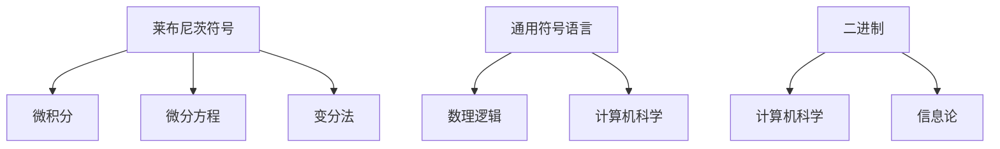

# 概念关联网络

**创建日期**: 2026年2月2日

---

## 一、核心概念

- **莱布尼茨符号** → 微积分、微分方程、变分法
- **通用符号语言** → 数理逻辑、计算机科学、人工智能
- **二进制** → 计算机科学、信息论

## 二、概念网络图

莱布尼茨思想连接微积分、逻辑学、计算机科学、哲学。积分符号∫、微分符号d沿用至今，通用符号语言设想影响数理逻辑与人工智能。
