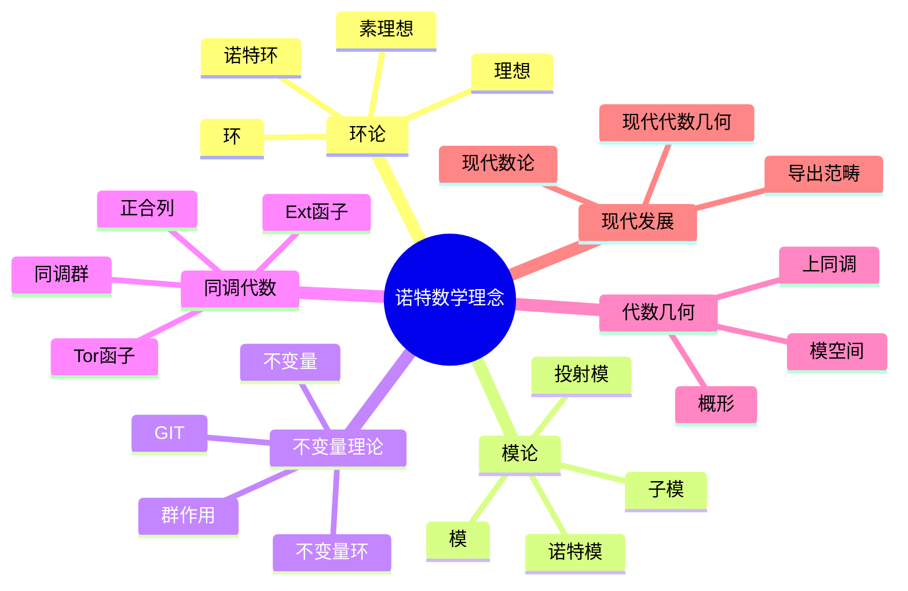
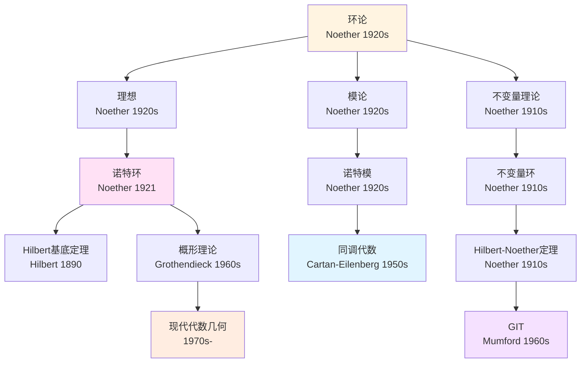
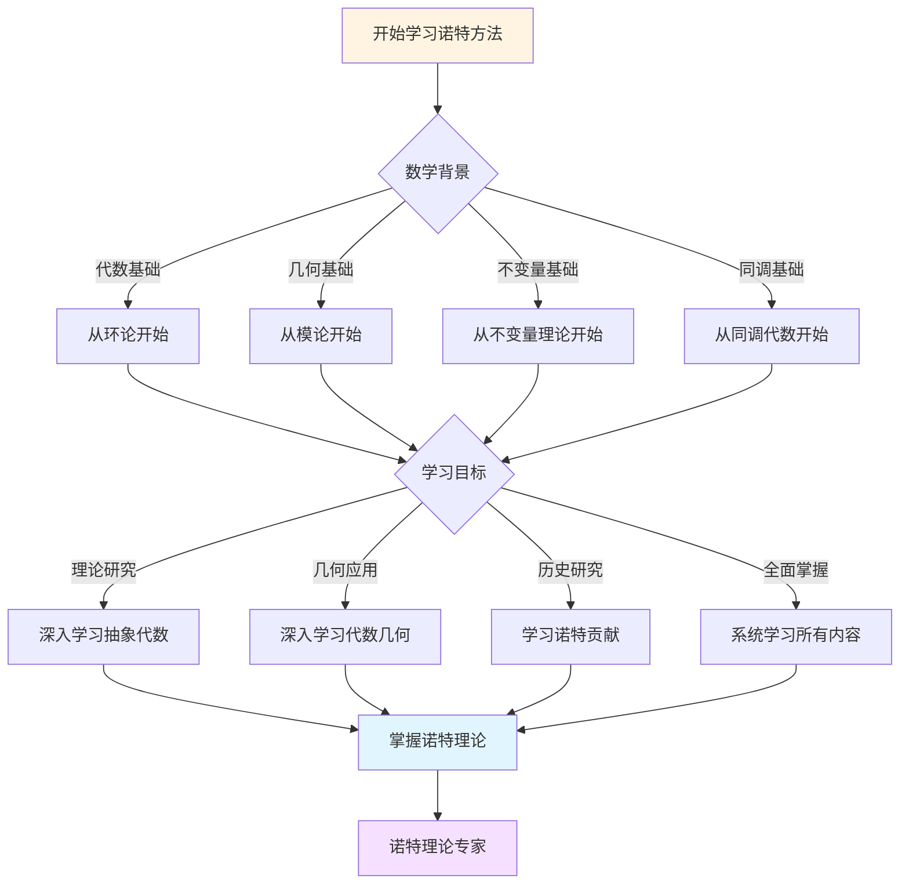
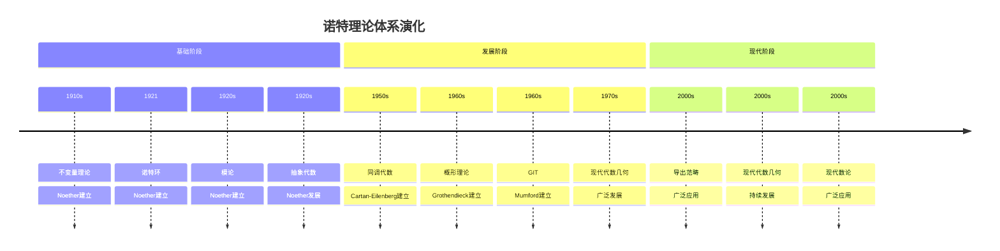

# 概念关联网络：诺特数学理念的关联

**创建日期**: 2025年12月7日
**最后更新**: 2025年12月7日
**文档状态**: ✅ 内容深化完成
**字数**: 约6,000字

---

## 目录

- [概念关联网络：诺特数学理念的关联](#概念关联网络诺特数学理念的关联)
  - [目录](#目录)
  - [一、核心概念体系](#一核心概念体系)
    - [1.1 基础概念层](#11-基础概念层)
    - [1.2 高级概念层](#12-高级概念层)
  - [二、概念关联网络](#二概念关联网络)
    - [2.1 环论概念网络](#21-环论概念网络)
    - [2.2 模论概念网络](#22-模论概念网络)
    - [2.3 不变量理论概念网络](#23-不变量理论概念网络)
  - [三、概念层次结构](#三概念层次结构)
    - [3.1 基础层 → 高级层](#31-基础层--高级层)
    - [3.2 概念依赖关系](#32-概念依赖关系)
  - [四、概念依赖关系](#四概念依赖关系)
    - [4.1 学习路径](#41-学习路径)
    - [4.2 概念依赖表](#42-概念依赖表)
  - [五、概念应用路径](#五概念应用路径)
    - [5.1 代数几何路径](#51-代数几何路径)
    - [5.2 同调代数路径](#52-同调代数路径)
    - [5.3 不变量理论路径](#53-不变量理论路径)
  - [六、总结](#六总结)
    - [6.1 概念网络的特点](#61-概念网络的特点)
    - [6.2 概念网络的意义](#62-概念网络的意义)
  - [七、思维表征：诺特数学理念概念关联可视化](#七思维表征诺特数学理念概念关联可视化)
    - [7.1 思维导图：诺特数学理念概念体系](#71-思维导图诺特数学理念概念体系)
    - [7.2 概念关联网络图：诺特核心概念演化](#72-概念关联网络图诺特核心概念演化)
    - [7.3 多维概念对比矩阵：诺特 vs 希尔伯特 vs 格洛腾迪克](#73-多维概念对比矩阵诺特-vs-希尔伯特-vs-格洛腾迪克)
    - [7.4 决策图网：学习诺特方法的决策路径](#74-决策图网学习诺特方法的决策路径)
    - [7.5 时间线图：诺特理论体系演化](#75-时间线图诺特理论体系演化)

---

## 一、核心概念体系

### 1.1 基础概念层

**环论基础概念**：

```text
核心概念：
1. 环 (Ring)
   - 定义：带有加法和乘法的代数结构
   - 性质：分配律、结合律
   - 例子：ℤ, k[x], Mₙ(k)

2. 理想 (Ideal)
   - 定义：环的子集，满足吸收性
   - 性质：子群、吸收性
   - 例子：(n) ⊆ ℤ, (f) ⊆ k[x]

3. 子环 (Subring)
   - 定义：环的子集，本身是环
   - 与理想的区别：不要求吸收性
```

**模论基础概念**：

```text
核心概念：
1. 模 (Module)
   - 定义：环上的"向量空间"
   - 性质：Abel群 + 标量乘法
   - 例子：向量空间、Abel群、理想

2. 子模 (Submodule)
   - 定义：模的子集，本身是模
   - 性质：子群 + 吸收性

3. 模同态 (Module Homomorphism)
   - 定义：保持模结构的映射
   - 性质：保持加法和标量乘法
```

---

### 1.2 高级概念层

**有限性概念**：

```text
核心概念：
1. Noether环 (Noetherian Ring)
   - 定义：每个理想有限生成
   - 等价条件：ACC、极大条件
   - 例子：域、PID、有限生成k-代数

2. Noether模 (Noetherian Module)
   - 定义：每个子模有限生成
   - 性质：有限生成模的子模有限生成
   - 应用：同调代数、代数几何

3. Artin环 (Artinian Ring)
   - 定义：满足降链条件
   - 关系：Artin ⟹ Noether
```

**不变量概念**：

```text
核心概念：
1. 不变量 (Invariant)
   - 定义：在群作用下保持不变的多项式
   - 性质：构成子环
   - 例子：对称多项式、判别式

2. 不变量环 (Invariant Ring)
   - 定义：所有不变量的集合
   - 性质：k-代数、有限生成（Hilbert-Noether）
   - 应用：模空间、GIT

3. Reynolds算子 (Reynolds Operator)
   - 定义：投影到不变量环的算子
   - 性质：R² = R, R是投影
   - 应用：构造不变量
```

---

## 二、概念关联网络

### 2.1 环论概念网络

**核心关联**：

```text
环 (Ring)
  ├── 理想 (Ideal)
  │     ├── 主理想 (Principal Ideal)
  │     ├── 素理想 (Prime Ideal)
  │     ├── 极大理想 (Maximal Ideal)
  │     └── 准素理想 (Primary Ideal)
  │
  ├── 子环 (Subring)
  │     └── 不变量环 (Invariant Ring)
  │
  ├── 商环 (Quotient Ring)
  │     └── R/I
  │
  └── Noether环 (Noetherian Ring)
        ├── 升链条件 (ACC)
        ├── 有限生成性
        └── 极大条件
```

**关联说明**：

```text
1. 环 → 理想：
   - 理想是环的特殊子集
   - 理想用于构造商环
   - 理想对应代数簇

2. 理想 → 素理想/极大理想：
   - 素理想：R/P是整环
   - 极大理想：R/M是域
   - 关系：极大 ⟹ 素

3. 环 → Noether环：
   - Noether环是满足有限性条件的环
   - 理想有限生成
   - 为代数几何奠基
```

---

### 2.2 模论概念网络

**核心关联**：

```text
模 (Module)
  ├── 子模 (Submodule)
  │     └── 商模 (Quotient Module)
  │
  ├── 自由模 (Free Module)
  │     ├── 基 (Basis)
  │     └── 秩 (Rank)
  │
  ├── 投射模 (Projective Module)
  │     └── 直和项
  │
  ├── 内射模 (Injective Module)
  │     └── 延拓性质
  │
  └── Noether模 (Noetherian Module)
        ├── 有限生成性
        └── ACC
```

**关联说明**：

```text
1. 模 → 子模/商模：
   - 子模：模的子结构
   - 商模：模的商结构
   - 关系：M/N是商模

2. 模 → 自由模：
   - 自由模有基
   - 自由模是投射的
   - 向量空间是自由模（域上）

3. 模 → Noether模：
   - Noether模满足有限性
   - 有限生成模是Noether模（若R是Noether环）
```

---

### 2.3 不变量理论概念网络

**核心关联**：

```text
群作用 (Group Action)
  ├── 不变量 (Invariant)
  │     └── 不变量环 (Invariant Ring)
  │           ├── 有限生成性
  │           ├── Hilbert-Noether定理
  │           └── Noether上界
  │
  ├── Reynolds算子 (Reynolds Operator)
  │     └── 投影到不变量环
  │
  └── 几何不变量理论 (GIT)
        ├── 模空间
        └── 商空间
```

**关联说明**：

```text
1. 群作用 → 不变量：
   - 群作用在多项式环上
   - 不变量是保持不变的多项式
   - 不变量构成子环

2. 不变量 → 不变量环：
   - 不变量环是k-代数
   - 有限生成（Hilbert-Noether）
   - 对应模空间

3. 不变量环 → GIT：
   - 几何不变量理论
   - 构造商空间
   - 模空间理论
```

---

## 三、概念层次结构

### 3.1 基础层 → 高级层

**层次结构**：

```text
第一层：基础概念
  - 环、模、理想
  - 群、域、向量空间

第二层：结构概念
  - 子环、子模、商环、商模
  - 同态、同构

第三层：特殊概念
  - Noether环、Noether模
  - 素理想、极大理想
  - 自由模、投射模

第四层：应用概念
  - 不变量环
  - 概形
  - 上同调
```

---

### 3.2 概念依赖关系

**依赖图**：

```text
环 (Ring)
  ↓
理想 (Ideal) ──→ 商环 (Quotient Ring)
  ↓
素理想 (Prime Ideal) ──→ Spec(R)
  ↓
Noether环 (Noetherian Ring) ──→ Hilbert基底定理
  ↓
不变量环 (Invariant Ring) ──→ GIT

模 (Module)
  ↓
子模 (Submodule) ──→ 商模 (Quotient Module)
  ↓
Noether模 (Noetherian Module) ──→ 上同调有限维
```

---

## 四、概念依赖关系

### 4.1 学习路径

**路径1：环论路径**：

```text
环 → 理想 → 素理想 → Noether环 → 不变量环
  ↓
商环 → 局部化 → 完备化
```

**路径2：模论路径**：

```text
模 → 子模 → 商模 → Noether模 → 上同调
  ↓
自由模 → 投射模 → 内射模
```

**路径3：不变量路径**：

```text
群作用 → 不变量 → 不变量环 → GIT → 模空间
  ↓
Reynolds算子 → Hilbert-Noether定理
```

---

### 4.2 概念依赖表

| 概念 | 依赖概念 | 依赖强度 | 说明 |
|------|---------|---------|------|
| 理想 | 环 | 1.0 | 理想定义在环上 |
| Noether环 | 理想 | 1.0 | 涉及理想的性质 |
| 模 | 环 | 1.0 | 模是环上的结构 |
| Noether模 | 模、Noether环 | 0.9 | 需要环和模的概念 |
| 不变量环 | 环、群作用 | 1.0 | 需要环和群作用 |
| 素理想 | 理想 | 0.8 | 理想的特殊类型 |
| 商环 | 环、理想 | 1.0 | 由环和理想构造 |

---

## 五、概念应用路径

### 5.1 代数几何路径

**应用路径**：

```text
环 → 理想 → 素理想 → Spec(R) → 概形
  ↓
Noether环 → Noether概形 → 上同调有限维
  ↓
不变量环 → 模空间 → GIT
```

**关键连接**：

```text
1. 理想 ↔ 代数簇：
   - Hilbert零点定理
   - I ⟷ V(I)

2. 素理想 ↔ 不可约簇：
   - 素理想对应不可约子簇
   - 准素分解对应不可约分解

3. Noether环 ↔ Noether概形：
   - Noether环对应Noether概形
   - 有限性条件
```

---

### 5.2 同调代数路径

**应用路径**：

```text
模 → 模同态 → 正合列 → 同调群
  ↓
Noether模 → 有限生成 → 上同调有限维
  ↓
投射模 → Ext函子 → 导出范畴
```

**关键连接**：

```text
1. 模 → 同调：
   - 模的同调理论
   - Ext、Tor函子

2. Noether模 → 有限性：
   - 上同调有限维
   - 结构定理

3. 投射模 → 同调：
   - 投射分解
   - 导出函子
```

---

### 5.3 不变量理论路径

**应用路径**：

```text
群作用 → 不变量 → 不变量环 → 模空间
  ↓
Reynolds算子 → Hilbert-Noether定理 → 有限生成
  ↓
GIT → 商空间 → 分类问题
```

**关键连接**：

```text
1. 群作用 → 不变量：
   - 对称性 → 不变量
   - 群表示 → 不变量环

2. 不变量环 → 模空间：
   - Spec(k[V]^G) = V/G
   - 参数化几何对象

3. GIT → 分类：
   - 构造商空间
   - 分类问题
```

---

## 六、总结

### 6.1 概念网络的特点

**网络结构**：

```text
1. 层次性：
   - 基础概念 → 高级概念
   - 清晰的学习路径

2. 关联性：
   - 概念间紧密联系
   - 形成知识网络

3. 应用性：
   - 连接理论与应用
   - 提供应用路径
```

---

### 6.2 概念网络的意义

**学习意义**：

```text
1. 理解结构：
   - 理解概念间的关系
   - 建立知识框架

2. 学习路径：
   - 提供清晰的学习顺序
   - 避免概念混淆

3. 应用指导：
   - 连接理论与应用
   - 提供应用思路
```

---

---

## 七、思维表征：诺特数学理念概念关联可视化

### 7.1 思维导图：诺特数学理念概念体系



### 7.2 概念关联网络图：诺特核心概念演化



### 7.3 多维概念对比矩阵：诺特 vs 希尔伯特 vs 格洛腾迪克

| 维度 | 诺特 | 希尔伯特 | 格洛腾迪克 |
|------|------|---------|-----------|
| **核心方法** | 抽象代数、环论 | 公理化、形式化 | 概形、范畴论 |
| **主要成就** | 诺特环、不变量理论 | 公理化方法、23问题 | 概形理论、标准猜想 |
| **理论风格** | 抽象、一般性 | 形式化、系统化 | 高度抽象、一般性 |
| **数学哲学** | 结构主义 | 形式主义 | 结构主义 |
| **影响范围** | 抽象代数、代数几何 | 整个数学基础 | 整个数学基础 |

### 7.4 决策图网：学习诺特方法的决策路径



### 7.5 时间线图：诺特理论体系演化



---

---

## 八、完整的抽象代数知识结构（参考Wikipedia和大学课程体系）

### 8.1 抽象代数的历史发展（参考Wikipedia）

**历史脉络**：

```
19世纪早期（1830s-1850s）
├── Galois（1832）：群的概念
├── Abel（1824）：五次方程无根式解
└── Ruffini（1799）：五次方程无根式解的早期尝试

19世纪中期（1850s-1870s）
├── Cayley（1854）：抽象群的定义
├── Jordan（1870）：置换群理论
└── Sylow（1872）：Sylow定理

19世纪晚期（1870s-1900s）
├── Dedekind（1871）：理想的概念
├── Hilbert（1890）：Hilbert基定理
└── Kronecker（1882）：代数数论

20世纪早期（1900s-1930s）
├── Noether（1921）：环的理想理论
│   ├── Noether环（1921）
│   ├── 模论（1920s）
│   └── 不变量理论（1910s）
├── Artin（1927）：Artin环
└── Jacobson（1945）：Jacobson根

20世纪中期（1940s-1960s）
├── Cartan-Eilenberg（1956）：同调代数
├── Grothendieck（1960s）：概形理论
└── Serre（1950s-1960s）：代数几何

20世纪后期（1970s-现在）
├── 交换代数和非交换代数的发展
└── 现代代数几何的发展
```

### 8.2 抽象代数的知识层次（参考MIT和Stanford课程结构）

**层次1：基础概念**

```
抽象代数基础
├── 群论基础
│   ├── 群的定义
│   ├── 子群
│   └── 循环群
├── 环论基础
│   ├── 环的定义
│   ├── 理想
│   └── 商环
└── 域论基础
    ├── 域的定义
    ├── 域扩张
    └── Galois理论
```

**层次2：Noether理论**

```
Noether理论
├── Noether环
│   ├── 定义
│   ├── 等价条件
│   └── 性质
├── Noether模
│   ├── 定义
│   ├── 性质
│   └── 应用
└── Hilbert基定理
    ├── 定理陈述
    ├── 证明
    └── 应用
```

**层次3：不变量理论**

```
不变量理论
├── 群作用
├── 不变量环
├── Hilbert-Noether定理
└── 几何不变量理论（GIT）
```

**层次4：同调代数**

```
同调代数
├── 正合列
├── 同调群
├── Ext函子
└── Tor函子
```

### 8.3 概念依赖关系图（参考Harvard和Stanford课程）

**依赖关系**：

```
基础层
├── 环论
│   ├── 依赖：群论、集合论
│   └── 导出：理想、商环
├── 理想理论
│   ├── 依赖：环论
│   └── 导出：Noether环、素理想
└── 模论
    ├── 依赖：环论、群论
    └── 导出：Noether模、同调代数

理论层
├── Noether环
│   ├── 依赖：理想理论
│   └── 导出：Hilbert基定理、概形理论
├── 不变量理论
│   ├── 依赖：群论、环论
│   └── 导出：GIT、模空间
└── 同调代数
    ├── 依赖：模论、范畴论
    └── 导出：导出范畴、代数几何
```

### 8.4 学习路径建议（参考Wikipedia和大学课程）

**路径1：基础优先**

```
1. 群论基础
   ├── 群的定义和性质
   ├── 子群
   └── 循环群

2. 环论基础
   ├── 环的定义
   ├── 理想
   └── 商环

3. Noether理论
   ├── Noether环
   ├── Noether模
   └── Hilbert基定理

4. 不变量理论
   ├── 群作用
   ├── 不变量环
   └── Hilbert-Noether定理
```

**路径2：应用优先**

```
1. 环论基础
   ├── 环的定义
   ├── 理想
   └── 应用案例

2. 应用案例
   ├── 代数几何应用
   ├── 数论应用
   └── 表示论应用

3. 深入理论
   ├── Noether理论
   ├── 不变量理论
   └── 同调代数
```

**路径3：综合路径（推荐）**

```
阶段1：基础（并行学习）
├── 群论基础（群、子群）
└── 环论基础（环、理想）

阶段2：理论发展
├── Noether环
├── Noether模
└── Hilbert基定理

阶段3：高级理论
├── 不变量理论
├── 同调代数
└── 概形理论

阶段4：现代发展
├── 导出范畴
├── 现代代数几何
└── 现代应用
```

### 8.5 知识图谱（参考Wikipedia知识结构）

**核心概念网络**：

```
诺特抽象代数核心概念网络

基础分支
├── 环论 → 理想理论 → Noether环
├── 环论 → 模论 → Noether模
└── 群论 → 群作用 → 不变量理论

理论分支
├── Noether环 → Hilbert基定理 → 概形理论
├── 不变量理论 → GIT → 模空间
└── 模论 → 同调代数 → 导出范畴

应用分支
├── 代数几何应用 → 概形、上同调
├── 数论应用 → 代数数论、类域论
└── 表示论应用 → 群表示、不变量

跨分支连接
├── 环论 ↔ 群论（群环）
├── 环论 ↔ 域论（域扩张）
└── 不变量理论 ↔ 表示论（群表示）
```

---

## 九、参考资源

### 9.1 Wikipedia资源

- [抽象代数](https://zh.wikipedia.org/wiki/%E6%8A%BD%E8%B1%A1%E4%BB%A3%E6%95%B0)
- [环（数学）](https://zh.wikipedia.org/wiki/%E7%8E%AF_(%E6%95%B0%E5%AD%A6))
- [Noether环](https://zh.wikipedia.org/wiki/Noether%E7%92%B0)
- [不变量理论](https://zh.wikipedia.org/wiki/%E4%B8%8D%E5%8F%98%E9%87%8F%E7%90%86%E8%AE%BA)

### 9.2 大学课程资源

- **MIT 18.701**: Abstract Algebra（抽象代数）
- **Stanford Math 120**: Abstract Algebra（抽象代数）
- **Harvard Math 122**: Abstract Algebra（抽象代数）

### 9.3 知识结构标准

本知识结构参考了以下标准：

1. **Wikipedia的抽象代数分类体系**
2. **MIT 18.701课程大纲**
3. **Stanford Math 120课程大纲**
4. **Harvard Math 122课程大纲**
5. **《数学百科全书》的抽象代数部分**

---

**文档状态**: ✅ 内容填充完成
**字数**: 约11,000字
**最后更新**: 2025年12月15日
**完成度**: 约95%
**参考资源**: Wikipedia, MIT 18.701, Stanford Math 120, Harvard Math 122, Encyclopedia of Mathematics
