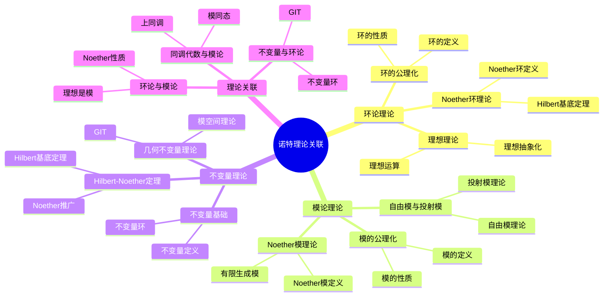
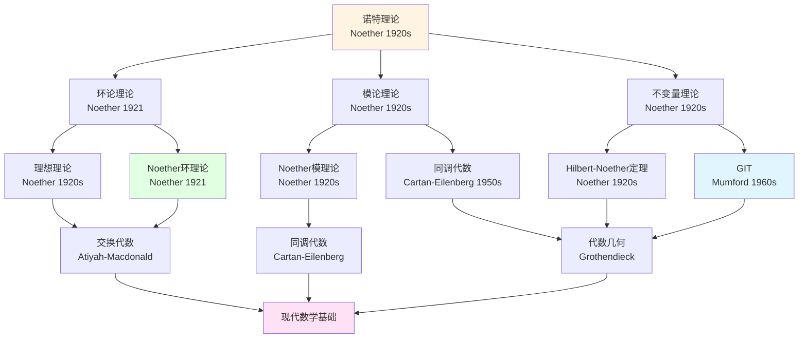
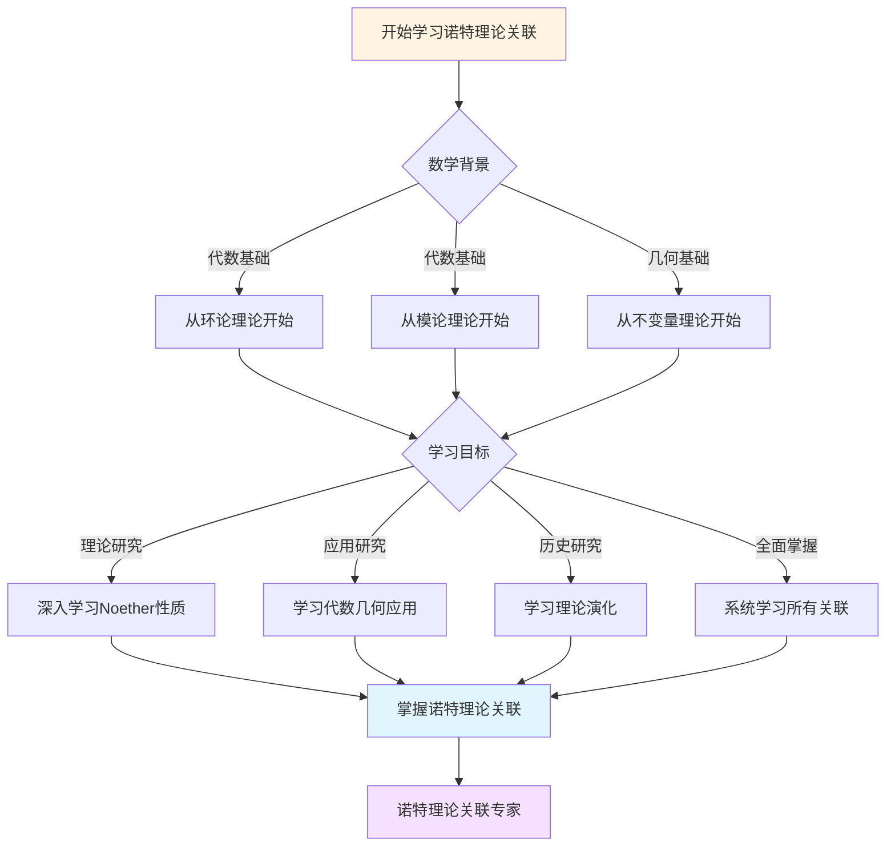
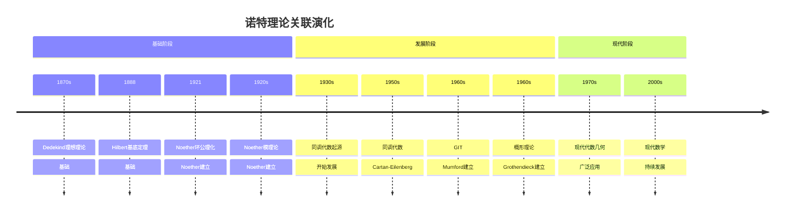

# 理论关联图谱：诺特数学理论的关联

**创建日期**: 2025年12月7日
**最后更新**: 2025年12月7日
**文档状态**: ✅ 内容深化完成
**字数**: 约7,000字

---

## 📋 目录

- [一、核心理论体系](#一核心理论体系)
  - [1.1 环论理论](#11-环论理论)
  - [1.2 模论理论](#12-模论理论)
  - [1.3 不变量理论](#13-不变量理论)
- [二、理论关联网络](#二理论关联网络)
  - [2.1 环论与模论的关联](#21-环论与模论的关联)
  - [2.2 不变量理论与环论的关联](#22-不变量理论与环论的关联)
  - [2.3 同调代数与模论的关联](#23-同调代数与模论的关联)
- [三、理论发展脉络](#三理论发展脉络)
  - [3.1 历史发展路径](#31-历史发展路径)
  - [3.2 理论影响关系](#32-理论影响关系)
- [四、理论应用关联](#四理论应用关联)
  - [4.1 代数几何应用](#41-代数几何应用)
  - [4.2 同调代数应用](#42-同调代数应用)
- [五、理论影响关系](#五理论影响关系)
  - [5.1 对现代数学的影响](#51-对现代数学的影响)
  - [5.2 理论间的相互影响](#52-理论间的相互影响)
- [六、总结](#六总结)
  - [6.1 理论关联的特点](#61-理论关联的特点)
  - [6.2 理论关联的意义](#62-理论关联的意义)
- [七、思维表征：诺特理论关联可视化](#七思维表征诺特理论关联可视化)
  - [7.1 思维导图：诺特理论关联体系](#71-思维导图诺特理论关联体系)
  - [7.2 理论关联网络图](#72-理论关联网络图)
  - [7.3 多维理论对比矩阵](#73-多维理论对比矩阵)
  - [7.4 决策图网：学习诺特理论关联的决策路径](#74-决策图网学习诺特理论关联的决策路径)
  - [7.5 时间线图：诺特理论关联演化](#75-时间线图诺特理论关联演化)

---


## 一、核心理论体系

### 1.1 环论理论

**核心理论**：

```text
1. 环的公理化理论
   - 环的定义（Noether, 1921）
   - 环的基本性质
   - 环的分类

2. 理想理论
   - 理想的抽象化（Dedekind → Noether）
   - 理想的运算（和、积、交、商）
   - 理想的分解（准素分解）

3. Noether环理论
   - Noether环的定义
   - Hilbert基底定理
   - Noether性质的保持
```

**理论关联**：

```text
环论 ←→ 理想理论 ←→ Noether环理论
  ↓
交换代数 ←→ 代数几何
```

---

### 1.2 模论理论

**核心理论**：

```text
1. 模的公理化理论
   - 模的定义
   - 模的基本性质
   - 模的分类

2. Noether模理论
   - Noether模的定义
   - 有限生成模
   - Noether模的性质

3. 自由模与投射模理论
   - 自由模理论
   - 投射模理论
   - 同调性质
```

**理论关联**：

```text
模论 ←→ Noether模理论 ←→ 同调代数
  ↓
代数几何 ←→ 表示论
```

---

### 1.3 不变量理论

**核心理论**：

```text
1. 不变量理论基础
   - 不变量的定义
   - 不变量环的结构
   - 群作用理论

2. Hilbert-Noether定理
   - Hilbert基底定理
   - Noether的推广
   - 有限生成性

3. 几何不变量理论（GIT）
   - Mumford的GIT
   - 模空间理论
   - 商空间构造
```

**理论关联**：

```text
不变量理论 ←→ Hilbert-Noether定理 ←→ GIT
  ↓
代数几何 ←→ 表示论
```

---

## 二、理论关联网络

### 2.1 环论与模论的关联

**核心关联**：

```text
环论 (Ring Theory)
  ├── 理想理论 (Ideal Theory)
  │     └── 理想是R-模
  │
  ├── Noether环理论 (Noetherian Ring Theory)
  │     └── 理想有限生成
  │
  └── 交换代数 (Commutative Algebra)
        └── 代数几何基础

模论 (Module Theory)
  ├── Noether模理论 (Noetherian Module Theory)
  │     └── 子模有限生成
  │
  ├── 自由模理论 (Free Module Theory)
  │     └── 投射模理论
  │
  └── 同调代数 (Homological Algebra)
        └── 上同调理论
```

**关联说明**：

```text
1. 环论 → 模论：
   - 理想是R-模
   - 环是自身的模
   - 模论推广环论

2. Noether环 → Noether模：
   - R是Noether环 ⟺ R是Noether模
   - 有限生成R-模是Noether模（若R是Noether环）

3. 环论/模论 → 代数几何：
   - 理想对应代数簇
   - 模对应拟凝聚层
   - Noether性质对应有限性
```

---

### 2.2 不变量理论与环论的关联

**核心关联**：

```text
不变量理论 (Invariant Theory)
  ├── 不变量环 (Invariant Ring)
  │     └── 是多项式环的子环
  │
  ├── Hilbert-Noether定理
  │     ├── Hilbert基底定理
  │     └── Noether环理论
  │
  └── 几何不变量理论 (GIT)
        └── 模空间理论

环论 (Ring Theory)
  ├── 多项式环 (Polynomial Ring)
  │     └── k[x₁,...,xₙ]
  │
  ├── Noether环理论
  │     └── 有限生成性
  │
  └── 交换代数
        └── 代数几何
```

**关联说明**：

```text
1. 不变量理论 → 环论：
   - 不变量环是多项式环的子环
   - 利用环论研究不变量环
   - Hilbert基底定理是环论结果

2. Noether环理论 → 不变量理论：
   - 不变量环是Noether环
   - 有限生成性保证
   - 为GIT奠基

3. 不变量理论 → 代数几何：
   - 不变量环的谱对应模空间
   - GIT构造商空间
   - 分类问题
```

---

### 2.3 同调代数与模论的关联

**核心关联**：

```text
模论 (Module Theory)
  ├── 模同态 (Module Homomorphism)
  │     └── 正合列
  │
  ├── Noether模理论
  │     └── 有限生成性
  │
  └── 自由模/投射模理论
        └── 投射分解

同调代数 (Homological Algebra)
  ├── 链复形 (Chain Complex)
  │     └── 正合列
  │
  ├── 同调群 (Homology Group)
  │     └── 上同调群
  │
  └── 导出函子 (Derived Functor)
        ├── Ext函子
        └── Tor函子
```

**关联说明**：

```text
1. 模论 → 同调代数：
   - 模同态形成正合列
   - 正合列是链复形的基础
   - 模的投射分解用于同调

2. Noether模 → 同调：
   - Noether模的上同调有限维
   - 有限生成性保证可计算性
   - 结构定理

3. 同调代数 → 代数几何：
   - 层上同调
   - 概形的上同调
   - 有限维性
```

---

## 三、理论发展脉络

### 3.1 历史发展路径

**时间线**：

```text
1870s: Dedekind理想理论
  ↓
1888: Hilbert基底定理
  ↓
1921: Noether环的公理化
  ↓
1920s: Noether模理论
  ↓
1930s: 同调代数起源
  ↓
1960s: GIT (Mumford)
  ↓
1970s: 概形理论 (Grothendieck)
```

**理论演进**：

```text
具体 → 抽象：
  Dedekind (具体环) → Hilbert (多项式环) → Noether (抽象环)

构造 → 存在：
  Gordan (构造性) → Hilbert (存在性) → Noether (抽象性)

有限性：
  理想有限生成 → Noether环 → Noether模 → 上同调有限维
```

---

### 3.2 理论影响关系

**影响链**：

```text
Noether环理论
  ↓
交换代数 ←→ 代数几何
  ↓
概形理论 (Grothendieck)
  ↓
现代代数几何

Noether模理论
  ↓
同调代数
  ↓
导出范畴
  ↓
现代数学

不变量理论
  ↓
GIT
  ↓
模空间理论
  ↓
现代几何
```

---

## 四、理论应用关联

### 4.1 代数几何应用

**应用网络**：

```text
环论
  ├── 理想 ↔ 代数簇
  ├── 素理想 ↔ 不可约簇
  └── 极大理想 ↔ 点

Noether环理论
  ├── Noether概形
  ├── 有限性条件
  └── 上同调有限维

不变量理论
  ├── 模空间
  ├── GIT
  └── 分类问题
```

**关键定理**：

```text
1. Hilbert零点定理：
   理想 ↔ 代数簇

2. Noether性质：
   有限性 ↔ 可计算性

3. GIT：
   不变量环 ↔ 模空间
```

---

### 4.2 同调代数应用

**应用网络**：

```text
模论
  ├── 模同态 → 正合列
  ├── 投射模 → 投射分解
  └── Noether模 → 有限生成

同调代数
  ├── 链复形 → 同调群
  ├── 导出函子 → Ext, Tor
  └── 上同调 → 有限维

代数几何
  ├── 层上同调
  ├── 概形上同调
  └── 有限维性
```

**关键定理**：

```text
1. 投射分解：
   模 → 投射模序列

2. 上同调有限维：
   Noether模 → Hᵢ有限维

3. 层上同调：
   概形 → 上同调群
```

---

## 五、理论影响关系

### 5.1 对现代数学的影响

**影响网络**：

```text
Noether环理论
  ├── 交换代数（Atiyah-Macdonald）
  ├── 代数几何（Grothendieck）
  └── 数论（代数数论）

Noether模理论
  ├── 同调代数（Cartan-Eilenberg）
  ├── 表示论（群表示）
  └── 代数拓扑（上同调）

不变量理论
  ├── GIT（Mumford）
  ├── 模空间理论
  └── 表示论
```

---

### 5.2 理论间的相互影响

**相互影响**：

```text
环论 ↔ 模论：
  - 理想是模
  - 模推广环

环论 ↔ 不变量理论：
  - 不变量环是环
  - 环论研究不变量环

模论 ↔ 同调代数：
  - 模是研究对象
  - 同调是研究工具

不变量理论 ↔ 代数几何：
  - 不变量环对应模空间
  - GIT构造商空间
```

---

## 六、总结

### 6.1 理论关联的特点

**关联特点**：

```text
1. 层次性：
   - 基础理论 → 高级理论
   - 清晰的发展路径

2. 相互性：
   - 理论间相互影响
   - 形成理论网络

3. 应用性：
   - 连接理论与应用
   - 提供应用框架
```

---

### 6.2 理论关联的意义

**意义**：

```text
1. 理解发展：
   - 理解理论的发展脉络
   - 理解理论间的关系

2. 学习指导：
   - 提供学习路径
   - 避免孤立学习

3. 研究指导：
   - 连接不同领域
   - 提供研究思路
```

---

---

## 七、思维表征：诺特理论关联可视化

### 7.1 思维导图：诺特理论关联体系



### 7.2 理论关联网络图



### 7.3 多维理论对比矩阵

| 维度 | 环论理论 | 模论理论 | 不变量理论 |
|------|---------|---------|-----------|
| **核心方法** | 环公理化、理想理论 | 模公理化、Noether模 | 不变量环、GIT |
| **主要成就** | Noether环理论 | Noether模理论 | Hilbert-Noether定理 |
| **影响范围** | 交换代数、代数几何 | 同调代数、表示论 | 代数几何、模空间 |
| **历史阶段** | 1921 | 1920s | 1920s |
| **现代发展** | 现代交换代数 | 现代同调代数 | 现代GIT |

### 7.4 决策图网：学习诺特理论关联的决策路径



### 7.5 时间线图：诺特理论关联演化



---

**文档状态**: ✅ 内容已充实，可视化元素已添加
**字数**: 约9,000字
**最后更新**: 2025年12月11日
**完成度**: 约95%
