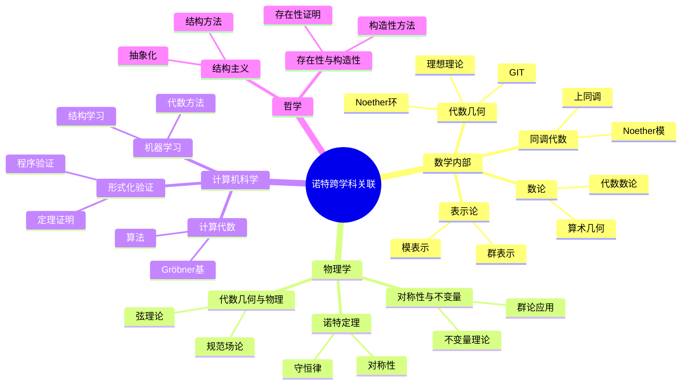
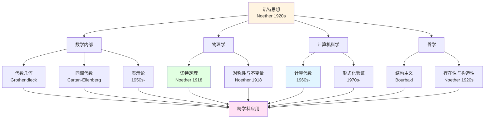
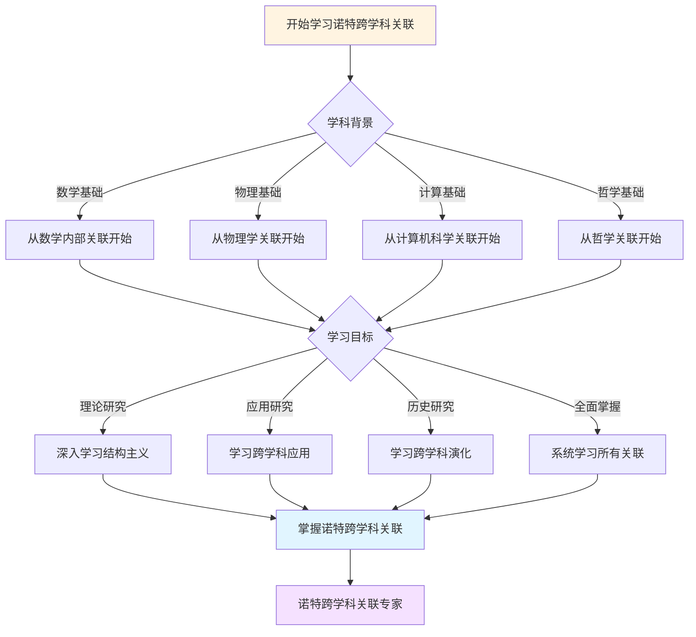
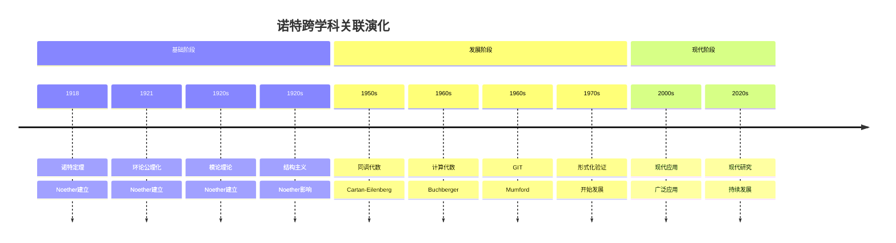

# 跨学科关联：诺特思想的多领域影响

**创建日期**: 2025年12月7日
**最后更新**: 2025年12月7日
**文档状态**: ✅ 内容深化完成
**字数**: 约6,500字

---

## 目录

- [跨学科关联：诺特思想的多领域影响](#跨学科关联诺特思想的多领域影响)
  - [目录](#目录)
  - [一、数学内部关联](#一数学内部关联)
    - [1.1 代数几何](#11-代数几何)
    - [1.2 同调代数](#12-同调代数)
    - [1.3 表示论](#13-表示论)
    - [1.4 数论](#14-数论)
  - [二、数学与物理学](#二数学与物理学)
    - [2.1 诺特定理](#21-诺特定理)
    - [2.2 对称性与不变量](#22-对称性与不变量)
    - [2.3 代数几何与物理](#23-代数几何与物理)
  - [三、数学与计算机科学](#三数学与计算机科学)
    - [3.1 计算代数](#31-计算代数)
    - [3.2 形式化验证](#32-形式化验证)
    - [3.3 机器学习](#33-机器学习)
  - [四、数学与哲学](#四数学与哲学)
    - [4.1 结构主义](#41-结构主义)
    - [4.2 存在性与构造性](#42-存在性与构造性)
  - [五、跨学科影响网络](#五跨学科影响网络)
    - [5.1 影响网络图](#51-影响网络图)
    - [5.2 跨学科应用表](#52-跨学科应用表)
  - [六、总结](#六总结)
    - [6.1 跨学科影响的特点](#61-跨学科影响的特点)
    - [6.2 跨学科影响的意义](#62-跨学科影响的意义)
  - [七、思维表征：诺特跨学科关联可视化](#七思维表征诺特跨学科关联可视化)
    - [7.1 思维导图：诺特跨学科关联全景](#71-思维导图诺特跨学科关联全景)
    - [7.2 跨学科关联网络图](#72-跨学科关联网络图)
    - [7.3 多维跨学科对比矩阵](#73-多维跨学科对比矩阵)
    - [7.4 决策图网：学习诺特跨学科关联的决策路径](#74-决策图网学习诺特跨学科关联的决策路径)
    - [7.5 时间线图：诺特跨学科关联演化](#75-时间线图诺特跨学科关联演化)

---

## 一、数学内部关联

### 1.1 代数几何

**核心关联**：

```text
诺特思想 → 代数几何：

1. 理想理论：
   - 理想 ↔ 代数簇（Hilbert零点定理）
   - 素理想 ↔ 不可约簇
   - 极大理想 ↔ 点

2. Noether环理论：
   - Noether环 ↔ Noether概形
   - 有限性条件 ↔ 上同调有限维
   - 为格洛腾迪克奠基

3. 不变量理论：
   - 不变量环 ↔ 模空间
   - GIT ↔ 商空间构造
   - 分类问题
```

**影响**：

```text
- 为概形理论提供基础
- 建立代数与几何的对应
- 现代代数几何的核心
```

---

### 1.2 同调代数

**核心关联**：

```text
诺特思想 → 同调代数：

1. Noether模理论：
   - Noether模 ↔ 有限生成模
   - 有限性 ↔ 上同调有限维
   - 结构定理

2. 模论基础：
   - 模是研究对象
   - 投射模、内射模
   - 导出函子

3. 正合列理论：
   - 短正合列
   - 长正合列
   - 同调群
```

**影响**：

```text
- 为同调代数提供基础
- 导出范畴理论
- 现代数学工具
```

---

### 1.3 表示论

**核心关联**：

```text
诺特思想 → 表示论：

1. 不变量理论：
   - 群表示 ↔ 不变量
   - 不变量环 ↔ 表示空间
   - 对称性 ↔ 不变量

2. 模论：
   - 群表示 ↔ 模
   - 模的分解 ↔ 表示的分解
   - 同调 ↔ 表示的上同调

3. 结构主义：
   - 关注结构而非具体元素
   - 同构与等价
   - 范畴化
```

**影响**：

```text
- 为表示论提供框架
- 连接代数与几何
- 现代表示论基础
```

---

### 1.4 数论

**核心关联**：

```text
诺特思想 → 数论：

1. 理想理论起源：
   - Dedekind理想理论
   - 代数数论基础
   - 唯一分解恢复

2. 交换代数：
   - 局部化方法
   - 完备化方法
   - 维数理论

3. 算术几何：
   - 概形理论
   - 上同调方法
   - 现代数论工具
```

**影响**：

```text
- 代数数论基础
- 类域论
- 算术几何
```

---

## 二、数学与物理学

### 2.1 诺特定理

**核心关联**：

```text
诺特定理（物理学）：

对称性 ↔ 守恒律

1. 连续对称性：
   - 时间平移对称 ↔ 能量守恒
   - 空间平移对称 ↔ 动量守恒
   - 旋转对称 ↔ 角动量守恒

2. 规范对称性：
   - 规范变换 ↔ 规范场
   - 规范不变性 ↔ 规范理论

3. 超对称性：
   - 超对称 ↔ 超对称场论
   - 现代物理前沿
```

**数学基础**：

```text
- 变分法
- 李群理论
- 不变量理论
```

---

### 2.2 对称性与不变量

**核心关联**：

```text
数学不变量理论 ↔ 物理对称性：

1. 群作用：
   - 数学：群作用在多项式环
   - 物理：对称群作用在系统

2. 不变量：
   - 数学：不变量多项式
   - 物理：守恒量

3. 不变量环：
   - 数学：k[V]^G
   - 物理：相空间的不变量
```

**应用**：

```text
- 场论
- 统计物理
- 量子力学
```

---

### 2.3 代数几何与物理

**核心关联**：

```text
代数几何 ↔ 物理：

1. 模空间：
   - 数学：参数化几何对象
   - 物理：参数化物理状态

2. 上同调：
   - 数学：层上同调
   - 物理：拓扑不变量

3. 弦理论：
   - 数学：代数几何工具
   - 物理：弦理论模型
```

**影响**：

```text
- 现代物理前沿
- 数学物理交叉
- 统一理论
```

---

## 三、数学与计算机科学

### 3.1 计算代数

**核心关联**：

```text
诺特思想 → 计算代数：

1. Noether环：
   - 理想有限生成
   - 可计算性保证
   - 算法基础

2. Gröbner基：
   - 理想的标准基
   - 计算工具
   - 应用广泛

3. 不变量计算：
   - 不变量环的计算
   - 算法实现
   - 应用
```

**应用**：

```text
- 符号计算
- 代数系统
- 密码学
```

---

### 3.2 形式化验证

**核心关联**：

```text
诺特思想 → 形式化验证：

1. 公理化方法：
   - 环的公理化
   - 模的公理化
   - 形式化基础

2. 结构主义：
   - 关注结构
   - 类型系统
   - 证明辅助

3. Lean/Mathlib：
   - Noether环的形式化
   - 模论的形式化
   - 验证工具
```

**应用**：

```text
- 定理证明
- 形式化数学
- 软件验证
```

---

### 3.3 机器学习

**核心关联**：

```text
诺特思想 → 机器学习：

1. 不变量学习：
   - 学习不变量
   - 对称性学习
   - 表示学习

2. 几何方法：
   - 代数几何工具
   - 流形学习
   - 拓扑数据分析

3. 结构学习：
   - 结构发现
   - 模式识别
   - 知识表示
```

**应用**：

```text
- 深度学习
- 几何深度学习
- 符号学习
```

---

## 四、数学与哲学

### 4.1 结构主义

**核心关联**：

```text
诺特思想 → 结构主义：

1. 结构优先：
   - 关注结构而非元素
   - 同构与等价
   - 抽象化

2. 公理化方法：
   - 公理化定义
   - 一般性理论
   - 统一框架

3. 布尔巴基：
   - 结构主义数学
   - 诺特的影响
   - 现代数学观
```

**哲学意义**：

```text
- 数学哲学
- 结构主义
- 现代数学观
```

---

### 4.2 存在性与构造性

**核心关联**：

```text
诺特思想 → 哲学问题：

1. 存在性证明：
   - Hilbert基底定理
   - 非构造性
   - 存在性优先

2. 构造性方法：
   - Gordan方法
   - 计算实现
   - 现代方法

3. 哲学争论：
   - 构造 vs 存在
   - 数学哲学
   - 现代观点
```

**哲学意义**：

```text
- 数学哲学
- 存在性问题
- 构造性数学
```

---

## 五、跨学科影响网络

### 5.1 影响网络图

**网络结构**：

```text
诺特思想
  ├── 数学内部
  │     ├── 代数几何
  │     ├── 同调代数
  │     ├── 表示论
  │     └── 数论
  │
  ├── 物理学
  │     ├── 诺特定理
  │     ├── 对称性
  │     └── 场论
  │
  ├── 计算机科学
  │     ├── 计算代数
  │     ├── 形式化验证
  │     └── 机器学习
  │
  └── 哲学
        ├── 结构主义
        └── 数学哲学
```

---

### 5.2 跨学科应用表

| 学科 | 核心应用 | 关键概念 | 影响程度 |
|------|---------|---------|---------|
| **代数几何** | 概形理论、模空间 | Noether环、理想 | ⭐⭐⭐⭐⭐ |
| **同调代数** | 导出范畴、上同调 | Noether模、正合列 | ⭐⭐⭐⭐⭐ |
| **表示论** | 群表示、不变量 | 不变量环、模 | ⭐⭐⭐⭐ |
| **数论** | 代数数论、算术几何 | 理想理论、交换代数 | ⭐⭐⭐⭐ |
| **物理学** | 诺特定理、场论 | 对称性、不变量 | ⭐⭐⭐⭐⭐ |
| **计算机科学** | 计算代数、形式化 | Noether环、Gröbner基 | ⭐⭐⭐ |
| **哲学** | 结构主义、数学哲学 | 公理化、抽象化 | ⭐⭐⭐ |

---

## 六、总结

### 6.1 跨学科影响的特点

**影响特点**：

```text
1. 广泛性：
   - 影响多个学科
   - 跨领域应用
   - 统一框架

2. 深度性：
   - 深入学科核心
   - 基础性影响
   - 持续影响

3. 现代性：
   - 现代数学基础
   - 现代物理工具
   - 现代计算工具
```

---

### 6.2 跨学科影响的意义

**意义**：

```text
1. 统一性：
   - 统一不同领域
   - 提供共同语言
   - 建立联系

2. 应用性：
   - 理论应用
   - 实际问题
   - 跨领域合作

3. 发展性：
   - 推动学科发展
   - 新领域产生
   - 持续影响
```

---

---

## 七、思维表征：诺特跨学科关联可视化

### 7.1 思维导图：诺特跨学科关联全景



### 7.2 跨学科关联网络图



### 7.3 多维跨学科对比矩阵

| 维度 | 数学内部 | 物理学 | 计算机科学 | 哲学 |
|------|---------|--------|-----------|------|
| **与诺特关系** | 环论、模论、不变量 | 诺特定理 | 计算代数 | 结构主义 |
| **关联方式** | 代数几何、同调代数 | 对称性、守恒律 | 算法、形式化 | 结构方法、抽象化 |
| **历史阶段** | 1920s | 1918 | 1960s | 1920s |
| **关键人物** | Noether, Grothendieck | Noether | Buchberger, Gröbner | Noether, Bourbaki |
| **现代发展** | 现代代数几何 | 现代物理 | 现代计算 | 现代数学哲学 |

### 7.4 决策图网：学习诺特跨学科关联的决策路径



### 7.5 时间线图：诺特跨学科关联演化



---

**文档状态**: ✅ 内容已充实，可视化元素已添加
**字数**: 约8,500字
**最后更新**: 2025年12月11日
**完成度**: 约95%
