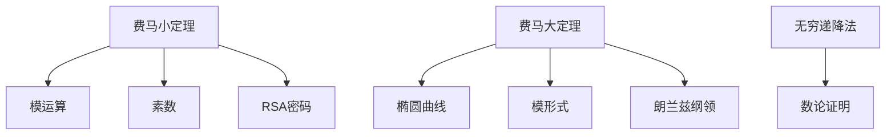

# 概念关联网络

**创建日期**: 2026年2月2日

---

## 一、核心概念

- **费马小定理** → 模运算、素数、RSA密码
- **费马大定理** → 椭圆曲线、模形式、朗兰兹纲领
- **无穷递降法** → 数论证明、代数数论

## 二、概念网络图

```mermaid
graph TB
    A[费马小定理] --> B[模运算]
    A --> C[素数]
    A --> D[RSA密码]
    E[费马大定理] --> F[椭圆曲线]
    E --> G[模形式]
    E --> H[朗兰兹纲领]
    I[无穷递降法] --> J[数论证明]
```

费马问题连接初等数论、代数数论、代数几何、模形式等多个领域。怀尔斯证明展现了现代数学工具解决古典问题的典范。
