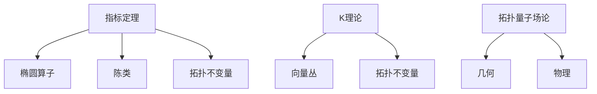

# 概念关联网络

**创建日期**: 2026年2月2日

---

## 一、核心概念

- **指标定理** → 椭圆算子、陈类、拓扑不变量
- **K 理论** → 向量丛、拓扑不变量、代数 K 理论
- **拓扑量子场论** → 几何、物理、拓扑场论

## 二、概念网络图

阿蒂亚-辛格指标定理连接拓扑与解析，陈省身的陈类是指标公式的核心成分。K理论与拓扑量子场论体现几何与物理的深层统一。
