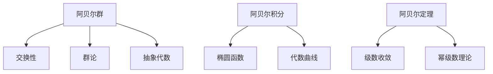

# 概念关联网络

**创建日期**: 2026年2月2日

---

## 一、核心概念

- **阿贝尔群** → 交换性、群论、抽象代数
- **阿贝尔积分** → 椭圆函数、代数曲线、代数几何
- **阿贝尔定理** → 级数收敛、幂级数理论

## 二、概念网络图

```mermaid
graph TB
    A[阿贝尔群] --> B[交换性]
    A --> C[群论]
    A --> D[抽象代数]
    E[阿贝尔积分] --> F[椭圆函数]
    E --> G[代数曲线]
    H[阿贝尔定理] --> I[级数收敛]
    H --> J[幂级数理论]
```

阿贝尔理论连接代数学、分析学、代数几何、数论。阿贝尔群是现代代数的基石，阿贝尔积分是代数几何的核心工具。
