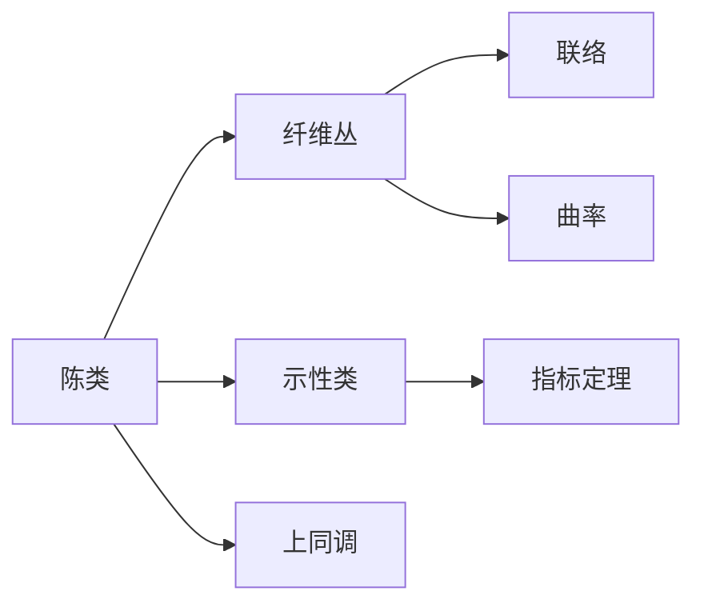

# 概念关联网络

**创建日期**: 2026年2月2日

---

## 一、核心概念

- **陈类** → 纤维丛、示性类、上同调
- **纤维丛** → 联络、曲率、主丛
- **整体几何** → 高斯-博内定理、拓扑不变量

## 二、概念网络图

```mermaid
graph LR
    A[陈类] --> B[纤维丛]
    A --> C[示性类]
    A --> D[上同调]
    B --> E[联络]
    B --> F[曲率]
    C --> G[指标定理]
```

## 三、跨领域关联

几何、拓扑、代数、分析、物理的交叉联系。

---

*内容待深化填充*
