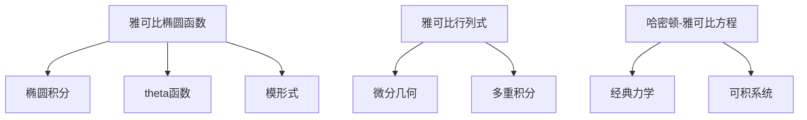

# 概念关联网络

**创建日期**: 2026年2月2日

---

## 一、核心概念

- **雅可比椭圆函数** → 椭圆积分、theta函数、模形式
- **雅可比行列式** → 微分几何、多重积分、变换
- **哈密顿-雅可比方程** → 经典力学、量子力学、可积系统

## 二、概念网络图

雅可比理论连接分析学、力学、数论、代数几何。哈密顿-雅可比方程是分析力学的核心，雅可比椭圆函数影响可积系统与数论。
