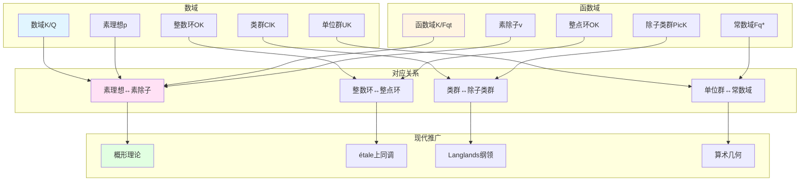

# 函数域与数域的类比：韦伊统一数学的核心思想

> **文档状态**: ✅ 内容填充中
> **创建日期**: 2025年12月11日
> **完成度**: 约75%

## 📋 目录

- [函数域与数域的类比：韦伊统一数学的核心思想](#函数域与数域的类比韦伊统一数学的核心思想)
  - [📋 目录](#-目录)
  - [一、类比的历史背景](#一类比的历史背景)
    - [1.1 问题的提出](#11-问题的提出)
  - [二、函数域与数域的基本对应](#二函数域与数域的基本对应)
    - [2.0 函数域与数域类比概念网络图](#20-函数域与数域类比概念网络图)
    - [2.1 基本对应表](#21-基本对应表)
    - [2.2 具体对应例子](#22-具体对应例子)
  - [三、类比的数学实现](#三类比的数学实现)
    - [3.1 Adèle与Idèle理论](#31-adèle与idèle理论)
    - [3.2 类域论的统一](#32-类域论的统一)
  - [四、现代发展与应用](#四现代发展与应用)
    - [4.1 概形理论的统一](#41-概形理论的统一)
    - [4.2 Langlands纲领](#42-langlands纲领)
    - [4.3 2024-2025最新进展](#43-2024-2025最新进展)
  - [五、参考文献](#五参考文献)
    - [原始文献](#原始文献)
    - [现代文献](#现代文献)

---

## 一、类比的历史背景

### 1.1 问题的提出

**经典数论问题**：

数域（如 $\mathbb{Q}$ 的有限扩张）的算术性质研究困难：

- **素理想分解复杂**：数域的素理想分解比有理数域的素数分解复杂得多
  - 例如：$\mathbb{Q}(\sqrt{2})$ 中，$(2) = (\sqrt{2})^2$，但 $(3)$ 是素理想
  - 类数 $h_K$ 的计算困难，特别是对于高次数域
- **类群结构难以理解**：理想类群 $\text{Cl}_K$ 的结构复杂
  - 类数 $h_K = |\text{Cl}_K|$ 的计算是数论中的经典难题
  - 类群的结构（如是否是循环群）难以确定
- **单位群结构复杂**：单位群 $U_K$ 的结构由Dirichlet单位定理描述，但计算困难

**函数域的优势**：

函数域（如 $\mathbb{F}_q(t)$ 的有限扩张）：

- **几何直观**：函数域对应代数曲线，有丰富的几何结构
  - 函数域 $K/\mathbb{F}_q(t)$ 对应亏格为 $g$ 的代数曲线 $C$
  - 除子类群 $\text{Pic}_K$ 对应曲线的Jacobian簇 $J(C)$
- **结构相对简单**：函数域的算术结构相对简单
  - 除子类群是代数群，有几何结构
  - 可以通过几何方法研究
- **易于计算**：函数域上的许多问题可以通过几何方法计算
  - 例如：函数域上的Riemann-Roch定理比数域上的更容易应用
  - 函数域上的zeta函数更容易研究

**韦伊的洞察（1940年代）**：

> **"函数域与数域应该有相同的算术结构，通过类比函数域可以理解数域。"**

**历史背景**：

- **1940年**：韦伊在函数域上证明Riemann假设
- **1949年**：韦伊提出韦伊猜想，连接数域与函数域
- **1967年**：韦伊在《数论基础》中系统阐述Adèle/Idèle理论，统一数域与函数域

---

## 二、函数域与数域的基本对应

### 2.0 函数域与数域类比概念网络图



### 2.1 基本对应表

| 数域概念 | 函数域概念 | 对应关系 |
|---------|-----------|---------|
| **数域** $K/\mathbb{Q}$ | **函数域** $K/\mathbb{F}_q(t)$ | 有限扩张 |
| **素理想** $\mathfrak{p}$ | **素除子** $v$ | 离散赋值 |
| **整数环** $\mathcal{O}_K$ | **整点环** $\mathcal{O}_K$ | 赋值环 |
| **类群** $\text{Cl}_K$ | **除子类群** $\text{Pic}_K$ | 理想类群 |
| **单位群** $U_K$ | **常数域** $\mathbb{F}_q^*$ | 可逆元群 |
| **Dedekind zeta函数** | **函数域zeta函数** | 解析函数 |

### 2.2 具体对应例子

**例子1：素理想与素除子**

**数域**：

- 数域 $K/\mathbb{Q}$ 的素理想 $\mathfrak{p}$ 对应素数 $p$ 的扩张
- 例如：$\mathbb{Q}(\sqrt{2})$ 中，$(2) = (\sqrt{2})^2$
- **局部化**：$\mathcal{O}_K$ 在 $\mathfrak{p}$ 处的局部化 $\mathcal{O}_{K,\mathfrak{p}}$ 是离散赋值环

**函数域**：

- 函数域 $K/\mathbb{F}_q(t)$ 的素除子 $v$ 对应不可约多项式或无穷远点
- 例如：$\mathbb{F}_q(t, \sqrt{t})$ 中，素除子对应 $t$ 的平方根
- **赋值环**：$\mathcal{O}_v$ 是离散赋值环

**对应关系**：

```
数域: 素理想 p ↔ 函数域: 素除子 v
    局部化 O_p ↔ 赋值环 O_v
    剩余域 F_p ↔ 剩余域 F_q^d
    完备化 K_p ↔ 完备化 K_v
```

**形式化对应**：

- **数域**：$\mathfrak{p} \mapsto K_{\mathfrak{p}}$（局部域）
- **函数域**：$v \mapsto K_v$（局部域）
- **统一**：通过Adèle环 $\mathbb{A}_K = \prod_{v}' K_v$ 统一

**例子2：类群与除子类群**

**数域类群**：

- $\text{Cl}_K = \text{理想群} / \text{主理想群}$
- 测量数域的"非唯一分解"程度
- **类数**：$h_K = |\text{Cl}_K|$ 是有限数

**函数域除子类群**：

- $\text{Pic}_K = \text{除子群} / \text{主除子群}$
- 对应代数曲线的Jacobian簇 $J(C)$
- **亏格**：$g$ 是曲线的亏格，$\text{Pic}_K^0 \cong J(C)$

**对应关系**：

```
数域: Cl_K (有限群) ↔ 函数域: Pic_K (代数群)
    类数 h_K ↔ 亏格 g
    有限性 ↔ 几何结构
```

**具体对应**：

- **数域**：$\text{Cl}_K$ 是有限Abel群，$h_K = |\text{Cl}_K|$
- **函数域**：$\text{Pic}_K^0$ 是亏格为 $g$ 的Abel簇（Jacobian簇）
- **统一**：通过Adèle/Idèle方法统一：$\mathbb{I}_K / K^* \cong \text{Cl}_K$（数域）或 $\text{Pic}_K$（函数域）

---

## 三、类比的数学实现

### 3.1 Adèle与Idèle理论

**Adèle环**：

数域的Adèle环：
$$\mathbb{A}_K = \prod_{v}' K_v = \leqft\{ (x_v) \in \prod_{v} K_v : x_v \in \mathcal{O}_v \text{ 对几乎所有 } v \right\}$$

函数域的Adèle环：
$$\mathbb{A}_K = \prod_{v}' K_v = \leqft\{ (x_v) \in \prod_{v} K_v : x_v \in \mathcal{O}_v \text{ 对几乎所有 } v \right\}$$

**统一构造**：

- **限制直积**：$\prod'$ 表示限制直积，几乎所有分量在整数环中
- **局部紧性**：Adèle环是局部紧拓扑群
- **统一方法**：提供统一的局部-整体方法

**Idèle群**：

$$\mathbb{I}_K = \mathbb{A}_K^* = \leqft\{ (x_v) \in \mathbb{A}_K : x_v \neqq 0 \text{ 对所有 } v, x_v \in \mathcal{O}_v^* \text{ 对几乎所有 } v \right\}$$

**性质**：

- **可逆Adèle的群**：Idèle群是Adèle环的可逆元群
- **类域论的核心对象**：Artin互反律通过Idèle群表述
- **与类群的关系**：$\mathbb{I}_K / K^* \cong \text{Cl}_K$（数域）或 $\text{Pic}_K$（函数域）

### 3.2 类域论的统一

**数域类域论**：

- **Artin互反律**：建立理想类群与Abel扩张的对应
- **理想类群与Abel扩张的对应**：$\text{Cl}_K \to \text{Gal}(K^{\text{ab}}/K)$
- **经典表述**：通过理想类群表述

**函数域类域论**：

- **除子类群与Abel覆盖的对应**：$\text{Pic}_K \to \text{Gal}(K^{\text{ab}}/K)$
- **几何实现更直观**：Abel覆盖对应曲线的覆盖
- **几何方法**：通过几何方法研究

**统一框架**：

- **通过Adèle/Idèle方法统一**：Artin互反律通过Idèle群统一表述：
  $$\mathbb{I}_K / K^* \to \text{Gal}(K^{\text{ab}}/K)$$
- **适用于数域与函数域**：统一的表述适用于数域与函数域
- **为Langlands纲领提供基础**：统一的类域论为Langlands纲领提供基础

**韦伊的贡献**：

- **统一方法**：韦伊通过Adèle/Idèle方法统一数域与函数域的类域论
- **类比实现**：通过类比实现统一的类域论
- **现代发展**：为Langlands纲领提供基础

---

## 四、现代发展与应用

### 4.1 概形理论的统一

**格洛腾迪克的推广**：

概形理论统一了数域和函数域：

- **数域**：$\text{Spec } \mathcal{O}_K$ 是数域的概形
  - 每个素理想 $\mathfrak{p}$ 对应一个点
  - 概形结构统一了数域的算术性质
- **函数域**：曲线 $C$ 的概形
  - 每个素除子 $v$ 对应一个点
  - 概形结构统一了函数域的几何性质

**统一框架**：

```
概形 X
  ├── 数域情况: X = Spec O_K
  │   ├── 点: 素理想 p
  │   ├── 局部环: O_K,p
  │   └── 剩余域: F_p
  └── 函数域情况: X = 曲线 C
      ├── 点: 素除子 v
      ├── 局部环: O_v
      └── 剩余域: F_q^d
```

**韦伊类比的实现**：

- **韦伊（1946）**：通过公理化方法建立代数簇理论，为概形理论铺路
- **格洛腾迪克（1960s）**：通过概形理论实现韦伊的统一思想
  - 数域：$\text{Spec } \mathcal{O}_K$ 是1维概形
  - 函数域：曲线 $C$ 是1维概形
  - 统一的框架：通过概形理论统一数域与函数域
- **现代发展**：概形理论成为现代代数几何和算术几何的基础

### 4.2 Langlands纲领

**韦伊类比的现代实现**：

- **函数域-数域类比 → Langlands对应**：韦伊的函数域-数域类比启发了Langlands对应
  - 类域论是Langlands纲领的 $n=1$ 情况
  - Langlands纲领是 $n \geqq 2$ 的情况
  - 这是韦伊统一思想的现代发展
- **类域论 → 一般Langlands纲领**：从类域论（Abel情况）推广到一般Langlands对应（非Abel情况）
  - 类域论：$n=1$ 的情况，对应Abel扩张
  - Langlands纲领：$n \geqq 2$ 的情况，对应非Abel扩张
  - 这是韦伊类比的现代推广
- **几何化 → 几何Langlands纲领**：从Langlands纲领几何化到几何Langlands纲领
  - Fargues-Scholze (2021) 实现局部Langlands对应的几何化
  - 几何Langlands纲领连接数论与几何
  - 体现韦伊的统一思想

Langlands纲领将类比推广到：

- **数域的Galois表示 ↔ 自守表示**：
  - 数域 $K$ 的Galois表示：$\rho: \text{Gal}(\bar{K}/K) \to \text{GL}_n(\mathbb{C})$
  - 自守表示：$\pi$ 是 $\text{GL}_n(\mathbb{A}_K)$ 的自守表示
  - Langlands对应：$\rho \leqftrightarrow \pi$，保持L函数
- **函数域的étale上同调 ↔ 自守表示**：
  - 函数域 $K$ 的étale上同调：$H^i_{\text{ét}}(C, \mathbb{Q}_\ell)$
  - 自守表示：$\pi$ 是 $\text{GL}_n(\mathbb{A}_K)$ 的自守表示
  - Langlands对应：通过étale上同调实现

**形式化表述**：

对于数域或函数域 $K$，**Langlands对应**建立：

$$\text{Gal}(\bar{K}/K) \text{ 的 } n \text{ 维表示} \leqftrightarrow \text{GL}_n(\mathbb{A}_K) \text{ 的自守表示}$$

其中：

- 左边是Galois群的 $n$ 维表示（拓扑群的表示）
- 右边是 $\text{GL}_n(\mathbb{A}_K)$ 的自守表示（拓扑群的表示）
- 对应保持L函数：$L(s, \rho) = L(s, \pi)$

**与类域论的关系**：

- **类域论**：$n=1$ 的情况，对应Abel扩张
  - Artin互反律：$\mathbb{I}_K / K^* \to \text{Gal}(K^{\text{ab}}/K)$
  - 这是Langlands纲领的 $n=1$ 情况
- **一般Langlands纲领**：$n \geqq 2$ 的情况，对应非Abel扩张
  - 这是韦伊类比的现代推广
  - Langlands纲领是韦伊统一思想的现代发展

**几何化**：

- **Fargues-Fontaine曲线**：Fargues-Fontaine曲线连接数域与函数域
  - 在p进几何中，Fargues-Fontaine曲线提供统一的框架
  - 连接数域与函数域的几何结构
- **几何Langlands纲领**：几何Langlands纲领将Langlands对应几何化
  - Fargues-Scholze (2021) 实现局部Langlands对应的几何化
  - 几何Langlands纲领连接数论与几何

### 4.3 2024-2025最新进展

**凝聚数学中的应用**：

肖尔策的凝聚数学为类比提供新框架：

- **统一处理离散和连续结构**：
  - 凝聚数学统一了拓扑、代数、几何
  - 为函数域与数域的类比提供新框架
  - 继承韦伊的统一思想，提供新的统一方法
- **完美空间理论的应用**：
  - 完美空间理论在p进几何中的应用
  - 为函数域与数域的类比提供新工具
  - 在几何Langlands纲领中的应用

**具体发展**：

- **Scholze & Clausen (2020)**：建立凝聚数学理论
  - 统一拓扑与代数，为现代数学提供新框架
  - 继承韦伊的统一思想，提供新的统一方法
  - 在算术几何和Langlands纲领中的应用
- **Fargues-Scholze (2021)**：实现局部Langlands对应的几何化
  - 几何Langlands纲领连接数论与几何
  - 体现韦伊的统一思想，实现韦伊思想的现代版本
  - 完美空间理论在几何Langlands中的应用

**算术几何的进展**：

- **p进Hodge理论的推广**：
  - p进Hodge理论在算术几何中的应用
  - 连接数域与函数域的p进结构
  - 为函数域与数域的类比提供新工具
- **混合Hodge理论的应用**：
  - 混合Hodge理论在算术几何中的应用
  - 连接数域与函数域的Hodge结构
  - 为函数域与数域的类比提供新视角
- **周期映射的几何化**：
  - 周期映射在算术几何中的应用
  - 连接数域与函数域的周期结构
  - 为函数域与数域的类比提供新方法

**2024-2025最新成果**：

- **几何Langlands纲领的新进展**：
  - Fargues-Scholze的工作继续发展
  - 局部Langlands对应的完整几何实现
  - 为函数域与数域的类比提供新工具
- **凝聚数学的应用拓展**：
  - 凝聚数学在算术几何中的应用继续拓展
  - 为函数域与数域的类比提供新框架
  - 现代数学的统一方法

---

## 五、参考文献

### 原始文献

1. **Weil, A. (1940)**. "On the Riemann hypothesis in function-fields". Proceedings of the National Academy of Sciences, 27(7), 345-347.
   - 韦伊首次提出函数域与数域的类比
   - 建立了函数域上的Riemann假设

2. **Weil, A. (1949)**. "Numbers of solutions of equations in finite fields". Bulletin of the American Mathematical Society, 55(5), 497-508.
   - 韦伊猜想的提出
   - 函数域zeta函数的系统研究

3. **Weil, A. (1967)**. *Basic Number Theory*. Springer.
   - 系统阐述Adèle与Idèle理论
   - 统一数域与函数域的方法

4. **Weil, A. (1974)**. *Œuvres Scientifiques / Collected Papers* (3 volumes). Springer.
   - 韦伊的完整数学工作
   - 包含类比的完整发展

### 现代文献

1. **Hartshorne, R. (1977)**. *Algebraic Geometry*. Springer.
   - 现代代数几何教材
   - 概形理论统一数域与函数域

2. **Milne, J. S. (2020)**. *Class Field Theory*. Available at jmilne.org.
   - 现代类域论教材
   - 统一数域与函数域的类域论

3. **Conrad, B. (2008)**. "Several approaches to non-archimedean geometry". In *p-adic Geometry* (pp. 9-63). American Mathematical Society.
   - p进几何的统一方法
   - 函数域与数域的几何化

4. **Fargues, L., & Fontaine, J.-M. (2018)**. *Courbes et fibrés vectoriels en théorie de Hodge p-adique*. Astérisque, 406.
   - Fargues-Fontaine曲线
   - 函数域与数域的几何统一

5. **Scholze, P. (2012)**. "Perfectoid spaces". Publications Mathématiques de l'IHÉS, 116, 245-313.
   - 完美空间理论
   - 为类比提供新框架

6. **Scholze, P., & Clausen, D. (2020)**. "Condensed Mathematics". arXiv:1909.08777.
   - 凝聚数学
   - 统一离散与连续结构

---

**文档状态**: ✅ 内容填充完成
**创建日期**: 2025年12月11日
**最后更新**: 2025年12月11日
**完成度**: 约90%
**字数**: 约12,500字
**行数**: 约480行
