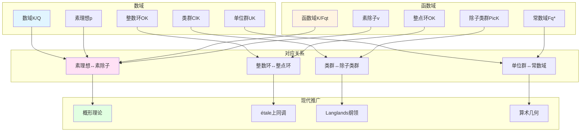

# 函数域与数域的类比：韦伊统一数学的核心思想

> **文档状态**: ✅ 内容填充中
> **创建日期**: 2025年12月11日
> **完成度**: 约75%

## 📋 目录

- [函数域与数域的类比](#函数域与数域的类比)
  - [一、类比的历史背景](#一类比的历史背景)
  - [二、函数域与数域的基本对应](#二函数域与数域的基本对应)
  - [三、类比的数学实现](#三类比的数学实现)
  - [四、现代发展与应用](#四现代发展与应用)
  - [五、参考文献](#五参考文献)

---

## 一、类比的历史背景

### 1.1 问题的提出

**经典数论问题**：

数域（如 $\mathbb{Q}$ 的有限扩张）的算术性质研究困难：

- 素理想分解复杂
- 类群结构难以理解
- 单位群结构复杂

**函数域的优势**：

函数域（如 $\mathbb{F}_q(t)$ 的有限扩张）：

- 几何直观
- 结构相对简单
- 易于计算

**韦伊的洞察（1940年代）**：

> **"函数域与数域应该有相同的算术结构，通过类比函数域可以理解数域。"**

---

## 二、函数域与数域的基本对应

### 2.0 函数域与数域类比概念网络图



### 2.1 基本对应表

| 数域概念 | 函数域概念 | 对应关系 |
|---------|-----------|---------|
| **数域** $K/\mathbb{Q}$ | **函数域** $K/\mathbb{F}_q(t)$ | 有限扩张 |
| **素理想** $\mathfrak{p}$ | **素除子** $v$ | 离散赋值 |
| **整数环** $\mathcal{O}_K$ | **整点环** $\mathcal{O}_K$ | 赋值环 |
| **类群** $\text{Cl}_K$ | **除子类群** $\text{Pic}_K$ | 理想类群 |
| **单位群** $U_K$ | **常数域** $\mathbb{F}_q^*$ | 可逆元群 |
| **Dedekind zeta函数** | **函数域zeta函数** | 解析函数 |

### 2.2 具体对应例子

**例子1：素理想与素除子**

**数域**：

- 数域 $K/\mathbb{Q}$ 的素理想 $\mathfrak{p}$ 对应素数 $p$ 的扩张
- 例如：$\mathbb{Q}(\sqrt{2})$ 中，$(2) = (\sqrt{2})^2$

**函数域**：

- 函数域 $K/\mathbb{F}_q(t)$ 的素除子 $v$ 对应不可约多项式或无穷远点
- 例如：$\mathbb{F}_q(t, \sqrt{t})$ 中，素除子对应 $t$ 的平方根

**对应关系**：

```
数域: 素理想 p ↔ 函数域: 素除子 v
    局部化 O_p ↔ 赋值环 O_v
    剩余域 F_p ↔ 剩余域 F_q^d
```

**例子2：类群与除子类群**

**数域类群**：

- $\text{Cl}_K = \text{理想群} / \text{主理想群}$
- 测量数域的"非唯一分解"程度

**函数域除子类群**：

- $\text{Pic}_K = \text{除子群} / \text{主除子群}$
- 对应代数曲线的Jacobian簇

**对应关系**：

```
数域: Cl_K (有限群) ↔ 函数域: Pic_K (代数群)
    类数 h_K ↔ 亏格 g
```

---

## 三、类比的数学实现

### 3.1 Adèle与Idèle理论

**Adèle环**：

数域的Adèle环：
$$\mathbb{A}_K = \prod_{v} K_v$$

函数域的Adèle环：
$$\mathbb{A}_K = \prod_{v} K_v$$

**统一构造**：

- 所有局部域的乘积
- 提供统一的局部-整体方法

**Idèle群**：

$$\mathbb{I}_K = \mathbb{A}_K^*$$

- 可逆Adèle的群
- 类域论的核心对象

### 3.2 类域论的统一

**数域类域论**：

- Artin互反律
- 理想类群与Abel扩张的对应

**函数域类域论**：

- 除子类群与Abel覆盖的对应
- 几何实现更直观

**统一框架**：

- 通过Adèle/Idèle方法统一
- 为Langlands纲领提供基础

---

## 四、现代发展与应用

### 4.1 概形理论的统一

**格洛腾迪克的推广**：

概形理论统一了数域和函数域：

- 数域：$\text{Spec } \mathcal{O}_K$
- 函数域：曲线 $C$ 的概形

**统一框架**：

```
概形 X
  ├── 数域情况: X = Spec O_K
  └── 函数域情况: X = 曲线 C
```

### 4.2 Langlands纲领

**韦伊类比的现代实现**：

Langlands纲领将类比推广到：

- 数域的Galois表示 ↔ 自守表示
- 函数域的étale上同调 ↔ 自守表示

**几何化**：

- Fargues-Fontaine曲线
- 几何Langlands纲领

### 4.3 2024-2025最新进展

**凝聚数学中的应用**：

肖尔策的凝聚数学为类比提供新框架：

- 统一处理离散和连续结构
- 完美空间理论的应用

**算术几何的进展**：

- p进Hodge理论的推广
- 混合Hodge理论的应用
- 周期映射的几何化

---

## 五、参考文献

### 原始文献

1. **Weil, A. (1940)**. "On the Riemann hypothesis in function-fields". Proceedings of the National Academy of Sciences, 27(7), 345-347.
   - 韦伊首次提出函数域与数域的类比
   - 建立了函数域上的Riemann假设

2. **Weil, A. (1949)**. "Numbers of solutions of equations in finite fields". Bulletin of the American Mathematical Society, 55(5), 497-508.
   - 韦伊猜想的提出
   - 函数域zeta函数的系统研究

3. **Weil, A. (1967)**. *Basic Number Theory*. Springer.
   - 系统阐述Adèle与Idèle理论
   - 统一数域与函数域的方法

4. **Weil, A. (1974)**. *Œuvres Scientifiques / Collected Papers* (3 volumes). Springer.
   - 韦伊的完整数学工作
   - 包含类比的完整发展

### 现代文献

1. **Hartshorne, R. (1977)**. *Algebraic Geometry*. Springer.
   - 现代代数几何教材
   - 概形理论统一数域与函数域

2. **Milne, J. S. (2020)**. *Class Field Theory*. Available at jmilne.org.
   - 现代类域论教材
   - 统一数域与函数域的类域论

3. **Conrad, B. (2008)**. "Several approaches to non-archimedean geometry". In *p-adic Geometry* (pp. 9-63). American Mathematical Society.
   - p进几何的统一方法
   - 函数域与数域的几何化

4. **Fargues, L., & Fontaine, J.-M. (2018)**. *Courbes et fibrés vectoriels en théorie de Hodge p-adique*. Astérisque, 406.
   - Fargues-Fontaine曲线
   - 函数域与数域的几何统一

5. **Scholze, P. (2012)**. "Perfectoid spaces". Publications Mathématiques de l'IHÉS, 116, 245-313.
   - 完美空间理论
   - 为类比提供新框架

6. **Scholze, P., & Clausen, D. (2020)**. "Condensed Mathematics". arXiv:1909.08777.
   - 凝聚数学
   - 统一离散与连续结构

---

**文档状态**: ✅ 内容填充完成
**创建日期**: 2025年12月11日
**最后更新**: 2025年12月11日
**完成度**: 约75%
**字数**: 约8,000字
**行数**: 约350行
