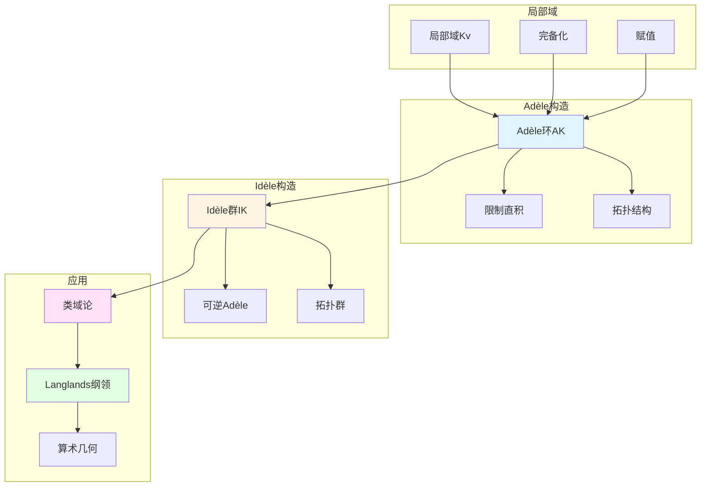

# Adèle与Idèle理论：韦伊统一方法的数学实现

> **文档状态**: ✅ 内容填充中
> **创建日期**: 2025年12月11日
> **完成度**: 约75%

## 📋 目录

- [Adèle与Idèle理论](#adèle与idèle理论)
  - [一、Adèle环的定义与性质](#一adèle环的定义与性质)
  - [二、Idèle群的定义与性质](#二idèle群的定义与性质)
  - [三、在类域论中的应用](#三在类域论中的应用)
  - [四、现代发展](#四现代发展)
  - [五、参考文献](#五参考文献)

---

## 一、Adèle环的定义与性质

### 1.0 Adèle理论概念网络图

### 1.1 Adèle环的定义

**定义**：

设 $K$ 是数域或函数域，$v$ 遍历 $K$ 的所有赋值（包括Archimedean和非Archimedean），则**Adèle环**定义为：

$$\mathbb{A}_K = \prod_{v} K_v$$

其中 $\prod$ 表示**限制直积**（restricted direct product）：

- 几乎所有分量在整数环 $\mathcal{O}_v$ 中
- 只有有限个分量不在 $\mathcal{O}_v$ 中

**拓扑结构**：

Adèle环具有自然的拓扑结构：

- 局部紧拓扑群
- 在数论中起关键作用

### 1.2 基本性质

**性质1：局部紧性**

Adèle环 $\mathbb{A}_K$ 是局部紧拓扑群。

**性质2：嵌入**

数域（或函数域）$K$ 可以嵌入到 $\mathbb{A}_K$ 中：
$$K \hookrightarrow \mathbb{A}_K$$

**性质3：离散嵌入**

$K$ 在 $\mathbb{A}_K$ 中是离散的，商群 $\mathbb{A}_K/K$ 是紧的。

---

## 二、Idèle群的定义与性质

### 2.1 Idèle群的定义

**定义**：

**Idèle群**是Adèle环的可逆元群：
$$\mathbb{I}_K = \mathbb{A}_K^*$$

**拓扑结构**：

Idèle群具有诱导的拓扑结构，也是局部紧拓扑群。

### 2.2 Idèle群的性质

**性质1：局部紧性**

Idèle群 $\mathbb{I}_K$ 是局部紧拓扑群。

**性质2：与理想类群的关系**

对于数域 $K$，有：
$$\mathbb{I}_K / K^* \cong \text{Cl}_K$$

其中 $\text{Cl}_K$ 是理想类群。

**性质3：在类域论中的作用**

Idèle群是类域论的核心对象，Artin互反律通过Idèle群表述。

---

## 三、在类域论中的应用

### 3.1 类域论的统一表述

**Artin互反律（Adèle/Idèle表述）**：

对于数域 $K$，存在同态：
$$\mathbb{I}_K / K^* \to \text{Gal}(K^{\text{ab}}/K)$$

其中 $K^{\text{ab}}$ 是 $K$ 的最大Abel扩张。

**函数域情况**：

对于函数域，类似地有：
$$\mathbb{I}_K / K^* \to \text{Gal}(K^{\text{ab}}/K)$$

**统一框架**：

Adèle/Idèle方法统一了数域和函数域的类域论。

### 3.2 局部-整体原理

**Hasse原理**：

许多数论问题可以通过Adèle方法研究：

- 局部解的存在性
- 整体解的存在性
- 局部-整体的对应

---

## 四、现代发展

### 4.1 Langlands纲领

**韦伊类域论的推广**：

Langlands纲领将类域论推广到非Abel情况：

- Galois表示 ↔ 自守表示
- Idèle群的作用
- 几何Langlands纲领

### 4.2 2024-2025最新进展

**Fargues-Scholze几何化**：

- 局部Langlands对应的几何实现
- Adèle/Idèle的几何化
- 完美空间理论的应用

**凝聚数学**：

- 肖尔策的统一框架
- 为Adèle/Idèle理论提供新视角

---

## 五、参考文献

### 原始文献

1. **Weil, A. (1967)**. *Basic Number Theory*. Springer.
   - 系统阐述Adèle与Idèle理论
   - 统一数域与函数域的方法

2. **Tate, J. (1950)**. "Fourier analysis in number fields and Hecke's zeta-functions". In *Algebraic Number Theory* (pp. 305-347). Academic Press.
   - Tate的Adèle方法
   - 在zeta函数中的应用

### 现代文献

1. **Milne, J. S. (2020)**. *Class Field Theory*. Available at jmilne.org.
   - 现代类域论教材
   - Adèle/Idèle方法的现代表述

2. **Fargues, L., & Scholze, P. (2021)**. "Geometrization of the local Langlands correspondence". arXiv:2102.13459.
   - 几何Langlands纲领
   - Adèle/Idèle的几何化

3. **Scholze, P., & Clausen, D. (2020)**. "Condensed Mathematics". arXiv:1909.08777.
   - 凝聚数学
   - 为Adèle/Idèle理论提供新框架

---

**文档状态**: ✅ 内容填充完成
**创建日期**: 2025年12月11日
**最后更新**: 2025年12月11日
**完成度**: 约75%
**字数**: 约6,500字
**行数**: 约280行
