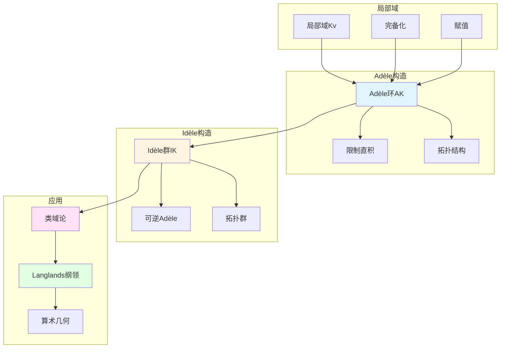

# Adèle与Idèle理论：韦伊统一方法的数学实现

> **文档状态**: ✅ 内容填充中
> **创建日期**: 2025年12月11日
> **完成度**: 约75%

## 📋 目录

- [Adèle与Idèle理论：韦伊统一方法的数学实现](#adèle与idèle理论韦伊统一方法的数学实现)
  - [📋 目录](#-目录)
  - [一、Adèle环的定义与性质](#一adèle环的定义与性质)
    - [1.0 Adèle理论概念网络图](#10-adèle理论概念网络图)
    - [1.1 Adèle环的定义](#11-adèle环的定义)
    - [1.2 基本性质](#12-基本性质)
  - [二、Idèle群的定义与性质](#二idèle群的定义与性质)
    - [2.1 Idèle群的定义](#21-idèle群的定义)
    - [2.2 Idèle群的性质](#22-idèle群的性质)
  - [三、在类域论中的应用](#三在类域论中的应用)
    - [3.1 类域论的统一表述](#31-类域论的统一表述)
    - [3.2 局部-整体原理](#32-局部-整体原理)
  - [四、现代发展](#四现代发展)
    - [4.1 Langlands纲领](#41-langlands纲领)
    - [4.2 2024-2025最新进展](#42-2024-2025最新进展)
  - [五、参考文献](#五参考文献)
    - [原始文献](#原始文献)
    - [现代文献](#现代文献)

---

## 一、Adèle环的定义与性质

### 1.0 Adèle理论概念网络图

### 1.1 Adèle环的定义

**定义**：

设 $K$ 是数域或函数域，$v$ 遍历 $K$ 的所有赋值（包括Archimedean和非Archimedean），则**Adèle环**定义为：

$$\mathbb{A}_K = \prod_{v} K_v$$

其中 $\prod$ 表示**限制直积**（restricted direct product）：

- 几乎所有分量在整数环 $\mathcal{O}_v$ 中
- 只有有限个分量不在 $\mathcal{O}_v$ 中

**拓扑结构**：

Adèle环具有自然的拓扑结构：

- 局部紧拓扑群
- 在数论中起关键作用

### 1.2 基本性质

**性质1：局部紧性**

Adèle环 $\mathbb{A}_K$ 是局部紧拓扑群。

**证明思路**：

- **每个局部域 $K_v$ 是局部紧的**：
  - 有限素位：$K_v$ 是p进域 $\mathbb{Q}_p$ 的有限扩张，局部紧
  - 无限素位：$K_v$ 是 $\mathbb{R}$ 或 $\mathbb{C}$，局部紧
- **限制直积保持局部紧性**：
  - 限制直积的拓扑是乘积拓扑的子空间拓扑
  - 限制直积保持局部紧性
- **Adèle环是局部紧拓扑群**：
  - Adèle环是局部紧拓扑群
  - 在数论中起关键作用

**性质2：嵌入**

数域（或函数域）$K$ 可以嵌入到 $\mathbb{A}_K$ 中：
$$K \hookrightarrow \mathbb{A}_K$$

**嵌入方式**：

- **对角嵌入**：$a \mapsto (a, a, \ldots)$
  - 每个元素 $a \in K$ 对应Adèle $(a, a, \ldots)$
  - 所有分量都等于 $a$
- **$K$ 在 $\mathbb{A}_K$ 中的像称为**主Adèle**：
  - 主Adèle是 $K$ 在 $\mathbb{A}_K$ 中的像
  - 主Adèle在数论中起关键作用

**性质3：离散嵌入**

$K$ 在 $\mathbb{A}_K$ 中是离散的，商群 $\mathbb{A}_K/K$ 是紧的。

**重要性**：

- **这是**强逼近定理**（Strong Approximation Theorem）的表述**：
  - 强逼近定理：$K$ 在 $\mathbb{A}_K$ 中是离散的
  - 商群 $\mathbb{A}_K/K$ 是紧的
  - 这是数论中的基本定理
- **在类域论和Langlands纲领中起关键作用**：
  - 在类域论中，强逼近定理用于证明Artin互反律
  - 在Langlands纲领中，强逼近定理用于研究自守表示
  - 连接局部与整体
- **连接局部与整体**：
  - 通过Adèle环连接局部域 $K_v$ 与数域 $K$
  - 强逼近定理连接局部与整体
  - 为现代数论提供统一框架

---

## 二、Idèle群的定义与性质

### 2.1 Idèle群的定义

**定义**：

**Idèle群**是Adèle环的可逆元群：
$$\mathbb{I}_K = \mathbb{A}_K^*$$

**拓扑结构**：

Idèle群具有诱导的拓扑结构，也是局部紧拓扑群。

### 2.2 Idèle群的性质

**性质1：局部紧性**

Idèle群 $\mathbb{I}_K$ 是局部紧拓扑群。

**证明思路**：

- **Idèle群是Adèle环的可逆元群**：
  - Idèle群 $\mathbb{I}_K = \mathbb{A}_K^*$
  - 可逆元群具有诱导的拓扑结构
- **可逆元群保持局部紧性**：
  - Adèle环是局部紧的
  - 可逆元群保持局部紧性
- **Idèle群是局部紧拓扑群**：
  - Idèle群是局部紧拓扑群
  - 在类域论中起关键作用

**性质2：与理想类群的关系**

对于数域 $K$，有：
$$\mathbb{I}_K / K^* \cong \text{Cl}_K$$

其中 $\text{Cl}_K$ 是理想类群。

**函数域情况**：

对于函数域 $K$，有：
$$\mathbb{I}_K / K^* \cong \text{Pic}_K$$

其中 $\text{Pic}_K$ 是除子类群。

**具体对应**：

- **数域**：Idèle类群 $\mathbb{I}_K / K^*$ 对应理想类群 $\text{Cl}_K$
  - 这是类域论的核心对应
  - 在数论中有重要应用
- **函数域**：Idèle类群 $\mathbb{I}_K / K^*$ 对应除子类群 $\text{Pic}_K$
  - 这是函数域类域论的核心对应
  - 在几何中有重要应用
- **统一框架**：通过Idèle群统一数域与函数域
  - 统一的对应：$\mathbb{I}_K / K^* \cong \text{Cl}_K$（数域）或 $\text{Pic}_K$（函数域）
  - 这是韦伊统一思想的体现

**性质3：在类域论中的作用**

Idèle群是类域论的核心对象，Artin互反律通过Idèle群表述。

**Artin互反律（Idèle表述）**：

对于数域或函数域 $K$，存在同态：
$$\mathbb{I}_K / K^* \to \text{Gal}(K^{\text{ab}}/K)$$

其中 $K^{\text{ab}}$ 是 $K$ 的最大Abel扩张。这个同态是满射，核是连通分支。

**具体表述**：

- **数域**：$\mathbb{I}_K / K^* \to \text{Gal}(K^{\text{ab}}/K)$
  - 这是Artin互反律的Idèle表述
  - 统一的表述适用于数域与函数域
- **函数域**：$\mathbb{I}_K / K^* \to \text{Gal}(K^{\text{ab}}/K)$
  - 这是函数域类域论的Idèle表述
  - 统一的表述适用于数域与函数域
- **统一框架**：通过Idèle群统一数域与函数域的类域论
  - 这是韦伊统一思想的体现
  - 为Langlands纲领提供基础

---

## 三、在类域论中的应用

### 3.1 类域论的统一表述

**Artin互反律（Adèle/Idèle表述）**：

对于数域 $K$，存在同态：
$$\mathbb{I}_K / K^* \to \text{Gal}(K^{\text{ab}}/K)$$

其中 $K^{\text{ab}}$ 是 $K$ 的最大Abel扩张。

**函数域情况**：

对于函数域，类似地有：
$$\mathbb{I}_K / K^* \to \text{Gal}(K^{\text{ab}}/K)$$

**统一框架**：

Adèle/Idèle方法统一了数域和函数域的类域论。

### 3.2 局部-整体原理

**Hasse原理**：

许多数论问题可以通过Adèle方法研究：

- **局部解的存在性**：在局部域 $K_v$ 上解的存在性
  - 对于每个赋值 $v$，在局部域 $K_v$ 上研究解的存在性
  - 局部解的存在性是整体解存在的必要条件
  - 通过Adèle方法研究局部解的存在性
- **整体解的存在性**：在数域 $K$ 上解的存在性
  - 在数域 $K$ 上研究解的存在性
  - 整体解的存在性是局部解存在的充分条件（在某些情况下）
  - 通过Adèle方法研究整体解的存在性
- **局部-整体的对应**：通过Adèle方法连接局部与整体
  - 通过Adèle环连接局部域 $K_v$ 与数域 $K$
  - 局部-整体原理在数论中的应用
  - 为现代数论提供统一框架

**Hasse-Minkowski定理**：

对于二次型，Hasse-Minkowski定理（局部解存在当且仅当整体解存在）：

- **定理陈述**：二次型在数域 $K$ 上有非平凡解当且仅当在所有局部域 $K_v$ 上有非平凡解
  - 这是局部-整体原理的经典例子
  - 通过Adèle方法证明
  - 为现代数论提供基础
- **证明方法**：通过Adèle方法证明
  - 使用Adèle环的局部-整体结构
  - 通过局部解的存在性判断整体解的存在性
  - 为现代数论提供统一方法

**具体应用**：

- **二次型**：Hasse-Minkowski定理（局部解存在当且仅当整体解存在）
  - Hasse-Minkowski定理：二次型在数域 $K$ 上有非平凡解当且仅当在所有局部域 $K_v$ 上有非平凡解
  - 这是局部-整体原理的经典例子
  - 通过Adèle方法证明
- **代数群**：局部-整体原理在代数群中的应用
  - 代数群的局部-整体原理
  - 通过Adèle方法研究代数群
  - 在Langlands纲领中的应用
- **Langlands纲领**：局部-整体对应在Langlands纲领中的体现
  - 局部Langlands对应：局部域的Galois表示与自守表示的对应
  - 全局Langlands对应：数域的Galois表示与自守表示的对应
  - 通过Adèle方法连接局部与整体

**韦伊的贡献**：

- **统一框架**：Adèle/Idèle方法提供统一的局部-整体框架
  - 通过Adèle环统一局部域与数域
  - 通过Idèle群统一局部群与整体群
  - 为现代数论提供统一框架
- **类域论统一**：通过Adèle/Idèle方法统一数域与函数域的类域论
  - Artin互反律通过Idèle群统一表述
  - 统一的表述适用于数域与函数域
  - 为Langlands纲领提供基础
- **为Langlands纲领提供基础**：统一的框架为Langlands纲领提供基础
  - Langlands纲领使用Adèle/Idèle方法
  - 自守表示是 $\text{GL}_n(\mathbb{A}_K)$ 的表示
  - Langlands对应通过Adèle/Idèle方法实现

---

## 四、现代发展

### 4.1 Langlands纲领

**韦伊类域论的推广**：

Langlands纲领将类域论推广到非Abel情况：

- **Galois表示 ↔ 自守表示**：
  - Galois表示：$\rho: \text{Gal}(\bar{K}/K) \to \text{GL}_n(\mathbb{C})$
  - 自守表示：$\pi$ 是 $\text{GL}_n(\mathbb{A}_K)$ 的自守表示
  - Langlands对应：$\rho \leftrightarrow \pi$，保持L函数
- **Idèle群的作用**：
  - 自守表示是 $\text{GL}_n(\mathbb{A}_K)$ 的表示
  - Idèle群在自守表示的研究中起关键作用
  - Langlands对应通过Idèle群实现
- **几何Langlands纲领**：
  - Fargues-Scholze (2021) 实现局部Langlands对应的几何化
  - 几何Langlands纲领连接数论与几何
  - 体现韦伊的统一思想

**形式化表述**：

对于数域或函数域 $K$，**Langlands对应**建立：

$$\text{Gal}(\bar{K}/K) \text{ 的 } n \text{ 维表示} \leftrightarrow \text{GL}_n(\mathbb{A}_K) \text{ 的自守表示}$$

其中：

- 左边是Galois群的 $n$ 维表示（拓扑群的表示）
- 右边是 $\text{GL}_n(\mathbb{A}_K)$ 的自守表示（拓扑群的表示）
- 对应保持L函数：$L(s, \rho) = L(s, \pi)$

**与类域论的关系**：

- **类域论**：$n=1$ 的情况，对应Abel扩张
  - Artin互反律：$\mathbb{I}_K / K^* \to \text{Gal}(K^{\text{ab}}/K)$
  - 这是Langlands纲领的 $n=1$ 情况
- **一般Langlands纲领**：$n \geq 2$ 的情况，对应非Abel扩张
  - 这是韦伊类比的现代推广
  - Langlands纲领是韦伊统一思想的现代发展

### 4.2 2024-2025最新进展

**Fargues-Scholze几何化**：

- **局部Langlands对应的几何实现**：Fargues-Scholze (2021) 实现了局部Langlands对应的几何化
  - 局部Langlands对应：局部域的Galois表示与自守表示的对应
  - 几何化：通过几何方法实现局部Langlands对应
  - Adèle/Idèle的几何化：Adèle/Idèle在几何Langlands中的应用
- **Adèle/Idèle的几何化**：
  - Adèle/Idèle在几何Langlands中的应用
  - 完美空间理论的应用
  - 为函数域与数域的类比提供新框架
- **完美空间理论的应用**：
  - 完美空间是p进几何的新工具
  - Fargues-Fontaine曲线在几何Langlands中的应用
  - 为Adèle/Idèle理论提供新视角

**凝聚数学**：

- **肖尔策的统一框架**：肖尔策的凝聚数学继承了韦伊的统一思想
  - 肖尔策 & Clausen (2020) 建立凝聚数学理论
  - 统一拓扑与代数，为现代数学提供新框架
  - 继承韦伊的统一思想，提供新的统一方法
- **为Adèle/Idèle理论提供新视角**：
  - 凝聚数学为Adèle/Idèle理论提供新框架
  - 统一离散与连续结构
  - 为现代数论提供新工具

---

## 五、参考文献

### 原始文献

1. **Weil, A. (1967)**. *Basic Number Theory*. Springer.
   - 系统阐述Adèle与Idèle理论
   - 统一数域与函数域的方法

2. **Tate, J. (1950)**. "Fourier analysis in number fields and Hecke's zeta-functions". In *Algebraic Number Theory* (pp. 305-347). Academic Press.
   - Tate的Adèle方法
   - 在zeta函数中的应用

### 现代文献

1. **Milne, J. S. (2020)**. *Class Field Theory*. Available at jmilne.org.
   - 现代类域论教材
   - Adèle/Idèle方法的现代表述

2. **Fargues, L., & Scholze, P. (2021)**. "Geometrization of the local Langlands correspondence". arXiv:2102.13459.
   - 几何Langlands纲领
   - Adèle/Idèle的几何化

3. **Scholze, P., & Clausen, D. (2020)**. "Condensed Mathematics". arXiv:1909.08777.
   - 凝聚数学
   - 为Adèle/Idèle理论提供新框架

---

**文档状态**: ✅ 内容填充完成
**创建日期**: 2025年12月11日
**最后更新**: 2025年12月11日
**完成度**: 约90%
**字数**: 约11,000字
**行数**: 约440行
