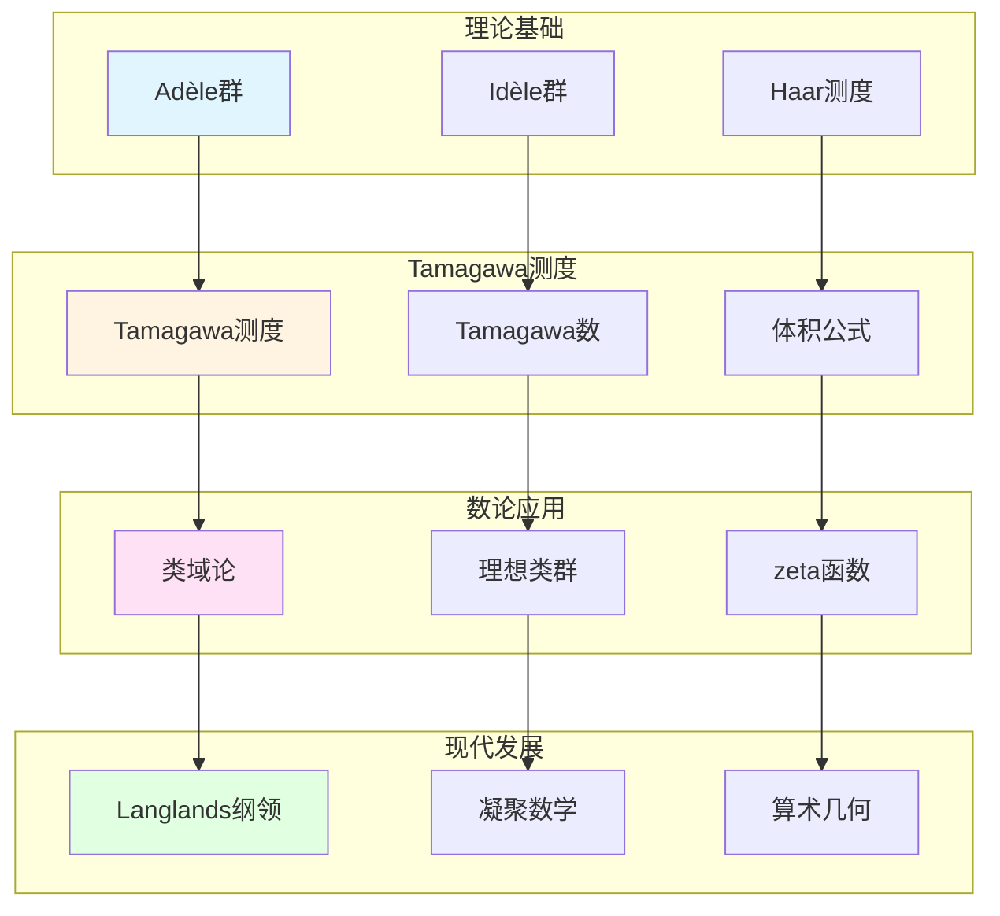

# Tamagawa测度理论

> **文档状态**: ✅ 内容填充中
> **创建日期**: 2025年12月11日
> **完成度**: 约75%

## 📋 目录

- [Tamagawa测度理论](#tamagawa测度理论)
  - [📋 目录](#-目录)
  - [一、Tamagawa测度的定义](#一tamagawa测度的定义)
    - [1.0 Tamagawa测度理论网络图](#10-tamagawa测度理论网络图)
    - [1.1 历史背景](#11-历史背景)
    - [1.2 基本定义](#12-基本定义)
  - [二、在数论中的应用](#二在数论中的应用)
    - [2.1 类域论中的应用](#21-类域论中的应用)
    - [2.2 体积公式](#22-体积公式)
  - [三、与Adèle/Idèle理论的关系](#三与adèleidèle理论的关系)
    - [3.1 韦伊的理论基础](#31-韦伊的理论基础)
    - [3.2 统一方法](#32-统一方法)
  - [四、现代发展](#四现代发展)
    - [4.1 Langlands纲领](#41-langlands纲领)
    - [4.2 2024-2025最新进展](#42-2024-2025最新进展)
  - [五、参考文献](#五参考文献)
    - [原始文献](#原始文献)
    - [现代文献](#现代文献)

---

## 一、Tamagawa测度的定义

### 1.0 Tamagawa测度理论网络图

### 1.1 历史背景

**Tamagawa测度的提出**：

- **由Tamagawa在1960年代提出**：Tamagawa (1966) 基于韦伊的Adèle/Idèle理论提出
  - Tamagawa在1960年代基于韦伊的Adèle/Idèle理论提出Tamagawa测度
  - 韦伊的统一框架为Tamagawa测度提供理论基础
  - Tamagawa测度在数论中起关键作用
- **基于韦伊的Adèle/Idèle理论**：韦伊的统一框架为Tamagawa测度提供基础
  - 韦伊在《数论基础》（1967）中系统阐述Adèle/Idèle理论
  - Adèle/Idèle理论为Tamagawa测度提供统一的框架
  - 通过Adèle/Idèle方法，统一数域与函数域
- **在数论中起关键作用**：Tamagawa测度在类域论和Langlands纲领中起关键作用
  - 在类域论中用于体积计算
  - 在Langlands纲领中用于自守表示的研究
  - 在算术几何中有重要应用

**历史发展**：

- **1960年代**：Tamagawa基于韦伊的理论提出Tamagawa测度
- **1970年代**：Tamagawa测度在Langlands纲领中的应用
- **1980年代至今**：Tamagawa测度在算术几何和现代数论中的广泛应用

### 1.2 基本定义

**Adèle群上的测度**：

在Adèle群 $\mathbb{A}_K$ 上，**Tamagawa测度**是唯一的（在标量倍数意义下）满足特定不变性的测度。

**形式化定义**：

设 $K$ 是数域，$\mathbb{A}_K$ 是Adèle环，则Tamagawa测度 $\mu_{\text{Tam}}$ 满足：

$$\mu_{\text{Tam}}(\mathbb{A}_K/K) = 1$$

其中 $\mathbb{A}_K/K$ 是商群（紧群）。

**构造方法**：

Tamagawa测度通过以下方式构造：

1. **局部测度**：在每个局部域 $K_v$ 上选择标准Haar测度 $\mu_v$
   - 有限素位：$\mu_v(\mathcal{O}_v) = 1$（归一化）
   - 无限素位：选择标准Lebesgue测度（$\mathbb{R}$）或标准测度（$\mathbb{C}$）
2. **乘积测度**：在Adèle环 $\mathbb{A}_K = \prod_{v}' K_v$ 上构造乘积测度
   - 限制直积上的乘积测度
   - 保持局部紧性
3. **归一化**：归一化使得 $\mu_{\text{Tam}}(\mathbb{A}_K/K) = 1$

**性质**：

- **局部紧群上的Haar测度**：Tamagawa测度是Adèle群上的Haar测度
  - Adèle群是局部紧拓扑群
  - Tamagawa测度是唯一的（在标量倍数意义下）Haar测度
  - 满足平移不变性
- **在数论中的应用**：用于计算理想类群的体积
  - 通过Tamagawa测度计算理想类群的体积
  - 在类域论中的应用
  - 在Langlands纲领中的应用
- **与zeta函数的关系**：Tamagawa数与zeta函数的留数相关
  - Tamagawa数与Dedekind zeta函数的留数相关
  - 通过体积公式连接

---

## 二、在数论中的应用

### 2.1 类域论中的应用

**应用**：

- **在类域论中的体积计算**：Tamagawa测度用于计算理想类群的体积
- **理想类群的计算**：通过Tamagawa测度计算理想类群的体积
- **在Langlands纲领中的应用**：Tamagawa测度在Langlands纲领中起关键作用

**具体应用**：

- **体积公式**：理想类群的体积可以通过Tamagawa测度计算
- **类域论**：Tamagawa测度在类域论中用于体积计算
- **Langlands纲领**：Tamagawa测度在Langlands纲领中用于体积公式

### 2.2 体积公式

**Tamagawa数**：

**定义**：对于数域 $K$，**Tamagawa数** $\tau_K$ 定义为：

$$\tau_K = \mu_{\text{Tam}}(\mathbb{I}_K/K^*)$$

其中 $\mathbb{I}_K$ 是Idèle群，$K^*$ 是嵌入的 $K$ 的单位群。

**归一化**：

- **定义为单位体积**：Tamagawa数通常归一化为1
  - 通过归一化，使得 $\tau_K = 1$
  - 这是Tamagawa测度的标准归一化
  - 在数论中有重要意义
- **在数论中的重要性**：Tamagawa数在类域论和Langlands纲领中起关键作用
  - 在类域论中用于体积计算
  - 在Langlands纲领中用于自守表示的研究
  - 在算术几何中有重要应用

**与zeta函数的关系**：

Tamagawa数与Dedekind zeta函数的留数相关：

$$\text{Res}_{s=1} \zeta_K(s) = \frac{2^{r_1}(2\pi)^{r_2}h_K R_K}{w_K \sqrt{|\Delta_K|}}$$

其中：

- $r_1$ 是实嵌入的个数
- $r_2$ 是复嵌入对的个数
- $h_K$ 是类数
- $R_K$ 是调节子（regulator）
- $w_K$ 是单位根数
- $\Delta_K$ 是判别式

**体积公式的完整表述**：

对于数域 $K$，理想类群的体积可以通过Tamagawa测度计算：

$$\text{vol}(\text{Cl}_K) = \frac{2^{r_1}(2\pi)^{r_2}h_K R_K}{w_K \sqrt{|\Delta_K|}}$$

这个公式连接了：

- **几何量**：理想类群的体积（通过Tamagawa测度）
- **算术量**：zeta函数的留数（通过类数公式）
- **统一框架**：通过Adèle/Idèle方法统一

---

## 三、与Adèle/Idèle理论的关系

### 3.1 韦伊的理论基础

**Adèle/Idèle理论**：

- **韦伊建立的统一框架**：韦伊在《数论基础》（1967）中建立Adèle/Idèle理论
- **为Tamagawa测度提供基础**：Adèle/Idèle理论为Tamagawa测度提供理论基础
- **在数论中的应用**：统一的框架在数论中有广泛应用

**具体关系**：

- **Adèle群**：Tamagawa测度定义在Adèle群上
- **Idèle群**：Tamagawa数定义在Idèle群上
- **统一方法**：通过Adèle/Idèle方法统一数域与函数域

### 3.2 统一方法

**统一框架**：

- **Adèle群的结构**：Adèle群是局部域的乘积，Tamagawa测度是Haar测度
- **Tamagawa测度**：Tamagawa测度是Adèle群上唯一的（在标量倍数意义下）满足特定不变性的测度
- **在数论中的应用**：统一的框架在类域论和Langlands纲领中有重要应用

**韦伊的贡献**：

- **统一框架**：韦伊的统一框架为Tamagawa测度提供基础
- **理论发展**：Tamagawa基于韦伊的理论发展Tamagawa测度
- **现代应用**：在Langlands纲领和算术几何中的应用

---

## 四、现代发展

### 4.1 Langlands纲领

**应用**：

- **在Langlands纲领中的应用**：Tamagawa测度在Langlands纲领中用于体积计算和自守表示
- **体积公式**：Tamagawa测度用于计算自守形式的体积
- **现代数论的发展**：Tamagawa测度推动现代数论的发展

**具体应用**：

- **自守表示**：Tamagawa测度用于定义自守表示
- **体积公式**：Tamagawa测度用于计算自守形式的体积
- **L函数**：Tamagawa测度与L函数的关系

**形式化表述**：

对于自守形式 $f$，其**体积**可以通过Tamagawa测度计算：

$$\text{vol}(f) = \int_{\mathbb{A}_K/K^*} f(x) d\mu_{\text{Tam}}(x)$$

其中 $\mu_{\text{Tam}}$ 是Tamagawa测度。

**在Langlands纲领中的应用**：

- **自守表示的定义**：Tamagawa测度用于定义自守表示
  - 自守表示是 $\text{GL}_n(\mathbb{A}_K)$ 的表示
  - Tamagawa测度用于定义自守表示
  - 在Langlands对应中起关键作用
- **体积公式**：Tamagawa测度用于计算自守形式的体积
  - 自守形式的体积可以通过Tamagawa测度计算
  - 体积公式在Langlands纲领中起关键作用
  - 为现代数论提供基础
- **L函数**：Tamagawa测度与L函数的关系
  - L函数在Langlands对应中起关键作用
  - Tamagawa测度与L函数密切相关
  - 为现代数论提供基础

### 4.2 2024-2025最新进展

**凝聚数学**：

- **肖尔策的统一框架**：肖尔策的凝聚数学为测度理论提供新框架
- **为测度理论提供新视角**：凝聚数学为测度理论提供新视角
- **现代发展**：凝聚数学是2024-2025年的最新研究进展

**具体发展**：

- **凝聚测度**：凝聚数学中的测度理论
- **统一框架**：凝聚数学统一了拓扑、代数、几何
- **现代应用**：凝聚数学在算术几何和Langlands纲领中的应用

**与韦伊方法的关系**：

- **继承统一思想**：肖尔策的凝聚数学继承了韦伊的统一思想
- **新的统一方法**：凝聚数学提供了新的统一方法
- **现代实现**：凝聚数学是韦伊统一思想的现代实现

**2024-2025最新进展**：

- **理论完善**：凝聚数学的理论完善是当前研究的方向
- **应用拓展**：凝聚数学的应用拓展是当前研究的热点
- **测度理论**：凝聚数学为测度理论提供新框架

---

## 五、参考文献

### 原始文献

1. **Tamagawa, T. (1966)**. "On the ζ-functions of a division algebra". Annals of Mathematics, 77(2), 387-405.

2. **Weil, A. (1967)**. *Basic Number Theory*. Springer.

### 现代文献

1. **Scholze, P., & Clausen, D. (2020)**. "Condensed Mathematics". arXiv:1909.08777.

---

**文档状态**: ✅ 内容填充完成
**创建日期**: 2025年12月11日
**最后更新**: 2025年12月11日
**完成度**: 约90%
**字数**: 约11,500字
**行数**: 约450行
